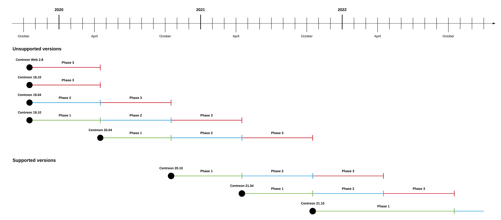

La société Centreon publie de nouvelles versions
de Centreon sur une cadence régulière depuis Centreon 18.10, permettant à la communauté, aux
entreprises et aux développeurs de planifier leurs feuilles de route avec la
certitude d’avoir de la visibilité en amont sur les nouvelles capacités offertes par l'open source.

## Les numéros de version sont AA.MM

Les versions de Centreon sont nommées par l'année et la période de livraison : XX.04 pour la version de printemps,
et XX.10 pour la version d'automne. Par
exemple, Centreon 21.04 a été livrée au printemps 2021. Tous les modules et
composants de la collection de logiciels Centreon possèdent le même numéro de
version.

## Cadence de publication

La société Centreon publie 2 versions par an. La première sera un version majeure, livrée au printemps
(comprenant de nouveaux produits ou fonctionnalités ainsi que des changements d'architecture).
La seconde sera une version mineure, livrée en automne (apportant majoritairement des améliorations et des 
correctifs aux fonctionnlaités existantes). Entre ces deux versions majeures, Centreon fournira de
manière régulière des versions mineures (numérotées AA.MM.NN), y compris des correctifs de sécurité,
des correctifs et améliorations.

## Mises à jour de maintenance et de sécurité

### Jusqu'à la version 21.04

Jusqu'à la version 21.04 incluse, les versions étaient supportées pendant 18 mois. Le cycle de vie d'une version est divisé en 3 phases :

1.  Première phase : bogues de toute criticité (minor, major, critical,
    blocking) et correction de sécurité seront traités par priorité
2.  Seconde phase : bogues et correction de sécurité de criticité major,
    critical et blocking seront traités par priorité
3. Troisième phase : bogues et correction de sécurité de criticité blocking seront traités par priorité.

> La priorisation des bogues est faite par l'équipe produit
> Centreon.

La première phase du cycle de vie commence le jour de la sortie de la version.

La deuxième phase d'une version commence lorsque la prochaine version majeure
est disponible. Par exemple, la publication de Centreon 21.04 lance la deuxième
phase de Centreon 20.10.

La troisième phase d'une version commence lorsque la deuxième version majeure
suivante est disponible. Par exemple, la sortie de Centreon 21.04 lance la
troisième phase de Centreon 20.04 et la deuxième phase de Centreon 20.10.

### À partir de la version 21.10

À partir de la version 21.10, les versions sont supportées pendant 2 ans. Le cycle de vie d'une version est divisé en 2 phases de douze mois chacune.

1.  Première phase : bogues de toute criticité (minor, major, critical,
    blocking) et correction de sécurité seront traités par priorité
2.  Seconde phase : bogues et correction de sécurité de criticité major,
    critical et blocking seront traités par priorité.

> La priorisation des bogues est faite par l'équipe produit
> Centreon.

### Schéma

Le schéma suivant présente le cycle de vie des produits Centreon :

## Tableau de maintenance des anciens produits

> Tous les autres produits non décrits dans les tableaux suivants ne sont plus
> pris en charge par Centreon.

| Produit        | Sortie       | Fin de vie           | État                |
|----------------|--------------|----------------------|---------------------|
| Centreon 21.04 | 04/2021      | Centreon 22.10       | Supportée           |
| Centreon 20.10 | 10/2020      | Centreon 22.04       | Supportée           |
| Centreon 20.04 | 04/2020      | Centreon 21.10       | Plus supportée      |
| Centreon 19.10 | 10/2019      | Centreon 21.04       | Plus supportée      |
| Centreon 19.04 | 04/2019      | Centreon 20.10       | Plus supportée      |
| Centreon 18.10 | 10/2018      | Centreon 20.04       | Plus supportée      |
