Tous ces rapports sont génériques et leur paramétrage se base sur les
concepts de Centreon : groupes d'hôtes, catégories d'hôtes, catégories
de services, métriques etc... Pour intégrer vos logos aux rapports qui
disposent d'un espace prévu à cet effet, utilisez l'interface de
Centreon MBI, dans le menu Logo. Peu importe la taille de l'image, le
ratio doit être de 4,4 pour qu'il corresponde à l'espace prévu pour
l'image.

La plupart des rapports ont été créés pour un rendu optimal sur PDF, il
se peut que l'espace réservé aux noms (hôtes, services, groupes,
catégories) dans les tableaux ou graphiques soit limité, veillez à
prendre en compte cette limitation lorsque vous définissez le nom des
objets Centreon.

Vous trouverez les rapports par type de données adressées:

- [Activité Métier (BAM)](#activité-métier-bam)
- [Disponibilité et évènements](#disponibilité-et-événements)
- [Performance](#performance)
- [Stockage](#stockage)
- [Réseau](#réseau)
- [Virtualisation](#virtualisation)
- [Consommation éléctrique](#consommation-électrique)
- [Profiling](#profiling)
- [Inventaire & configuration](#inventaire-et-configuration)
- [Diagnostic de la base de données Centreon/Reporting](#diagnostic-de-base-de-données-centreonreporting)

## Activité Métier (BAM)

### BV-BA-Availabilities-1 

#### Description

Ce rapport affiche les statistiques de disponibilité et d'incidents des
applications d'une vue métier. La plage horaire utilisée pour chaque
activité métier est la plage horaire par défaut configurée dans le
module Centreon BAM.

**Comment interpréter ce rapport?**

La première page affiche un focus sur les notions suivantes:

-   Disponibilité

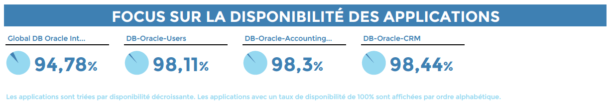

-   De temps d'indisponibilité

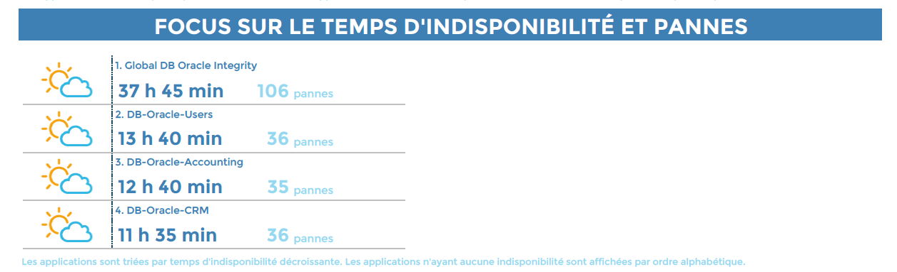

Les icônes météo changent en fonction des SLA définis au niveau de
chaque activité métier en minute.

-   De fiabilité et maintenabilité

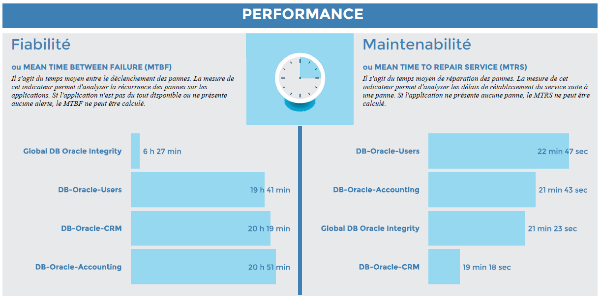

Les pages suivantes affichent pour chaque activité métier présente dans
la vue métier les statistiques sur:

-   La disponibilité, le temps d'indisponibilité, le temps passé en
    downtime, l'indice de performance du service ainsi que le nombre
    d'evenement déclenchés.

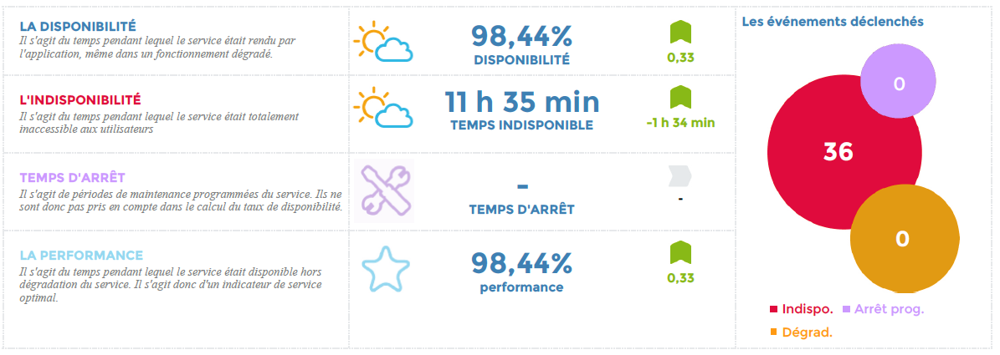

Les icônes météo changent en fonction des SLA en pourcentage et en
minutes définis dans la configuration pour l'activité métier.

-   L'évolution de la disponibilité, de la performance et du nombre
    d'évenements déclenchés

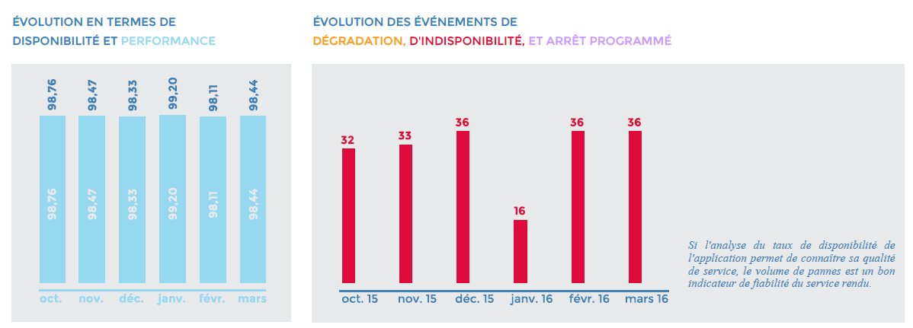

-   Un calendrier de disponibilité par jour où seuls les jours où la
    disponibilité est inférieure à 100% sont affichés.
-   Une journée avec 100% de disponibilité est représentée par une case
    gris clair sans aucune valeur.
-   En cas de non présence de données sur une journée, la case sera
    blanche et sans valeur.

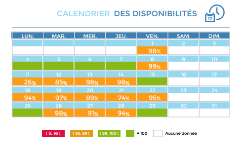

-   En option, la liste d'évenements déclenchés, avec pour chaque
    évenement les KPIs mises en cause.

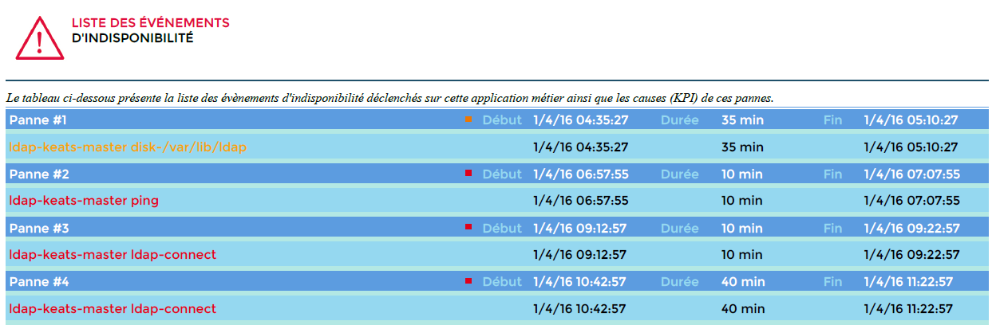

#### Paramètres

Les paramètres attendus dans ce rapport :

-   Une date correspondant au mois sur lequel générer le rapport (date
    de début sur l'interface de Centreon MBI)
-   Les objets Centreon suivant :

| **Paramètres** | **Type**         | **Description**                                                                        |
| -------------- | ---------------- | -------------------------------------------------------------------------------------- |
| logo           | Liste déroulante | Logo à afficher dans l'en tête du rapport                                              |
| business View  | Liste déroulante | Sélection de la business view sur laquelle générer le rapport                          |
| hide event     | Radio bouton     | Permet de cacher le tableau affichant la liste des évènements déclenchés               |
| calendar color | Radio bouton     | Permet de colorer les cases du calendrier en utilisant les couleurs verte/orange/rouge |
| title          | Champ texte      | Permet de préciser un titre particulier pour le rapport                                |
| time period    | Liste déroulante | Sélectionner la période de reporting à appliquer*                                     |

* *Si différent de "Default", assurez vous que la plage sélectionnée
soit bien définie dans la configuration des activités métier en tant que
plage horaire par défaut ou supplémentaire. Dans le cas contraire, les
activités métier n'apparaîtront pas dans le rapport*

#### Pré-requis

-   Disposer de Centreon BAM   = 3.0
-   Disposer de Centreon Broker >= 2.8.0
-   Superviser au moins une activité métier et la lier à une vue
    business.
-   Avoir au moins un mois de données provenant du module BAM

### BA-Availability-1 

#### Description

Ce rapport affiche les statistiques de disponibilité et d'incidents
d'une application métier.

**Comment interpréter ce rapport?**

Pour une activité métier, le rapport affiche les statistiques sur:

-   La disponibilité, le temps d'indisponibilité, le temps passé en
    downtime, l'indice de performance du service ainsi que le nombre
    d'evenement déclenchés.

Les icônes météo changent en fonction des SLA en pourcentage et en
minutes définis dans la configuration pour l'activité métier.

-   L'évolution de la disponibilité et du nombre d'évenements
    déclenchés

-   Un calendrier de disponibilité par jour où seuls les jours où la
    disponibilité est inférieure aux SLA en pourcentage définis dans la
    configuration de la BA sont affichés.

-   En option, la liste d'évenements déclenchés, avec pour chaque
    évenement les KPIs mises en cause.

#### Paramètres :

Les paramètres attendus dans ce rapport :

-   Une date correspondant au mois sur lequel générer le rapport (date
    de début sur l'interface de Centreon MBI)
-   Les objets Centreon suivant :

| Paramètres        | Type             | Description                                                                            |
| ----------------- | ---------------- | -------------------------------------------------------------------------------------- |
| logo              | Liste déroulante | Logo à afficher dans l'en tête du rapport                                              |
| business Activity | Liste déroulante | Sélection de la business activity sur laquelle générer le rapport                      |
| hide\_event       | Radio bouton     | Permet de cacher le tableau affichant la liste des évènements déclenchés               |
| calendar color    | Radio bouton     | Permet de colorer les cases du calendrier en utilisant les couleurs verte/orange/rouge |
| title             | Champ texte      | Permet de préciser un titre particulier pour le rapport                                |
| time period       | Liste déroulante | Sélectionner la période de reporting à appliquer \*                                    |

\* *Si différent de "Default", assurez vous que la plage sélectionnée
soit bien définie dans les paramètres de l'application métier dans
Configuration > Business Activiy > XXXXX | onglet "Information
étendues" en plage horaire par défaut ou supplémentaire*

#### Pre-requis

-   Disposer de Centreon BAM >= 3.0
-   Disposer de Centreon Broker >= 2.8.0
-   Superviser au moins une activité métier et la lier à une vue
    business.
-   Avoir au moins un mois de données provenant du module BAM

### BV-BA-Availabilities-List

####  Description

Pour une vue métier, ce rapport affiche les statistiques de
disponibilité, temps d'indisponibilité, temps dégrédé et pannes des
applications métier sous forme de listing.

#### Comment intérpréter le rapport:

Les icônes météo changent en fonction des SLA définis au niveau de
chaque activité métier en pourcentage. Si aucune SLA n'est paramétrée,
une disponibiilité de 100% sera représentée par un soleil, et une
disponibilité inférieure à 100% sera représentée par un nuage.

L'évolution est calculée par rapport à la période précedente:

> -   Si la période de reporting est un mois plein, la période
>     précedente sera le mois plein précedent.
> -   Si la répiode de reporting est autre qu'un mois plein,
>     l'évolution sera calculée sur le nombre de jour qui précede le
>     nombre de jour de la période de reporing.

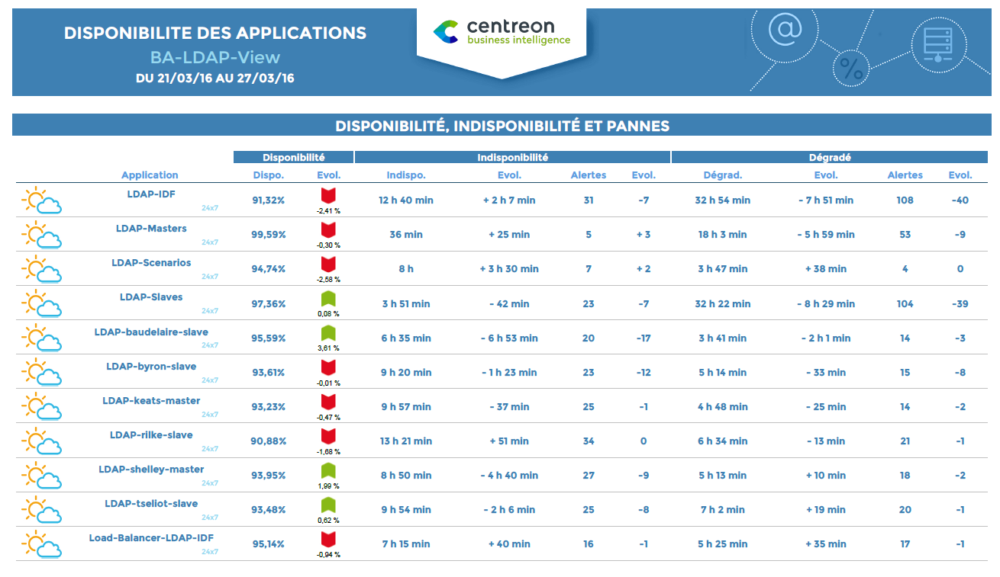

#### Paramètres

Les paramètres attendus dans ce rapport :

-   Une date correspondant au mois sur lequel générer le rapport (date
     de début sur l'interface de Centreon MBI)
-   Les paramètres suivants :

| Paramètres                      | Type             | Description                                                                     |
| ------------------------------- | ---------------- | ------------------------------------------------------------------------------- |
| business View                   | Liste déroulante | Sélection de la business view sur laquelle générer le rapport                   |
| logo                            | Liste déroulante | Logo à afficher dans l'en tête du rapport                                       |
| sort by                         | Radio bouton     | Permet d'afficher les BA par ordre alphabétique ou par BA les moins disponibles |
| show the reporting timeperiod.. | Radio bouton     | Permet l'affichage ou non de la période associée à l'activité métier            |
| title                           | Champ texte      | Permet de préciser un titre particulier pour le rapport                         |
| time period                     | Liste déroulante | Sélectionner la période de reporting à appliquer\*                              |

\* *Si différent de "Default", assurez vous que la plage sélectionnée
soit bien définie dans la configuration des activités métier en tant que
plage horaire par défaut ou supplémentaire. Dans le cas contraire, elle
n'apparaîtront pas dans le rapport*

#### Pre-requis

-   Disposer de Centreon BAM >= 3.0
-   Disposer de Centreon Broker >= 2.8.0
-   Superviser au moins une activité métier et la lier à une vue
    business.

### BA-Event-List 

#### Description

Pour une application métier, ce rapport affiche la liste des évenements
déclenchés.

**Comment interpréter ce rapport?**

-   La liste d'évenements déclenchés, avec pour chaque évenement les
    KPIs mises en cause. La période temporelle prise en compte est celle
    définie par défaut dans la configuration de la BA.

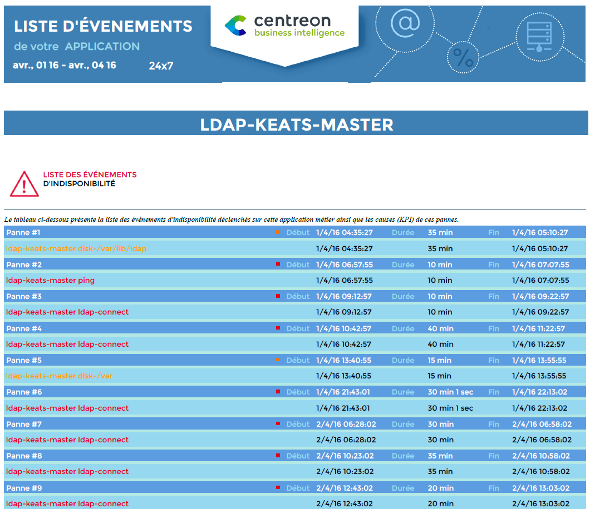

#### Paramètres :

Les paramètres attendus dans ce rapport :

-   Une date de début et de fin laquelle générer le rapport
-   Les objets Centreon suivant :

| Paramètres        | Type             | Description                                                       |
| ----------------- | ---------------- | ----------------------------------------------------------------- |
| logo              | Liste déroulante | Logo à afficher dans l'en tête du rapport                         |
| business Activity | Liste déroulante | Sélection de la business activity sur laquelle générer le rapport |
| title             | Champ texte      | Permet de préciser un titre particulier pour le rapport           |
| time period       | Liste déroulante | Sélectionner la période de reporting à appliquer\*                |

\* *Si différent de "Default", assurez vous que la plage sélectionnée
soit bien définie dans les paramètres de l'application métier dans
Configuration > Business Activiy > XXXXX | onglet "Information
étendues" en plage horaire par défaut ou supplémentaire*

#### Pre-requis

-   Disposer de Centreon BAM >= 3.0
-   Disposer de Centreon Broker >= 2.8.0
-   Superviser au moins une activité métier et la lier à une vue
    business.
-   Avoir au moins un mois de données provenant du module BAM

### BV-BA-Current-Health-VS-Past

#### Description

Ce rapport affiche la santé des activités métier au moment de sa
génération et leur disponibilité sur une période paramétrée.

**Comment interpréter ce rapport?**

Pour une vue métier donnée en entrée, Le rapport affiche l'état et la
santé de chacune des applications de la vue métier, l'heure du dernier
changement d'état, la durée de l'état actuel, indique si
l'application métier a été acquittée et / ou en downtime. Selon le
paramètre choisi au moment de la génération, le rapport affiche la
disponibilité et le nombre de pannes des applications métier sur une
période dans le passé.

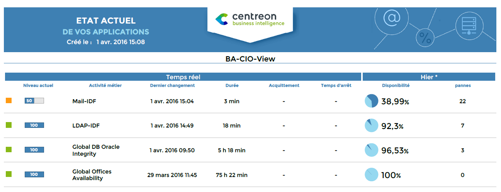

#### Paramètres

Les paramètres attendus dans ce rapport :

| **Paramètres**                  | **Type**         | **Description**                                                                                 |
| ------------------------------- | ---------------- | ----------------------------------------------------------------------------------------------- |
| logo                            | Liste déroulante | Logo à afficher dans l'en tête du rapport                                                       |
| title                           | Champ texte      | Permet de préciser un titre particulier pour le rapport                                         |
| business View                   | Liste déroulante | Sélection de la business view sur laquelle générer le rapport                                   |
| compare with                    | Radio bouton     | Permet de d'afficher les données du passés selon la période choisie                             |
| show the reporting timeperiod.. | Radio bouton     | Permet l'affichage ou non de la période associée à l'activité métier                            |
| display thresholds              | Radio bouton     | Afficher les seuils d'avertissement (warning) et critique (critical) de chaque activité métier? |
| time period                     | Liste déroulante | Sélectionner la période de reporting à appliquer*                                              |

* *Si différent de "Default", assurez vous que la plage sélectionnée
soit bien définie dans les paramètres de l'application métier dans
Configuration > Business Activiy > XXXXX | onglet "Information
étendues" en plage horaire par défaut ou supplémentaire. Dans le cas
contraire seule les données temps réelles seront affichées.*

#### Pre-requis

-   Disposer de Centreon BAM >= 3.0
-   Disposer de Centreon Broker >= 2.8.0
-   Superviser au moins une activité métier et la lier à une vue
    business.

### BV-BA-Availabilities-Calendars

#### Description

Ce rapport vous donnes des statistiques sur la disponibilité et les
incidents de vos activités métier. Les données sont affichées dans des
calendriers au mois et à la journée. La plage horaire utilisée pour
chaque activité métier est la plage horaire par défaut configurée dans
le module Centreon BAM.

**Comment interpréter ce rapport?**

Le premier calendrier la disponibilité des activités métier par mois.
Les cases sont colorées en fonction des SLA définis en pourcentage au
niveau de chaque activité métier (dans "Extended Information"). Si
aucun SLA n'est défini au niveau de la BA, la valeur est affichée dans
la cellule si la disponibilité est inférieure à 100% ou
l'indisponibilité supérieure à 0 secondes. La plage horaire considérée
est la plage horaire de reporting par défaut définie au niveau de chaque
activité métier (Dans l'onglet "Configuration").

Le second calendrier affiche l'indisponibilité et le nombre
d'incidents apparus sur les activités métier, par mois. Les cases sont
colorées en fonction des SLA définis au niveau de chaque activité métier
en minutes. Si aucun SLA n'est défini au niveau de la BA, la valeur est
affichée dans la cellule si la disponibilité est inférieure à 100% ou
l'indisponibilité supérieure à 0 secondes. La plage horaire considérée
est la plage horaire de reporting par défaut définie au niveau de chaque
activité métier.

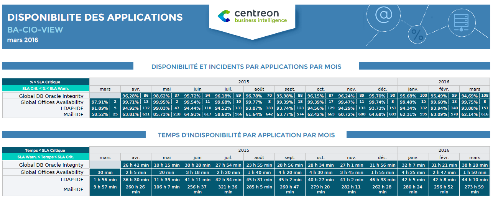

Le troisième calendrier affiche la disponibilité par jour de chaque
activité métier. La couleur est affichée en fonction des tranches de
temps indisponibles définies en paramètres du rapport, en minute. Si la
disponibilité est inférieur à 100%, la disponibilité de la journée est
affichées.

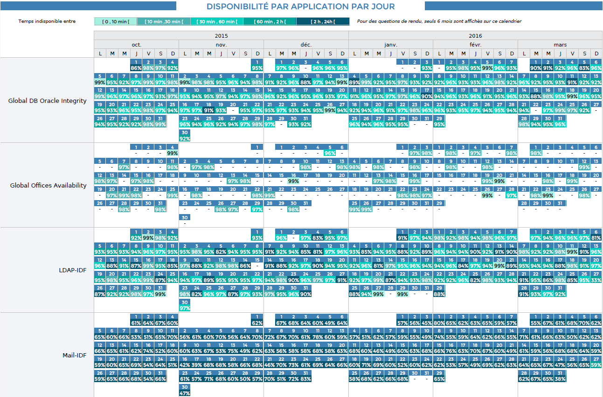

#### Paramètres :

Les paramètres attendus dans ce rapport :

-   Une date correspondant au mois sur lequel générer le rapport (date
    de début sur l'interface de Centreon MBI)
-   Les objets Centreon suivant :

| Paramètres    | Type             | Description                                                             |
| ------------- | ---------------- | ----------------------------------------------------------------------- |
| logo          | Liste déroulante | Logo à afficher dans l'en tête du rapport                               |
| business View | Liste déroulante | Sélection de la business view sur laquelle générer le rapport           |
| sla 1         | Champ texte      | Temps maximum en minutes du premier intervalle \[0 min, **sla1** \[     |
| sla 2         | Champ texte      | Temps maximum en minutes du second intervalle \[sla1 min, **sla2** \[   |
| sla 3         | Champ texte      | Temps maximum en minutes du troisième intervalle \[sl2 min, **sla3** \[ |
| sla 4         | Champ texte      | Temps maximum en minutes du quatrième intervalle \[sl3 min, **sla4** \[ |
| title         | Champ texte      | Permet de préciser un titre particulier pour le rapport                 |
| time period   | Liste déroulante | Sélectionner la période de reporting à appliquer\*                      |

\* *Si différent de "Default", assurez vous que la plage sélectionnée
soit bien définie dans la configuration des activités métier en tant que
plage horaire par défaut ou supplémentaire. Dans le cas contraire, elle
n'apparaîtront pas dans le rapport*

#### Pre-requis

-   Disposer de Centreon BAM >= 3.0
-   Disposer de Centreon Broker >= 2.8.0
-   Superviser au moins une activité métier et la lier à une vue
    business.
-   Avoir au moins un mois de données provenant du module BAM

## Disponibilité et événements

### Hostgroups-Incidents-1

#### Description

Ce rapport permet d'avoir une vue d'ensemble sur les incidents apparus
au niveau des hôtes.

**Comment interpréter ce rapport?**

La page de garde permet de connaître la répartition des hôtes selon les
catégories d'hôtes et de services.

La première page du rapport affiche la répartition des évènements de
type exception ouverts/fermés par jour du mois et sur plusieurs mois
ainsi que leur répartition par groupe.

Sur la deuxième page on retrouve des informations de fiabilité et
maintenabilité des groupes d'hôtes (MTRS, MTBF,MTBSI).

Une page est ensuite générée pour chaque groupe d'hôtes afin de donner
des informations plus détaillées sur les évènements de type exception,
le MTTR, le MTBF et les hôtes les plus critiques sur ces deux derniers
indicateurs.

#### Page de garde

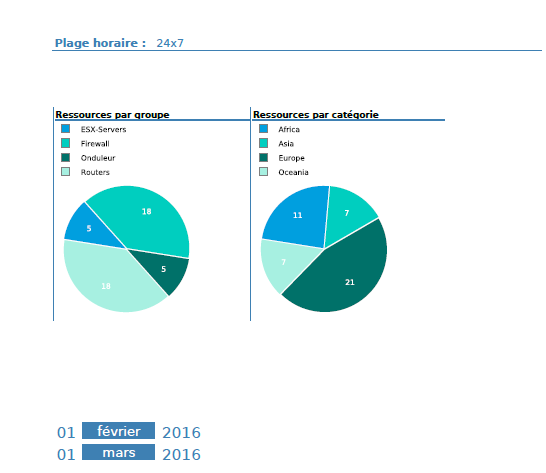

#### Première page

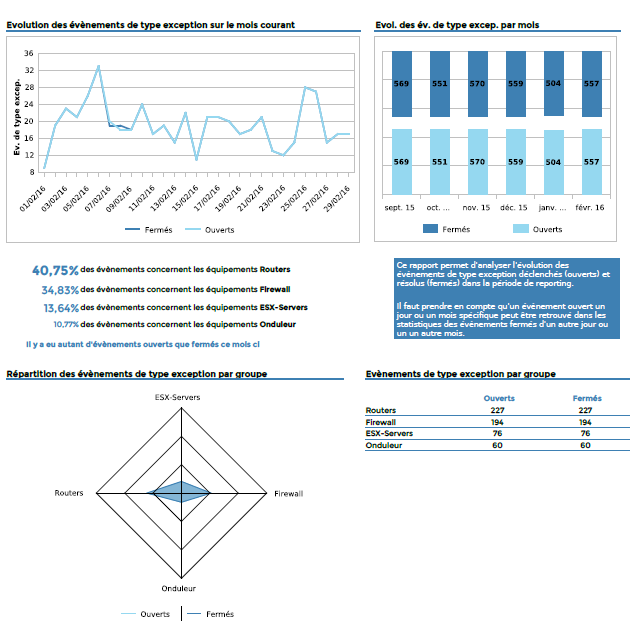

#### Deuxième page

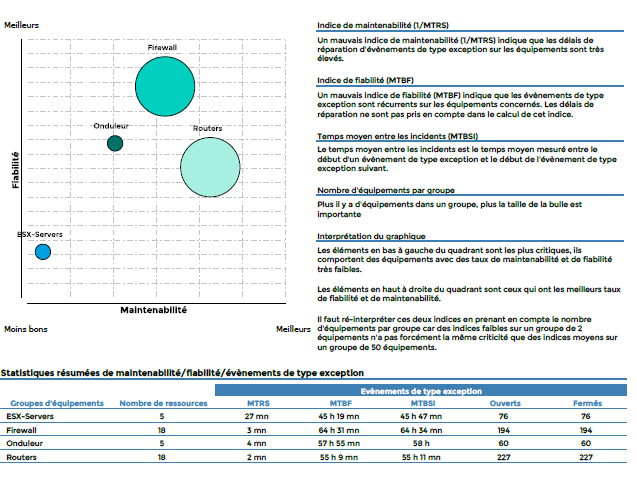

#### Pour chaque groupe

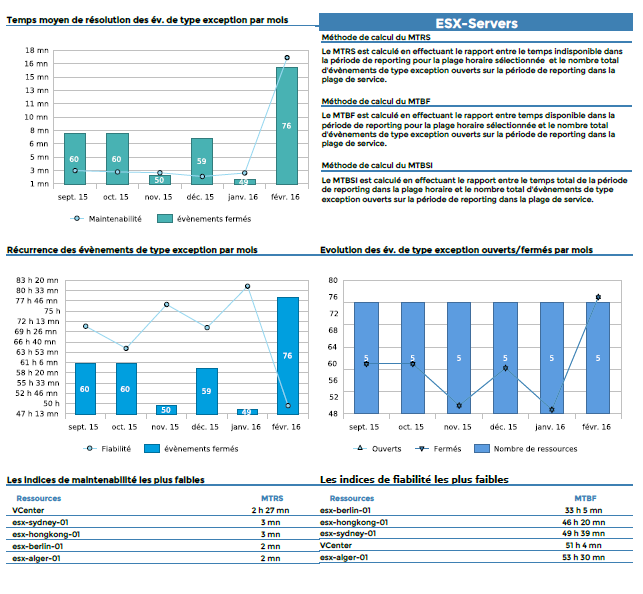

#### Paramètres

Les paramètres attendus dans ce rapport :

-   Une periode de reporting
-   Les objets Centreon suivant :

| Paramètres    | Type             | Description                                 |
| ------------- | ---------------- | ------------------------------------------- |
| Time period   | Liste déroulante | Plage horaire à utiliser                    |
| Host groups   | Multi sélection  | Sélection des groupes d'hôtes               |
| Host category | Multi sélection  | Catégories d'hôtes                          |
| Interval      | Champ texte      | Nombre de mois à afficher dans le graphique |

### Hostgroups-Availability-1

#### Description

Ce rapport affiche la disponibilité et les évènements de type exception
des hôtes et des services de plusieurs groupes d'hôtes. L'évolution de
ces indicateurs est également présente.

**Comment interpréter ce rapport?**

Sur la première page on trouve une vue d'ensemble des indicateurs de
disponibilité et d'évènements de type exception pour les hôtes et les
services de tous les groupes d'hôtes, par catégories d'hôtes.

Deux pages sont ensuite générées pour chaque groupe d'hôtes :

:   -   La première contient des graphiques d'évolution sur les
        indispobilités et les évènements de type exception des services
        et des hôtes du groupe
    -   La deuxième contient des TOP sur les hôtes les plus critiques en
        terme d'indisponibilité et d'évènements.

#### Première page

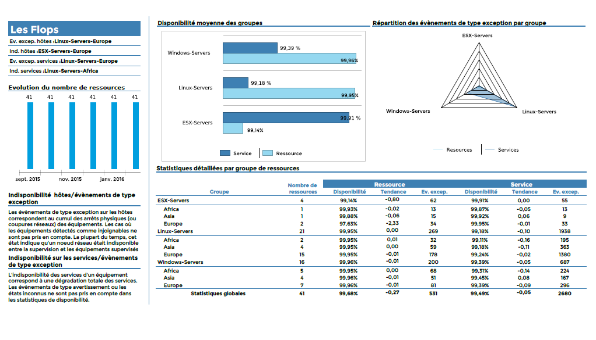

#### Pour chaque groupe d'hôtes

##### Première page

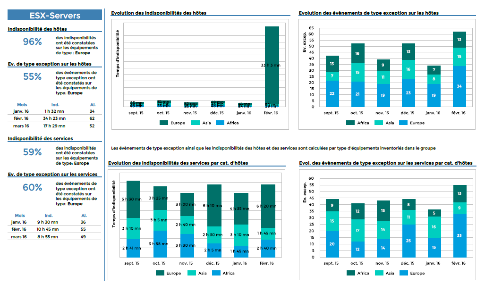

##### Deuxième page

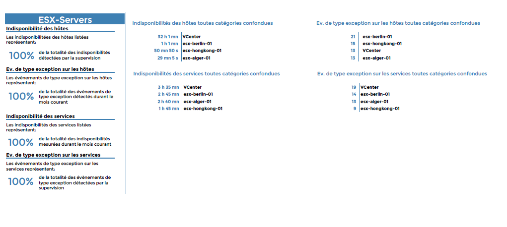

#### Paramètres

Les paramètres attendus dans ce rapport :

-   Une periode de reporting
-   Les objets Centreon suivant :

| Paramètres       | Type             | Description                                 |
| ---------------- | ---------------- | ------------------------------------------- |
| Time period      | Liste déroulante | Plage horaire à utiliser                    |
| Host groups      | Multi sélection  | Sélection des groupes d'hôtes               |
| Host category    | Multi sélection  | Catégories d'hôtes                          |
| Service category | Multi sélection  | Catégories de services                      |
| Interval         | Champ texte      | Nombre de mois à afficher dans le graphique |

### Hostgroup-Availability-2 

Ce rapport donne la disponibilité et les évènements de type exception
d'un groupe d'hôtes.

**Comment interpréter ce rapport ?**

Sur la première page, l'évolution de la disponibilité et des évènements
de type exception est affichée pour les hôtes et les services du groupe.
L'évolution du nombre d'hôtes dans le groupe est également affichée.

Sur la deuxième page, la disponibilité et les alarmes des évènements de
type exception sont affichés par catégorie. De plus, des TOP 15 des
équipements les moins disponibles et ayant générés le plus d'évènements
sont affichés.

On retrouve sur les deux dernières pages la disponibilité et les
évènements de type exception sur les serivces. Les informations sont
réparties par catégories d'hôtes et de services. Des TOP 15 des
équipements sur lesquels il y a eu le plus d'évènements et
d'indisponibilité des services sont affichés.

#### Première page

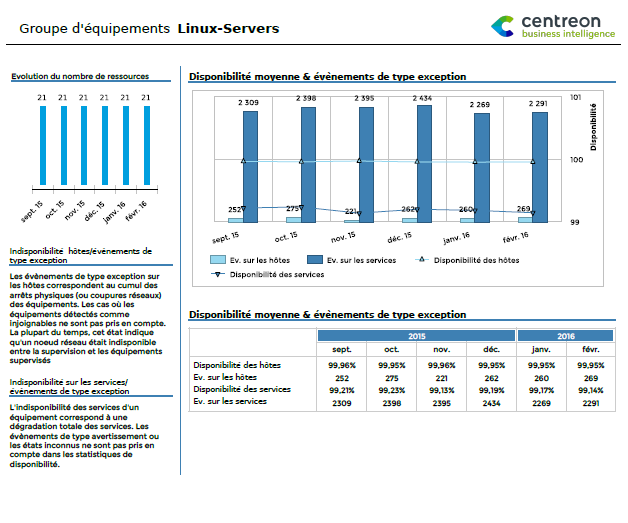

#### Deuxième page

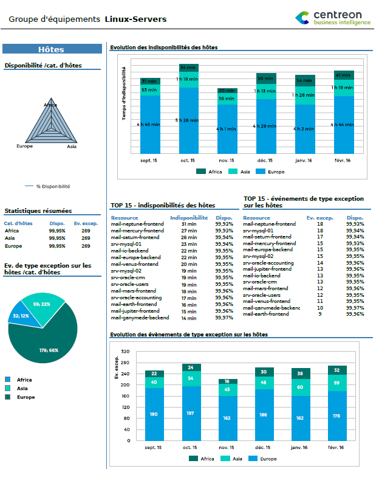

#### Troisième & quatrième pages

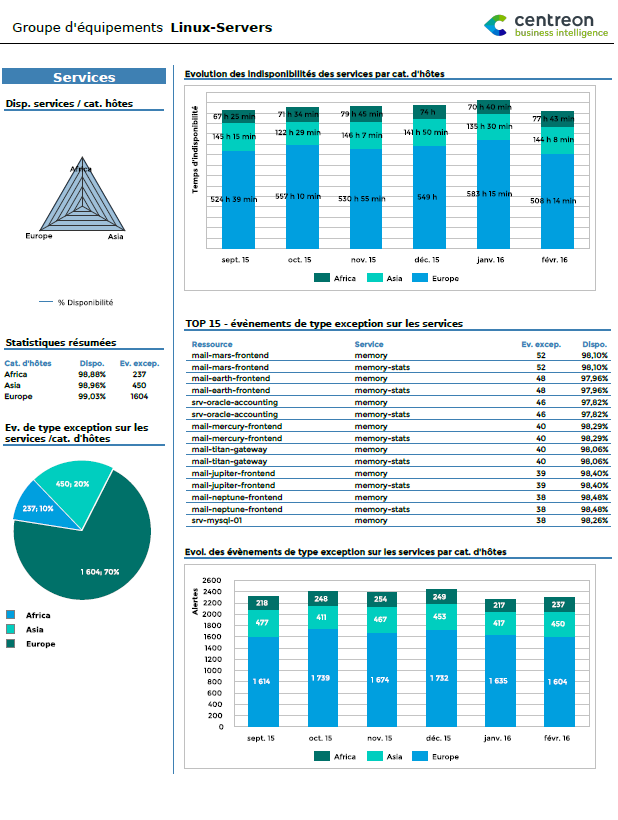

et

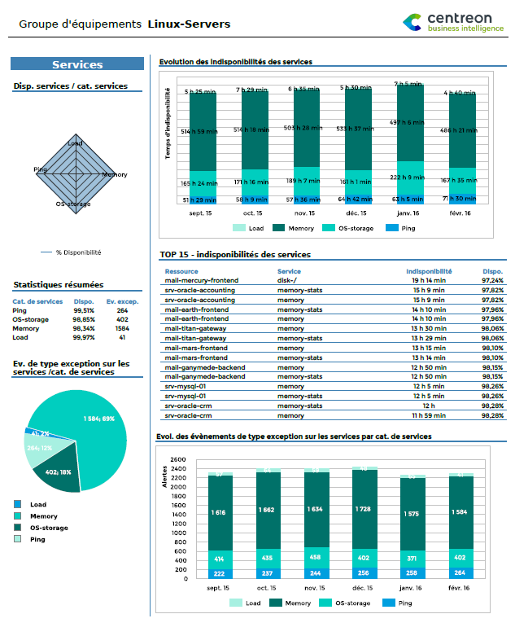

#### Paramètres

Les paramètres attendus dans ce rapport :

-   Une periode de reporting
-   Les objets Centreon suivant :

|   Paramètres      |   Type                 |   Description                                 |
| ----------------- | ---------------------- | --------------------------------------------- |
|    Time    period |    Liste    déroulante | Plage horaire à utiliser                      |
| Host group        | Liste déroulante       | Sélection du groupe d'hôtes                   |
| Host category     | Multi sélection        | Catégories d'hôtes                            |
| Service category  | Multi sélection        | Catégories de services                        |
| Interval          | Champ texte            | Nombre de mois à afficher dans les graphiques |

### Hostgroup-Host-Availability-List

Ce rapport est un tableau listant des informations des disponibilités et
d'évènements de type exception pour les hôtes d'un groupe d'hôtes.

**Comment interpréter ce rapport ?**

Pour chaque équipement sont affichés :le pourcentage de disponibilité,
le temps indisponible, le nombre d'évènements et les évolutions par
rapport à la période précédente.

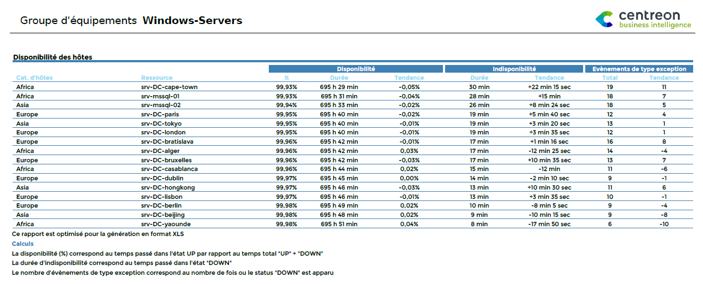

#### Paramètres

Les paramètres attendus dans ce rapport :

-   Une periode de reporting
-   Les objets Centreon suivant :

| Paramètres        |   Type                 |   Description               |
| ----------------- | ---------------------- | --------------------------- |
|    Time    period |    Liste    déroulante | Plage horaire à utiliser    |
| Host group        | Liste déroulante       | Sélection du groupe d'hôtes |
| Host category     | Multi sélection        | Catégories d'hôtes          |

### Hostgroup-Host-Event-List 

Ce rapport affiche un listing des évènements non informatifs sur les
équipements d'un groupe d'hôtes.

**Comment interpréter ce rapport?**

Ce rapport donne des statistiques détaillées sur les évènements : date
de début, date de fin, temps avant acquittement, "real MTRS",
"effective MTRS".

-   *real MTRS : temps total de résolution de l'évènement à partir de
    sa détection dans la plage horaire considérée*
-   *effective MTRS : temps total de résolution de l'évènement à partir
    de sa détection et uniquement calculé dans la plage horaire
    considérée*

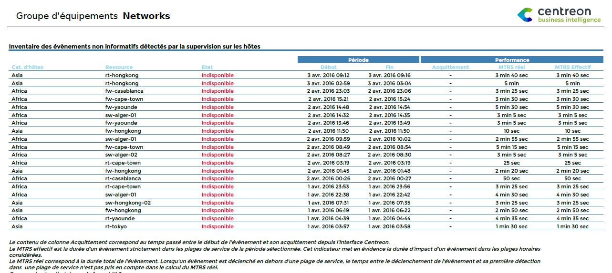

#### Paramètres

Les paramètres attendus dans ce rapport :

-   Une periode de reporting
-   Les objets Centreon suivant :

| paramètres        | Type                   | Description                 |
| ----------------- | ---------------------- | --------------------------- |
|    Time   period  | Liste déroulante       | Plage horaire à utiliser    |
| Host group        | Liste déroulante       | Sélection du groupe d'hôtes |
| Host category     | Multi sélection        | Catégories d'hôtes          |

### Hostgroup-Service-Availability-List

Ce rapport affiche un listing des disponibilités et des évènements sur
les services d'un groupe d'hôtes.

**Comment interpréter ce rapport**

Pour chaque service du groupe on retrouve : la disponibilité, le temps
d'indisponibilité, les évènements de type avertissement et exception
ainsi que l'évolution de ces différents indicateurs.

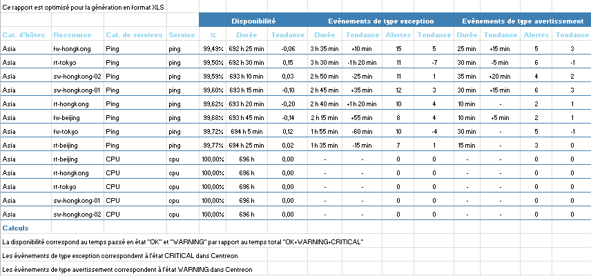

#### Paramètres

Les paramètres attendus dans ce rapport :

-   Une periode de reporting
-   Les objets Centreon suivant :

|   Paramètres      | Type                   | Description                          |
| ----------------- | ---------------------- | ------------------------------------ |
|    Time    period |    Liste    déroulante | Plage horaire à utiliser             |
| Host group        | Liste déroulante       | Sélection du groupe d'hôtes          |
| Host category     | Multi sélection        | Sélection des catégorie d'hôtes      |
| Service category  | Multi sélection        | Sélection des catégories de services |

### Hostgroup-Service-Event-List 

Ce rapport affiche un listing des évènements non informatifs sur les
services d'un groupe d'hôtes.

**Comment interpréter ce rapport?**

Ce rapport donne des statistiques détaillées sur les évènements : date
de début, date de fin, temps avant acquittement, "real MTRS",
"effective MTRS".

-   *real MTRS : temps total de résolution de l'évènement à partir de
    sa détection dans la plage horaire considérée*
-   *effective MTRS : temps total de résolution de l'évènement à partir
    de sa détection et uniquement calculé dans la plage horaire
    considérée*

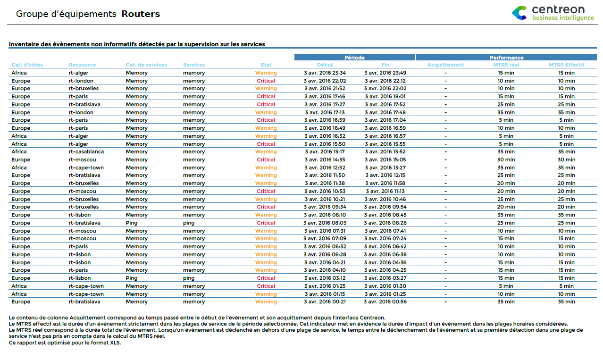

#### Paramètres

Les paramètres attendus dans ce rapport :

-   Une periode de reporting
-   Les objets Centreon suivant :

| Paramètres        | Type                   | Description                 |
| ----------------- | ---------------------- | --------------------------- |
|    Time    period |    Liste    déroulante | Plage horaire à utiliser    |
| Host group        | Liste déroulante       | Sélection du groupe d'hôtes |
| Host category     | Multi sélection        | Catégories d'hôtes          |
| Service category  | Multi sélection        | Catégories de services      |

### Hostgroup-Service-Incident-Resolution-2

Pour un groupe d'hôte, ce rapport affiche les taux d'acquittement et
de résolution des évènements, les évènements les plus longues, les
incidateurs les moins fiables ainsi que les équipements générants le
plus de d'évènements.

**Comment interpréter ce rapport?**

Le premier objet de ce rapport affichent le pourcentage d'évènements
acquittées et résolues dans un délai donné en paramètre

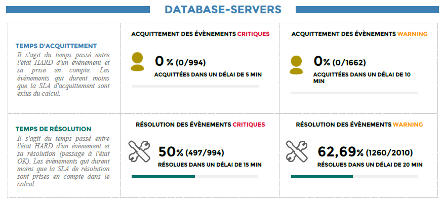

Le second objet affiche un TOP x des évènements les plus longues, avec
pour chaque évènement, l'heure de début et de fin ainsi que le temps
mis pour sa résolution. En rouge les incidateurs dans un status
"critical". En orange les indicateurs "warning", et en gris les
incidateurs "unknown".

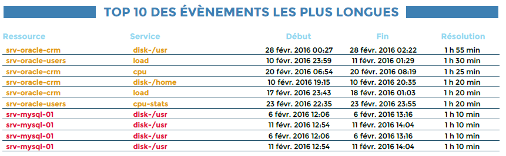

Le troisième objet de ce rapport représente un TOP x des indicateurs les
moins fiables.

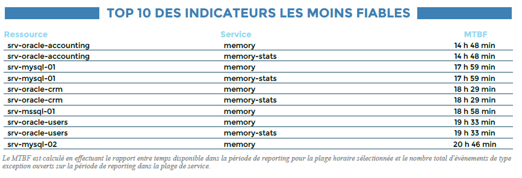

Enfin, un dernier TOP représentera les équipements générants le plus
d'évènements.

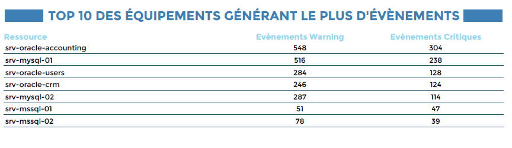

#### Paramètres

Les paramètres attendus dans ce rapport :

  -   Une periode de reporting
  -   Une SLA d'acquittement en minutes
  -   Une SLA de résolution en minutes
  -   Le nombre de lignes à afficher dans les TOP
  -   Les objets Centreon suivant :

| Paramètres        | Type                   | Description                 |
| ----------------- | ---------------------- | --------------------------- |
| Time period       | Liste déroulante       | Plage horaire à utiliser    |
| Host group        | Liste déroulante       | Sélection du groupe d'hôtes |
| Host category     | Multi sélection        | Catégories d'hôtes          |
| Service category  | Multi sélection        | Catégories de services      |

### Hostgroup-Host-Pareto 

Ce rapport met en évidence les hôtes responsables du plus grand nombre
d'évènements de type exception (statut DOWN) dans un groupe
d'équipements. La représentation est faite sous forme de diagramme de
pareto.

**Comment interpréter ce rapport?**

Les hôtes resposables de 80% des évènements sont mis en avant dans ce
rapport (couleurs dans le graphique). Ils sont triés par ordre
décroissant en termes de nombre d'évènements générés. Le pourcentage
des évènements cumulé au fur et à mesure est aussi représenté.

Ce rapport permet donc de prendre des mesures correctrices sur les bons
hôtes en exploitant le principe de Pareto ou encore la loi des 80-20 :
environ 80 % des effets sont le produit de 20 % des causes.

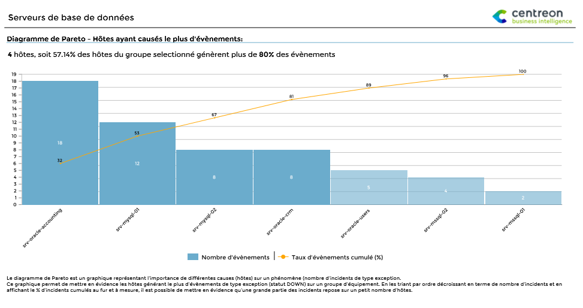

#### Paramètres

Les paramètres attendus dans ce rapport :

  -   Une periode de reporting
  -   Les objets Centreon suivant :

|   Paramètres      |   Type                 |   Description               |
| ----------------- | ---------------------- | --------------------------- |
| Time period       | Liste déroulante       | Plage horaire à utiliser    |
| Host group        | Liste déroulante       | Sélection du groupe d'hôtes |
| Host category     | Multi sélection        | Catégories d'hôtes          |

### Hostgroups-Host-Current-Events

Ce rapport affiche les évènements en cours sur les hôtes au moment de sa
génération.

**Comment interpréter ce rapport?**

Le rapport est composé de quatre parties, dans chaque partie, il est
possible de sélectionner un périmètre restreint en filtrant sur des
groupes d'hôtes et catégories de d'hôtes. Les données affichées sont
des données temps réel du moment de la génération.

-   Les évènements en cours peuvent être triés par: état, durée et
    hôtes.
-   Il est possible d'afficher / filtrer les hôtes acquittés ou en
    downtime.
-   Seuls les évènements dans un état confirmé (hard) sont pris en
    compte dans le rapport.
-   Il est possible générer le rapport sur moins de 4 parties, pour cela
    il suffit de renseigner la valeur -1 dans le titre dans la partie
    non utilisée

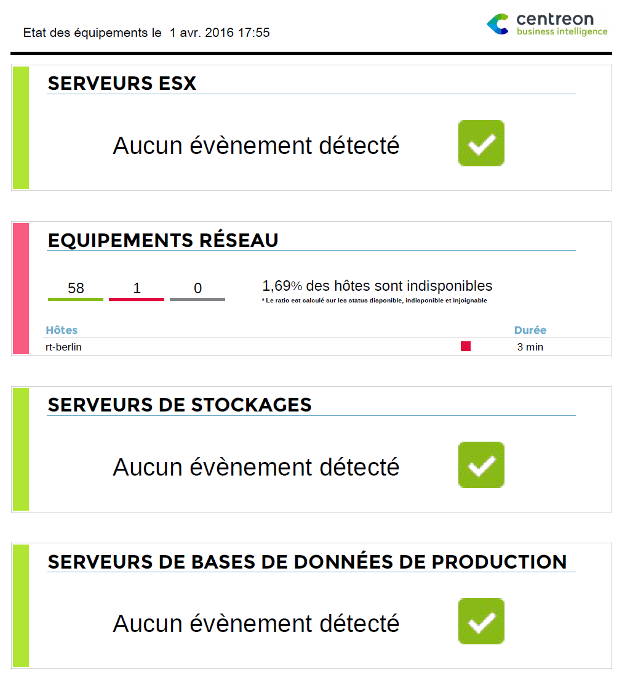

#### Paramètres

Les paramètres attendus dans ce rapport :

| Paramètres          | Type            | Description                                                     |
| ------------------- | --------------- | --------------------------------------------------------------- |
| title               | Champs texte    | titre de la première partie du rapport                          |
| Hostgroups          | Multi sélection | Sélection des groupe d'hôtes de la partie 1 du rapport          |
| Host category       | Multi sélection | Catégories d'hôtes de la partie 1 du rapport                    |
| title               | Champs texte    | titre de la seconde partie du rapport                           |
| Hostgroups          | Multi sélection | Sélection des groupe d'hôtes de la partie 2 du rapport          |
| Host category       | Multi sélection | Catégories d'hôtes de la partie 2 du rapport                    |
| title               | Champs texte    | titre de la troisième partie du rapport                         |
| Hostgroups          | Multi sélection | Sélection des groupe d'hôtes de la partie 3 du rapport          |
| Host category       | Multi sélection | Catégories d'hôtes de la partie 3 du rapport                    |
| title               | Champs texte    | titre de la quatrième partie du rapport                         |
| Hostgroups          | Multi sélection | Sélection des groupe d'hôtes de la partie 4 du rapport          |
| Host category       | Multi sélection | Catégories d'hôtes de la partie 4 du rapport                    |
| sort_by             | Radio bouton    | Permet de trier les résultats par état, durée ou hôte           |
| display_ack         | Radio bouton    | Permet d'afficher ou de filtrer les hôtes acquittés             |
| display _downtimes  | Radio bouton    | Permet d'afficher ou de filtrer les hôtes dans un temps d'arrêt |

### Hostgroups-Service-Current-Events

Ce rapport affiche les évènements en cours sur les services au moment de
sa génération.

**Comment interpréter ce rapport?**

Le rapport est composé de quatre parties, dans chaque partie, il est
possible de sélectionner un périmètre restreint en filtrant sur des
groupes d'hôtes, des catégories d'hôtes et de services. Les données
affichées sont des données temps réel du moment de la génération.

-   Les évènements en cours peuvent être triés par: état, durée et
    hôtes.
-   Il est possible d'afficher / filtrer les services acquittés ou en
    downtime.
-   Il est possible de prendre en compte uniquement les services
    critiques.
-   Seuls les évènements dans un état confirmé (hard) sont pris en
    compte dans le rapport.
-   Il est possible générer le rapport sur moins de 4 parties, pour cela
    il suffit de renseigner la valeur -1 dans le titre dans la partie
    non utilisée

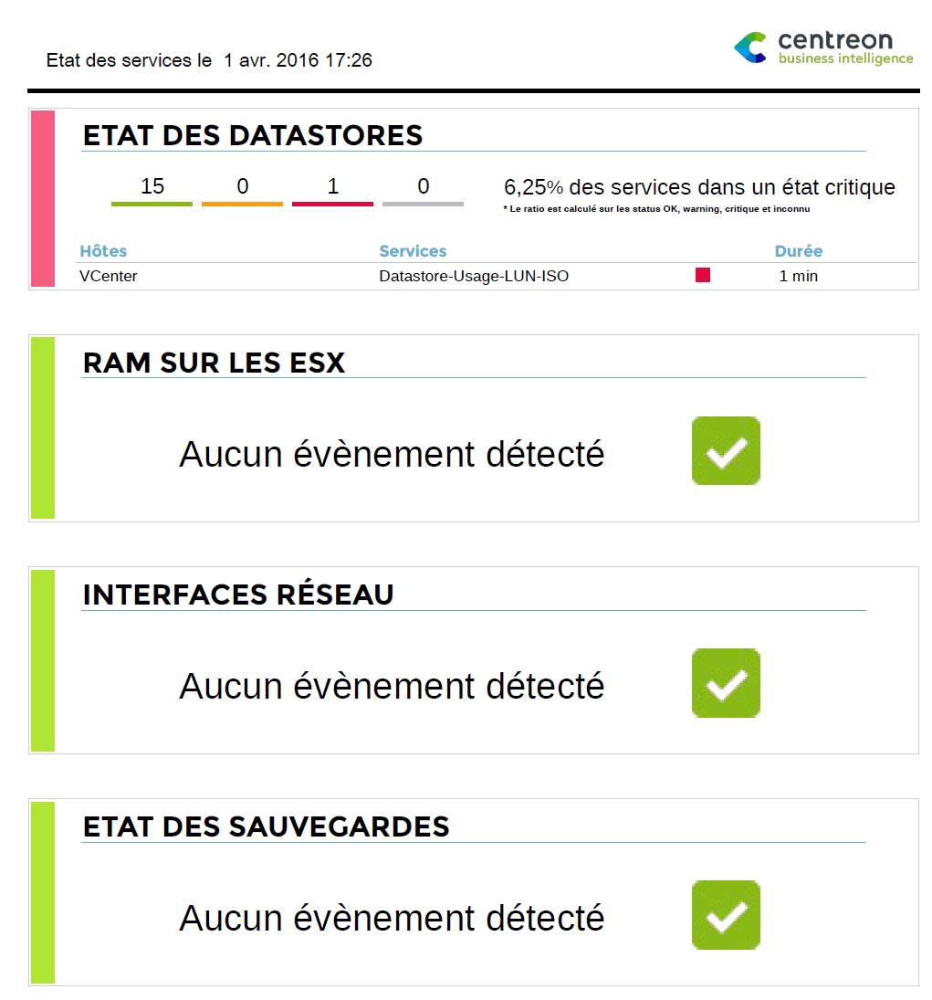

#### Paramètres

Les paramètres attendus dans ce rapport :

| Paramètres              | Type            | Description                                                        |
| ----------------------- | --------------- | ------------------------------------------------------------------ |
| title                   | Champs texte    | titre de la première partie du rapport                             |
| Hostgroups              | Multi sélection | Sélection des groupe d'hôtes de la partie 1 du rapport             |
| Host category           | Multi sélection | Catégories d'hôtes de la partie 1 du rapport                       |
| Service category        | Multi sélection | Catégories de services de la partie 1 du rapport                   |
| title                   | Champs texte    | titre de la seconde partie du rapport                              |
| Hostgroups              | Multi sélection | Sélection des groupe d'hôtes de la partie 2 du rapport             |
| Host category           | Multi sélection | Catégories d'hôtes de la partie 2 du rapport                       |
| Service category        | Multi sélection | Catégories de services de la partie 2 du rapport                   |
| title                   | Champs texte    | titre de la troisième partie du rapport                            |
| Hostgroups              | Multi sélection | Sélection des groupe d'hôtes de la partie 3 du rapport             |
| Host category           | Multi sélection | Catégories d'hôtes de la partie 3 du rapport                       |
| Service category        | Multi sélection | Catégories de services de la partie 3 du rapport                   |
| title                   | Champs          | titre de la quatrième partie du                                    |
| Hostgroups              | Multi sélection | Sélection des groupe d'hôtes de la partie 4 du rapport             |
| Host category           | Multi sélection | Catégories d'hôtes de la partie 4 du rapport                       |
| Service category        | Multi sélection | Catégories de services de la partie 4 du rapport                   |
| sort_by                 | Radio bouton    | Permet de trier les résultats par état, durée ou hôte              |
| display_ack             | Radio bouton    | Permet d'afficher ou de filtrer les services acquittés             |
| display–downtimes       | Radio bouton    | Permet d'afficher ou de filtrer les services dans un temps d'arrêt |
| display only_critical   | Radio bouton    | Permet d'afficher uniquement les services dans un état critique    |

## Performance

### Host-Graphs-V2

Ce rapport affiche les graphiques RRD des services d'un hôte pour les
catégories de services sélectionnées.

#### Paramètres

Les paramètres attendus par le rapport sont :

-   La période de reporting
-   Les objets Centreon suivant:

| Paramètres        | Type             | Description                                                                                                                   |
| ----------------- | ---------------- | ----------------------------------------------------------------------------------------------------------------------------- |
| Host              | Liste déroulante | Sélection de l'hôte                                                                                                           |
| Service category  | Liste déroulante | Catégorie de services                                                                                                         |
| Metric(s)         | Multi selection  | Sélection des métriques à conserver. Si aucune métrique n'est selectionnée, les graphiques par métrique ne sont pas affichés. |
| Règle d'affichage | Check box        | Défini si les graphiques doivent être affichés pour chaque service, chaque métrique ou les deux                               |

#### Pre-requis

Configurez le champ ci-dessous à la page `Reporting > Business Intelligence > General Options > Scheduler Options*` :

Ce rapport depend de l'API de génération de graphique RRD de Centreon
qui est appelé en utilisant le champ ci-dessus. De ce fait, il doit être
possible d'effectuer une requête sur l'API en HTTP ou HTTPs *à partir
du serveur de reporting* et cela doit fonctionner.

Pour résumer un "curl" sur l'URL de l'API doit répondre sans erreur
de certificat, example :

    curl https://$CENTREON-IP-OR-DNS$//include/views/graphs/generateGraphs/generateImage.php?akey=$AUTH_KEY$&username=$USER$&hostname=$HOSTNAME$&service=$SERVICENAME$&start=$TIMESTAMPSTART$&end=$TIMESTAMPEND$

Remplacez par les bonnes valeurs les variable '$xxxx$'.

Exemple :

    http://centreon.enterprise.com//include/views/graphs/generateGraphs/generateImage.php?akey=af9c583c5f31bd2459c07&username=myUser&hostname=host-1&service=cpu&start=1490997600&end=1493157600

### Hostgroup-Graphs-v2

Ce rapport affiche les graphiques RRD des services d'un groupe d'hôtes
pour les catégories de services sélectionnées.

#### Paramètres

Les paramètres attendus par le rapport sont :

-   La période de reporting
-   Les objets Centreon suivant:

| Paramètres        | Type             | Description                                                                                                                  |
| ----------------- | ---------------- | ---------------------------------------------------------------------------------------------------------------------------- |
| Host group        | Liste déroulante | Sélection du groupe d'hôtes                                                                                                  |
| Host category     | Multi sélection  | Catégories d'hôtes                                                                                                           |
| Service category  | Multi sélection  | Catégories de services                                                                                                       |
| Metric(s)         | Multi selection  | Sélection des métriques à conserver. Si aucune métrique n'est selectionnée les graphiques par métrique ne sont pas affichés. |
| Règle d'affichage | Check box        | Défini si les graphiques doivent être affichés pour chaque service, chaque métrique ou les deux                              |

#### Pre-requis

Configurez le champ ci-dessous à la page *Reporting > Business
Intelligence > General Options > Scheduler Options* :

Ce rapport depend de l'API de génération de graphique RRD de Centreon
qui est appelé en utilisant le champ ci-dessus. De ce fait, il doit être
possible d'effectuer une requête sur l'API **à partir du serveur de
reporting** et cela doit fonctionner.

Exemple, à partir du serveur de reporting, le "curl" suivant doit
répondre et générer un fichier de type image :

    curl https://$CENTREON-IP-OR-DNS$//include/views/graphs/generateGraphs/generateImage.php?akey=$AUTH_KEY$&username=$USER$&hostname=$HOSTNAME$&service=$SERVICENAME$&start=$TIMESTAMPSTART$&end=$TIMESTAMPEND$

Remplacez par les bonnes valeurs les variable '$xxxx$'.

Exemple d'adresse :

    http://centreon.enterprise.com//include/views/graphs/generateGraphs/generateImage.php?akey=af9c583c5f31bd2459c07&username=myUser&hostname=host-1&service=cpu&start=1490997600&end=1493157600

###  Hostgroup-Capacity-Planning-Linear-Regression

Ce rapport affiche des graphiques d'évolution et de prévision des
performances des métriques pour un groupe d'hôtes.

**Comment interpréter ce rapport?**

L'évolution de la valeur des métriques est affichée sur un graphique et
dans une table adjacente. Les prévisions sont calculées à partir des
valeurs prises sur la période ainsi que des valeurs avant la période de
reporting (paramètre Historical period in days...) et projetées sur le
futur, sur un nombre de jour défini en paramètre.

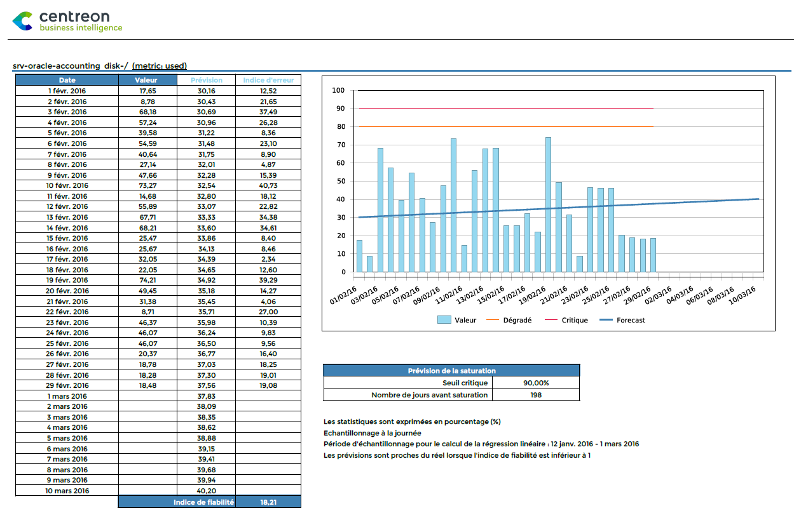

#### Paramètres

Les paramètres attendus dans ce rapport :

-   Une periode de reporting
-   Les objets Centreon suivant :

| Paramètres                                                    | Type             | Description                                                                                     |
| ------------------------------------------------------------- | ---------------- | ----------------------------------------------------------------------------------------------- |
| Time period                                                   | Liste déroulante | Plage horaire à utiliser                                                                        |
| Host group                                                    | Liste déroulante | Sélection du groupe d'hôtes                                                                     |
| Host category                                                 | Multi sélection  | Catégories d'hôtes                                                                              |
| Service category                                              | Multi sélection  | Catégories de services                                                                          |
| Metrics                                                       | Multi selection  | Metriques à **inclure** dans le rapport                                                         |
| Historical period in days in addition of the reporting period | Champ texte      | Nombre de jours à prendre en compte **avant** la période de reporting pour calculer l'évolution |
| Forecast period in days                                       | Champ texte      | Nombre de jour sur lesquels projeter les valeurs                                                |

#### Pre-requis:

Veillez à ce que les données de performance des métriques respectent
bien le format ci-dessous. Les valeurs maximum, warning et critique
doivent être présentes.

    output-plugin | metric1=valeur(unité);seuil_warning;seuil_critique;minimum;maximum metric2=valeur . . . 

###  Hostgroups-Rationalization-Of-Resources-1

Ce rapport permet d'avoir une vue d'ensemble de l'utlisation des
resources pour plusieurs groupes d'hôtes. L'idée ici étant d'établir
quelles sont les resources sous-utilisées, sur-chargées et combien sont
elles selon un critère paramétrable.

Sur la première page, la répartition en terme de charge est affichées
pour tous les groupes d'hôtes.

Une page pour chaque groupe d'hôtes est ensuite générée afin de
connaître la répartition par charge des équipements.

#### Page de résumé

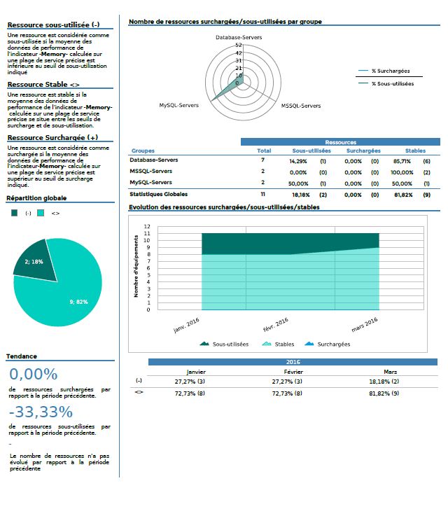

#### Pour chaque groupe d'hôtes

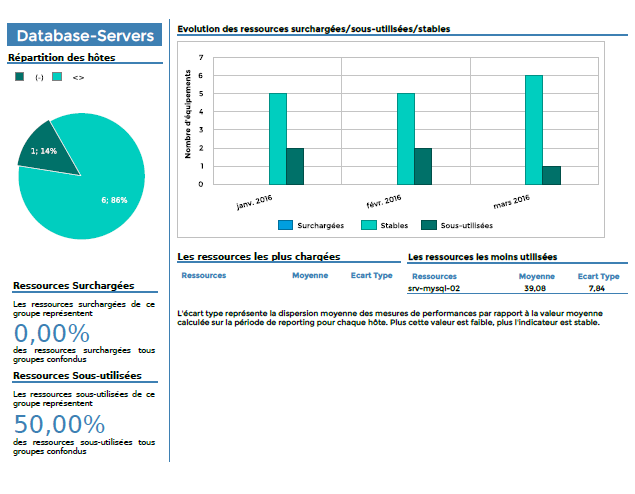

#### Parameters

Les paramètes attendus par ce rapport sont :

-   La période de reportin
-   Les objets Centreon suivant:

| **Parameter**      | **Parameter type** | **Description**                                                                                           |
| ------------------ | ------------------ | --------------------------------------------------------------------------------------------------------- |
| Hostgroups         | Multi selection    | Hostgroups à prendre en compte                                                                            |
| Host Categories    | Multi selection    | Catégories d'hôtes                                                                                        |
| Service Categories | Liste déroulante   | Catégorie de services                                                                                     |
| Metrics            | Multi selection    | Métriques à utiliser                                                                                      |
| Time period        | Liste déroulante   | Plage horaire à utiliser                                                                                  |
| Intervalle         | Champ texte        | Nombre de mois à afficher dans les graphiques                                                             |
| overloaded         | Champ texte        | Seuils haut à partir duquel la resources est considérée comment surchargée. *Unité: voir les pré-requis*  |
| underused          | Champ texte        | Seuils haut à partir duquel la resources est considérée comme sous-utilisée. *Unité: voir les pré-requis* |

#### Prerequisites 

Ce rapport peut être généré sur un indicateur retournant une valeur maximum ou non.

-   Dans le cas d'un indicateur sans valeur maximum (ex: nombre de
    visiteurs), les seuils doivent être dans la **même unité** que
    l'indicateur (ex: nombre de visiteurs).
-   Dans le cas d'un indicateurs possédant une valeur maximum est
    présente, les seuils doivent être en **pourcentage** (entre 0 et
    100).

###  Hostgroup-Service-Metric-Performance-List

Ce rapport affiche la valeur moyenne, les valeurs minimum & maximum
atteintes, la valeur maximum possible (lorsqu'elle existe) ainsi que
les seuils warning et critique pour toutes les métriques des services
correspondant au paramétrage.

-   Si la valeur maximum est retournée par le plugin, les colonnes
    moyenne, minimum et maximum sont affichées en pourcentage (%). Le
    calcul est le suivant : valeur / valeur maximum.
-   Si la valeur maximum n'est pas retournée par le plugin, les
    colonnes moyenne, minimum et maximum sont affichées dans l'unité de
    la métrique.

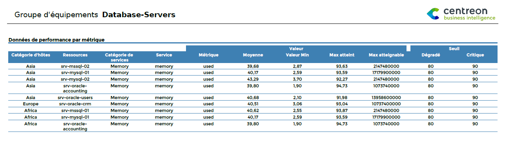

#### Paramètres

Les paramètres attendus dans ce rapport :

-   Une periode de reporting
-   Les objets Centreon suivant :

| **Paramètres**   | **Type**         | **Description**                         |
| ---------------- | ---------------- | --------------------------------------- |
| Time period      | Liste déroulante | Plage horaire à utiliser                |
| Host group       | Liste déroulante | Sélection du groupe d'hôtes             |
| Host category    | Multi sélection  | Catégories d'hôtes                      |
| Service category | Multi sélection  | Catégories de services                  |
| Metrics          | Multi selection  | Metriques à **inclure** dans le rapport |

### Hostgroups-Categories-Performance-List

Ce rapport affiche la valeur moyenne, les valeurs minimum & maximum
atteintes par toutes les catégories de services et d'hôtes, par groupe
d'hôtes.

-   Si la valeur maximum est retournée par le plugin, les colonnes
    moyenne, minimum et maximum sont affichées en pourcentage (%). Le
    calcul est le suivant : valeur / valeur maximum.
-   Si la valeur maximum n'est pas retournée par le plugin, les
    colonnes moyenne, minimum et maximum sont affichées dans l'unité de
    la métrique.

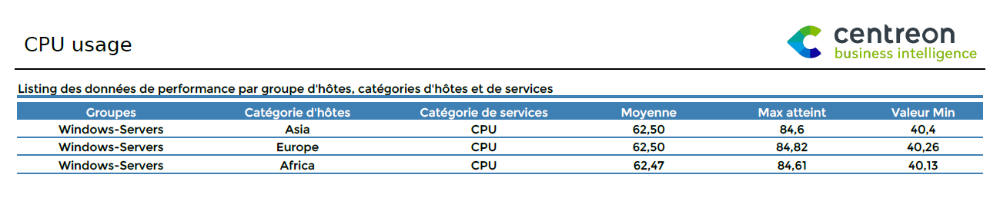

#### Paramètres

Les paramètres attendus dans ce rapport :

-   Une periode de reporting
-   Les objets Centreon suivant :

| **Paramètres**   | **Type**         | **Description**                         |
| ---------------- | ---------------- | --------------------------------------- |
| Time period      | Liste déroulante | Plage horaire à utiliser                |
| Hosts group      | Multi sélection  | Sélection des groupes d'hôtes           |
| Host category    | Multi sélection  | Catégories d'hôtes                      |
| Service category | Multi sélection  | Catégories de services                  |
| Metrics          | Multi selection  | Metriques à **inclure** dans le rapport |

## Stockage

### Hostgroups-Storage-Capacity-1 

Ce rapport affiche des statistiques d'allocation et d'utilisation des
espaces de stockage de plusieurs groupes d'hôtes.

**Comment interpréter ce rapport?**

Sur la première page les informations sont résumées pour tous les
groupes d'hôtes, par groupe d'hôtes.

Sur la deuxième page, ces mêmes informations sont réparties par
catégories d'hôtes et de services.

Pour chaque groupe d'hôtes, les mêmes indicateurs sont repris et
affichés par catégories d'hôtes et de services.

#### Première page

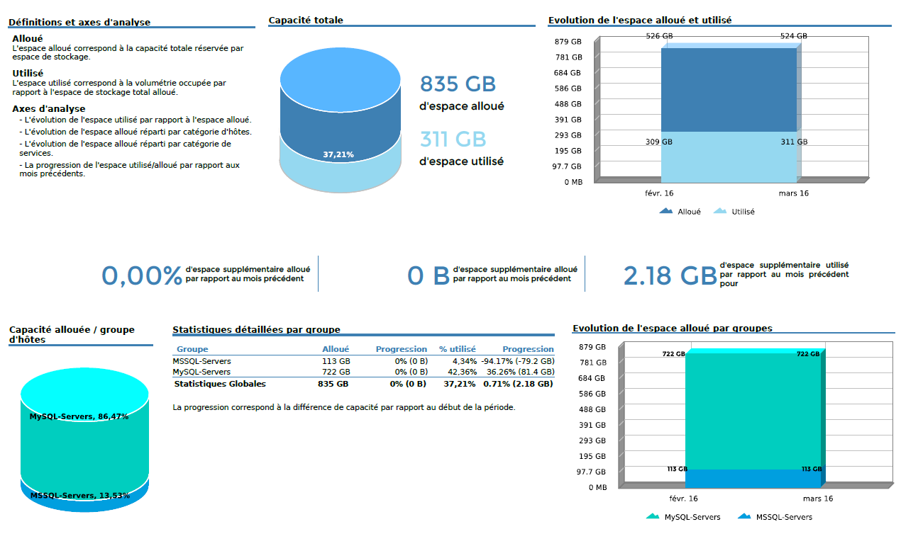

#### Deuxième page

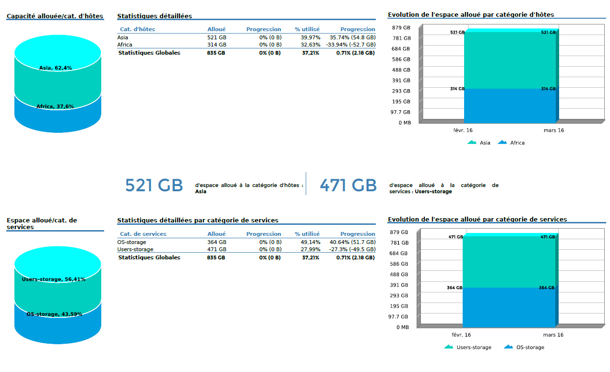

#### Pour chaque groupe d'hôtes

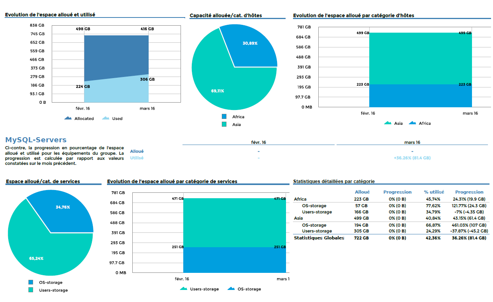

> Les statistiques affichées dans les tableaux et les graphques par mois
> correspondent aux valeurs mesurées le dernier jour des mois. Les
> statistiques de type "Snapshot" (en opposition aux évolutions par
> mois) correspondent aux valeurs des indicateurs mesurés le dernier jour
> de la période de reporting. Lorsqu'une évolution est affichée dans un
> tableau, il faut comprendre qu'elle est calculée en comparant la valeur
> du dernier jour de la période avec la valeur de la veille du premier
> jour de la période de reporting.

#### Paramètres

Les paramètres attendus dans ce rapport :

-   Une periode de reporting
-   Les objets Centreon suivant :

|   **Paramètres**        |            **Type**        |  **Description**                                                        |
|-------------------------|----------------------------|-------------------------------------------------------------------------|
|  Time period            |  Liste déroulante          | Plage horaire à utiliser. /! Seule la plage 24x7 doit être utilisée /!|
| Host groups             | Multi sélection            | Sélection des groupes d'hôtes                                           |
| Host category           | Multi sélection            | Catégories d'hôtes                                                      |
| Service category        | Multi sélection            | Catégories de services de **stockage**                                  |
| Metrics                 | Multi selection            | Metriques à **exclure** du le rapport                                   |
|      Intervalle         | Champ texte                | Nombre de mois à afficher dans les graphiques                           |

#### Pré-requis

Pour assurer la cohérence des données dans les graphiques et tableaux de
performance, certains pré-requis sont à respecter concernant le retour
des plugins.

Les données de performance retournées par les plugins de stockage
doivent être formatées de cette manière :

    output-plugin | metric1=valueunit;warning_treshold;critical_treshold;minimum;maximum metric2=value ....

Il est important de contrôler que la valeur maximum est bien retournée.
Enfin, assurez vous que les plugins de stockage retournent des valeurs
en Octet.

> **Important**
>
> - Le paramétrage de l'ETL doit comprendre les catégories de services de
> stockage. Dans le cas contraire, les graphiques d'évolutions sont
> vides.
> - Ce rapport est uniquement compatible avec la plage horaire 24x7. Cette
> dernière doit aussi être configurée dans le menu "General options |
> Capacity statistic agregated by month | Live services for capacity
> statistics calculation"

### Hostgroup-Storage-Capacity-2

Ce rapport fourni des statistiques détaillées sur les espaces de
stockage d'un groupe d'hôtes.

**Comment interpréter ce rapport ?**

Sur la première page, une information agrégée au niveau du groupe
d'hôtes est disponible. On y retrouve l'espace total utilisé et alloué
ainsi que l'évolution de ces valeurs. On y trouve également 2 tableaux
de type "TOP" affichant les espaces de stockage les plus critiques.

Sur la deuxième page on trouve des statistiques sur les espaces alloués
et occupés par catégorie de services puis sur la page suivante par
catégories d'hôtes.

Sur la quatrième page, un listing de tous les espaces de stockage du
groupe d'hôtes est disponible. On y retrouve des informations sur les
espaces alloués et utilisés, leur évolution et leur nombre de jours
avant saturation.

#### Première page

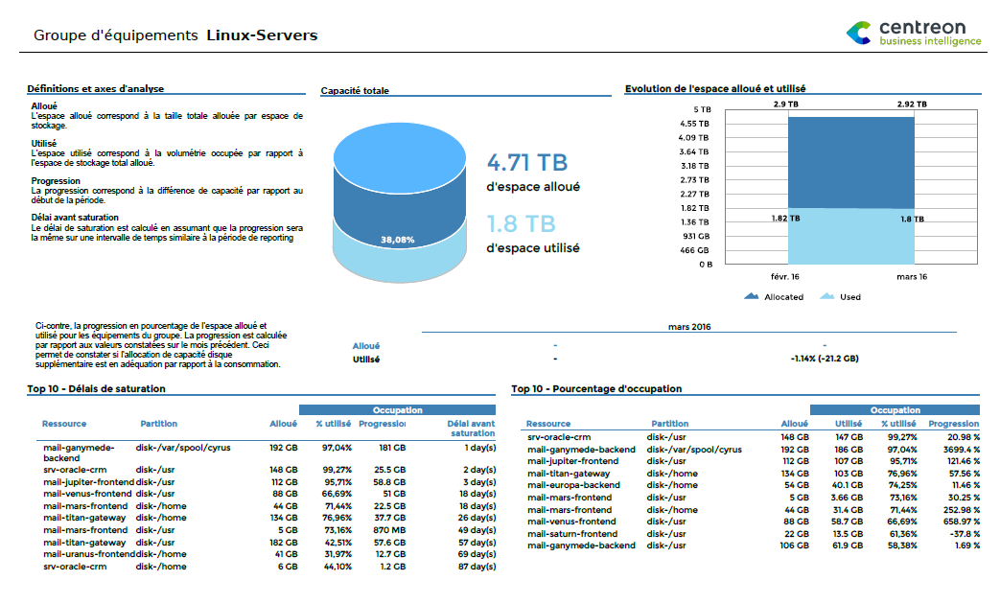

#### Deuxième page

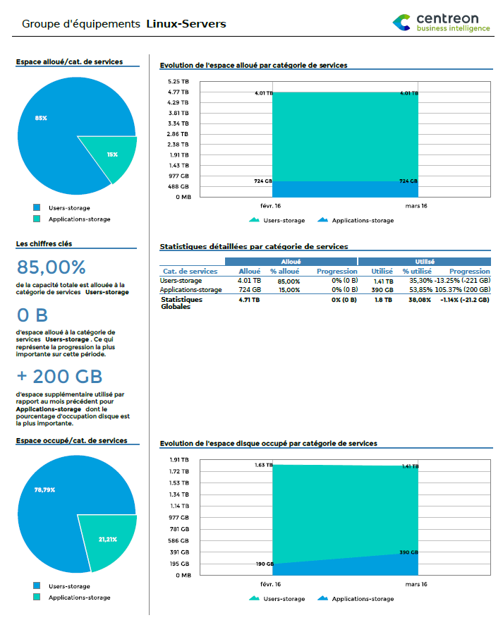

#### Troisième page

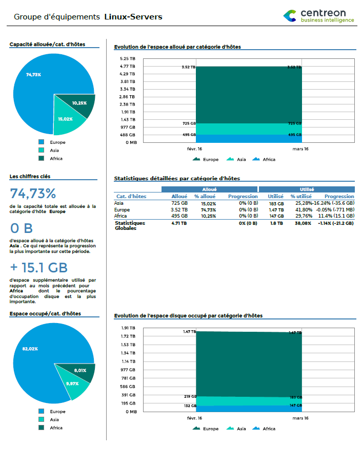

#### Quatrième page

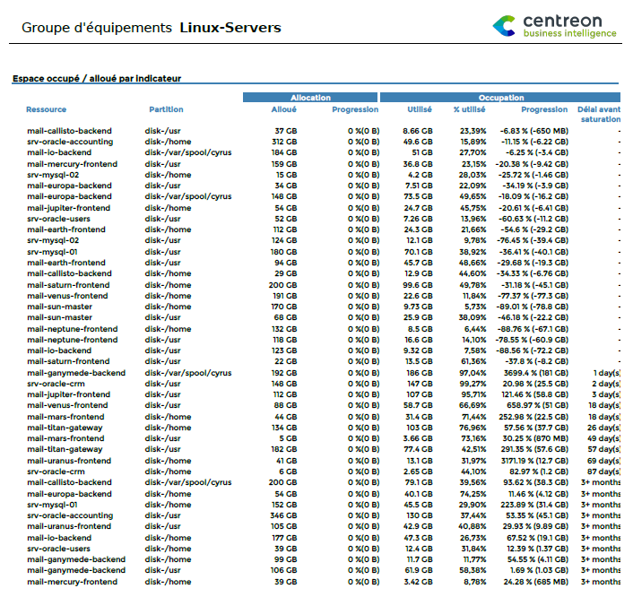

#### Paramètres

Les paramètres attendus dans ce rapport :

-   Une periode de reporting
-   Les objets Centreon suivant :

|   **Paramètres**        |            **Type**        |  **Description**                                                          |
|-------------------------|----------------------------|---------------------------------------------------------------------------|
|  Time period            |  Liste déroulante          | Plage horaire à utiliser.  /! Seule la plage 24x7 doit être utilisée /! |
| Host group              | Liste déroulante           | Sélection du groupe d'hôtes                                               |
| Host category           | Multi sélection            | Catégories d'hôtes                                                        |
| Service category        | Multi sélection            | Catégories de services de **stockage**                                    |
| Metrics                 | Multi selection            | Metriques à **exclure** du le rapport                                     |
|      Intervalle         | Champ texte                | Nombre de mois à afficher dans les graphiques                             |

#### Pre-requis

Pour assurer la cohérence des données dans les graphiques et tableaux de
performance, certains pré-requis sont à respecter concernant le retour
des plugins.

Les données de performance retournées par les plugins de stockage
doivent être formatées de cette manière :

    output-plugin | metric1=valueunit;warning_treshold;critical_treshold;minimum;maximum metric2=value ....

Il est important de contrôler que la valeur maximum est bien retournée.
Enfin, assurez vous que les plugins de stockage retournent des valeurs
en Octet.

> **Important**
>
> - Le paramétrage de l'ETL doit comprendre les catégories de services de
> stockage. Dans le cas contraire, les graphiques d'évolutions sont
> vides.
> - Ce rapport est compatible avec la plage horaire 24x7 uniquement. Cette
> dernière doit aussi être configurée dans le menu "General options |
> Capacity statistic agregated by month | Live services for capacity
> statistics calculation"

### Hostgroup-Storage-Capacity-List

Ce rapport est un listing des espaces de stockage d'un groupe d'hôtes.

**Comment interpréter ce rapport?**

Pour chaque espace de stockage, des informations détaillées sur
l'espace alloué, utilisé, leurs évolutions relative ainsi que le nombre
de jours avant saturation (estimation basée sur les données de la
période)

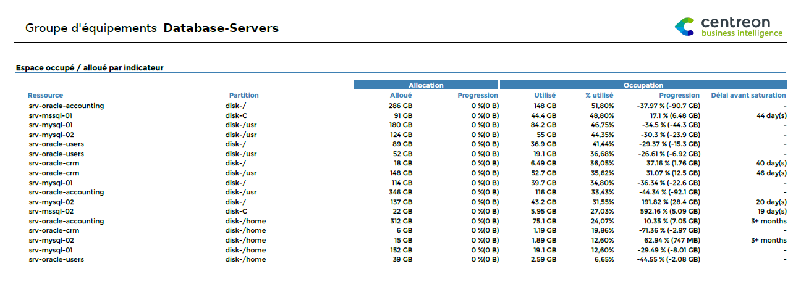

#### Paramètres

Les paramètres attendus dans ce rapport :

-   Une periode de reporting
-   Les objets Centreon suivant :

|   **Paramètres**        |            **Type**        |  **Description**                                                        |
|-------------------------|----------------------------|-------------------------------------------------------------------------|
|  Time period            |  Liste déroulante          | Plage horaire à utiliser. /! Seule la plage 24x7 doit être utilisée /!|
| Host group              | Liste déroulante           | Sélection du groupe d'hôtes                                             |
| Host category           | Multi sélection            | Catégories d'hôtes                                                      |
| Service category        | Multi sélection            | Catégories de services de **stockage**                                  |
| Metrics                 | Multi selection            | Metriques à **exclure** du le rapport                                   |

#### Pre-requis

Pour assurer la cohérence des données dans les graphiques et tableaux de
performance, certains pré-requis sont à respecter concernant le retour
des plugins.

Les données de performance retournées par les plugins de stockage
doivent être formatées de cette manière :

    output-plugin | metric1=valueunit;warning_treshold;critical_treshold;minimum;maximum metric2=value ....

Il est important de contrôler que la valeur maximum est bien retournée.
Enfin, assurez vous que les plugins de stockage retournent des valeurs
en Octet.

## Réseau

### Hostgroup-Traffic-By-Interface-And-Bandwith-Ranges

Ce rapport permet de visualiser l'utilisation de la bande passante
entrante et sortante sur les interfaces réseau d'un groupe d'hôtes.

**Comment interpréter ce rapport?**

#### Première page

On trouve sur la première page la répartition en pourcentage de
l'utilisation de la bande passante par intervalle.

5 intervalles sont possibles:

-   Utilisation nulle
-   Utilisation basse
-   Utilisation moyenne
-   Utilisation élevée
-   Utilisation très élevée

#### Pages suivantes

Les pages suivantes sont automatiquement générées pour toutes les
interfaces du groupe d'hôtes (une page par interface) et affichent
l'utilisation de la bande passante par intervalle avec une répartition
par:

-   Les heures d'une journée
-   Les jours d'une semaine
-   Les jours d'un mois

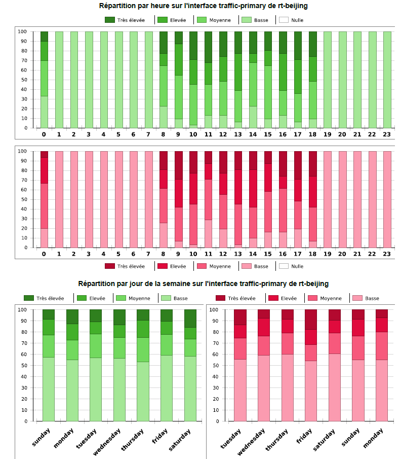

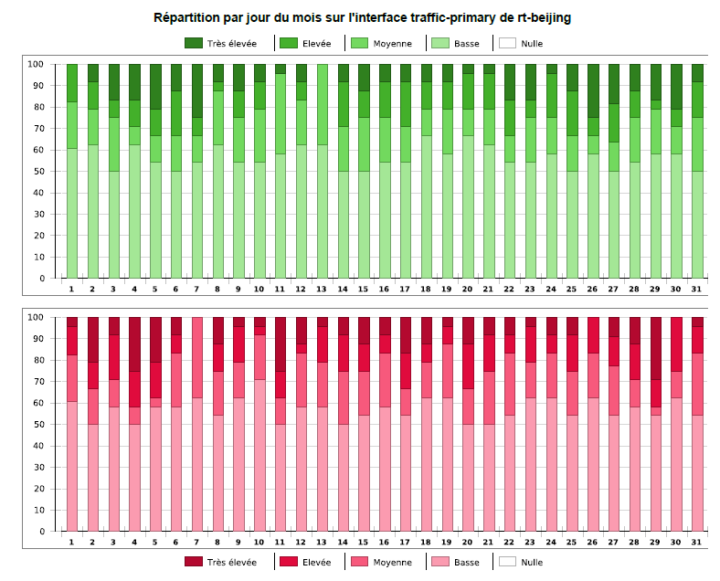

#### Paramètres

Les paramètres attendus dans ce rapport :

-   Une période de reporting
-   Les objets Centreon suivants :

| **Paramètres**              | **Type**         | **Description**                                                                 |
| --------------------------- | ---------------- | ------------------------------------------------------------------------------- |
| Host group                  | Liste déroulante | Sélection du groupe d'hôtes                                                     |
| Host category               | Multi sélection  | Catégories d'hôtes                                                              |
| Service category            | Multi sélection  | Catégories de services de **trafic**                                            |
| Low level treshold (%)      | Champ texte      | Seuil bas d'utilisation de la bande passante, en pourcentage (entre 0 et 100)   |
| Average level threshold (%) | Champ texte      | Seuil d'utilisation moyen de la bande passante, en pourcentage (entre 0 et 100) |
| High level threshold (%)    | Champ texte      | Seuil d'utlisation haut de la bande passante, en pourcentage (entre 0 et 100)   |
| Inbound traffic metric      | Liste déroulante | Nom de la métrique pour le trafic entrant                                       |
| Outbound traffic metric     | Liste déroulante | Nom de la métrique pour le trafic entrant                                       |

#### Pré-requis

Pour assurer la cohérence des données dans les graphiques et tableaux de
performance, certains pré-requis sont à respecter concernant le retour
des plugins.

Les données de performance retournées par les plugins de trafic doivent
être formatées de cette manière et comporter une métrique de **trafic
entrant** et une métrique de **trafic sortant**:

    output-plugin | traffic_in=valueunit;warning_treshold;critical_treshold;minimum;maximum traffic_out=value

Il est important de contrôler que la valeur maximum est bien retournée.
Enfin, assurez vous que les plugins de stockage retournent des valeurs
en **bits/secondes**.

### Hostgroup-Traffic-average-By-Interface

Ce rapport permet de visualiser l'utilisation de la bande passante
entrante et sortante sur les interfaces réseau d'un groupe d'hôtes.

**Comment interpréter ce rapport?**

#### Première page

On trouve sur la première page la répartition en pourcentage de
l'utilisation de la bande passante par intervalle.

5 intervalles sont possibles:

-   Utilisation nulle
-   Utilisation basse
-   Utilisation moyenne
-   Utilisation elevée
-   Utilisation très elevée

Ces intervalles sont paramétrables.

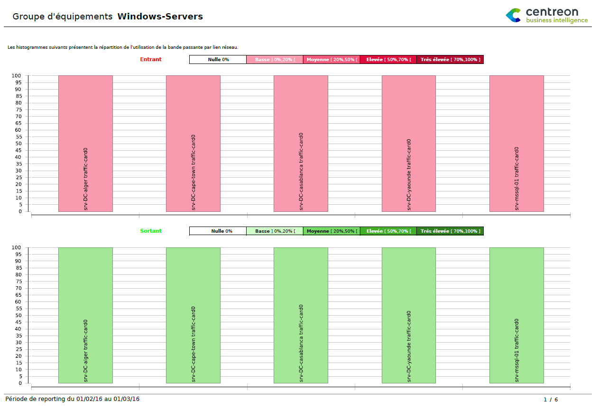

#### Pages suivantes

Les pages suivantes sont automatiquement générées pour toutes les
interfaces du groupe d'hôtes (une page par interface) et affichent la
répartition de la bande passante par :

-   **Heures de la journée** en affichant:
    -   La moyenne d'utilisation par heure de la journée du trafic
        entrant et sortant sur la période de reporting sélectionnée
    -   Le maximum atteint du trafic entrant et sortant par heure de la
        journée sur la période de reporting sélectionnée
-   **Jours de semaine** en affichant:
    -   La moyenne d'utilisation par jour de la semaine du trafic
        entrant et sortant sur la période de reporting sélectionnée
    -   Le maximum atteint du trafic entrant et sortant par jour de
        semaine sur la période de reporting sélectionnée
-   **Jours de mois** en affichant:
    -   La moyenne d'utilisation par jour de mois du trafic entrant et
        sortant sur la période de reporting sélectionnée
    -   Le maximum atteint du trafic entrant et sortant par jour de mois
        sur la période de reporting sélectionnée

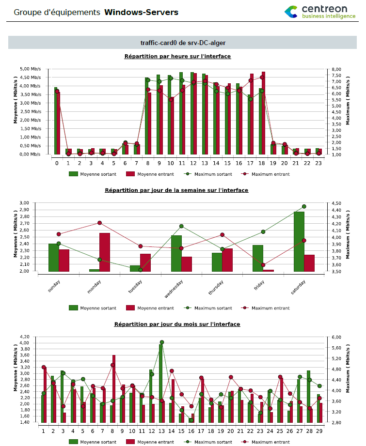

#### Paramètres

Les paramètres attendus dans ce rapport :

-   Une période de reporting
-   Les objets Centreon suivants :

| **Paramètres**              | **Type**         | **Description**                                                                 |
| --------------------------- | ---------------- | ------------------------------------------------------------------------------- |
| Host group                  | Liste déroulante | Sélection du groupe d'hôtes                                                     |
| Host category               | Multi sélection  | Catégories d'hôtes                                                              |
| Service category            | Multi sélection  | Catégories de services de **trafic**                                            |
| Low level treshold (%)      | Champ texte      | Seuil bas d'utilisation de la bande passante, en pourcentage (entre 0 et 100)   |
| Average level threshold (%) | Champ texte      | Seuil d'utilisation moyen de la bande passante, en pourcentage (entre 0 et 100) |
| High level threshold (%)    | Champ texte      | Seuil d'utlisation haut de la bande passante, en pourcentage (entre 0 et 100)   |
| Inbound traffic metric      | Liste déroulante | Nom de la métrique pour le trafic entrant                                       |
| Outbound traffic metric     | Liste déroulante | Nom de la métrique pour le trafic entrant                                       |

#### Pré-requis

Pour assurer la cohérence des données dans les graphiques et tableaux de
performance, certains pré-requis sont à respecter concernant le retour
des plugins.

Les données de performance retournées par les plugins de trafic doivent
être formatées de cette manière et comporter une métrique de **trafic
entrant** et une métrique de **trafic sortant**:

    output-plugin | traffic_in=valueunit;warning_treshold;critical_treshold;minimum;maximum traffic_out=value

Il est important de contrôler que la valeur maximum est bien retournée.
Enfin, assurez vous que les plugins de stockage retournent des valeurs
en **bits/secondes**.

### Hostgroup-monthly-network-percentile

Ce rapport vous donne des statistiques de moyenne et de centile du
traffic entrant et sortant des interface réseaux. Ce rapport est un
rapport mensuel, la période de reporting doit de ce fait être un mois
complet, terminé.

**Comment interpréter ce rapport?**

Sur la première page, il y a 3 informations :

-   Deux graphiques présentant les 10 interfaces ayant des valeurs de
    centile les plus élevées, pour le trafic entrant et sortant
-   Les 10 interfaces ayant leur moyenne d'utilisation de la bande
    passante entrante la plus élevée
-   Les 10 interfaces ayant leur moyenne d'utilisation de la bande
    passante sortante la plus élevée

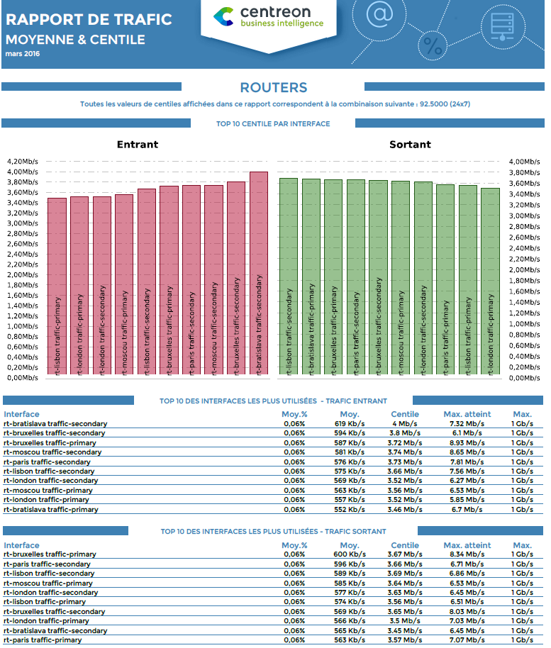

Sur la ou les pages suivantes, on retrouve un listing de toutes les
interfaces, triées par noms d'hôtes et de services sur lesquels on
retrouve toutes les statistiques d'utilisation de la bande passante.

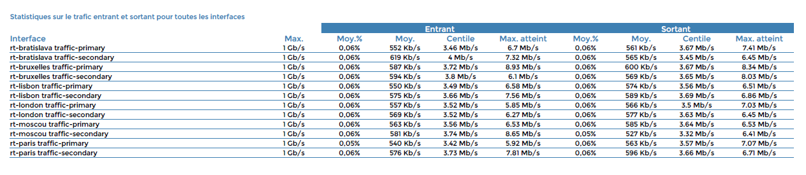

#### Paramètres :

Les paramètres attendus dans ce rapport :

-   Une date correspondant au mois sur lequel générer le rapport (date
    de début sur l'interface de Centreon MBI)
-   Les objets Centreon suivants :

| **Paramètres**          | **Type**         | **Description**                                                             |
| ----------------------- | ---------------- | --------------------------------------------------------------------------- |
| Host group              | Liste déroulante | Sélection du groupe d'hôtes                                                 |
| Host category           | Multi sélection  | Catégories d'hôtes                                                          |
| Service category        | Multi sélection  | Catégories de services de trafic                                            |
| Plage horaire           | Liste déroulante | Plage horaire utilisée pour les moyennes d'utilisation de la bande psssante |
| Centile/Timeperiod      | Liste déroulante | Combinaison utiliser pour les statistiques de centile                       |
| Inbound traffic metric  | Liste déroulante | Nom de la métrique pour le trafic entrant                                   |
| Outbound traffic metric | Liste déroulante | Nom de la métrique pour le trafic entrant                                   |

#### Pre-requis

-   La configuration concernant les calculs de centile doit avoir été
    faite dans la partie General Option > Onglet "ETL"

-   Pour assurer la cohérence des données dans les graphiques et
    tableaux de performance, certains pré-requis sont à respecter
    concernant le retour des plugins. Les données de performance
    retournées par les plugins de trafic doivent être formatées de cette
    manière et comporter une métrique de **trafic entrant** et une
    métrique de **trafic sortant** :

        output-plugin | traffic_in=valueunit;warning_treshold;critical_treshold;minimum;maximum traffic_out=value

> Il est important de contrôler que la valeur maximum est bien
> retournée. Enfin, assurez vous que les plugins de stockage retournent
> des valeurs en **bits/secondes**.

## Virtualisation

### VMWare-Cluster-Performances-1 

Ce rapport présente les performances d'un cluster d'ESX en terme de
consommation CPU, utilisation mémoire, hébergement des machines
virtuelles et utilisation des datastores.

**Comment interpréter ce rapport?**

Pour un cluster d'ESX et une période donnée en entrée, le rapport
affiche:

Sur la page 1:

Le nombre total des datastores présents sur le cluster, l'espace moyen
utilisé sur l'esemble des datastores en pourcentage et en octets, la
dernière valeur remontée sur la période, ainsi que l'espace total
alloué sur l'ensemble des datastores. Ces 3 dernières valeurs, une
évolution par rapport à la période précedente est affichée.

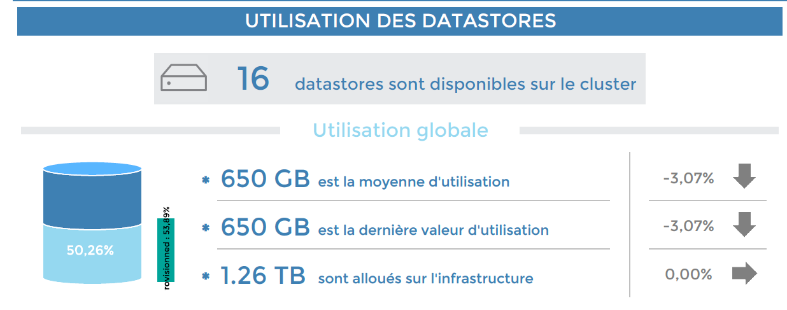

Ensuite, les 5 datastores les plus utlisés et les 5 datastores les moins
utilisés sont mis en évidence, avec pour chaque datastore: le
pourcentage d'utilisation,le maximum atteint ainsi que l'espace
alloué.

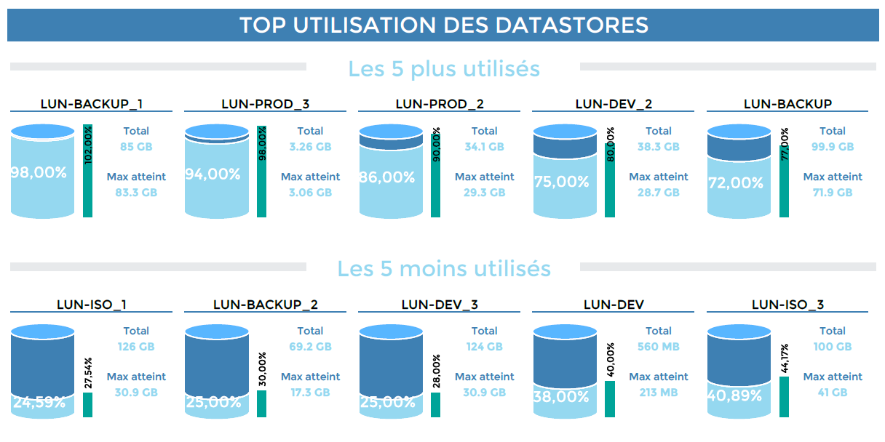

Enfin, toujours sur les datastores, ceux générant le plus et le moins
d'entrées/sorties par seconde en lecture et écriture sont mis en avant
dans des TOP 5 et des BOTTOM 5.

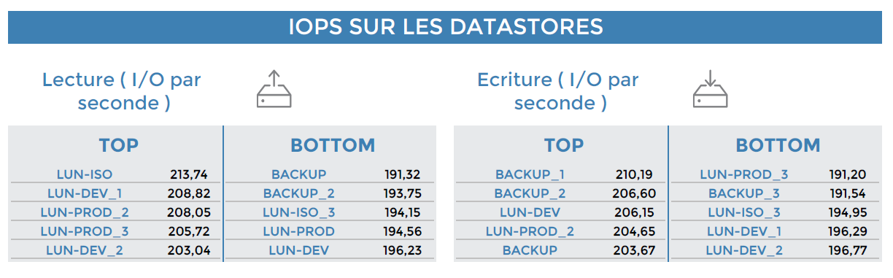

Sur la page 2:

La consommation CPU moyenne sur l'ensemble des ESXs du cluster ainsi
que l'evolution par rapport à la période précedente est affiché.

Les ESXs utilisants le consommant le plus de CPU et ceux consommant le
moins de CPU sont mis en avant, avec pour chaque ESXs, la moyenne
d'utilisation et la valeur maximale atteinte.

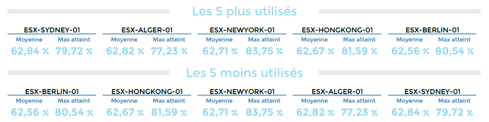

ensuite, l'utilisation moyenne de la mémoire vive sur l'ensemble des
ESXs du cluster ainsi ainsi que la mémoire totale allouée sont affichés:

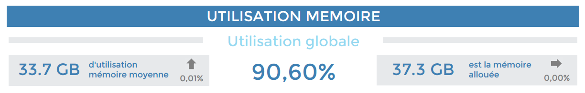

La mise en avant des ESXs utilisants le plus de RAM, et ceux utilisant
le moins de RAM, avec pour chaque ESX, l'utilisation moyenne sur la
période, la RAM totale disponible et la valeure maximale atteinte.

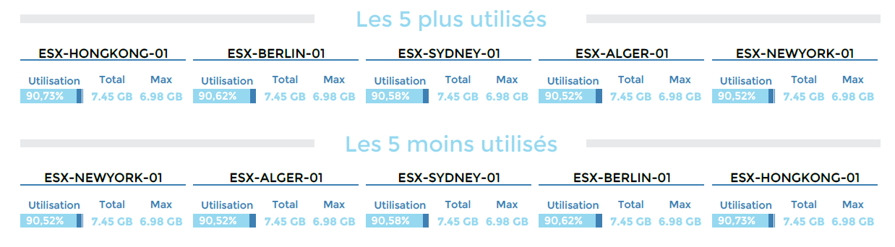

Enfin, des informations sur le nombre moyen de VMs allumées et éteintes
sur le cluster

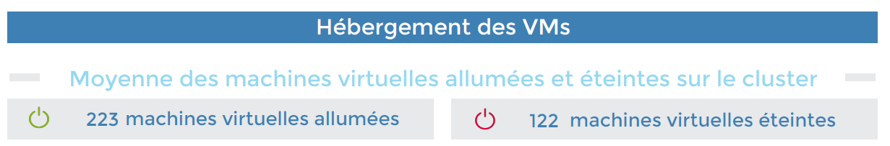

et la mise en avant des ESXs hébergeant le plus le moins de VMs allumées
et éteintes:

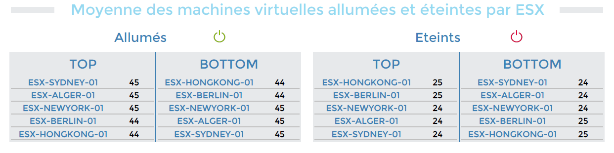

#### Paramètres

Les paramètres attendus dans ce rapport :

-   Une periode de reporting
-   Les objets Centreon suivant :

| **Paramètres**             | **Type**         | **Description**                                                                                                                         |
| -------------------------- | ---------------- | --------------------------------------------------------------------------------------------------------------------------------------- |
| Time period                | Liste déroulante | Plage horaire à utiliser                                                                                                                |
| Host group                 | Liste déroulante | Sélection du cluster                                                                                                                    |
| Host category              | Multi sélection  | Sélection des catégories d'hôtes à filter sur le cluster                                                                                |
| Datastore Service category | Multi sélection  | Sélection des catégories de services contenant l'utilisation datastores                                                                 |
| IOPs Service category      | Multi sélection  | Sélection des catégories de services contenant les IOPS des datastore                                                                   |
| CPU Service category       | Multi sélection  | Sélection des catégories de services contenant la CPU des ESXs                                                                          |
| Memory Service category    | Multi sélection  | Sélection des catégories de services contenant la mémoire des ESXs                                                                      |
| VM count Service category  | Multi sélection  | Sélection des catégories de services contenant le VMcount sur les ESXs                                                                  |
| Datastore usage (filtre)   | Champ texte      | Entrer la partie commune sur laquelle vous souhaitez filtrer les datastores. Cette partie sera également supprimée (% pour tout garder) |
| Datastore iops (filtre)    | Champ texte      | Entrer la partie commune sur laquelle vous souhaitez filtrer les datastores. Cette partie sera également supprimée (% pour tout garder) |

#### Prérequis

Ce rapport est developpé pour une compatibilié avec le plugin pack
Virt-VMware2-ESX et le connecteur Centreon-VMWare-2.0

Les prérequis pour le bon fonctionnement du rapport sont:

Mise en place de la Supervision des indicateurs suivants:

-   Un service CPU, Memory et VMcount pour chaque ESX.
-   Un service Datastore-usage par datastore, qui sera rattaché ou à
    un seul ESX du cluster, ou alors au VCenter. Par défaut, le
    service aura la nomenclature suivante: Datastore-Usage-xxxx où
    xxxx sera le nom du datastore.
-   Un service Datastore-IOPS par datastore, qui sera rattaché ou à un
    seul ESX du cluster, ou alors au VCenter. Par défaut, Le service
    aura la nomenclature suivante: Datastore-Iops-xxxx où xxxx sera le
    nom du datastore.

Création de groupes d'hôtes correspondants aux cluster. Un cluster (
groupe d'hôte) contiendra :

-   Un ensemble d'ESXs ( hôte )
-   Le VCenter uniquement si les services Datastore-usage et
    Datastore-IOPS sont rattaché au VCenter et non à un ESX du
    cluster.

Création d'au moins une catégorie d'hôtes contenant le cluster entier
(ESXs + vCenter). Si vous avez plusieurs cluster, vous pouvez les
répartir dans plusieurs catégories d'hôtes afin d'être en mesure de
filtrer le rapport sur un cluster précisémment.

Création des services catégories suivantes:

-   CPU-ESX: qui regroupe l'ensemble des indicateurs CPU sur les
    ESXs.
-   Memory-ESX : qui regroupe l'ensemble des indicateurs MEmory sur
    les ESXs.
-   VMcount-ESX: qui regroupe l'ensemble des indicateurs VMcount sur
    les ESXs.
-   Datastore-usage: qui regroupe l'ensemble des indicateurs de
    l'utilisation des datastores.
-   Datastore-IOPS : qui regroupe l'ensemble des indicateurs des IOPS
    sur les datastores.

> Si le nom d'un datastore ou d'un serveur ESX contient plus de 16
> caractères, les 16 premiers seront affichés, et complétés par 3 points
> de suspension

### VMWare-VM-Performances-List

Ce rapport affiche les statistiques sur l'utilsiation vCPU, mémoire et
IOPS sur les machines virtuelles vues par le VCenter.

Le rapport est optimisé pour une génération en xlsx dans le but de créer
les filters et les tris souhaités.

**Comment interpréter ce rapport?**

Le premier onglet affiche des informations sur la période de réporting,
la plage de service selectionnée ainsi que le jour et l'heure de la
création du rapport.

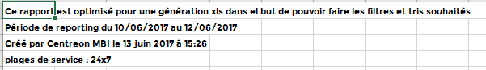

Le second usage affiche la liste de toutes les VMs vues par le VCenter
et l'utilisation vCPU ( moyenne, moyenne formatée, max, max formaté) et
mémoire (moyenne, moyenne formatée, max, max formaté, utilisation en %,
utilisation en % formatée) sur chaque VM.

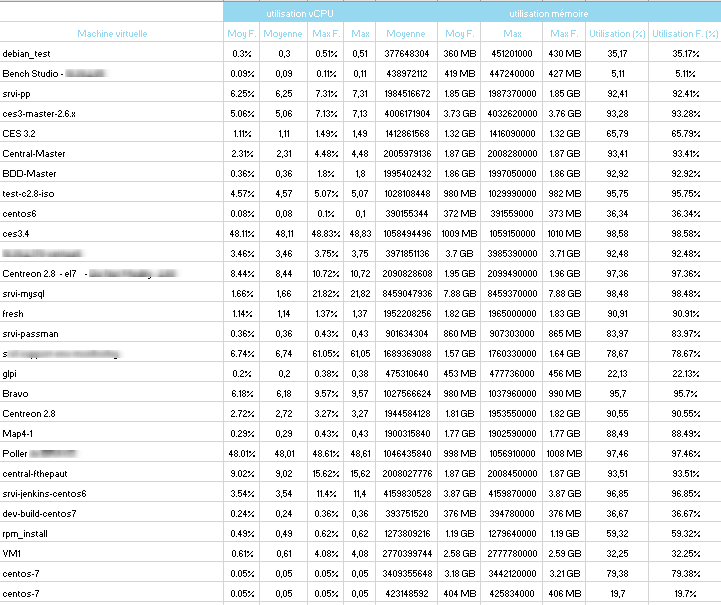

Le dernier onglet affiche la listes des VM par datastore et leur
utilisation des IOPS en lécture et en écriture en affichant la moyenne
et le maximum atteint.

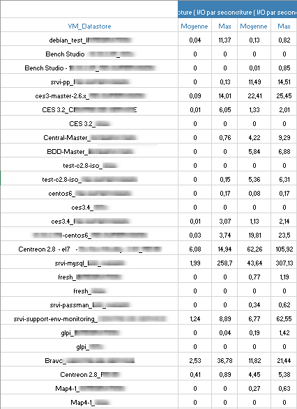

#### Paramètres

Les paramètres attendus dans ce rapport :

-   Une periode de reporting
-   Les objets Centreon suivant :

| **Paramètres**   | **Type**         | **Description**                                                                 |
| ---------------- | ---------------- | ------------------------------------------------------------------------------- |
| Time period      | Liste déroulante | Plage horaire à utiliser                                                        |
| Host to report   | Liste déroulante | Sélection du cluster                                                            |
| Host category    | Multi sélection  | Sélection des catégories d'hôtes à filter sur le cluster                        |
| Service category | Multi sélection  | Sélection des catégories de services contenant les statistiques globales par VM |

#### Prérequis

Ce rapport est developpé pour une compatibilité avec le plugin pack
Virt-VMware2-ESX et le connecteur Centreon-VMWare-2.0

Les prérequis pour le bon fonctionnement du rapport sont:

Mise en place de la Supervision des indicateurs suivants sur le VCenter:

-   Un service Vm-Cpu-Global.
-   Un service Vm-Memory-Global.
-   Un service Vm-Datastore-Iops-Global.

Création de la catégorie de services suivante:

-   VM-Statistics: qui regroupe l'ensemble des indicateurs
    Vm-Cpu-Global, Vm-Memory-Global et Vm-Datastore-Iops-Global.

## Consommation électrique 

### Hostgroup-Electricity-Consumption-1

Ce rapport affiche les statisitques de la consommation éléctrique de vos
équipements branchés derrière un onduleur.

**Comment intérpréter le rapport?**

Le rapport prendra en entrée un groupe d'hôtes et des onduleurs, qui
seront filtrés sur des catégories d'hôtes, et la catégorie de services
contenant les services retournant la puissance en *watt* , prix du KWh,
pour afficher dans un premier tableau:

Le coût, la consommation , la puissance moyenne et la puissance maximale
sur le mois N, un rappel des mêmes valeurs sur le mois N-1, et
l'évolution entre le mois N et le mois N - 1.

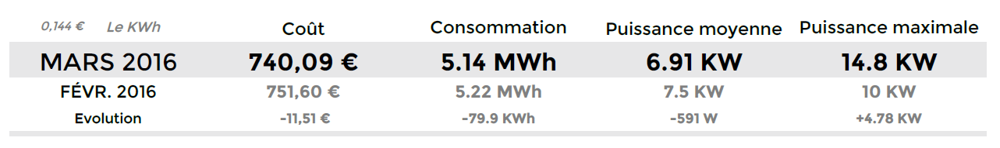

Les 2 graphiques suivants affichent la répartition moyenne de la
puissance utilisée par heure de la journée et jour de mois, avec une
comparaison sur le mois N-1.

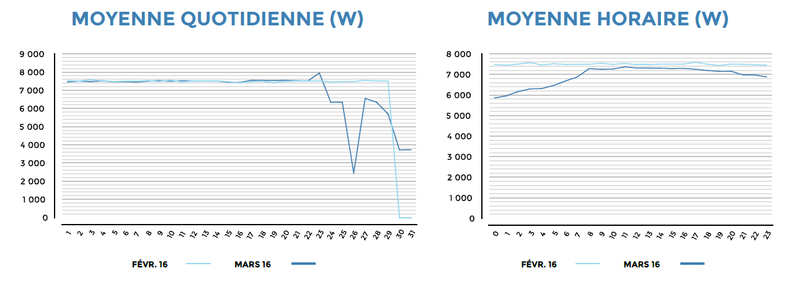

Ensuite, un TOP 5 des onduleurs les plus consommateurs, avec le
pourcentage de consommation de chaque UPS par rapport à la consommation
totale, la cossommation moyenne ainsi que le coût de chaque UPS sur le
mois.

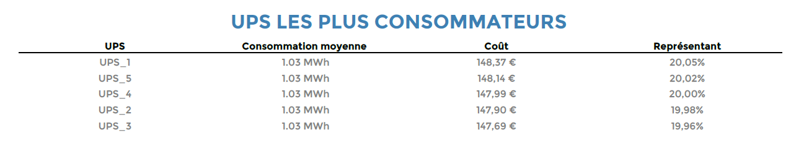

> Si il y a plus de 5 onduleurs dans le groupe selectionné, seuls les 4
> les plus consommateurs seront affichés; la 5ème ligne regroupera le
> reste des onduleurs.

Enfin, l'évolution du coût total mensuel sur la dernière année.

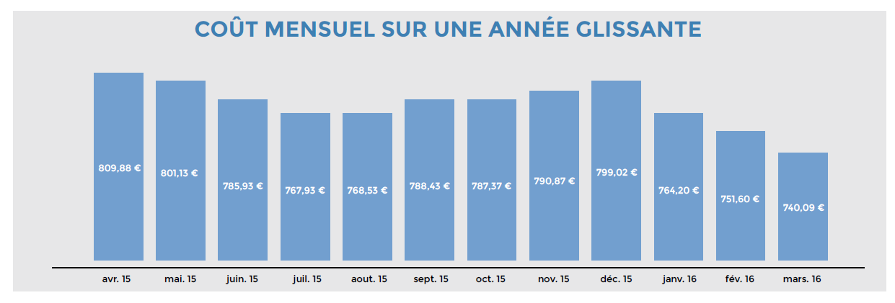

#### Paramètres

Les paramètres attendus dans ce rapport :

-   Une periode de reporting
-   Les objets Centreon suivants:

| **Paramètres**            | **Type**         | **Description**                                                       |
| ------------------------- | ---------------- | --------------------------------------------------------------------- |
| Time period               | Liste déroulante | Plage horaire à utiliser                                              |
| Host group                | Liste déroulante | Sélection du groupe d'hôte des UPS                                    |
| Host category             | Multi sélection  | Sélection des catégories d'hôtes à filter sur le groupe               |
| Service category          | Multi sélection  | Sélection des catégories de services contenant la puissance en sortie |
| Select metrics to include | Multi sélection  | Sélection la métrique retournant la puissance en sortie               |
| Prix KWh                  | Text             | Entrez le prix du KWh facturé par votre fournisseur                   |

#### Prérequis

Les prérequis pour faire fonctionner le rapport sont:

-   Supervision de la puissance en sortie des onduleurs.
-   Création d'une catégorie de services contenant l'ensemble des
    indicateurs retournant une puissance en sortie.
-   Suffisament d'historique pour afficher les graphiques
    d'évolution.

La consommation d'un onduleur conrrespondera à la consommation de
l'esemble des équipements branchés derrière l'onduleur.

## Profiling

### Host-Detail-2 

Ce rapport contient des statistiques de disponibilité, d'alarmes, de
stockage, de mémoire et de CPU pour un équipement (hôte).

Il est à utiliser lorsque vous souhaitez étudier le comportement d'un
équipement en particulier et que vous collectez les indicateurs suivant
sur cet hôte : Stockage, CPU et mémoire.

**Comment interpréter ce rapport ?**

La premiège page affiche les statistiques de disponibilité de
l'équipement.

La deuxième page affiche les statistiques de performance de
l'équipement (CPU et mémoire).

La troisième page affiche les statistiques de stockage par partition.

Enfin, une page d'annexe affiche toutes les alarmes apparues sur cet
hôte.

#### Première page

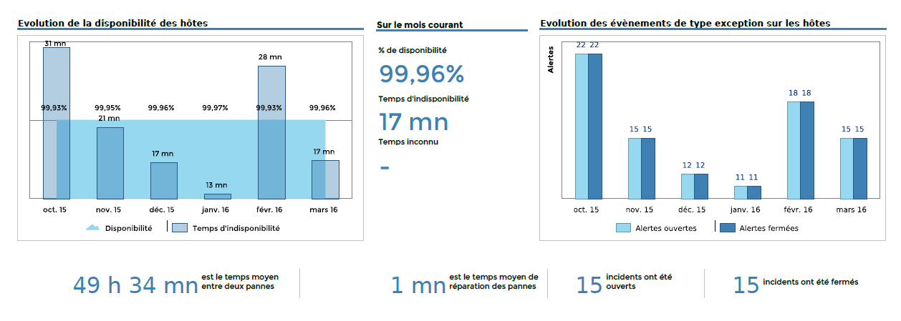

#### Deuxième page

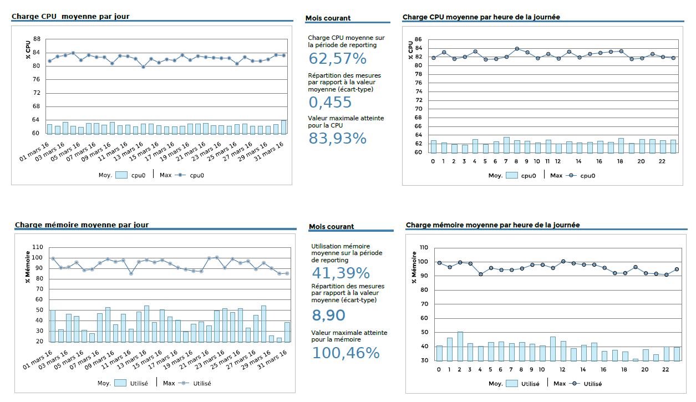

#### Troisième page

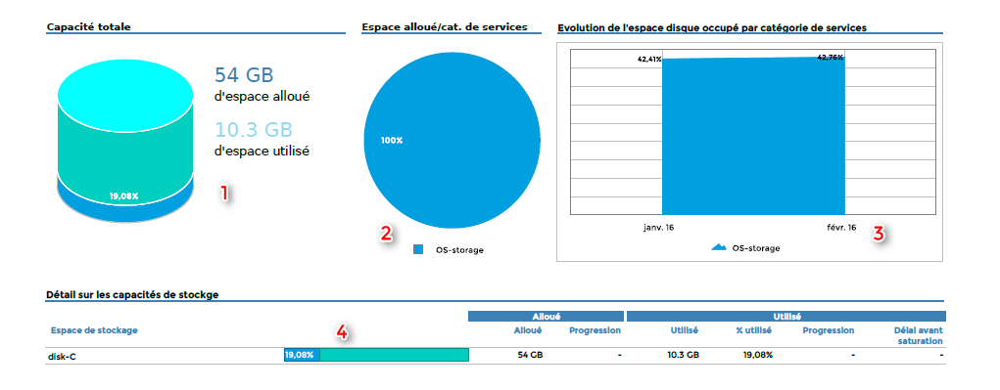

1 - Statistique de stockage sur le dernier jour de la période de
reporting

2 - Statistique de stockage sur le dernier jour de la période de
reporting

3 - Statistique de stockage le dernier jour de chaque mois

4 - Statistique de stockage du dernier jour de la période comparé à la
veille du premier jour de la période

#### Annexe

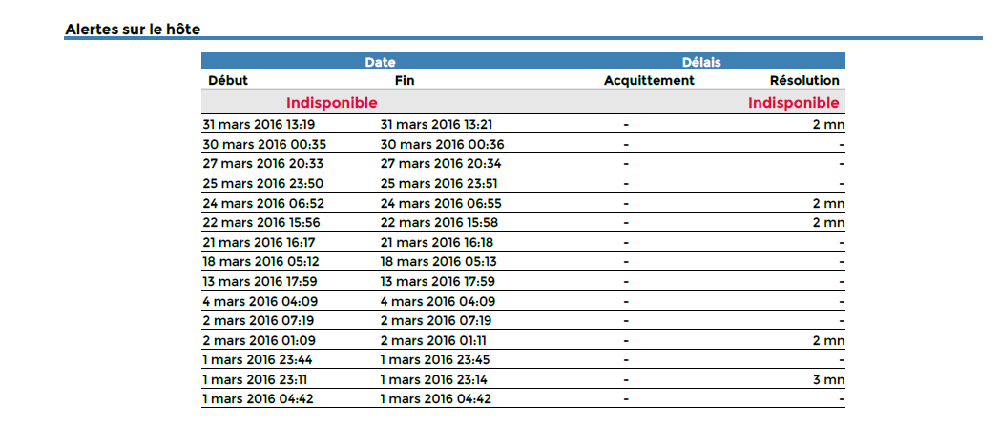

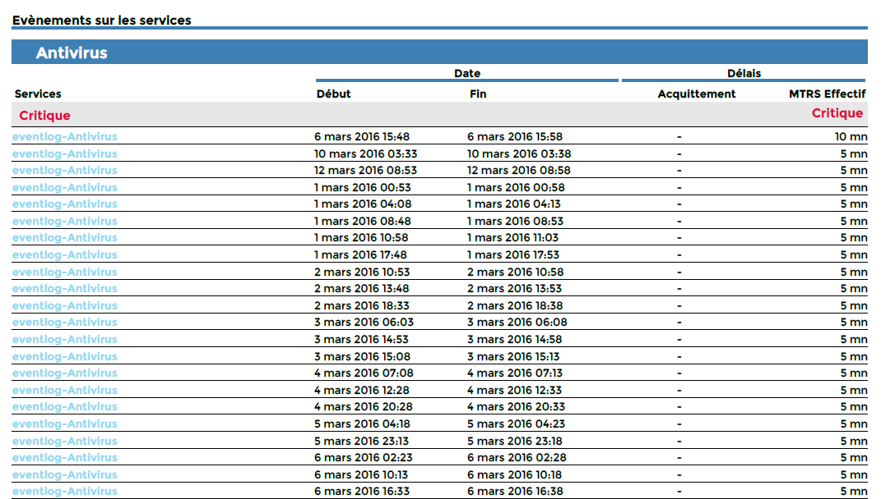

#### Paramètres

Les paramètres attendus dans ce rapport :

-   Une periode de reporting
-   Les objets Centreon suivant :

| Paramètres               | Type             | Description                                              |
| ------------------------ | ---------------- | -------------------------------------------------------- |
| Time period              | Liste déroulante | Plage horaire à utiliser                                 |
| Interval                 | Champ texte      | Nombre de mois à afficher dans le graphique              |
| Host                     | Liste déroulante | Sélection de l'hôte                                      |
| CPU service category     | Liste déroulante | Catégorie de services contenant les services de CPU      |
| CPU metric(s)            | Multi sélection  | Sélection des métriques de CPU à utiliser                |
| Storage service category | Multi sélection  | Catégorie de services contenant les services de stockage |
| Storage Metric(s)        | Multi sélection  | Sélection des métriques de Stockage à utiliser           |
| Memory service category  | Liste déroulante | Catégorie de services contenant les services de mémoire  |
| Memory metric(s)         | Multi sélection  | Sélection des métriques de mémoire à utiliser            |

#### Pre-requis

Pour assurer la cohérence des données dans les graphiques et tableaux de
performance, certains pré-requis sont à respecter concernant le retour
des plugins.

Les données de performance retournées par les plugins de CPU, mémoire et
stockage doivent être formatées de cette manière :

    output-plugin | metric1=valueunit;warning_treshold;critical_treshold;minimum;maximum metric2=value ....

Il est important de contrôler que la valeur maximum est bien retournée.
Enfin, assurez vous que les plugins de mémoire et de stockage retournent
des valeurs en Octet.

> **Important**
>
> Ce rapport est compatible avec la plage horaire 24x7 uniquement. Cette
> dernière doit aussi être configurée dans le menu "General options |
> Capacity statistic agregated by month | Live services for capacity
> statistics calculation"

### Host-Detail-3 

Ce rapport contient des statistiques de disponibilité, d'alarmes, de
stockage, de mémoire, de CPU et de traffic pour un équipement (hôte).

Il est à utiliser lorsque vous souhaitez étudier le comportement d'un
équipement en particulier et que vous collectez les indicateurs suivant
sur cet hôte : Stockage, CPU, mémoire et traffic.

**Comment interpréter ce rapport ?**

La premiège page affiche les statistiques de disponibilité de
l'équipement.

La deuxième page affiche les statistiques de performance de
l'équipement (CPU et mémoire).

La troisième page affiche les statistiques de stockage par partition.

La quatrième page affiche les statistiques de performance sur le traffic
entrant et sortant.

Enfin, une page d'annexe affiche toutes les alarmes apparues sur cet
hôte.

#### Première page

#### Deuxième page

#### Troisième page

1 - Statistique de stockage sur le dernier jour de la période de
reporting

2 - Statistique de stockage sur le dernier jour de la période de
reporting

3 - Statistique de stockage le dernier jour de chaque mois

4 - Statistique de stockage du dernier jour de la période comparé à la
veille du premier jour de la période

#### Quatrième page

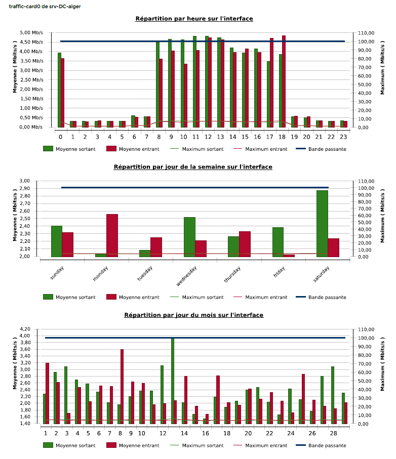

#### Annexe

#### Paramètres

Les paramètres attendus dans ce rapport :

-   Une periode de reporting
-   Les objets Centreon suivant :

| Paramètres               | Type             | Description                                                |
| ------------------------ | ---------------- | ---------------------------------------------------------- |
| Time period              | Liste déroulante | Plage horaire à utiliser                                   |
| Interval                 | Champ texte      | Nombre de mois à afficher dans le graphique                |
| Host                     | Liste déroulante | Sélection de l'hôte                                        |
| CPU service category     | Liste déroulante | Catégorie de services contenant les services de CPU        |
| CPU metric(s)            | Multi sélection  | Sélection des métriques de CPU à utiliser                  |
| Storage service category | Multi sélection  | Catégorie de services contenant les services de stockage   |
| Storage Metric(s)        | Multi sélection  | Sélection des métriques de Stockage à utiliser             |
| Memory service category  | Liste déroulante | Catégorie de services contenant les services de mémoire    |
| Memory metric(s)         | Multi sélection  | Sélection des métriques de mémoire à utiliser              |
| Traffic service category | Multi sélection  | Catégorie de services contenant les service traffic        |
| Traffic In metric        | Liste déroulante | Sélection de la métrique qui représente le traffic entrant |
| Traffic out metric       | Liste déroulante | Sélection de la métrique qui représente le traffic sortant |

#### Pre-requis

Pour assurer la cohérence des données dans les graphiques et tableaux de
performance, certains pré-requis sont à respecter concernant le retour
des plugins.

Les données de performance retournées par les plugins de CPU, mémoire,
traffic et stockage doivent être formatées de cette manière :

    output-plugin | metric1=valueunit;warning_treshold;critical_treshold;minimum;maximum metric2=value ....

Il est important de contrôler que la valeur maximum est bien retournée.
Enfin, assurez vous que les plugins de mémoire et de stockage retournent
des valeurs en Octet; et les plugins de traffic retournent des valeurs
en Ko/s

> **Important**
>
> Ce rapport est compatible avec la plage horaire 24x7 uniquement. Cette
> dernière doit aussi être configurée dans le menu "General options |
> Capacity statistic agregated by month | Live services for capacity
> statistics calculation"

### Hostgroup-Host-Details-1

Pour un groupe d'équipement donné en entrée, Ce rapport affiche les
statistiques de disponibilité, d'alarmes, de stockage, de mémoire,de
CPU et de traffic pour chaque équipement présent dans le groupe.

**Comment interpréter ce rapport ?**

Pour chaque équipement, le rapport est divisé en quatre parties:

-   La premiège partie affiche les statistiques de disponibilité de
    l'équipement.
-   La deuxième partie affiche les statistiques de performance de
    l'équipement (CPU et mémoire).
-   La troisième partie affiche les statistiques de stockage par
    partition.
-   la quatrième partie affiche les statistiques et distribution du
    traffic entrant et sortant des interfaces de l'équipement.

#### Première partie

#### Deuxième partie

#### Troisième partie

1 - Statistique de stockage sur le dernier jour de la période de
reporting

2 - Statistique de stockage sur le dernier jour de la période de
reporting

3 - Statistique de stockage le dernier jour de chaque mois

4 - Statistique de stockage du dernier jour de la période comparé à la
veille du premier jour de la période

#### Quatrième partie

#### Paramètres

Les paramètres attendus dans ce rapport :

-   Une periode de reporting
-   Les objets Centreon suivant :

| Paramètres               | Type             | Description                                              |
| ------------------------ | ---------------- | -------------------------------------------------------- |
| Time period              | Liste déroulante | Plage horaire à utiliser                                 |
| Interval                 | Champ texte      | Nombre de mois à afficher dans le graphique              |
| Hostgroup                | Liste déroulante | Sélection du groupe d'hôtes                              |
| Host Category            | Multi sélection  | Sélection de catégories d'hôtes                          |
| CPU service category     | Liste déroulante | Catégorie de services contenant les services de CPU      |
| CPU metric(s)            | Multi sélection  | Sélection des métriques de CPU à utiliser                |
| Storage service category | Multi sélection  | Catégorie de services contenant les services de stockage |
| Storage Metric(s)        | Multi sélection  | Sélection des métriques de Stockage à utiliser           |
| Memory service category  | Liste déroulante | Catégorie de services contenant les services de mémoire  |
| Memory metric(s)         | Multi sélection  | Sélection des métriques de mémoire à utiliser            |
| Traffic service category | Liste déroulante | Catégorie de services contenant les services de traffic  |
| Traffic In metric        | Liste déroulante | Sélection de la métrique récupérant le traffic entrant   |
| Traffic Out metric       | Liste déroulante | Sélection de la métrique récupérant le traffic sortant   |

#### Pre-requis

Pour assurer la cohérence des données dans les graphiques et tableaux de
performance, certains pré-requis sont à respecter concernant le retour
des plugins.

Les données de performance retournées par les plugins de CPU, mémoire,
stockage et traffic doivent être formatées de cette manière :

    output-plugin | metric1=valueunit;warning_treshold;critical_treshold;minimum;maximum metric2=value ....

Il est important de contrôler que la valeur maximum est bien retournée.
Enfin, assurez vous que les plugins de mémoire et de stockage retournent
des valeurs en Octet et ceux du traffic retournent des valeurs en Ko/s

> **Imporatn**
>
> Ce rapport est compatible avec la plage horaire 24x7 uniquement. Cette
> dernière doit aussi être configurée dans le menu "General options |
> Capacity statistic agregated by month | Live services for capacity
> statistics calculation"

## Inventaire et configuration

### Hostgroups-Host-Templates 

Ce rapport permet d'afficher les informations sur les hôtes présents
dans la base de données de reporting, leur template parent, leur
appartenance aux groupes et aux catégories, ainsi que leur date de
création en filtrant sur les groupes et les catégories d'hôtes
souhaités.

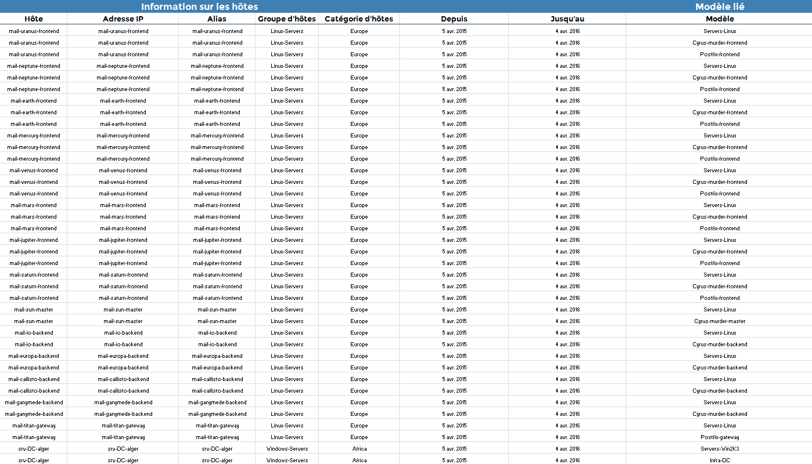

Afficher depuis la configuration Centreon les lien entre modèles
d'hôtes:

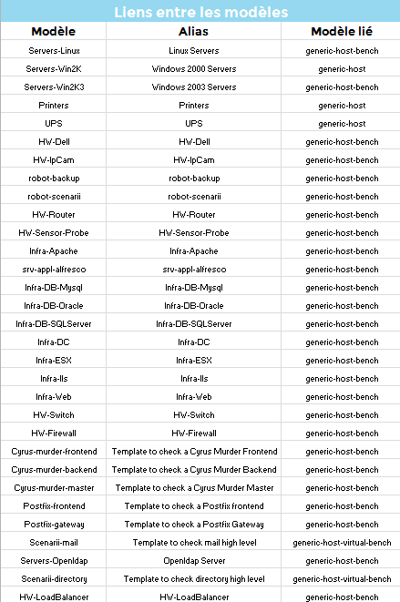

Les modèles de services rattachés aux modèles d'hôtes

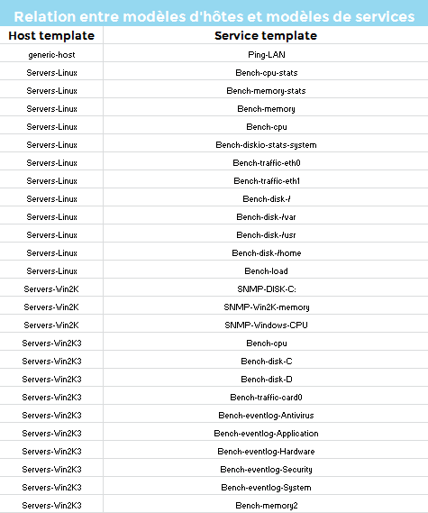

ainsi que des informations globales sur les modèles d'hôtes, leurs
propriétés de vérifications et de notifications.

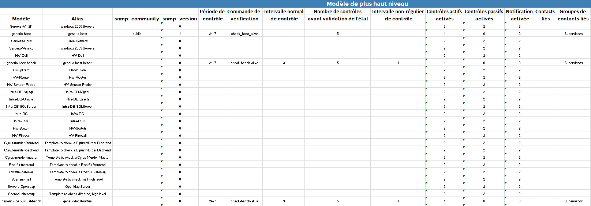

#### Paramètres

Les paramètes attendus par le rapport sont:

-   La période de reporting
-   Les objets Centreon suivant

|   **Parameter**         |  **Parameter type**        |  **Description**                                                        |
|-------------------------|----------------------------|-------------------------------------------------------------------------|
|  Hostgroups             | Multi select               | Sélectionner les groupes d'hôtes                                        |
| Host Categories         | Multi select               | Sélectionner les catégories d'hôtes                                     |

### Hostgroups-Service-Templates

Ce rapport permet d'afficher les informations sur les services présents
dans la base de données de reporting, leur modèle parent, leur liaison
avec les hôtes, appartenance aux groupes et aux catégories, ainsi que
leur date de création en filtrant sur les groupes d'hôtes, catégories
d'hôtes et categories de services souhaitées.

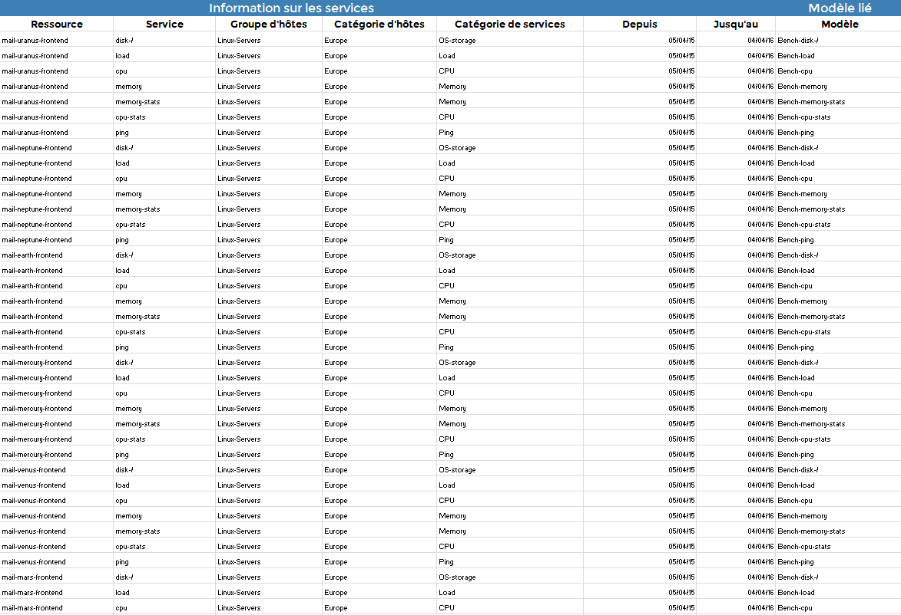

Afficher depuis la configuration Centreon les liens entre modèles de
services:

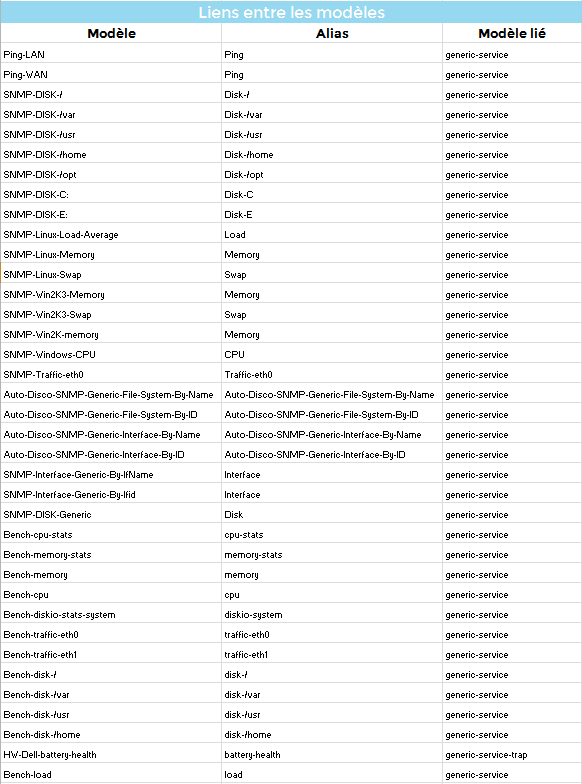

Les modèles de d'hôtes rattachés aux modèles de services

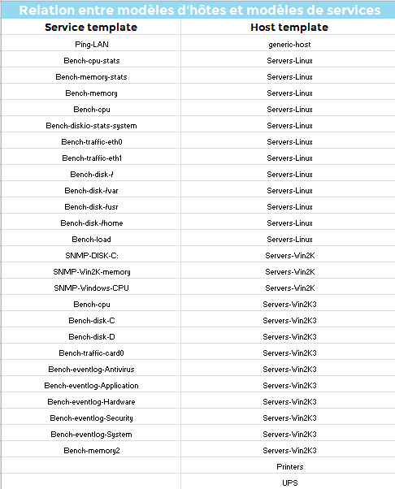

ainsi que des informations globales sur les modèles de services, leurs
propriétés de vérifications et de notifications.

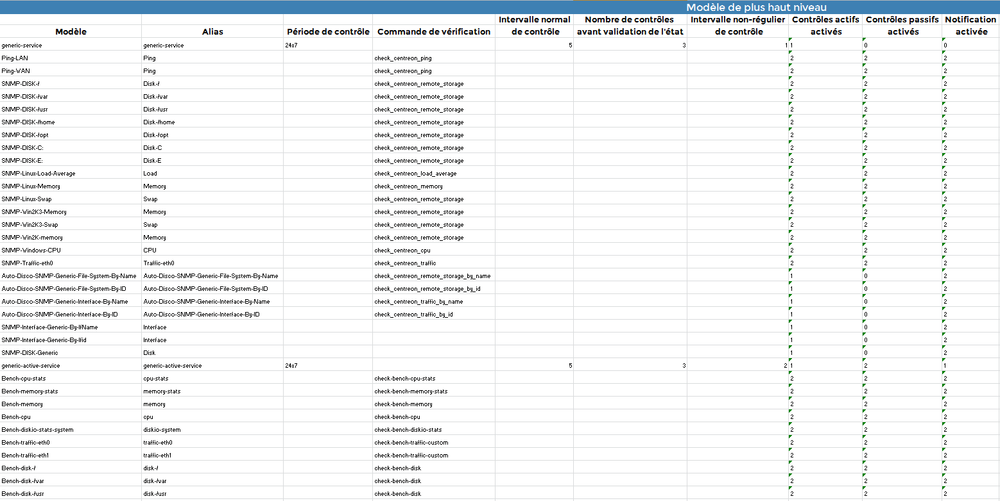

Paramètres
----------

Les paramètes attendus par le rapport sont:

-   La période de reporting
-   Les objets Centreon suivant

|   **Parameter**         |  **Parameter type**        |  **Description**                                                        |
|-------------------------¬----------------------------|-------------------------------------------------------------------------|
|  Hostgroups             | Multi select               | Sélectionner les groupes d'hôtes                                        |
| Host Categories         | Multi select               | Sélectionner les catégories d'hôtes                                     |
| Service Categories      | Multi select               | Sélectionner les catégories de services                                 |

### Poller-Performances 

Ce rapport fourni des informations sur les performances et la
configuration de l'ordonnanceur Centreon Engine sur un Poller.

**Comment interpréter ce rapport ?**

La prémière partie indique le nom du poller et son adresse IP, la
version et l'état de l'ordonnanceur installé dessus ainsi que la date
du dernier redémarrage.

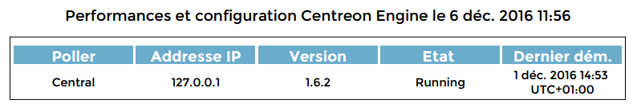

Ensuite, les hôtes et les services supervisés par le poller en question,
ainsi que leurs états sont affichés.

Les latences et temps d'executions moyens et maximums sont représentés,
ainsi que les hôtes et services dépassant les seuils tolérés.

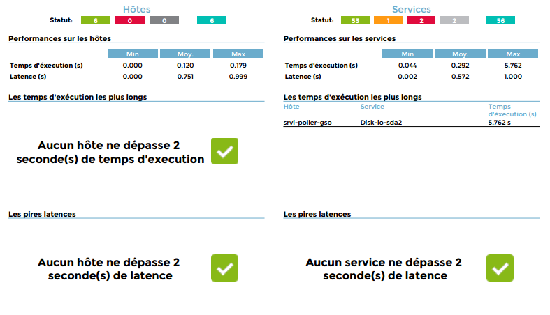

Enfin, un résumé sur la configuration actuelle de l'ordonnanceur et des
astuces d'optimisation en cas de problème de performances

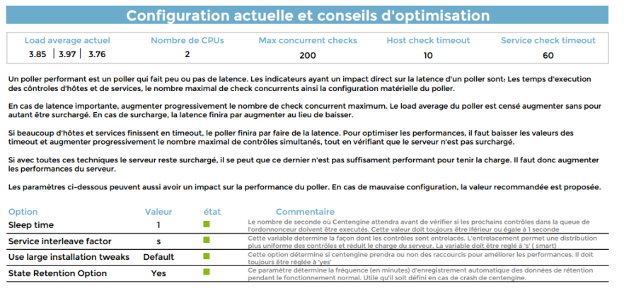

#### Paramètres

Le données représentées dans le rapport sont celles de l'instant de
génération.

Les paramètres attendus dans ce rapport :

-   Les objets Centreon suivants :

| Paramètres                                       | Type         | Description                                                                                          |
| ------------------------------------------------ | ------------ | ---------------------------------------------------------------------------------------------------- |
| Select poller(s) on which you want to the report | Radio bouton | Générer le rapport sur le Central seulement, les poller seulement ou sur l'ensemble de la plateforme |
| Limit latency (sec)                              | Champs texte | Seuil de latency. Les équipements / services dépassant ce seuil seront listés                        |
| Limit exceution time (sec)                       | Champs texte | Seuil pour le temps d'execution. Les equipements /services dépassant ce seuil seront listés          |

#### Pre-requis

Les prérequis pour le bon fonctionnement de ce rapport sont:

-   Supervision du load average des pollers ( les métriques doivent
    être: load1, load5 et load15)
-   Supervision de la CPU des pollers ( les métriques doivent contenir
    la chaine *cpu* ainsi que le numéro du coeur. Ex: CPU à 4 coeurs ,
    les métriques doivent ressembler à cpu0,cpu1... ou
    cpu_0,cpu_1... )

### Hosts-not-classified 

Ce rapport affiche la liste des hôtes non classifiés. Les informations
sont representées sous forme de 2 tableaux:

-   Le premier affiche les hôtes non liés à des groupes d'hôtes
-   Le second tableau affichent les hôtes non liés à des catégories
    d'hôtes.

Si un hôte n'a ni groupe d'hôte ni catégorie d'hôte, il apparaitra
dans les 2 tableau.

Les modifications faites sur la classification des hôtes seront prises
en compte le lendemain du changement.

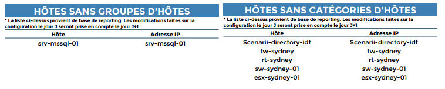

#### Paramètres

Ce rapport n'a besoin d'aucun paramètre.

#### Pré-requis

Aucun prérequis n'est necessaire.

### Services-not-classified

Ce rapport affiche la liste des services non catégorisés. Les
informations sont représentées sous forme de tableau.

Les modifications faites sur la catégorisation des services seront
prises en compte le lendemain du changement.

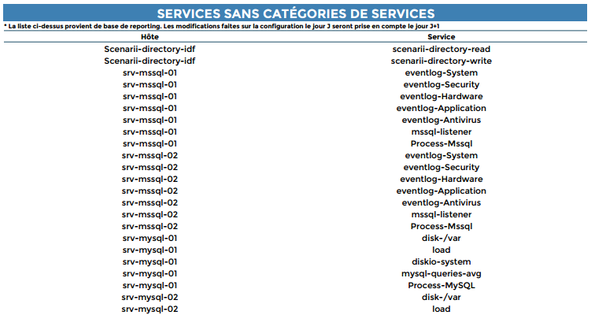

#### Paramètres

Ce rapport n'a besoin d'aucun paramètre.

#### Pré-requis

Aucun prérequis n'est necessaire.

## Diagnostic de base de données Centreon/Reporting

### Content-diagnostic 

Ce rapport vous permets de connaître le contenu de votre base de données
au niveau des statistiques de disponibilité et de performance par jour
et par mois. Les informations affichées permettent de déterminer si les
données sont présentes pour les groupes d'hôtes, catégories d'hôtes,
catégories de services et plages horaire en fonction des couleurs.

-   Vert = au moins une valeurs est présente
-   Rouge = aucune valeur présente

> **Important**
> 
> Ce rapport ne garanti pas la qualité et la cohérence des données mais
> uniquement la présence de ces dernières.

#### Paramètres

Les paramètes attendus par le rapport sont:

-   La période de reporting
-   Les objets Centreon suivant

| Parameter          | Parameter type | Description                                   |
| ------------------ | -------------- | --------------------------------------------- |
| Host group         | Multi select   | Sélectionner les groupes d'hôtes              |
| Service Categories | Multi select   | Sélectionner les catégories de services       |
| Host Categories    | Multi select   | Sélectionner les catégories d'hôtes           |
| Metrics            | Multi select   | Métriques sur lesquelles filtrer les services |

### content-diagnostic-availability

Ce rapport vous permet d'avoir une vue sous forme de calendrier de la
disponibilité des hôtes. Sont affichées sur le rapport : la
disponibilité de chaque hôtes, le temps d'indisponibilité en seconde
ainsi que le temps injoignable, le tout pour chaque plage horaire et
combinaison groupe <> catégories d'hôtes.

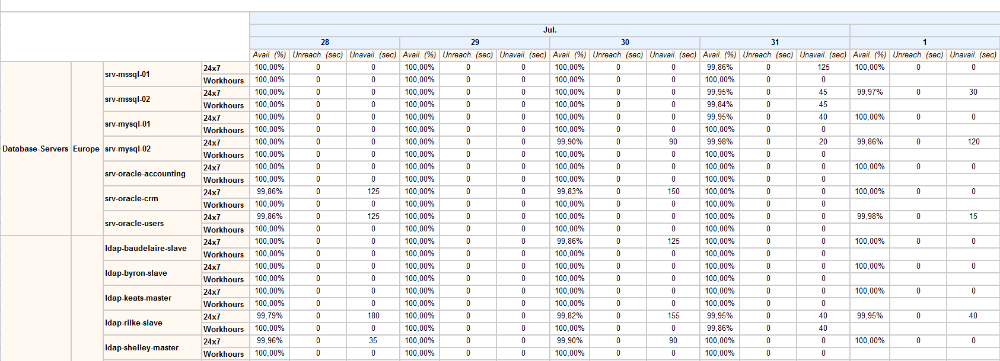

#### Paramètres

Les paramètes attendus par le rapport sont:

-   La période de reporting
-   Les objets Centreon suivant

| Parameter       | Parameter type | Description                         |
| --------------- | -------------- | ----------------------------------- |
| Host group      | Multi select   | Sélectionner les groupes d'hôtes    |
| Host Categories | Multi select   | Sélectionner les catégories d'hôtes |

### Content-diagnostic-service-availability 

Ce rapport vous permet d'avoir une vue sous forme de calendrier de la
disponibilité des services. Sont affichées sur le rapport : la
disponibilité de chaque service, le temps passé dans l'état critique et
le temps passé dans l'état warning, le tout pour chaque plage horaire
et combinaison groupe <> catégories d'hôtes <> catégories de
services.

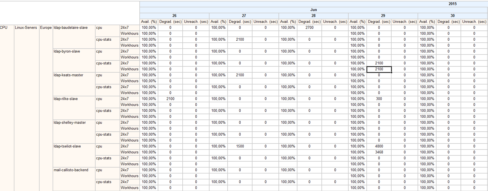

### Paramètres

Les paramètes attendus par le rapport sont:

-   La période de reporting
-   Les objets Centreon suivant

| Parameter          | Parameter type | Description                             |
| ------------------ | -------------- | --------------------------------------- |
| Host group         | Multi select   | Sélectionner les groupes d'hôtes        |
| Host Categories    | Multi select   | Sélectionner les catégories d'hôtes     |
| Service Categories | Multi select   | Sélectionner les catégories de services |

### Content-diagnostic-performance

Ce rapport vous permet d'avoir une vue sous forme de calendrier de la
moyenne des métriques et la valeur maximum atteignable ( bande passante
maximum, stockage maximum etc..), pour chaque plage horaire, pour chaque
combinaison groupes d'hôtes <> catégories d'hôtes <> catégories de
services.

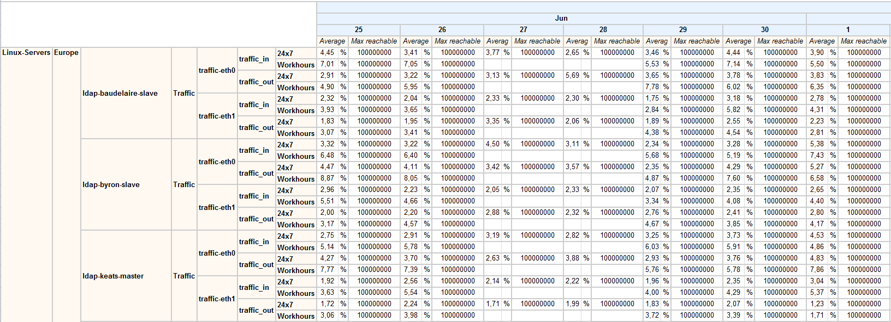

#### Paramètres

Les paramètes attendus par le rapport sont:

-   La période de reporting
-   Les objets Centreon suivant

| Parameter          | Parameter type | Description                             |
| ------------------ | -------------- | --------------------------------------- |
| Host group         | Multi select   | Sélectionner les groupes d'hôtes        |
| Host Categories    | Multi select   | Sélectionner les catégories d'hôtes     |
| Service Categories | Multi select   | Sélectionner les catégories de services |
| Metrics            | Multi select   | Sélectionner les métriques à inclure    |

### Metric-integrity-check

Ce report permet de vérifier la compatibilité des plugins et des
métriques avec les rapports de performance de Centreon MBI. Il permet
d'identifier rapidement les services incompatibles et de mettre à jour
les plugins utilisés.

**Comment interpréter ce rapport?**

Si un warning est affiché en face d'une ligne, cela signifie que :

-   La valeur maximum n'est pas renseigné
-   Les seuils Warning et Critique ne sont pas définis

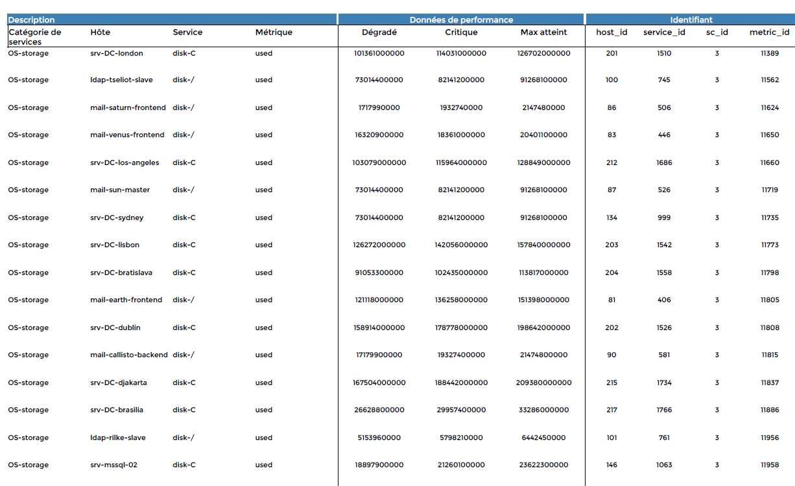

#### Paramètres

Les paramètres attendus par le rapport sont:

-   Une période de reporting
-   Les objets Centreon suivants:

| Paramètres         | Type            | Description                          |
| ------------------ | --------------- | ------------------------------------ |
| Service Categories | Multi sélection | Sélection des catégories de services |
| Metrics            | Multi sélection | Sélection des métriques à inclure    |

## Traduction des rapports

Par défaut, Centreon MBI permet la génération des rapports en deux
langues: le français et l'anglais. Il est possible de générer les
rapports en d'autres langues à condition de leur créer les bons
fichiers de tradution.

Les fichiers de traduction possèdent l'extension .properties, et sont
stockés dans le répértoire
`/usr/share/centreon-bi/Resources/translation/` et sont classés par type
dans des sous répértoire.

Les fichiers de tradution en anglais sont nommés *xxx.properties* et
ceux en francais sont nommés *xxx_fr_FR.properties*

Si vous souhaitez générer vos rapports dans une langue autre que le
français ou l'anglais, vous devez faire une copie de tous les fichiers
*xxx_properties* en les suffixant avec la locale de la langue cible.

Exemple, pour une traduction en allemand, les fichiers seront nommés
*xxx_de_DE.properties* , pour l'espagnol : *xxx_es_ES.properties*

Traduisez ensuite tout le contenu en anglais de ces nouveaux fichiers.

> Si vous souhaitez traduire seulement certains rapports, vous devez
> traduire les fichiers de traduction généraux de la même manière que la
> méthode ci-dessus. Les fichiers sont:
>
> -   units.properties
> -   calendar.properties
> -   common.properties
> -   master-page.properties

Traduisez ensuite le ou les fichiers de la famille de rapports souhaité.
Ces fichiers sont stockés dans

    /usr/share/centreon-bi/Resources/translation/component/

Une fois les nouveaux fichiers .properties traduits, rendez vous sur
l'interface Centreon MBI, editez n'importe quel job puis cliquez sur
le bouton refresh à côté de la selection de la langue. La ou les
nouvelles langues ajoutées seront disponibles pour la selection. Il ne
reste plus qu'a généré le rapport en choisissant la nouvelle langue
pour voir le résultat.

> Attention à la taille du text traduit: Le design du rapport peut
> s'altérer en cas de textes longs.

