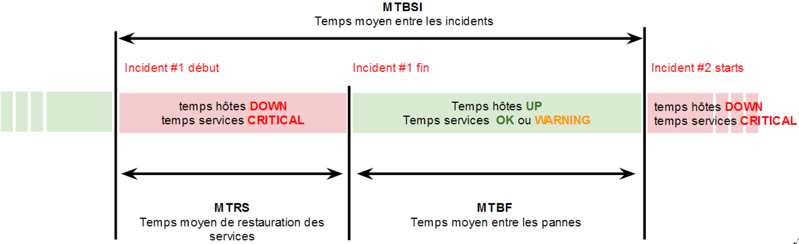
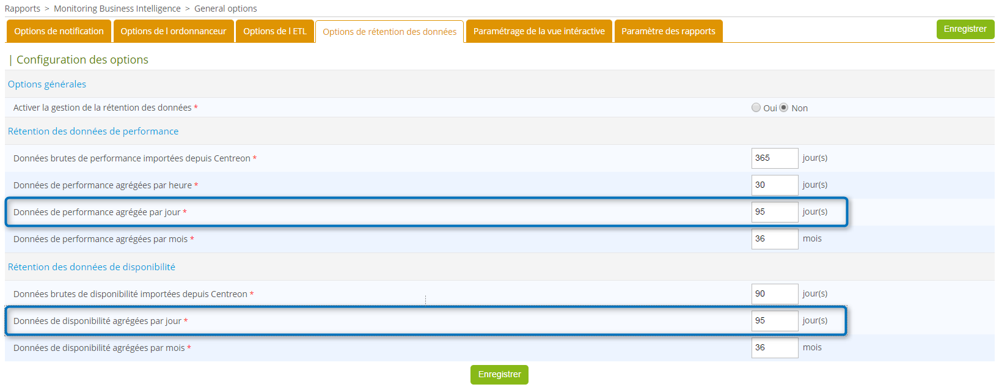
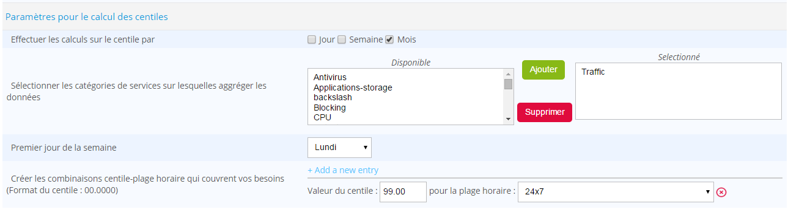

## Disponibilité et évènements

Les données de disponibilité et d'évènements correspondent aux données
liées au changement d'état des hôtes et des services supervisés par
Centreon. Elles sont exploitées dans les modèles de rapports et widgets
de disponibilité et d'évènements proposés par Centreon MBI.

Aucun pré-requis n'est exigé pour que les rapports exploitant ces
notions soient fonctionnels. Il suffit de disposer de plugin renvoyant
un statut. Pour que vous puissiez exploiter et analyser ce que ces
rapports remontent, il est important que vous compreniez certaines
notions et règles de calculs.

### Disponibilité

#### Hôtes

Un hôte est dit disponible s'il est dans un état « Up »

Le calcul du taux de disponibilité présent dans les rapports est le
suivant : Durée « Up » / ( Durée « UP » + Durée « Down »).

Règles supplémentaires :

-   Le temps passé dans l'état « Unreacheable» n'est pas pris en compte
    dans le calcul de la disponibilité,
-   Le temps passé « maintenance programmée (Downtime) » n'est pas pris
    en compte dans le calcul de la disponibilité.

Exemple : Pour un rapport sur 1 journée, si un hôte est disponible 23h
et indisponible 1h sur les 24h théorique, sa disponibilité sera donc 23h
/ (23+1) ~ 95,8%.

#### Services

Un service est dit disponible s'il est dans un état « OK » ou « Warning
».

Le calcul du taux de disponibilité d'un service est le suivant : (durée
« OK » + « Warning ») / ( durée « OK » + « Warning » + « Critical »).

Règles supplémentaires :

-   Le temps passé dans l'état « Unknown» n'est pas pris en compte dans
    le calcul de la disponibilité,
-   Le temps passé « maintenance programmée (Downtime) » n'est pas pris
    en compte dans le calcul de la disponibilité.

### Evènements

Seuls les évènements **confirmés** sont pris en compte dans le calcul
des évènements. Cela correspond à l'état "Hard" dans Centreon.

Dans les rapports, différentes notions sont affichées lorsqu'on parle
d'évènements, ils peuvent être de type :

-   Exception : cela correspond à un état « Down» pour un hôte et un
    état « Critical » pour un service,
-   Avertissement : cela correspond à un état « Warning » pour les
    services, il n'y a pas d'équivalent pour les hôtes,
-   Information : tout autre état.

Un évènement sur un hôte ou un service est caractérisé par 3 éléments :

-   Une date de début,
-   Une date de fin,
-   Un état.

### Indicateurs supplémentaires

-   MTRS (Mean Time To Restore Service) correspond à la Maintenabilité :
    c'est le temps moyen de durée des pannes. Cet indicateur doit être
    le plus faible possible.
-   MTBF (Mean Time Between Failure) correspond à la Fiabilité : c'est
    le temps moyen entre la fin d'un incident et le début du suivant.
    Cet indicateur doit être le plus élevé possible.
-   MTBSI (Mean Time Between Service Incident) : c'est le temps moyen
    entre le début de deux incidents. Cet indicateur doit être le plus
    élevé possible

Le schéma ci-dessous permet de se rendre compte de la portée de ces
indicateurs :

## Bonnes pratiques

### Bonnes pratiques de supervision

#### Qualité des plugins & données

Pour être en mesure d'avoir des rapports sur les données de performance
en utilisant les rapports par défaut de Centreon MBI, vous devez au
moins superviser quelques indicateurs de performance de base
(métriques) :

- CPU : doit retourner un pourcentage d'une ou plusieurs métriques
    (cpu_total, cpu_sys, cpu_1...) et 100 comme valeur maximum.
- Memory : doit retourner au moins une métrique comportant ces
    informations :
    - L'utilisation mémoire : Cette valeur doit être en octets
    - Le seuil d'alerte d'utilisation mémoire
    - Le seuil critique d'utilisation mémoire
    - La mémoire totale allouée en octet 

    Le plugin utilisé pour superviser cet indicateur doit renvoyer la sortie suivante:

        *any status information* | **$metric_name=$value$unit;$warning_threshold;critical_threshold;$min_value;$max_value**

- Utilisation d'espace disque: Deux types de service possibles :
    - Superviser une partition par service (les métriques sont souvent
        nommées « used » et « size »
    - Superviser plusieurs partitions par service et chaque métrique
        correspond au nom d'une partition.

    Dans les deux cas, les données de performance renvoyées par les
    plugins doivent correspondre à ce format :

        *any status information* | **$metric_name=$value$unit;$warning_threshold;$critical_threshold;$min_value;$max_value**

-   Données de trafic : les rapports standards utilisent une metrique
    pour le trafic entrant et une metrique pour le trafic sortant. Pour
    être compatible, vos plugins doivent renvoyer également deux
    métriques (peu importe leurs noms). Il est également important que
    pour chaque métrique, la valeur maximum atteignable soit présente.
    Le format du plugin est donc le même que conseillé ci-dessus :

        any status information | $inboundTrafic=$value$unit;$warning_threshold;$critical_threshold;$min_value;$max_value $outBoundTrafic=...

#### Unité par défaut

Il est important de s'assurer que les unités des données renvoyées par
les plugins soient communes à tous les services pour un même type de
données. Nous conseillons donc fortement de vérifier que les plugins
renvoient les données dans les unités suivantes :

-   Temps: secondes
-   Trafic: bits/sec
-   Stockage: Octets
-   Mémoire/Swap: Octets

### Bonnes pratiques de configuration

Chaque modèle de rapport dans Centreon MBI prend en compte plusieurs
paramètres qui permettent de générer des rapports adaptés à vos besoins.

Plusieurs types de paramètres sont disponibles pour chaque modèle :

-   Un objet principal sur lequel le rapport est généré. Cela peut
    être :
    -   Un hôte
    -   Un groupe d'hôtes : groupe fonctionnel défini dans Centreon
        afin de classer les hôtes par client, application, domaine
        d'activité stratégique, pays, ...
    -   Plusieurs groupes d'hôtes
-   Une période temporelle (ou « plage horaire » ) sur laquelle les
    statistiques seront calculées.
-   Des filtres pour prendre en compte seulement des types spécifiques
    d'équipements, des services ou des métriques dans les groupes
    d'hôtes sélectionnés :
    -   Catégories d'hôtes : Permet de classer les hôtes dans des
        groupes techniques afin de déterminer le type ou la fonction
        d'un hôte ; Par exemple : serveurs Linux, serveurs Windows,
        routeurs cisco, imprimantes, ...
    -   Catégories de services : Permet de définir le type d'un service
        : CPU, mémoire, stockage, ...
    -   Métriques : Données de performances collectées par les services
        (indicateurs de supervision). Un service de supervision peut
        collecter plusieurs métriques. Cependant les noms des métriques
        et les unités ne sont pas normalisés (par exemple : un service
        de type CPU peut collecter seulement une métrique nommée
        'cpu_average' définie en pourcentage et un autre service de
        type CPU peut collecter une métrique par cœur de processeur
        configuré dans l'équipement), il est donc nécessaire, à la
        génération du rapport, de sélectionner les métriques à prendre à
        compte pour le calcul des statistiques.

### Groupes d'hôtes et catégories

Les définitions des groupes d'hôtes et des catégories listées
ci-dessous sont données à partir des bonnes pratiques établies par
Centreon.

Cependant, les groupes et les catégories que vous allez créer doivent
correspondre à vos besoins.

Exemple :

Si vous avez besoin de mettre en évidence le nombre d'alertes générées
par domaines d'activité de votre SI avec une répartition par type
d'équipement, il sera nécessaire de définir des groupes et et des
catégories d'hôtes de la manière suivante :

-   Groupe d'hôtes : **Databases**, Applications, Security, Network,
    Mail ...
-   Catégorie d'hôtes : DB2-Servers, MySQL-Servers, Oracle-Servers,
    SQL-Servers ...

Voici un exemple de statistiques que vous pourriez obtenir en utilisant
ces groupes et catégories :

Le groupe d'hôte est le premier axe d'analyse. La catégorie d'hôte
permet d'analyser les statistiques en sous-domaines.

De la même manière, nous pouvons analyser les statistiques en se basant
sur les dimensions suivantes :

-   Par pays (groupe d'hôte) avec une répartition des données par type
    d'équipement réseau (catégorie d'hôtes)
-   Par pays (groupe d'hôte) avec une répartition des données par
    client (catégorie d'hôte)
-   Par client (groupe d'hôte) avec une répartition des données par
    pays (catégorie d'hôte)
-   Par client (groupe d'hôte) avec une répartition des données par
    serveur d'application (catégorie d'hôte)
-   ...

Il n'existe pas de règles standards pour définir des groupes d'hôtes
ou des catégories. Cela doit être adapté à vos besoins.

**Comment créer ces catégories et groupes?**

-   La relation entre les hôtes et les groupes d'hôtes est faite à
    partir du menu *Configuration > Hosts > Host groups* sur
    l'interface de Centreon. Il est également possible d'utiliser
    l'onglet *Relation* présent dans le formulaire
    d'ajout/modification d'un hôte.
-   La relation entre un hôte et une catégorie d'hôte est faite à
    partir du menu *Configuration > Hosts > Categories* sur
    l'interface de Centreon. Il est également possible d'utiliser
    l'onglet *Relation* présent dans le formulaire
    d'ajout/modification d'un hôte.

### Catégories de Service

Les catégories de services permettent d'organiser les services
(indicateurs de supervision) en sous-domaines. L'usage le plus commun
des catégories de services est de définir des catégories basées sur des
types de services : CPU, mémoire, stockage, processus Oracle, DNS,
processus Websphere, ...

Ce genre de configuration permet, par exemple, de :

-   Comparer le nombre d'alertes générées pour chaque type de services
-   Sélectionner la catégorie de service qui indique l'utilisation
    d'espace disque quand vous souhaitez générer un rapport de
    capacité.

**Comme les groupes d'hôtes et les catégories d'hôtes, les catégories
de service doivent être définies selon vos besoins.**

Par exemple : Si vous avez besoin d'analyser l'espace disque alloué et
utilisé par un SGDB ou par un type d'application, vous devez créer
plusieurs catégories de services. A la place d'utiliser une seule
catégorie nommée « Stockage » ou « Disque » nous aurons :

-   « Operating system » : contenant les espaces de stockage de type
    système
-   « Oracle » : contenant les espaces de stockage des serveurs Oracle
-   « SQL Server » : les espaces de stockage des serveur SQL

Voici un exemple de statistiques que vous pourriez obtenir en utilisant
ces catégories de services :

La relation entre les services et leurs catégories peut être faite à
partir de menu *Configuration > Services > Categories* sur
l'interface de Centreon. Il est également possible d'utiliser
l'onglet *Relation* présent dans le formulaire d'ajout/modification
d'un service.

> Il est fortement conseillé de gérer les catégories de service en
> utilisant uniquement les modèles de services.

## ETL

### Gestion de l'historique des changements

Centreon MBI enregistre chaque changement qui concernent les relations
entre les hôtes, les services, les groupes et les catégories.

Par exemple :

-   Un hôte « H1 » appartient à un groupe d'hôtes « G1 » en janvier
    2012 
-   L'hôte « H1 » n'appartient plus au groupe « G1 » le 1er février
    2012
-   Après ce changement, si un rapport est généré pour le groupe « G1 »
    sur la période de reporting de janvier 2012, les statistiques de
    l'hôte « H1 » seront prises en compte dans les statistiques du
    groupe « G1 »
-   Les statistiques de l'hôte « H1 » ne seront pas prises en compte
    pour le groupe « G1 » si la période de rapport sélectionnée est
    février 2012
-   Si la période de rapport démarre le 15 janvier et finit le 15
    février, les statistiques de l'hôte « H1 » seront intégrées à celle
    du groupe « G1 » seulement du 15 janvier au 31 janvier

> La configuration initiale de Centreon et la relation entre les objets
> doivent être clairement définis avant l'installation de Centreon MBI
> sur une plate-forme de production. Chaque modification de configuration
> d'un hôte, groupe ou catégorie est considérée comme une évolution
> normale dans le cycle de vie de l'objet.

### Modes d'exécution

La base de données de reporting ou « Data Warehouse » est mise à jour
tous les jours avec les données agrégées par l'ETL. En fonction de la
taille du périmètre supervisé, cela peut représenter de quelques
milliers à plusieurs millions de lignes par jour. De ce fait, la base de
données de reporting et l'ETL sont deux composants critiques de Centreon
MBI que vous devez comprendre. **Deux modes** de fonctionnement sont
disponibles pour l'ETL:

-   **Daily mode** ou mode journalier : C'est le fonctionnement normal
    de l'ETL lorsque la plateforme de reporting est en place. Les
    données de Centreon sont importées tous les jours, de manière
    différentielle. Plus précisemment:

    -   les données de la table "data_bin" de la veille sont importées
    et les calculs ne se font que sur ces données
    - toutes les données des tables *servicestatevents* et
    *hoststateevents* sont importées mais les calculs se font de
     manière différentielle

Elles sont ensuite agrégées puis insérées dans le datawarehouse. Cela
peut prendre de quelques secondes à quelques minutes en fonction du
périmètre de monitoring.

Le mode journalier est configuré comme un cron que vous pouvez
consulter dans `/etc/cron.d/centreon-bi-engine`:

    #30 4 * * * root /usr/share/centreon-bi/bin/centreonBIETL --daily >> /var/log/centreon-bi/centreonBIETL.log 2>&1

> **Important**
>
> Ne lancez pas le calcul en mode journalier plusieurs fois dans la même
> journée au risque d'obtenir des données dupliquées.

-   **Rebuild mode** ou mode de reconstruction: C'est le mode souvent
    utilisé après l'installation de la plateforme de reporting, en cas
    de corruption des données. Ce mode permet d'importer les données
    brutes de Centreon et de recalculer toutes les statistiques sur une
    période donnée ou en utilisant les paramètres de rétention.

Exemple:

    /usr/share/centreon-bi/bin/centreonBIETL -r

Afin d'obtenir des temps d'exécution raisonnables, la configuration
matérielle, l'espace de stockage disponible et les optimisations MariaDB
doivent avoir été bien positionnés lors de l'installation.

Toutes les recommandations matérielles, logicielles et
d'optimisations peuvent être trouvées sur le site de documentation.

> Il est fortement recommandé de mettre en place la supervision de l'ETL
> expliqué dans le chapitre "Configuration avancée". Dans le cas ou
> l'ETL n'aurait pas fonctionné pendant plusieurs jours ou que les
> données brutes importées de Centreon n'étaient pas à jour ou erronées,
> un processus de reconstruction partielle des données doit être exécuté.
> N'hésitez pas à contacter le Support afin d'être accompagné dans ce
> processus. L'ETL **ne récupère pas automatiquement** les jours qui
> n'ont pas été calculés.

#### Performance

Si les traitements de l'ETL vous semblent anormalement longs, en mode
journalier ou en mode reconstruction, veillez à optimiser votre serveur
de reporting. Cela peut être fait en :

-   améliorant la configuration MariaDB
-   s'assurant de la bonne performance des disques (pas d'I/O wait par
    exemple)
-   ajoutant de la mémoire physique (+ optimisation MariaDB)
-   veillant à ne pas mutualiser la base de données ni le stockage

#### Options d'exécution

Différentes options peuvent être passées en paramètre de l'ETL afin de
lancer des actions spécifiques d'import ou de reconstruction:

    -c  Create the reporting database model
    -d  Daily execution to calculate statistics on yesterday
    -r  Rebuild mode to calculate statitics on a historical period. Can be used with:
        Extra arguments for options -d and -r (if none of the following is specified, these one are selected by default: -IDEP):
    -I  Extract data from the monitoring server
        Extra arguments for option -I:
        -C  Extract only Centreon configuration database only. Works with option -I.
        -i  Ignore perfdata extraction from monitoring server
        -o  Extract only perfdata from monitoring server

    -D  Calculate dimensions
    -E  Calculate event and availability statistics
    -P  Calculate perfdata statistics
        Common options for -rIDEP:
        -s  Start date in format YYYY-MM-DD.
            By default, the program uses the data retention period from Centreon MBI configuration
        -e  End date in format YYYY-MM-DD.
            By default, the program uses the data retention period from Centreon MBI configuration
        -p  Do not empty statistic tables, delete only entries for the processed period.
            Does not work on raw data tables, only on Centreon MBI statistics tables.

Si les paramètres "start" et "end" ne sont pas précisés, les dates
de début et fin pour chaque étape sont automatiquement calculées en
fonction de la rétention des données paramétrées dans les options
générales de l'ETL.

### Purge automatique des données

Une purge des données peut être activée dans les options générales
Centreon MBI afin de s'assurer que le contenu de la base de reporting
respecte bien la configuration de la rétention. Ce mécanisme doit être
activé dans l'interface ET au niveau du cron
/etc/cron.d/centreon-bi-purge .

Les dimensions de reporting (combinaisons groupes / catégories host /
services / metrics) sont automatiquement supprimées de la base si plus
aucune données n'est lié à la combinaison en question.

### Comment appliquer la dernière configuration Centreon aux données de reporting ?

> Lorsque vous lancez cette procédure, toutes les données déjà calculées
> sont supprimées puis recalculer en se basant sur la période de
> rétention. De plus toutes les relations passées entre les objets seront
> supprimées pour ne garder que la dernière.

En période de mise en place de reporting, il est normal d'avoir à
relancer les calculs des statistiques relativement souvent puisque la
configuration dans Centreon est amenée à changer. Une fois le travail de
groupement / catégorisation terminé, lancer les commandes suivantes sur
le serveur de **REPORTING**, de préférence le matin (cela peut prendre
plusieurs heures). Cette procédure n'inclut pas la reprise des données
de logs et de métrologie brutes, assurez vous que les données provenant
de Centreon sont à jour. Pour cela, exécutez la commande suivante::

    /usr/share/centreon-bi/etl/centreonbiMonitoring.pl --db-content

Et vérifiez que le message "ETL OK - Database is up to date" apparaît
ou qu'aucune de ces tables n'apparaît dans la liste :

-   data_bin
-   hoststatevents
-   servicestateevents

Les commandes d'agrégation proposées ci-dessous sont lancées sans
précision de date de début et fin, le calcul se basera alors sur la
rétention configurée dans Centreon MBI. Si vous êtes en période
d'installation/test de Centreon MBI, vous pouvez modifier cette
rétention AVANT le traitement pour la diminuer puis de la remettre par
défaut (365 jours) APRES le traitement. Les calculs seront de ce fait
plus rapides.

Se rendre à la page : Reporting > Business Intelligence > General
Option | Onglet Data Retention Options

#### Importer la dernière configuration de Centreon

    #/usr/share/centreon-bi/etl/importData.pl -r --centreon-only

#### Calculer les dimensions de reporting

Cette commande supprime toutes les anciennes relations tracées dans le
serveur de reporting pour n'appliquer que les dernières en date. Si vous
souhaitez garder les anciennes relations, remplacer **"-r"** par
**"-d"**.:

    #/usr/share/centreon-bi/etl/dimensionsBuilder.pl -r

#### Agrégation des événements et de la disponibilité

    #nohup /usr/share/centreon-bi/etl/eventStatisticsBuilder.pl -r > /var/log/centreon-bi/rebuildAllEvents.log &

#### Agrégation des données de performance (stockage, traffic etc.. )

    #nohup /usr/share/centreon-bi/etl/perfdataStatisticsBuilder.pl -r > /var/log/centreon-bi/rebuildAllPerf.log &

### Comment reprendre partiellement les données de reporting ?

Cette procédure vous est utile lorsque le plugin de monitoring donnant
l'état de la base de reporting vous remonte un état non-OK. Cela peut
être dû à des problèmes rencontrés lors des traitements journaliers
(données Centreon qui ne sont pas à jour, manque d'espace sur le
serveur de reporting, traitements coupés manuellement etc..).

Dans ce cas, le plugin de reporting renvoie que la base de données
n'est pas à jour. Exemple du retour du plugin lorsque la base de
données n'est pas à jour : :

    #/usr/share/centreon-bi/etl/centreonbiMonitoring.pl --db-content

    [Table mod_bam_reporting, last entry: 2015-07-01 00:00:00] [Table mod_bi_ba_incidents, last entry: 2015-07-01 00:00:00] [Table hoststateevents, last entry: 2015-07-01 00:00:00]
    [Table servicestateevents, last entry: 2015-07-01 00:00:00] [Table mod_bi_hoststateevents, last entry: 2015-07-01 00:00:00]
    [Table mod_bi_servicestateevents, last entry: 2015-07-01 00:00:00] [Table mod_bi_hostavailability, last entry: 2015-07-01 00:00:00]
    [Table mod_bi_serviceavailability, last entry: 2015-07-01 00:00:00] [Table data_bin, last entry: 2015-08-01 00:00:00] [Table mod_bi_metricdailyvalue, last entry: 2015-08-01 00:00:00]
    [Table mod_bi_metrichourlyvalue, last entry: 2015-08-01 23:00:00]

-   Si vous ne voyez que les tables **mod_bi_*** cela signifie que le
    problème se situe uniquement sur les données agrégées et pas les
    données provenant de Centreon.

    Dans ce cas, **ignorez la partie "Importer les données
    manquantes"** dans la procédure qui suit.

-   Si vous voyez également les tables ci dessous, cela signifie qu'il
    y a un problème avec les données importées de Centreon :

    -   hoststatevents
    -   servicestateevents
    -   Les tables **mod_bam_reporting*** tables
    -   data_bin

    Dans ce cas, vous devez vous assurer qu'il n'y a pas de problème du
    côté Centreon avant d'éxécuter la procédure suivante. Dans ce cas,
    exécutez la procédure qui suit.

#### Pré-requis

Avant d'exécuter les commandes de la procédure, s'assurer que:

-   La plateforme Centreon est saine et les données sont à jour dans la base de données
-   Le script dataRetentionManager.pl n'est pas activé sur le serveur
    de reporting ( c'est à dire commenté ) dans
    `/etc/cron.d/centreon-bi-purge`. Il faudra le réactiver à la fin de la
    procédure
-   Le script centreonBIETL n'est pas activé sur le serveur de reporting ( c'est à dire commenté ) dans
    `/etc/cron.d/centreon-bi-engine`. Il faudra le réactiver à la fin de la procédure
-   La rétention est configurée sur l'interface Centreon BI et que la valeur configurée n'est pas supérieure à 1024 jours
-   La rétention est activée dans l'interface
-   Les scripts présents dans `/etc/cron.d/centreon-bi-backup-reporting-server`
    doivent être commentés. Il faudra les dé-commenter à la fin de la
    procédure

> Pour l'ensemble des commandes listées ci-dessous, utiliser "screen" ou
> "nohup" car les temps d'exécution peuvent être très longs.
>
>   - $date_start$: doit être remplacé par la date de début en accord avec le retour des scripts de diagnostic ou de la rétention
>   - $date_end$: à remplacer la plupart du temps par la date du jour

#### Importer les données manquantes

-   Importer les données, sans les données de performance (table
    data_bin), depuis une date ancienne correspondant à la rétention
    configurée dans Centreon MBI > Generation Option > Data Retention
    Parameters, au niveau des paramètre de rétention de la
    disponibilité: :

        nohup /usr/share/centreon-bi/etl/importData.pl -r -s $date_start$ -e $date_end$ --ignore-databin > /var/log/centreon-bi/rebuild_importDataEvents.log &

    *Temps d'exécution : (rapide) quelques minutes*

-   Importer les données de data_bin depuis la date des dernières
    données présentes en base. Vous pouvez le savoir en vérifiant la
    date à côté de la table data_bin dans le retour du plugin :

        nohup /usr/share/centreon-bi/etl/importData.pl -r --no-purge --databin-only -s $date_start$ -e $date_end$ > /var/log/centreon-bi/rebuild_importDataBin.log &

    *Temps d'exécution : (rapide) quelques minutes dépendant du nombre
    de jour à importer*

#### Mettre à jour les dimensions de reporting

-   Mettre à jour les dimensions. L'option "-d" est utilisée pour
    conserver l'historique des changements de configuration, ne pas
    utiliser l'option "-r" ou vous seriez dans l'obligation de
    reconstruire toutes les statistiques :

        nohup /usr/share/centreon-bi/etl/dimensionsBuilder.pl -d > /var/log/centreon-bi/rebuild_dimensions.log &

    *Temps d'exécution : (rapide) quelques secondes à quelques minutes*

#### Reconstruire les évènements manquants et les données de disponibilité

-   Reconstruire les évènements depuis une date ancienne correspondant à
    la rétention configurée dans Centreon MBI > Generation Option >
    Data Retention Parameters : :

        nohup /usr/share/centreon-bi/etl/eventStatisticsBuilder.pl -r --events-only  > /var/log/centreon-bi/rebuild_events.log &

    *Temps d'exécution : dépend de votre périmètre de supervision et du
    nombre d'évènements. Peut prendre de quelques minutes à plusieurs
    heures mais ne doit pas être plus long que 24h. Si c'est le cas,
    veuillez contacter le Support Centreon.*

-   Reconstruire les tables de disponibilité depuis la date des
    dernières données présentes en base. Pour le savoir, regardez les
    dates en face de mod_bi_hostavailability et
    mod_bi_serviceavailability: :

        nohup /usr/share/centreon-bi/etl/eventStatisticsBuilder.pl -r --no-purge --availability-only -s $date_start$ -e $date_end$ > /var/log/centreon-bi/rebuild_availability.log &

    *Temps d'exécution : dépend de votre périmètre de supervision et du
    nombre de jour à reconstruire. Peut prendre de quelques minutes à
    plusieurs heures*

#### Importer et reconstruire les données de performance manquantes

-   Construire les statistiques manquantes. Prenez la date la plus
    ancienne en face des tables mod_bi_metrichourlyvalue et
    mod_bi_metricdailyvalue dans le retour du plugin: :

        nohup /usr/share/centreon-bi/etl/perfdataStatisticsBuilder.pl -r --no-purge -s $date_start$ -e $date_end$ > /var/log/centreon-bi/rebuild_perfData.log &

    *Temps d'exécution : dépend de votre périmètre de supervision et du
    nombre de jour à reconstruire. Peut prendre de quelques minutes à
    plusieurs heures. Attention, si le nombre de jour à reconstuire est
    supérieur à la rétention configurée au niveau des données agrégées à
    l'heure, cela peut générer un important volume de données et une
    reconstruction très longue.*

#### Que faire après l'exécution des scripts ?

-   Cas 1 : **La reconstruction s'est terminée le même jour**

    Dé-commenter les lignes dans `/etc/cron.d/centreon-bi-engine` et
    `/etc/cron.d/centreon-bi-purge` puis redémarrer le systemctl restart
    crond :

        #systemctl restart crond

-   Cas 2 : **La reconstruction se termine le jour suivant**

    -   Dé-commenter les lignes dans `/etc/cron.d/centreon-bi-engine` et
    `/etc/cron.d/centreon-bi-purge` puis redémarrer le systemctl restart
    crond:

            systemctl restart crond

    -   Exécutez manuellement la construction journalière: :

            /usr/share/centreon-bi/bin/centreonBIETL -d

-   Cas 3 : **Tous les autres cas**

    Reprendre la procédure de reconstruction partielle en l'appliquant
    sur les jours qui manquent: :

    Exemple:
        La reconstruction a pris 4 jours : du 01/01 au 04/01 , il faut alors reprendre la procédure depuis le début en utilisant date_start = 01-01 et date_end = 04/01.
    La procédure est terminée et la sortie de la sonde de supervision BI devrait être “ETL execution OK, database is up-to-date”.

### Centreon BAM

Si vous avez récemment mis à jour Centreon BAM en version 3.0 ou que
vous venez de reconstruire les statistiques de BAM, vous devez
ré-importer les données de BAM sur les serveur de reporting. Pour cela,
exécutez la commande suivante :

    /usr/share/centreon-bi/etl/importData.pl -r --bam-only

Cela aura pour effet de n'importer que les tables de reporting du
module BAM.

Si les données de reporting ne semble pas à jour, les statistiques de BAM peuvent être globalement
recalculées en exécutant la commande suivante:

    /usr/share/centreon/www/modules/centreon-bam-server/engine/centreon-bam-rebuild-events --all

### Comment calculer uniquement les données de Centile

Pour être en mesure d'utiliser le rapport "Monthly Network
Percentile" vous devez activer le calcul et le stockage des centiles.

Pour cela, rendez vous sur la page *Reporting > Business Intelligence
> General Options | ETL Tab* et configurez la section "Centile
Parameters" comme décrit ci-dessous. Le combinaison centile/timeperiod
est donnée à titre d'exemple, n'hésitez pas à créer votre/vos propres
combinaisons. Si vous n'êtes pas intéressé par ce rapport, laissez les
valeurs par défaut.

  Parameter                                                                                             | Value
  ------------------------------------------------------------------------------------------------------|--------------------------
  Effectuer les calculs sur le centile par                                                              | Mois (au moins)
  Sélectionner les catégories de services sur lesquelles aggréger les données                           | Sélectionner au moins une de vos catégories de trafic
  Premier jour de la semaine                                                                            | Lundi (défaut)
  Créer les combinaisons centile-plage horaire qui couvrent vos besoins (Format du centile : 00.0000)   |   Créer au moins une combinaison. Ex: 99.0000 - 24x7

Exemple :

Seules les categories de services sélectionnées dans la partie
"Reporting perimeter selection" apparaîtront dans les catégories de
services disponibles pour les statistiques de centile.

Vous pouvez créer autant de combinaison que vous souhaitez mais il faut
savoir que l'impact sur les temps de traitements est fort. A titre
d'exemple, l'agrégation au mois de ces statistiques peut prendre de
quelques secondes à plusieurs dizaines de minutes.

Commencez par configurer les centiles sur un petit perimètre puis
étendez le au fur et à mesure si les temps de calculs ne deviennent pas
problématiques. (peut prendre de quelques secondes à plusieurs dizaine
de minutes).

Sur le serveur de **reporting**, executez la commande suivante pour
importer les données de configuration:

    /usr/share/centreon-bi/bin/centreonBIETL -rIC

Ensuite, exécutez la commande suivante pour intégrer la configuration
des centiles dans le datawarehouse:

    /usr/share/centreon-bi/etl/dimensionsBuilder.pl -d

Enfin, exécutez la commande suivante afin de calculer les statistiques
(cela peut prendre de quelques secondes à plusieurs dizaines de minutes
selon votre configuration):

    /usr/share/centreon-bi/etl/perfdataStatisticsBuilder.pl -r --centile-only
