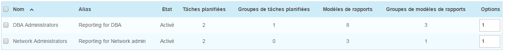
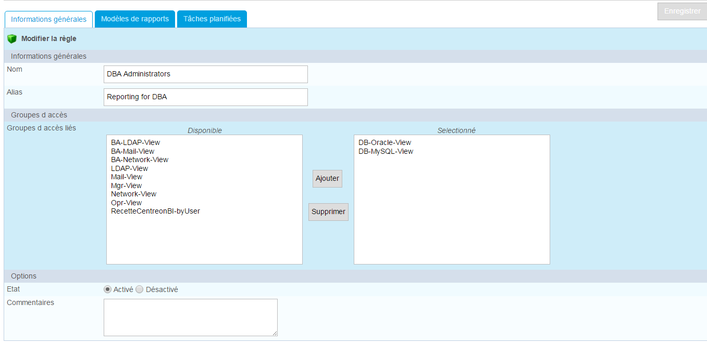
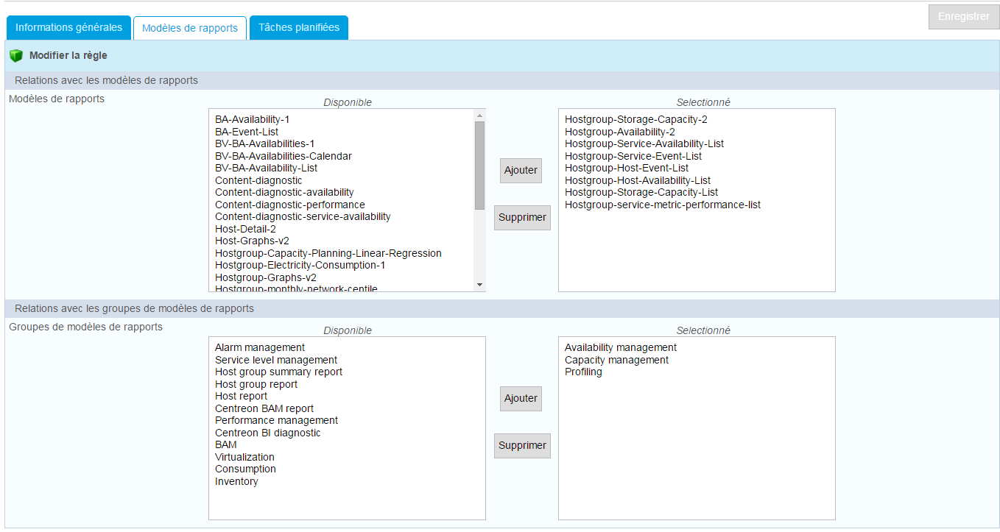
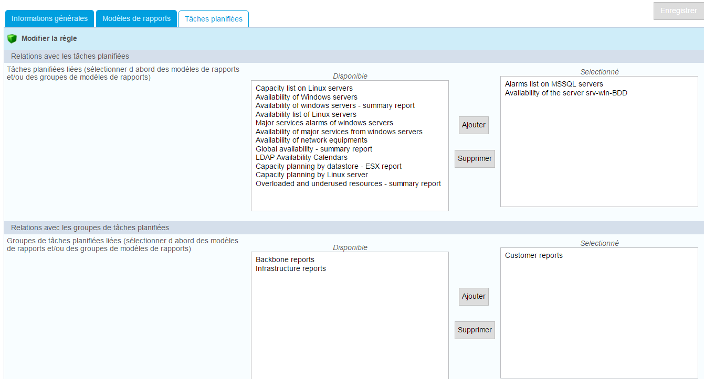
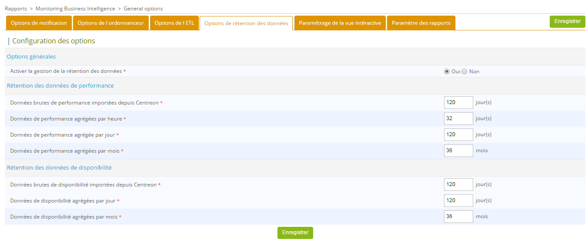

## Gestion des accès aux rapports & tâches planifiées (ACL)

Il est possible de limiter la génération ou la consultation de rapports
à des groupes d'utilisateurs spécifiques. Pour cela, il faut configurer
les listes de contrôle d'accès (ACL) pour Centreon MBI.

Le filtre sur les modèles de rapport permet de :

- Donner accès aux modèles de rapports lors de la création d'une tâche planifiée ("Page Tâches Planifiée -> Ajouter")

Le filtre sur les jobs permets de :

- Donner accès aux rapports générés (page "Report View")
- Donner accès aux tâches planifiée, en créer ou les modifier (page "Tâches planifiées")
- Permettre à un utilisateur de recevoir par e-mail les rapports basé sur les tâches planifiées

Pour gérer les accès, rendez vous à la page suivante: `Administration > ACL > Centreon MBI > ACL Rules`

Lors de l'ajout ou d'une modification d'une règle, un formulaire
composé de 3 onglets s'ouvre.

Dans l'onglet "General informations" , les groupes d'accès
préalablement paramétrés dans Centreon sont listés. Il est possible de
les lier à la règle.

L'onglet "report designs" permet de lier des modèles de rapport ou
des groupes de modèles à cette règle.

Le dernier onglet "Jobs" permet de lier les tâches et les groupes de
tâches planifiées à la règle. Si aucun modèle de rapport n'est
selectionné dans l'onglet précedent, aucune tâche ne sera visible dans
cet onglet.

> **Important**
>
> Un utilisateur non administrateur ne peut recevoir des notifications sur
> des rapports qu'il n'est pas autorisé à voir, même s'il fait parti du
> groupe de contacts relatif à la notification.
> 
> Il est possible de donner accès aux autres menus de Centreon MBI à des
> utilisateurs soumis à des ACLs, ces utilisateurs pourront alors
> uniquement visualiser le contenu. Les pages concernées sont :
> 
> -   Groupe de tâches planifiées
> -   Modèle de rapports
> -   Groupe de modèle de rapports
> -   Logos
> -   Règles de publication
>
> Si vous donnez accès à la page "Options générales" à un utilisateur
> limité, il aura les droits de modification, cela est fortement
> déconseillé.

## Options générales 

Les options générales de Centreon MBI sont utilisées pour paramétrer:

-   Les options d'ordonnancement des tâches planifiées et de génération
    de rapports
-   La communication entre l'interface de Centreon MBI et le moteur de
    génération des rapports CBIS
-   Les paramètres de notification des administrateurs de Centreon MBI
-   Le paramétrage de la vue interactive

### Options de notification

Le moteur de génération de rapports peut notifier les administrateurs
Centreon MBI après la génération de chaque rapport. L'e-mail envoyé
contient:

-   Le lien de téléchargement du rapport
-   Le fichier de log relatif au rapport généré

Cela permet aux administrateurs de contrôler les tâches échouées.

Le processus de notification doit être different de celui de la
publication par e-mail:

La publication par e-mail permet d'envoyer les rapports aux
utilisateurs concernés alors que la notification envoie l'e-mail aux
administrateurs Centreon MBI afin de les prévenir de la génération du
rapport.

Les paramètres de notification peuvent être modifiés dans le menu:

*Reporting > Business Intelligence > General Options | Notification
Options*

Description des champs du formulaire:

  Champs                                        | Description
  ----------------------------------------------|-----------------------------------------------
  Enable job notification for administrators    | Permet d'activer le système de notification par défaut pour l'application. Il est cependant possible de désactiver la notification ensuite sur des tâches planifiées
  E-mail from                                   |  Expéditeur du e-mail
  SMTP server                                   | Adresse du serveur SMTP ( Adresse IP ou nom DNS)
  SMTP port                                     | Port SMTP
  Use credential                                | Utilisation d'une authentification (oui / non)
  Use SSL                                       | Utilisation d'une authentification SSL (oui / non)
  SMTP user                                     | Compte utilisateur SMTP
  SMTP password                                 | laisser vide pour ne pas modifier le mot de pass     
  E-mail default title                          |   Sujet du e-mail de notification par défaut
  Default E-mail body                           | Corps du e-mail de notification par défaut
  Default E-mail footer                         | pied de page du e-mail de notification par défaut
  Centreon main server web protocol             | Le protocole utilisé pour la connexion à l'interface Centreon ( http / https )
  Centreon web URL extension                    | L'extension URL du serveur Centreon ( Exemple: /centreon )
  Centreon main server web address              | Adresse du serveur Centreon ( exemple:
  Contact groups                                | Groupe de contacts des administrateurs Centreon MBI. Laisser le champs vide pour ne pas recevoir de notification après chaque génération de rapport
  Testing notification                          | Mettre une adresse e-mail valide dans ce champs, ensuite cliquer sur "test" pour envoyer un email de test correctement renseigné

### Options de l'ordonnanceur

Le menu permettant de modifier les options d'ordonnancement du moteur
de reporting se trouve dans: `Reporting > Business Intelligence > General Options | Scheduler
options`

### Propriétés du moteur CBIS

L'interface de Centreon MBI communique directement avec le moteur de
génération de rapports CBIS. Elle ouvre une connexion sur le port
d'écoute de CBIS pour:

-   Avertir lors de la création ou la modification de tâches planifiées
-   Mettre à jour les langues disponibles pour la traduction de rapports
-   Tester les règles de publication de rapports
-   Tester la configuration de notifications

Description des paramètres:

  Option                    | Description
  --------------------------|--------------------------------------------------------
  CBIS host                 | Adresse IP du serveur hébérgeant le moteur de génération de rapport
  CBIS port                 | Le port TCP sur lequel le moteur CBIS est en écoute
  CBIS connection timeout   | Timeout pour la connexion au moteur de génération de rapports en secondes

Une modification faite sur un de ces paramètres necessite un redémarrage
du service CBIS.

### Propriétés d'ordononnancement des rapports

Description des paramètres:

  Option                                                        | Description
  --------------------------------------------------------------|----------------------------------
  All cyclic reports generation hour                            | Heure de génération des rapports journaliers, hebdomadaires et mensuels
  Day of month for the generation of monthly reports            | Jour de mois de génération des rapports mensuels
  Day of week for the generation of weekly reports              | Jour de semaines de génération des rapports hebdomadaires
  maximum load allowed to the scheduler for the jobs execution  | Poids maximal autorisé pour la génération de tâches parallèles

### Propriétés de rapports spécifiques

Deux rapports nécessitent un accès au serveur Centreon afin de générer
des graphiques RRDs. Ces rapports sont:

-   Host-graph-v2
-   Hostgroup-graph-v2

Renseignez le champs suivant:

Une modification sur les paramètres ci-dessus nécessite un redémarrage
du service CBIS.

Le thème de couleurs par défaut peut aussi être défini dans ce menu, en
utilisant l'option "Default report color theme".

### Options de l'ETL

Centreon MBI intègre un ETL qui permet de :

-   Synchroniser les données brutes de la supervision vers le serveur de
    reporting
-   Alimenter les bases de données du serveur de reporting avec les
    données statistiques
-   Contrôler la rétention des données sur le serveur de reporting

Avant de passer aux étapes suivantes, il est nécessaire de lire le
chapitre `centreon_best_practices`{.interpreted-text role="ref"} afin de
vous assurer que la configuration des objets dans Centreon (groupes,
categories...) est conforme aux attentes de Centreon MBI.

Dans le menu « Reporting > Business Intelligence > General Options >
ETL options »  de Centreon, spécifiez les options suivants :

Option                                                                                                                                      | Values
--------------------------------------------------------------------------------------------------------------------------------------------|---------
| **Options générales**                                                                                                                     | |
  Une base de données MariaDB dédiée au reporting a été mise en place.		                                                            | Oui. Vous devez avoir un serveur de reporting dédié.
  Espace de stockage des fichiers temporaires sur le serveur de reporting *		                                                            | Dossier sur le serveur de reporting dans lequel les dumps de données seront positionnés
  Type de statistiques à traiter		                                                                                                    | <ul><li>Sélectionnez « Disponibilité uniquement » si vous utilisez uniquement les rapports de disponibilité. </li><li>Sélectionnez « Performance et capacité uniquement» si vous souhaitez utiliser uniquement les rapports de capacité et de performance</li><li>Sélectionnez «Tous» afin de calculer les statistiques pour les deux types de rapports.</li></ul>
  Activer le stockage des tables temporaires en mémoire (uniquement si la mémoire physique allouée au serveur de reporting est suffisante)  | Activé uniquement si votre configuration MariaDB et la mémoire physique allouée au serveur de reporting le permet.
| **Sélection du périmètre du reporting**                                                                                                   | |
Groupes d hotes                                                                                                                             | Sélectionnez les groupes d’hôtes pour lesquels vous souhaitez conserver les statistiques.
Catégories d hôtes                                                                                                                          | Sélectionnez les catégories d’hôtes pour lesquels vous souhaitez conserver les statistiques.
Catégories de services	                                                                                                                    | Sélectionnez les catégories de services pour lesquels vous souhaitez conserver les statistiques.
| **Calcul des données de disponibilité**                                                                                                   | |
  Sélectionner les plages de services pour le calcul des statistiques de disponibilité	                                                    | Plages horaires (time periods) pour lesquelles les calculs de disponibiltié des hôtes et des services sont réalisées
| **Calcul des données de performance et de capacité**                                                                                      | |
  Granularité des données statistiques à calculer	                                                                                        | Sélectionnez le ou les niveaux de granularité pour le calcul des données de performance (1)
  Sélectionner les plages de services pour le calcul des statistiques de performance                                                        | Plages horaires sur les jours de la semaine pris en compte dans le calcul des données de capacité et de performance
| **Capacity statistic aggregated by month**                                                                                                | |
  Sélectionner la plage de service 24h/24, 7j/7 pour le calcul des statistiques mensuelles de capacité	                                    | Selectionnez la plage horaire 24x7.
  Sélectionner les catégories de services liées aux indicateurs de capacité                                                                 | Sélectionnez les catégories de services ayant été rattachés à des services de type capacité
  Exclure les métriques qui ne renvoient pas une indication d utilisation des espaces de stockage                                           | Concerne uniquement les métriques liées aux services qui renvoient une information de capacité. Sélectionnez uniquement les métriques qui donnent une valeur maximale ou une valeur totale de capacité et non une valeur d’utilisation. (exemple, la métrique “ size ” returnée par le plugins check_centreon_snmp_remote_storage »)
 | **Paramètres pour le calcul des centiles**                                                                                               | |
   Calculating centile aggregation by	                                                                                                    | Selectionnez la granularité des calculs. Le rapport de trafic fourni en standard avec BI 2.1 utilise les données au Mois.
  Sélectionner les catégories de services sur lesquelles aggréger les données                                                               | Selectionnez uniquement les catégories de services pertinente (Ex: Traffic)
  Premier jour de la semaine	                                                                                                            | Selectionnez le premier jour à considérer pour les statistiques à la semaine
Créer les combinaisons centile-plage horaire qui couvrent vos besoins (Format du centile : 00.0000)	                                        | Créez des combinaisons centile/plage horaire sur lesquels les statistiques seront effectuées

**(1)** Les rapports nécessitant une granularité des données à l'heure
sont listés ci-dessous. Si vous ne souhaitez pas utiliser ces rapports,
désactivez le calcul des statistiques à l'heure:

-   Hotsgroup-Host-details-1
-   Host-detail-v2
-   Hostgroup-traffic-Average-Usage-By-Interface
-   Hostgroup-traffic-by-Interface-And-Bandwith-Ranges

### Options de réténtion des données

Le serveur de reporting contient des données de statistiques dans des
tables spécifiques à Centreon MBI. Ces données sont stockées dans la
base de données *centreon_storage*.

L'espace utilisé par ces tables augmentera de jour en jour; il est
possible de contrôler la volumétrie de ces données en configurant des
règles de rétention.

Dans le menu : *Reporting > Monitoring Business Intelligence > Options
générales > Options de rétention des données* la rétention peut être
gérée par:

-   type de données (disponibilité ou performance)
-   granularité des données (données brutes de la supervision, données
    agrégées par heure, jour ou mois)

Activez la rétention de données en cochant "Yes" puis paramétrez les
différents options de configuration.

Pour activer la purge automatique des données, éditez le cron
`/etc/cron.d/centreon-bi-purge` sur le serveur de reporting puis
dé-commentez la ligne suivante: :

    0 20 * * * root @CENTREON_BI_HOME@/etl/dataRetentionManager.pl >> @CENTREON_BI_LOG@/dataRetentionManager.log 2>&1

> Évitez les périodes pendant lesquelles les calculs de statistiques avec
> l'ETL Centreon MBI et la génération des rapports sont programmés.

Il est possible d'exécuter le cron de manière journalière ou
hebdomadaire, cela dépendra de la charge générée par la purge des
données sur votre serveur de reporting.

Redémarrez le service cron: :

    systemctl restart crond

### Report Parameter

Cet onglet a pour but d'afficher les dimensions disponibles pour un
utilisateur choisi en fonction de ses restrictions d'ACL et de ce qui a
été calculé dans l'entrepôt de données.

En cas de changement de configuration de groupes d'hôtes, catégories
d'hôtes ou de services, vous devez cliquer sur "Update ACL resources"
afin que les paramètres disponibles dans la page de configuration d'une
tâche planifiée soient mis à jour.

### Widget de reporting

Cet onglet permet de vérifier que la connexion à la base de reporting
est fonctionnelle et de modifier les paramètres de connexion. Ces
paramètres sont utilisés pour récupérer les données dans les widgets.
