Ce chapitre décrit les fonctionnalités à utiliser afin de générer et gérer les rapports.

## Tâches planifiées

Une tâche planifiée est une entité qui permet de générer un rapport et sa configuration prend en compte :

 - Un modèle de rapport à utiliser ([voir les modèles disponibles par défaut](reports.html))
 - Un périmètre basé sur les objets Centreon (voir [les bonnes pratiques](installation.html#bonnes-pratiques-de-supervision))

 - Une période de reporting (mois en cours, mois dernier, veille etc..)

### Liste des tâches planifiées

Le menu suivant liste les tâches planifiées, en cours d'execution,
terminées ou échouées: `Reporting > Business Intelligence > Configuration > Jobs`

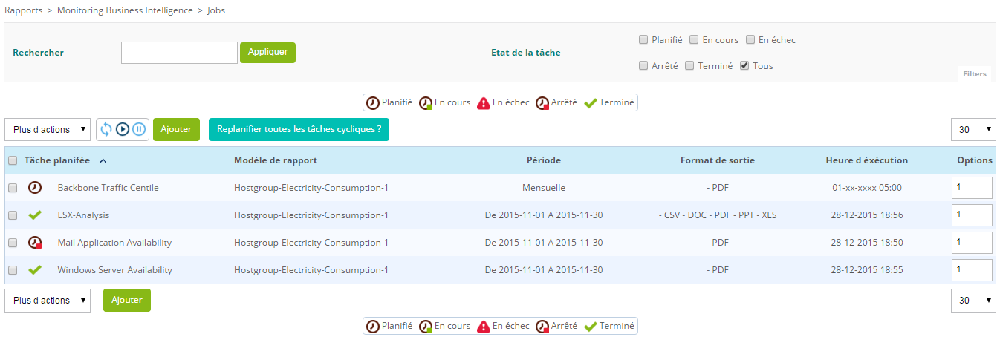

Description des colonnes:

  **Colonne**       | **Description**
  ------------------|------------------------------------------------------------
  Name              | Nom de la tâche planifiée
  Report Model      | Modèle de rapport utilisé
  Period            | La période sur laquelle le rapport est généré
  Output Format     | Le format de sortie du rapport généré (PDF, Excel, Powerpoint, CSV, DOC)
  Execution time    | Date et heure d'execution de la tâche planifiée
  Options           | Nombre de tâches à dupliquer si l'option de duplication est choisie dans le menu "More Actions"

Dans la colonne "Name", une icône est associée au status de la tâche planifiée:
  Icon                                                     |  Statut
  ---------------------------------------------------------|----------------------------
      | tâche arrêtée
              | tâche planifiée
      | tâche en cours d'execution
            | tâche terminée
             | tâche échouée ou annulée

#### Filtre de recherche

Un filtre de recherche est disponible pour un accès rapide aux tâches planifiées:

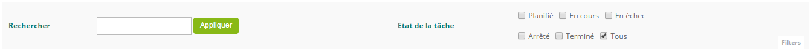

**Légende**: Les options de filtre sur les tâches planifiées.

Le champs "Search" permet de fitrer par nom de tâche. Les options du
"Job state" permettent de filtrer par état.

Description des différents états:

  Etats         | Description
  --------------|----------------------------------------------------------------
  Scheduled     | tâche planifiée , sera exécutée
  Running       | tâche en cours d'éxecution, le rapport est en cours de génération
  Failed        | tâche échouée
  Stopped       | tâche arrêtée, ne sera pas executée
  Finished      | tâche terminée, le rapport a été généré. Cet état apparait seulement pour les tâches en execution unique. Les tâches cycliques repassent à l'état "Scheduled" une fois le rapport généré
  All           | tous les états

#### Rafraîchir la liste des tâches planifiées

Les icônes suivantes permettent à l'utilisateur de mettre à jour
dynamiquement la liste des tâches planifiées:

Icon                                                                                                          | Description
--------------------------------------------------------------------------------------------------------------|-----------------------------------------------
|                                                              | Rafraîchir manuellement la liste et les états de chacune des tâches.
|   | Le rafraîchissement peut être activé ou désactivé

#### Menu d'actions

Le menu d'action permet la mise en place de differentes actions
d'ajout ou de modification. Les actions seront appliquées sur un ou
plusieurs éléments de la liste.

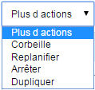

**Légende:** Menu d'actions de la page "Jobs"

Le tableau suivant décrit les différentes actions possibles:

  Action      | Description
  ------------|-------------------------------------------------------------
  Trash       | Envoie les tâches selectionnées vers la corbeille.
  Stop        | Arrête la tâche selectionnée.
  Reschedule  | Planifie/lance la tâche selectionnée.
  Duplicate   | Duplique la tâche selectionnée. Toutes les propriétés de la tâches seront également dupliquées

### Ajouter / modifier

Pour générer un rapport, il faut créer une tâche planifiée en cliquant sur "Ajouter". La configuration d'une
tâche planifiée se fait en deux principales étapes:

- Sélection du modèle de rapport à utiliser (voir tous les modèles disponible)
- Selectionner le périmètre sur lequel générer le rapport

et deux étapes optionnelles:

- Publication du rapport
- Tuning (Réglages avancés)

Le formulaire suivant est utilisé pour la création d'une nouvelle tâche
planifiée:

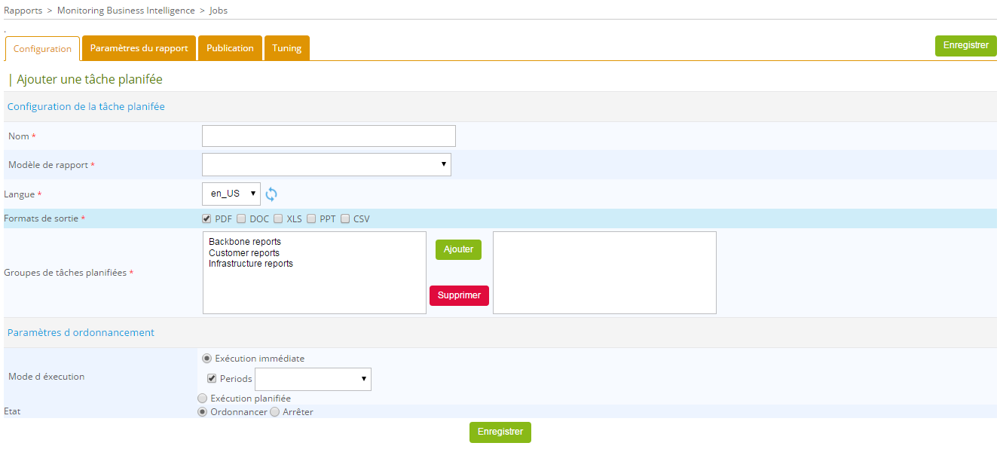

<!--DOCUSAURUS_CODE_TABS-->

<!--1. Configuration-->

Une tâche de génération de rapport doit être liée à un modèle de
rapport.

Plusieurs formats de sortie sont disponibles:

-   Acrobat PDF
-   Microsoft Excel
-   Microsoft Word
-   Microsoft Powerpoint
-   CSV : ce format d'export est particulier, seul le premier jeux de
    données du rapport BIRT est exporté au format CSV. Il est probable
    que vous deviez créer un rapport spécifique permettant de tirer
    parti de ce format d'export.

Les rapports peuvent être générés en plusieurs langues. Actuellement,
les langues disponibles sont:

-   Français
-   Anglais (Etats Unis).

L'icône à droite du menu de selection de la langue permet de rafraîchir
la liste des langues de traduction disponibles.

#### Paramètres d'ordonnancement

Une tâche peut être executée de deux manières différentes:

**Exécution immédiate**:

-   Peut être executée immédiatement ("Immediate execution"):

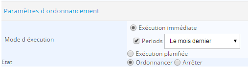

-   Execution planifiée à une date ultérieure ("Scheduled execution >
    One shot"):

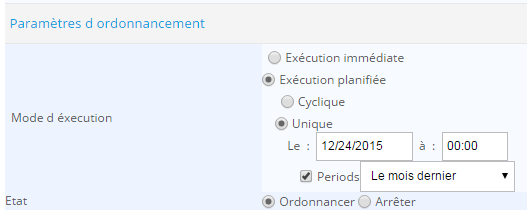

**Exécution cyclique**:

Dans ce cas, le rapport peut être planifié à s'éxecuter de façon
quotidienne, hebdomadaire ou mensuelle.

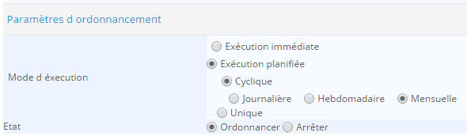

Lors d'une éxécution immédiate de la tâche, la période de réporting
doit être renseignée par l'utilisateur. Lors d'une éxécution cyclique,
cette période est automatiquement calculée par rapport à la fréquence de
lancement:

-   Les rapports journaliers auront comme période de reporting le jour
    précédent.
-   Les rapports hebdomadaires auront comme période de reporting la
    semaine précedente.
-   Les rapports mensuels auront comme période de reporting le mois
    précédent.

<!--2. Paramètres du rapport-->

L'onglet "Paramètres de rapport" est utilisé pour définir les paramètres
spécifiques du modèle de rapport.

> Les paramètres ne sont disponibles qu'en anglais, référez vous à la
> documentation en ligne pour plus d'explication.

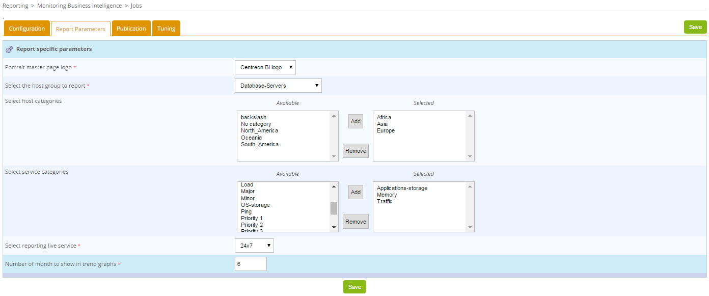

**Légende**: exemples de paramètres spécifiques de rapports

Cette partie du formulaire est remplie une fois qu'un modèle de rapport
est selectionné dans le menu "Scheduled job" de l'onglet
"Configuration".

Il existe trois types de champs dans ce formulaire:

-   Champs textes
-   Radios boutons
-   Sélections simples et Multi-sélections pour les ressources
    suivantes:
    -   Hôtes
    -   Métriques
    -   Groupes d'hôtes
    -   Catégories d'hôtes
    -   Catégories de services
    -   Périodes temporelles
    -   Images à insérer au rapport ( les logos par exemple)

> Une valeur doit être renseignée pour chaque champs excepté le
> multi-select quand il s'agit d'exclusion de métriques. Dans ce cas
> précis, quand aucune métrique n'est à exclure, toutes les métriques
> seront utilisées.

<!--3. Publication (optionel)-->

Une fois le rapport généré, il peut être automatiquement publié en
utilisant des règles de publication pré-définies. Lors de la création
d'une tâche, vous pouvez sélectionner plusieurs règles dans l'onglet
"Publication" ( se référer au chapitre
`"règles de publication"<publication_rules>`{.interpreted-text
role="doc"} pour plus d'information sur les différents protocoles de
publication de rapports).

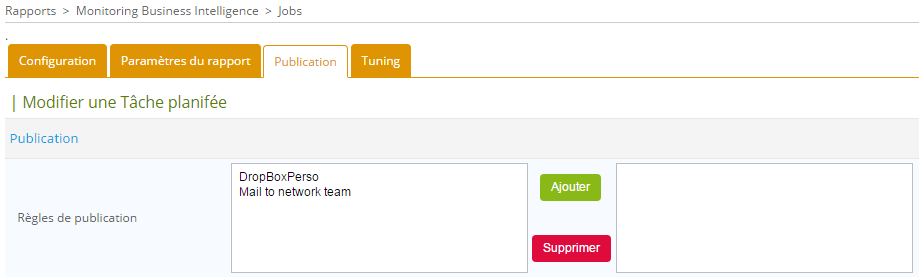

<!--4. Tuning (optionel)-->

-   **Le thème de couleurs des rapports**: La gestion des thèmes a été
    implémentée. Elle permet de choisir entre des palettes de couleurs.
    Sept thèmes sont proposés par défaut: Maroon, Orange, Blue, Green,
    Ice, Multicolor-1 et Multicolor-2

Ci-dessous les palettes associées aux couleurs:

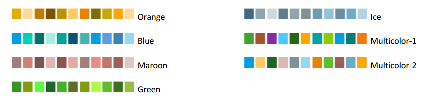

Le theme de couleur par défaut peut être modifié dans le menu d'options
générales de Centreon MBI. Pour plus d'informations, visitez le
chapitre [Options générales](configure.html#options-g%C3%A9n%C3%A9rales)

-   Coefficient de la tâche planifiée: chaque modèle de rapport a un
    poids. Une tâche planifiée multiplie ce poids par le coefficient
    renseigné. La somme des poids des tâches en cours d'execution ne
    doit pas dépasser le poids maximal autorisé par le moteur de
    génération ( paramétrable dans les options générales onglet
    "Scheduler options" ).
-   Activé ou non l'envoi de notifications aux administrateurs
    lorsqu'un rapport est généré.

<!--END_DOCUSAURUS_CODE_TABS-->

## Accéder aux rapports générés

Après l'execution d'une tâche planifiée, un nouveau rapport est généré
et stocké sur le serveur de supervision. Il est donc possible de
visualiser ou télécharger le rapport généré directement depuis le menu: `Reporting > Business Intelligence > Archives`

Le tableau ci-dessous liste les rapports générés.

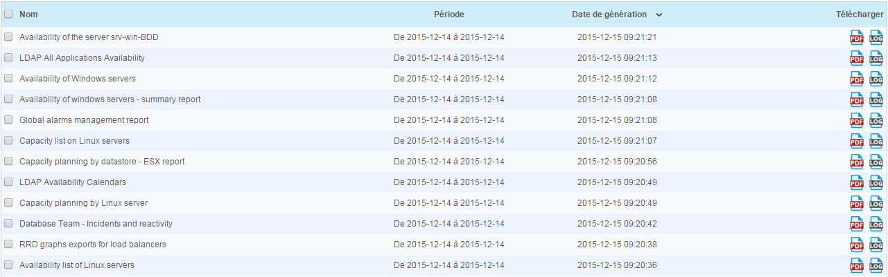

Description du tableau:

  Colonne             | Description
  --------------------|----------------------------------------------------
  Name                | Nom du rapport
  Period              | La période sur laquelle le rapport a été généré
  Date de génération  | date de génération du rapport |
  Download            | lien pour le téléchargement du rapport

#### Filtre de recherche

Le filtre de recherche suivant permet de trouver facilement un rapport:

-   "Period" : filtre appliqué sur la colonne "Period"
-   "Date of generation" : filtre appliqué sur la colonne "Date of
    Generation"
-   "Frequency" : filtre appliqué sur la colonne "Frequency"
-   "Search" : filtre appliqué sur la colonne "Name"

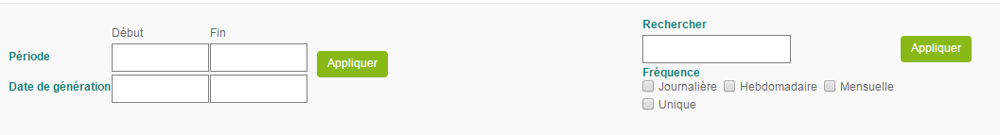

#### Menu des actions

Le menu permet d'envoyer vers la corbeille les rapports qui ne sont
plus utiles.

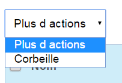

## Groupes de jobs

### Liste des groupes de tâches planifiées

Le menu suivant liste l'ensemble des groupes de tâches planifiées
disponibles dans Centreon MBI

*Rapports > Business Intelligence > Configuration > Groupe de tâches
planifiées*

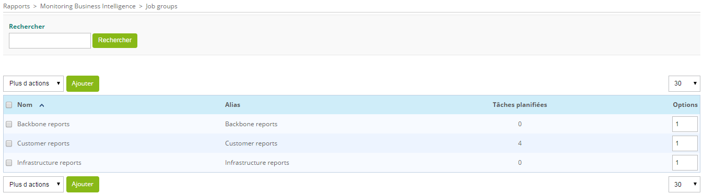

### Ajouter / Modifier

Un nouveau groupe peut être ajouté ou modifié.

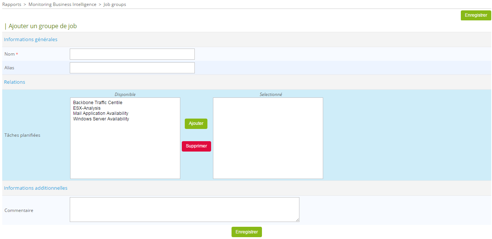

**Légende:** Formulaire d'ajout d'un groupe de tâches planifiées.

Description des champs du formulaire:

  Colonne       | Description
  --------------|------------------------------------------------------
  Name          | Nom du groupe des modèles de rapports
  Description   | Courte description du groupe des modèles de rapports
  Linked job    | Les tâches planifiées rattachées au groupe

#### Menu d'actions

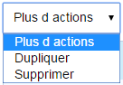

**Légende:** Les actions possibles sur les groupes des tâches planifiées

  Action    |   Description
  ----------|---------------------
  Delete    | Supprimer le groupe
  Duplicate |  Dupliquer le groupe

## Modèles de rapport

Les modèles de rapports sont les fichiers ".rptdesign" créés avec
l'outil open source BIRT ( Business Intelligence Reporting Tool).

Chaque fichier RPTDESIGN utilisé dans le module **Centreon MBI**
correspond un modèle de rapport. Afin de pouvoir générer des rapports,
le modèle de rapport doit être configuré par rapport aux:

-   Objets **Centreon** ( Hôtes, services, groupes d'hôtes, catégories
    de services, activité métiers , ect.)
-   La période de reporting selectionnée ( rapports hebdomadaires,
    mensuels , ect.)
-   ect

Chaque modèle de rapport peut avoir plusieurs paramètres à définir dans
l'interface **Centreon**.

### Liste des modèles de rapport

Le menu suivant liste l'ensemble des modèles de rapports disponibles
dans Centreon MBI: `Rapports > Business Intelligence > Configuration > modèles de rapports`

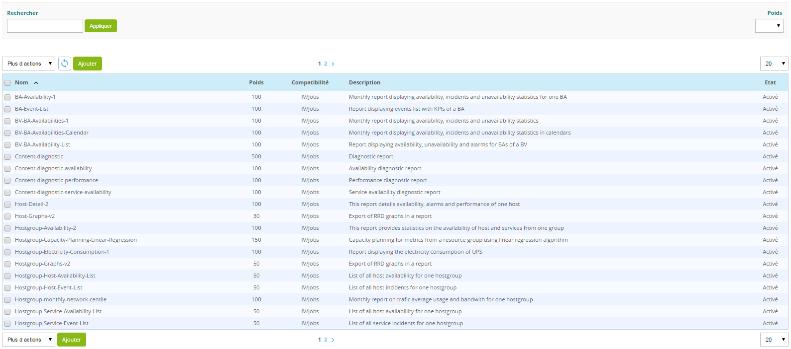

**Légende**: Liste des modèles de rapports de Centreon MBI

Description du tableau ci-dessus:

   Colonne     |   Description
  -------------|----------------------------------------------
  Name         | Nom du modèle de rapport
  Description  | Courte description du modèle de rapport
  State        | Etat du modèle de rapport (Activé/Désactivé)
  Weight       | Poids du rapport lors de son execution.

### Ajouter / modifier

Un nouveau modèle de rapport peut être ajouté ou modifié si vous développez vos propre rapport:

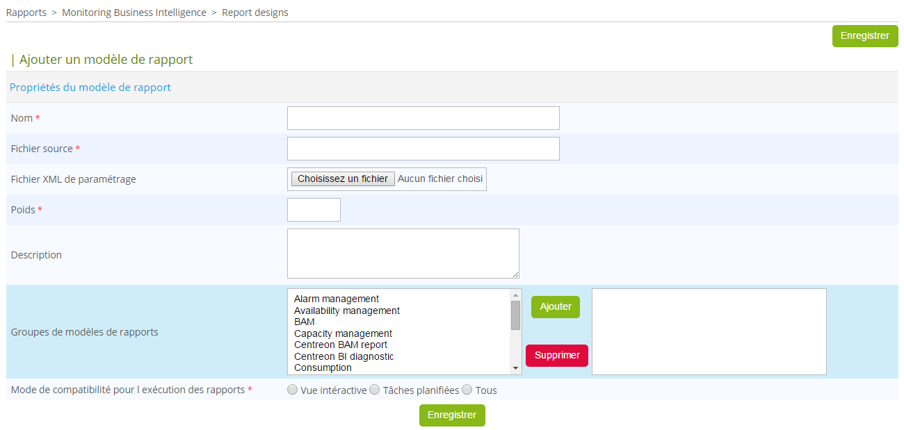

**Légende**: Formulaire d'ajout d'un modèle de rapport

Description des champs du formulaire:

Fields                | Description
----------------------|--------------------------------------------------------------------------------------------------------------------------------------------------------------------
Name                  | Nom du modèle de rapport
Report Source file    |  Nom du fichier ".rptdesign" correspondant au modèle de rapport. Ce fichier est stocké Dans le repertoire "reports/" du chemin d'installation de "Centreon MBI"
Description           | Courte description du modèle de rapport
XML parameters file   |        Chaque rapport peut avoir plusieurs paramètres spécifiques. le fichier ".xml" permet de définir ces paramètres
Weight                | Poids du rapport pendant son execution.
Report design groups  | Groupe de modèles de rapports lié au modèle de rapport pour une meilleure gestion des ACL

> Seuls les administrateurs sont autorisés de modifier des modèles de
> rapports ou d'en créer de nouveaux. Les utilisateurs avec des
> privilèges limités sont autorisés seulement à visualiser les
> informations liées à ces modèles.

#### Menu d'actions

**Légende**: les actions possibles sur les modèles de rapports.

  **Nom de l'action**   |    **Description**
  ----------------------|--------------------------------------------------------
  Trash                 | Envoyer le fichier vers la corbeille
  Activate              | Activer un modèle de rapport afin de pouvoir l'utiliser dans les tâches planifiées
  Deactivate            | Désactiver un modèle de rapport. Son utilisation ne sera plus possible dans les tâches planifiées

## Groupe de modèle de rapport

### Liste des groupes de modèle

Le menu suivant liste l'ensemble des groupes de modèles de rapports
disponibles dans Centreon MBI `Rapports > Business Intelligence > Configuration > Groupe de modèles de rapports`

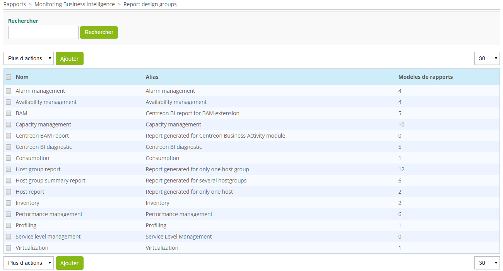

### Ajouter / Modifier un groupe de modèle de rapport

Un nouveau groupe peut être ajouté ou modifié.

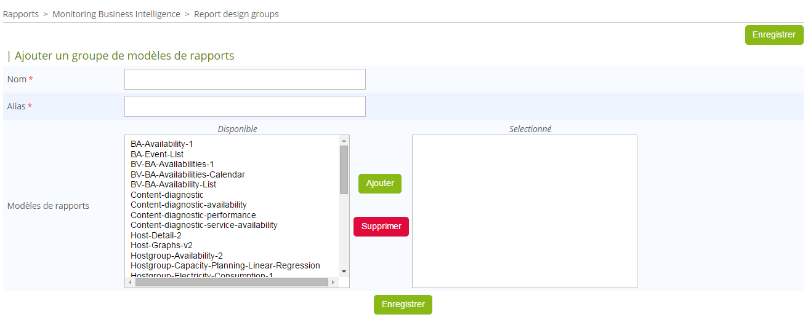

**Légende:** Formulaire d'ajout d'un groupe de modèle de rapports.

Description des champs du formulaire:

  Colonne               | Description
  ----------------------|------------------------------------------------------
  Name                  | Nom du groupe des modèles de rapports
  Description           |  Courte description du groupe des modèles de rapports
  Linked report designs | Les rapports rattachés au groupe

#### Menu d'actions

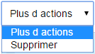

**Légende:** Les actions possibles sur les groupes de modèles de
rapports

  Action        | Description
  --------------|---------------------
  Delete        | Supprimer le groupe

## Logo

Vous pouvez stocker des images dans la configuration du module Centreon
MBI pour une réutilisation dans les rapports.

Pour chaque modèle de rapport utilisant des images ou logos, Un menu de
sélection est disponible au niveau des paramètres spécifiques du modèle
en question.

Peu importe la taille de l'image, le ratio doit être de 4,4 pour qu'il
corresponde à l'espace prévu pour l'image.

### Liste des logos

Le menu suivant liste toutes les images disponibles: `Reporting > Business Intelligence > Configuration > Logo`

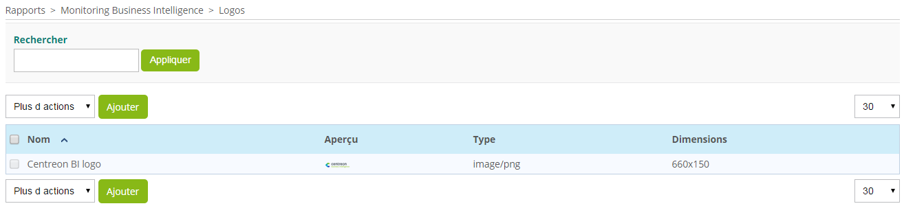

Description des colonnes:

  Colonne       |   Description
  --------------|-----------------------------------------------
  Name          | Nom de l'image
  Preview       | Affiche l'image chargée
  Type          | Le format de l'image. Les formats compatibles: PNG, JPEG, GIF
  Size          | Taille de l'image (largeur x hauteur)

### Ajouter / modifier

Pour ajouter une nouvelle image, cliquez sur "Add" et remplissez le
formulaire suivant:

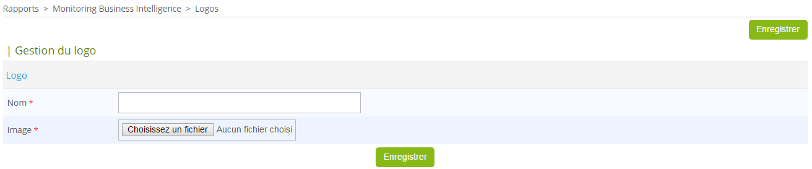

Description des champs:

  Colonne   | Description
  ----------|---------------------------------------------------------
  Name      | Nom de l'image. Les caractères spéciaux sont interdits.
  Image     | Fichier source relatif à l'image

> Les images utilisées comme "front page logo" ne doivent pas dépasser
> 160 pixels en largeur. Celles utilisées comme logo de la master page ne
> doivent pas dépasser les 45 pixels en hauteur.

#### Menu d'actions

Le menu suivant permet de supprimer les images selectionnées. Cepedant,
les images déjà liées à une tâche de génération de rapport ne peuvent
être supprimées.

## Corbeille

Lors d'une suppression d'un élément (modèle de rapport,tâche
planifiée, rapport), et par mesure de sécurité, ce dernier sera placé
dans la corbeille avant d'être physiquement supprimé du serveur.
L'accès à la corbeille se fait dans le menu suivant:

*Reportinng > Business Intelligence > Administration > Trash*

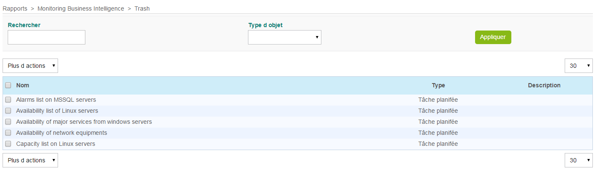

Voici les propriétés de la corbeille:

-   Tant que l'élément est placé dans la corbeille, il n'apparaitra
    dans aucun autre menu.
-   Si le rapport est présent dans la corbeille, l'ordonnoncement
    relatif à cet objet s'arrête
-   La suppression d'un modèle de rapport ou d'une tâche planifiée
    n'implique pas la suppression des rapports PDF liés à ces modèles
    ou tâches.

Le menu d'action permet la restauration des éléments ainsi que leur
suppression définitive du disque.

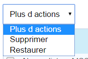

#### Filtres de recherche

Les filtres de recherches suivants facilitent la recherche d'un élément
dans la corbeille:

-   Le filtre "Search" permet de filtrer par nom.
-   Le filtre "Object type" permet de filtrer par type d'élément.

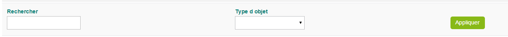
