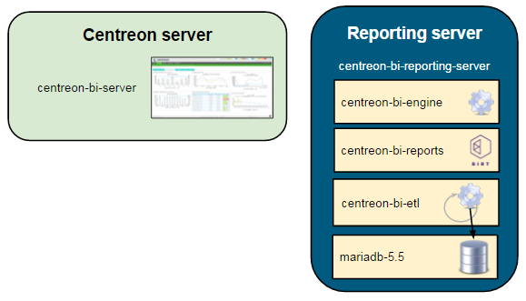
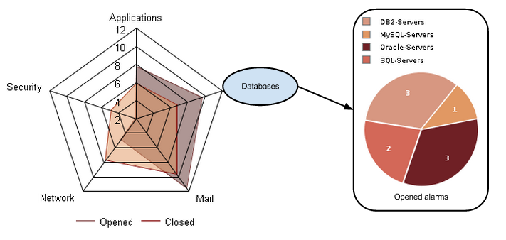
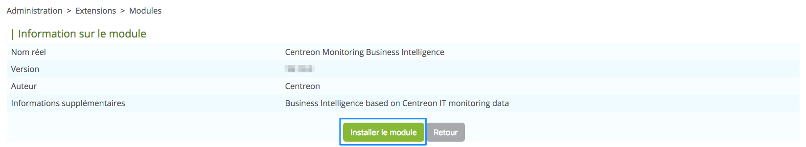

## Architecture

Ce chapitre présente l'architecture logicielle de l'extension **Centreon MBI**. Il
permet d'acquérir une compréhension de son intégration à la plateforme Centreon.

Ce document s'adresse aux administrateurs qui vont installer ou configurer Centreon MBI.

Dans ce chapitre, vous trouverez :

-   le diagramme d'architecture logicielle
-   le diagramme d'architecture des RPMs

### Une seule architecture possible : un serveur de reporting dédié à Centreon MBI

Cette architecture et les pré-requis présentés sont valables pour les
environnements suivant:

-   tests
-   production
-   pré-production

Le schéma ci-dessous met en avant les principaux composants de Centreon
MBI :


*La base de monitoring n\'est pas nécessairement sur le même serveur que
le serveur Centreon*

-   **ETL** : Mécanisme d\'extraction, calcul et chargement des données
    dans la base de données dediée reporting.
-   **CBIS** : Ordonnanceur gérant la génération et la publication
    automatique des rapports.
-   **Reporting database** : Base de données MySQL contenant les données
    de reporting et certaines données extraites de la base de
    monitoring.

Tableaux des flux réseau
------------------------

Dans le tableau ci-dessous, sont représentés les différents flux
présents entre le serveur de reporting dédié, le serveur Centreon et les
bases de données, par défaut.

  ---------------------------------------------------------------------------------------
  **Application**   **Source**        **Destination**           **Port**   **Protocol**
  ----------------- ----------------- ------------------------- ---------- --------------
  ETL/CBIS          Serveur de        Serveur de bases de       3306       TCP
                    reporting         données Centreon                     

  SSH               Serveur de        Serveur Centreon          22         TCP
                    reporting                                              

  CBIS              Serveur de        Serveur Centreon          80         HTTP\*
                    reporting                                              

  CBIS              Centreon          Serveur de reporting      1234       TCP

  Widgets           Serveur central   Serveur de reporting      3306       TCP
                    Centreon                                               
  ---------------------------------------------------------------------------------------

\**Uniquement nécessaire pour les rapports Host-Graph-v2 and
Hostgroup-Graph-v2*

Les RPMs de Centreon MBI
------------------------

L\'installation de Centreon MBI est basée sur deux paquets RPM :

-   **Centreon-bi-server :** Ce paquet installe l\'interface de Centreon
    MBI sur le frontend de Centreon. Ce paquet doit être installé sur le
    serveur web de Centreon.
-   **Centreon-bi-reporting-server** : Ce paquet contient tous les
    éléments composants le serveur reporting : moteur de génération de
    rapports, les rapports standards et l\'ETL. Il doit être installé
    sur un serveur dédié aux processus de reporting.

L\'installation du moteur de base de données doit être faite en même
temps. Nous conseillons fortement d\'installer la base MariaDB sur le
serveur de reporting pour des questions de performances & d\'isolation.

Ci-dessous le schéma représentant les paquets RPM installés pour
Centreon MBI. De nombreuses dépendances liées à ces paquets sont
installées mais ne sont pas représentées ici.




## Pré-requis 

Pré-requis : serveur Centreon
-----------------------------

**Logiciels**

  -------------- ---------
  Centreon Web   19.10.x

  -------------- ---------

::: {.note}
::: {.title}
Note
:::

\* Vérifiez que *date.timezone* est correctement configurée dans le
fichier /etc/opt/rh/rh-php71/php.ini (même que celui retourné par la
commande \"timedatectl status\") \* Evitez l\'utilisation des variables
ci dessous dans le fichier de configuration MySQL */etc/my.cnf *: Elles
arrêtent l'exécution des requêtes longues et ceci pourrait arrêter
l'exécution des ETL ainsi que la génération des rapports.

-   wait\_timeout
-   interactive\_timeout
:::

**Ajout d\'utilisateurs ou de groupes**

  ---------------------- ----------------------------
  Utilisateur            Groupe

  centreonBI (nouveau)   apache,centreon,centreonBI

  apache (existant)      centreonBI
  ---------------------- ----------------------------

**Description des utilisateurs, umask et répertoire utilisateur**

  ------------- ------- ------------------
  Utilisateur   umask   home

  centreonBI    0002    /home/centreonBI
  ------------- ------- ------------------

Pré-requis : serveur de reporting
---------------------------------

**Matériel**

+-------------------------------+----------------------+---------------+
| *Nombre de services           | *CPU*                | *Mémoire      |
| supervisés*                   |                      | Vive*         |
+===============================+======================+===============+
| \< 4 000                      | 2 CPU ( 3Ghz )       | 12Go minimum  |
|                               | minimum              |               |
+-------------------------------+----------------------+---------------+
| \< 20 000                     | 4 CPU (3GHz) minimum | 16 Go minimum |
+-------------------------------+----------------------+---------------+
| \>= 20 000 and \< 40 000      | 4 CPU (3GHz) minimum | 24 Go minimum |
+-------------------------------+----------------------+---------------+
| \>= 40 000 and \< 100 000     | 8 CPU (3GHz) minimum | 32 Go minimum |
+-------------------------------+----------------------+---------------+
| \> 100 000                    | > Contacter Cen      | treon         |
+-------------------------------+----------------------+---------------+

**Espace disque** :
`Utilisez le fichier suivant <doc/Centreon-MBI-QuickGuide-Storage-Sizing_EN.xlsx>`{.interpreted-text
role="download"}

**File system**

  ----------------- -----------------------------------------------------
  File system       Taille

  /                 5GB minimum

  /var (containing  utiliser le résultat du fichier de simulation de
  MySQL data)       l\'espace disque ci-dessus

  Dossier           Fortement recommandé de le positionner dans /var
  temporaire de     
  MySQL             

  Volume group\*    5G minimum d\'espace libre sur le **Volume groupe**
                    hébergeant les **données** MySQL/MariaDB.
  ----------------- -----------------------------------------------------

Pour controler l\'espace libre, utiliser la commande suivante en
remplaçant vg\_data par le nom du volume groupe:

>     vgdisplay vg_data | grep -i free*

**Logiciels**

  ------------ --------------------------------------------
  *OS*         CentOS 7 / Redhat 7

  *SGBD*       MariaDB 10.1.x

  *Firewall*   Désactivé

  *SELinux*    Désactivé
  ------------ --------------------------------------------

Dépendances automatiquement installées :

  ------------ -----------------
  *Java*       Openjdk \>= 1.7

  *Perl*       perl-DBD-MySQL
               perl-XML-LibXML
  ------------ -----------------

Veillez à optimiser MySQL sur votre serveur de reporting.Vous aurez
besoin d\'au moins 12GB de mémoire vive afin d\'utiliser le fichier
suivant : `centreon.cnf <doc/centreon.cnf>`{.interpreted-text
role="download"}. Veillez à créer un dossier *tmp* dans
*/var/lib/mysql/*.

::: {.warning}
::: {.title}
Warning
:::

N\'utilisez pas ce fichier d\'optimisation sur le serveur de
supervision.
:::

Ajout d\'utilisateurs ou de groupes :

  ------------- -------------
  Utilisateur   Groupe

  centreonBI    centreonBI
  ------------- -------------

Description des utilisateurs, umask et répertoire utilisateur :

  ------------- ------- ------------------
  Utilisateur   umask   home

  centreonBI    0002    /home/centreonBI
  ------------- ------- ------------------

License
-------

Pour utiliser Centreon MBI, vous devez récupérer une license.

La génération de cette license est faite par le support Centreon et se
base sur le *fingerprint* de la machine sur laquelle l\'interface
Centreon MBI est installé (le serveur Centreon central). Pour le générer
et le fournir au support, suivez les étapes suivantes :

Installer le binaire Centreon Fingerprint :

    # yum install centreon-fingerprint

Puis l\'executer

    # centreon-fingerprint

La clé retournée est à garder et fournir au support Centreon. La méthode
de mise en place de cette license est précisée dans la procédure
d\'installation.

Bonnes pratiques de supervision {#best_practices}
-------------------------------

### Qualité des plugins, données de performance et de capacité

Pour être en mesure d\'avoir des rapports sur les données de performance
en utilisant les rapports par défaut de Centreon MBI, vous devez au
moins superviser quelques indicateurs de performance de base
(métriques) :

-   CPU : doit retourner un pourcentage d\'une ou plusieurs métriques
    (cpu\_total, cpu\_sys, cpu\_1 \...) et 100 comme valeur maximum.
-   Memory : doit retourner au moins une métrique comportant ces
    informations :
    -   L\'utilisation mémoire : Cette valeur doit être en octets
    -   Le seuil d\'alerte d\'utilisation mémoire
    -   Le seuil critique d\'utilisation mémoire
    -   La mémoire totale allouée en octet 

> Le plugin utilisé pour superviser cet indicateur doit renvoyer la
> sortie suivante:
>
> >     *any status information* | **$metric_name=$value$unit;$warning_threshold;critical_threshold;$min_value;$max_value**

-   Utilisation d\'espace disque: Deux types de service possibles :
    -   Superviser une partition par service (les métriques sont souvent
        nommées « used » et « size »
    -   Superviser plusieurs partitions par service et chaque métrique
        correspond au nom d\'une partition.

> Dans les deux cas, les données de performance renvoyées par les
> plugins doivent correspondre à ce format :
>
> >     *any status information* | **$metric_name=$value$unit;$warning_threshold;$critical_threshold;$min_value;$max_value**

-   Données de trafic : les rapports standards utilisent une metrique
    pour le trafic entrant et une metrique pour le trafic sortant. Pour
    être compatible, vos plugins doivent renvoyer également deux
    métriques (peu importe leurs noms). Il est également important que
    pour chaque métrique, la valeur maximum atteignable soit présente.
    Le format du plugin est donc le même que conseillé ci-dessus :

>     *any status information* | **$inboundTrafic=$value$unit;$warning_threshold;$critical_threshold;$min_value;$max_value $outBoundTrafic=...**

### Unité par défaut

Il est important de s\'assurer que les unités des données renvoyées par
les plugins soient communes à tous les services pour un même type de
données. Nous conseillons donc fortement de vérifier que les plugins
renvoient les données dans les unités suivantes :

-   Temps: secondes
-   Trafic: bits/sec
-   Stockage: Octets
-   Mémoire/Swap: Octets

Bonnes pratiques de configuration des objets Centreon {#centreon_best_practices}
-----------------------------------------------------

Chaque modèle de rapport dans Centreon MBI prend en compte plusieurs
paramètres qui permettent de générer des rapports adaptés à vos besoins.

Plusieurs types de paramètres sont disponibles pour chaque modèle :

-   Un objet principal sur lequel le rapport est généré. Cela peut
    être :
    -   Un hôte
    -   Un groupe d\'hôtes : groupe fonctionnel défini dans Centreon
        afin de classer les hôtes par client, application, domaine
        d\'activité stratégique, pays, ...
    -   Plusieurs groupes d\'hôtes
-   Une période temporelle (ou « plage horaire » ) sur laquelle les
    statistiques seront calculées.
-   Des filtres pour prendre en compte seulement des types spécifiques
    d\'équipements, des services ou des métriques dans les groupes
    d\'hôtes sélectionnés :
    -   Catégories d\'hôtes : Permet de classer les hôtes dans des
        groupes techniques afin de déterminer le type ou la fonction
        d\'un hôte ; Par exemple : serveurs Linux, serveurs Windows,
        routeurs cisco, imprimantes, ...
    -   Catégories de services : Permet de définir le type d\'un service
        : CPU, mémoire, stockage, ...
    -   Métriques : Données de performances collectées par les services
        (indicateurs de supervision). Un service de supervision peut
        collecter plusieurs métriques. Cependant les noms des métriques
        et les unités ne sont pas normalisés (par exemple : un service
        de type CPU peut collecter seulement une métrique nommée
        \'cpu\_average\' définie en pourcentage et un autre service de
        type CPU peut collecter une métrique par cœur de processeur
        configuré dans l\'équipement), il est donc nécessaire, à la
        génération du rapport, de sélectionner les métriques à prendre à
        compte pour le calcul des statistiques.

### Groupes d\'hôtes et catégories

Les définitions des groupes d\'hôtes et des catégories listées
ci-dessous sont données à partir des bonnes pratiques établies par
Centreon.

Cependant, les groupes et les catégories que vous allez créer doivent
correspondre à vos besoins.

Exemple :

Si vous avez besoin de mettre en évidence le nombre d\'alertes générées
par domaines d\'activité de votre SI avec une répartition par type
d\'équipement, il sera nécessaire de définir des groupes et et des
catégories d\'hôtes de la manière suivante :

-   Groupe d\'hôtes : **Databases**, Applications, Security, Network,
    Mail \...
-   Catégorie d\'hôtes : DB2-Servers, MySQL-Servers, Oracle-Servers,
    SQL-Servers \...

Voici un exemple de statistiques que vous pourriez obtenir en utilisant
ces groupes et catégories :



Le groupe d\'hôte est le premier axe d\'analyse. La catégorie d\'hôte
permet d\'analyser les statistiques en sous-domaines.

De la même manière, nous pouvons analyser les statistiques en se basant
sur les dimensions suivantes :

-   Par pays (groupe d\'hôte) avec une répartition des données par type
    d\'équipement réseau (catégorie d\'hôtes)
-   Par pays (groupe d\'hôte) avec une répartition des données par
    client (catégorie d\'hôte)
-   Par client (groupe d\'hôte) avec une répartition des données par
    pays (catégorie d\'hôte)
-   Par client (groupe d\'hôte) avec une répartition des données par
    serveur d\'application (catégorie d\'hôte)
-   \...

Il n\'existe pas de règles standards pour définir des groupes d\'hôtes
ou des catégories. Cela doit être adapté à vos besoins.

**Comment créer ces catégories et groupes?**

-   La relation entre les hôtes et les groupes d\'hôtes est faite à
    partir du menu *Configuration \> Hosts \> Host groups* sur
    l\'interface de Centreon. Il est également possible d\'utiliser
    l\'onglet *Relation* présent dans le formulaire
    d\'ajout/modification d\'un hôte.
-   La relation entre un hôte et une catégorie d\'hôte est faite à
    partir du menu *Configuration \> Hosts \> Categories* sur
    l\'interface de Centreon. Il est également possible d\'utiliser
    l\'onglet *Relation* présent dans le formulaire
    d\'ajout/modification d\'un hôte.

### Catégories de Service

Les catégories de services permettent d\'organiser les services
(indicateurs de supervision) en sous-domaines. L\'usage le plus commun
des catégories de services est de définir des catégories basées sur des
types de services : CPU, mémoire, stockage, processus Oracle, DNS,
processus Websphere, ...

Ce genre de configuration permet, par exemple, de :

-   Comparer le nombre d\'alertes générées pour chaque type de services
-   Sélectionner la catégorie de service qui indique l\'utilisation
    d\'espace disque quand vous souhaitez générer un rapport de
    capacité.

**Comme les groupes d\'hôtes et les catégories d\'hôtes, les catégories
de service doivent être définies selon vos besoins.**

Par exemple : Si vous avez besoin d\'analyser l\'espace disque alloué et
utilisé par un SGDB ou par un type d\'application, vous devez créer
plusieurs catégories de services. A la place d\'utiliser une seule
catégorie nommée « Stockage » ou « Disque » nous aurons :

-   « Operating system » : contenant les espaces de stockage de type
    système
-   « Oracle » : contenant les espaces de stockage des serveurs Oracle
-   « SQL Server » : les espaces de stockage des serveur SQL

Voici un exemple de statistiques que vous pourriez obtenir en utilisant
ces catégories de services :


La relation entre les services et leurs catégories peut être faite à
partir de menu *Configuration \> Services \> Categories* sur
l\'interface de Centreon. Il est également possible d\'utiliser
l\'onglet *Relation* présent dans le formulaire d\'ajout/modification
d\'un service.

::: {.note}
::: {.title}
Note
:::

Il est fortement conseillé de gérer les catégories de service en
utilisant uniquement les modèles de services.
:::


## Centreon MBI Server (Interface)

Les actions listées dans ce chapitre doivent être lancées sur le serveur
de supervision Centreon.

Contactez le Centre de service de Centreon afin d\'obtenir les
repository de Centreon MBI.

Installation via les paquets RPM
--------------------------------

Lancez la commande suivante : :

    yum install centreon-bi-server

### Alternative : Installation via les paquets sources

::: {.warning}
::: {.title}
Warning
:::

Suivez la procédure en utilisateur « root ».
:::

Décompressez le paquet et lancez l\'installation : :

    tar zxf centreon-bi-server-18.10.0-php71.tar.gz
    cd ccentreon-bi-server-18.10.0-php71/
    ./install -i

Licence
-------

Le fichier de licence \"mbi.license" est fourni par Centreon, pour
l\'installer, rendez vous dans **Administration \> Extensions** puis
télécharger la via l\'interface.

Installation de Centreon MBI
----------------------------

Le menu \" **Administration \> Extensions** \" de Centreon permet
d\'installer les différents modules détectés par Centreon. Une ligne
doit référencer **Centreon MBI**. Cliquez sur l\'icône de la colonne
"Actions" afin d\'activer le module.

La page suivante (avec la bonne version) sera affichée, cliquez sur
*Installer le module* :



Une page d\'information informe qu\'aucune procédure supplémentaire
n\'est à effectuer avant ou après l\'installation. Cliquez sur *Retour*.

Options générales
-----------------

Renseignez les valeurs suivantes dans les options générales de Centreon
MBI, menu *Rapports \> Monitoring Business Intelligence \> Options
Générales* :

  ------------------------------------------------------------------------------
  Tab               Option                     Value
  ----------------- -------------------------- ---------------------------------
  Options de        Hôte de CBIS               Adresse IP du serveur de
  l\'ordonnanceur                              reporting

  Options de l\'ETL Une base de données MySQL  Oui
                    dédiée au reporting a été  
                    mise en place.             

  Widgets de        Reporting MySQL database   Adresse IP de la base de
  reporting\*                                  reporting (par défaut = adresse
                                               IP du serveur de reporting)
  ------------------------------------------------------------------------------

\* *Le test de connexion ne fonctionnera pas encore à ce moment de
l\'installation*

Configuration de l\'accès à la base de monitoring à partir du serveur de reporting
----------------------------------------------------------------------------------

### Cas\#1 : La base MySQL de monitoring est hébèrgée sur le même serveur que le serveur Central Centreon

Lancez la commande ci dessous pour autoriser le serveur de reporting à
se connecter aux bases de données du serveur de supervision.

-   **\@ROOTPWD@ :** Mot de passe root du serveur MySQL du serveur de
    supervision. Si il n\'y a pas de mot de passe root, ne spécifiez pas
    l\'option \"root-password\".

>     /usr/share/centreon/www/modules/centreon-bi-server/tools/centreonMysqlRights.pl --root-password=@ROOTPWD@

### Cas2\# La base MySQL de monitoring est hébergée sur un serveur dédié

Connectez vous en SSH sur le serveur de base de données, et lancez les
commandes suivantes : :

    mysql -u root -p
    mysql> CREATE USER 'centreonbi'@'$BI_ENGINE_IP$' IDENTIFIED BY 'centreonbi';
    mysql> GRANT ALL PRIVILEGES ON centreon.* TO 'centreonbi'@'$BI_ENGINE_IP$';
    mysql> GRANT ALL PRIVILEGES ON centreon_storage.* TO 'centreonbi'@'$BI_ENGINE_IP$';

-   **\$BI\_ENGINE\_IP\$ :** Adresse IP du serveur de reporting

::: {.warning}
::: {.title}
Warning
:::

Si vous utilisez une réplication MySQL pour vos bases de données de
**monitoring**, lors de l\'installation de Centreon MBI, des vues sont
créées. Il faut les exclure de la réplication en rajoutant la ligne
suivante dans le fichier my.cnf du slave

replicate-wild-ignore-table=centreon.[mod\_bi]()%v01,centreon.[mod\_bi]()%V01

puis créer les vues sur le slave en lançant la commande:

> \# mysql centreon \<
> `view_creation.sql <doc/view_creation.sql>`{.interpreted-text
> role="download"}
:::

Allez au chapitre suivant pour continuer l\'installation.


## Centreon MBI Reporting Server

Ce chapitre aborde l\'installation du serveur de reporting.

Lors de ce chapitre, vous aurez besoin des informations suivantes,
veillez à les connaître avant de commencer :

-   IP/DNS de la base de monitoring
-   IP/DNS de l\'interface de Centreon
-   IP/DNS de la base de reporting (localhost fortement recommandé)
-   accès (user/password) aux bases de données de monitoring & reporting
-   définir puis récupérer le mot de passe ssh de l\'utilisateur
    centreonBI, sur le serveur Central (pour la mise à disposition des
    rapports générés sur l\'interface)

Installation
------------

    yum install centreon-bi-reporting-server MariaDB-server MariaDB-client

Dans le cas d\'une installation basée sur une image CentOS vierge,
installez la clé GPG : :

    cd /etc/pki/rpm-gpg/
    wget http://yum.centreon.com/standard/18.10/el7/stable/RPM-GPG-KEY-CES

Configuration du serveur de reporting
-------------------------------------

### Optimisations MySQL

Assurez vous que le fichier de configuration optimisé fourni dans les
pré-requis est bien présent dans */etc/my.cnf.d/*,
(`centreon.cnf <doc/centreon.cnf>`{.interpreted-text role="download"})
puis redémarrez le service MySQL

    # systemctl restart mysql

Pour les systèmes **CentOS / RHEL en version 7**, il est nécessaire de
modifier la limitation **LimitNOFILE**. Changer cette option dans
/etc/my.cnf NE fonctionnera PAS.

    # mkdir -p  /etc/systemd/system/mariadb.service.d/
    # echo -ne "[Service]\nLimitNOFILE=32000\n" | tee /etc/systemd/system/mariadb.service.d/limits.conf
    # systemctl daemon-reload
    # systemctl restart mysql

Si le service MySQL échoue lors du démarrage, supprimer les fichiers
*ib\_logfile* (MySQL doit absolument être stoppé) puis redémarrer à
nouveau MySQL:

    # rm -f /var/lib/mysql/ib_logfile*
    # systemctl start mysql

Si vous utilisez un fichier de socket spécifique pour MySQL, modifiez le
fichier /etc/my.cnf et dans la section \[client\], ajoutez :

    socket=$PATH_TO_SOCKET$

### Installation et configuration du serveur de reporting

Vérifiez que le MySQL de reporting est bien démarré puis lancez les
commandes ci dessous et répondez aux questions:

    /usr/share/centreon-bi/config/install.sh

Le script effectue l\'échange de clés ssh entre le serveur de
supervision et le serveur de reporting, et configure la règle de
publication sftp standard pour pouvoir publier les rapports sur le
Centreon Web. Enfin, il active les backup et démarre le service cbis.

Une fois l\'installation terminée, poursuivez au chapitre suivant pour
configurer l\'ETL.


## ETL Centreon MBI : Configuration {#etl_configuration}

Centreon MBI intègre un ETL qui permet de :

-   Synchroniser les données brutes de la supervision vers le serveur de
    reporting
-   Alimenter les bases de données du serveur de reporting avec les
    données statistiques
-   Contrôler la rétention des données sur le serveur de reporting

Avant de passer aux étapes suivantes, il est nécessaire de lire le
chapitre `centreon_best_practices`{.interpreted-text role="ref"} afin de
vous assurer que la configuration des objets dans Centreon (groupes,
categories\...) est conforme aux attentes de Centreon MBI.

Dans le menu « Rapports \> Monitoring Business Intelligence \> General
Options \> Options de l ETL »  de Centreon, spécifiez les options
suivantes :

+-----------------------------+----------------------------------------+
| **Option**                  | **Value**                              |
+=============================+========================================+
| **General options**         |                                        |
+-----------------------------+----------------------------------------+
| Reporting engine uses a     | Oui. Vous **devez** avoir un serveur   |
| dedicated MySQL server      | de reporting dédié.                    |
+-----------------------------+----------------------------------------+
| Compatibility mode to use   | Non (cette option gère la              |
| report templates from       | compatibilité des rapports installés   |
| version of Centreon MBI     | avec les versions précédentes de       |
| prior to 1.5.0              | Centreon MBI)                          |
+-----------------------------+----------------------------------------+
| Type of statistics to build | -   Sélectionnez « Disponibilité       |
|                             |     uniquement » si vous utilisez      |
|                             |     uniquement les rapports de         |
|                             |     disponibilité .                    |
|                             |                                        |
|                             | \* Sélectionnez « Performance et       |
|                             | capacité uniquement» si vous souhaitez |
|                             | utiliser uniquement les rapports de    |
|                             | capacité et de performance \*          |
|                             | Sélectionnez «Tous» afin de calculer   |
|                             | les statistiques pour les deux types   |
|                             | de rapports.                           |
+-----------------------------+----------------------------------------+
| Use large memory tweaks     | Activé uniquement si votre             |
| (store MySQL temporary      | configuration MySQL et la mémoire      |
| tables in memory)           | physique allouée au serveur de         |
|                             | reporting le permet.                   |
+-----------------------------+----------------------------------------+
|                             |                                        |
+-----------------------------+----------------------------------------+
| **Reporting perimeter       |                                        |
| selection**                 |                                        |
+-----------------------------+----------------------------------------+
| Hostgroups                  | Sélectionnez les groupes d\'hôtes pour |
|                             | lesquels vous souhaitez conserver les  |
|                             | statistiques.                          |
+-----------------------------+----------------------------------------+
| Hostcategories              | Sélectionnez les catégories d\'hôtes   |
|                             | pour lesquels vous souhaitez conserver |
|                             | les statistiques.                      |
+-----------------------------+----------------------------------------+
| Service categories          | Sélectionnez les catégories de         |
|                             | services pour lesquels vous souhaitez  |
|                             | conserver les statistiques.            |
+-----------------------------+----------------------------------------+
|                             |                                        |
+-----------------------------+----------------------------------------+
| **Availability statistic    |                                        |
| calculation**               |                                        |
+-----------------------------+----------------------------------------+
| Live services for           | Plages horaires (time periods) pour    |
| availability statistics     | lesquelles les calculs de              |
| calculation                 | disponibiltié des hôtes et des         |
|                             | services sont réalisées                |
+-----------------------------+----------------------------------------+
|                             |                                        |
+-----------------------------+----------------------------------------+
| **Performance and capacity  |                                        |
| statistic calculation**     |                                        |
+-----------------------------+----------------------------------------+
| Granularity required for    | Sélectionnez le ou les niveaux de      |
| performance data statistics | granularité pour le calcul des données |
|                             | de performance **(1)**                 |
+-----------------------------+----------------------------------------+
| Live services for           | Plages horaires sur les jours de la    |
| performance data statistics | semaine pris en compte dans le calcul  |
| calculation                 | des données de capacité et de          |
|                             | performance                            |
+-----------------------------+----------------------------------------+
|                             |                                        |
+-----------------------------+----------------------------------------+
| **Capacity statistic        |                                        |
| agregated by month**        |                                        |
+-----------------------------+----------------------------------------+
| Live services for capacity  | Selectionnez la plage horaire 24x7.    |
| statistics calculation      |                                        |
+-----------------------------+----------------------------------------+
| Service categories related  | Sélectionnez les catégories de         |
| to capacity data monitoring | services ayant été rattachés à des     |
|                             | services de type capacité              |
+-----------------------------+----------------------------------------+
| Exclude metrics from        | Concerne uniquement les métriques      |
| service categories that     | liées aux services qui renvoient une   |
| does not return a capacity  | information de capacité. Sélectionnez  |
| USAGE information           | uniquement les métriques qui donnent   |
|                             | **une valeur maximale ou une valeur    |
|                             | totale de capacité** et non une valeur |
|                             | d\'utilisation. (exemple, la métrique  |
|                             | \"\*\* size \*\*\" returnée par le     |
|                             | plugins                                |
|                             | che                                    |
|                             | ck\_centreon\_snmp\_remote\_storage ») |
+-----------------------------+----------------------------------------+
|                             |                                        |
+-----------------------------+----------------------------------------+
| **Centile Parameters**      |                                        |
+-----------------------------+----------------------------------------+
| Calculating centile         | Selectionnez la granularité des        |
| agregation by               | calculs. Le rapport de trafic fourni   |
|                             | en standard avec BI 2.1 utilise les    |
|                             | données au Mois.                       |
+-----------------------------+----------------------------------------+
| Select service categories   | Selectionnez uniquement les catégories |
| to agregate centile on      | de services pertinente (Ex: Traffic)   |
+-----------------------------+----------------------------------------+
| First day of the week       | Selectionnez le premier jour à         |
|                             | considérer pour les statistiques à la  |
|                             | semaine                                |
+-----------------------------+----------------------------------------+
| Centile / Timeperiod        | Créez des combinaisons centile/plage   |
| combination                 | horaire sur lesquels les statistiques  |
|                             | seront effectuées                      |
+-----------------------------+----------------------------------------+

**(1)** Les rapports nécessitant une granularité des données à l\'heure
sont listés ci-dessous. Si vous ne souhaitez pas utiliser ces rapports,
désactivez le calcul des statistiques à l\'heure:

-   Hotsgroup-Host-details-1
-   Host-detail-v2
-   Hostgroup-traffic-Average-Usage-By-Interface
-   Hostgroup-traffic-by-Interface-And-Bandwith-Ranges


## Rétention de données {#retention}

Le serveur de reporting contient des données de statistiques dans des
tables spécifiques à Centreon MBI. Ces données sont stockées dans la
base de données *centreon\_storage*.

L\'espace utilisé par ces tables augmentera de jour en jour; il est
possible de contrôler la volumétrie de ces données en configurant des
règles de rétention.

Dans le menu :*Reporting \> Monitoring Business Intelligence \> Options
générales \> Options de rétention des données* la rétention peut être
gérée par:

-   type de données (disponibilité ou performance)
-   granularité des données (données brutes de la supervision, données
    agrégées par heure, jour ou mois)

::: {.note}
::: {.title}
Note
:::

Avant d\'activer la rétention de données, vérifier que l\'option *Une
base de données mySQL dédiée au reporting a été mise en place* est
configurée à \"Oui\" dans le menu : *Rapports \> Monitoring Business
Intelligence \> Options générales \> Options de l ETL*
:::

Activez la rétention de données en cochant \"Yes\" puis paramétrez les
différents options de configuration.


Pour activer la purge automatique des données, éditez le cron
*/etc/cron.d/centreon-bi-purge* sur le serveur de reporting puis
dé-commentez la ligne suivante: :

    0 20 * * * root @CENTREON_BI_HOME@/etl/dataRetentionManager.pl >> @CENTREON_BI_LOG@/dataRetentionManager.log 2>&1

::: {.warning}
::: {.title}
Warning
:::

Évitez les périodes pendant lesquelles les calculs de statistiques avec
l\'ETL Centreon MBI et la génération des rapports sont programmés.
:::

Il est possible d'exécuter le cron de manière journalière ou
hebdomadaire, cela dépendra de la charge générée par la purge des
données sur votre serveur de reporting.

Redémarrez le service cron: :

    systemctl restart crond

**BONNES PRATIQUES**: Sélectionnez différentes périodes de rétention en
fonction de la granularité des données statistiques:

-   Les données agrégées par heure sont souvent exploitées afin
    d\'analyser des métriques sur une période proche. Il n\'est pas
    nécessaire de conserver ces données sur plusieurs mois;
-   Au delà de 5 ou 6 mois, vous auriez probablement besoin de voir la
    tendance de la disponibilité et des statistiques de performances. Il
    serait donc envisageable de conserver au plus 6 mois les données
    agrégées par jour et configurer une rétention des données agrégées
    au mois sur plusieurs dizaines de mois.

Passez à la section suivante pour continuer l\'installation.


## ETL Centreon MBI : Execution {#etl_execution}

::: {.warning}
::: {.title}
Warning
:::

Avant d\'aller plus loin, assurez vous d\'avoir positionné les
optimisations MySQL fournis dans les pré-requis. Assurez vous également
d\'avoir configuré la rétention des données et de l\'avoir activée afin
de ne récupérer et calculer que les données dont vous avez besoins.
:::

Reconstruire les statistiques en utilisant les données historiques
------------------------------------------------------------------

La commande qui suit, à exécuter sur le serveur de *REPORTING*, aura
pour effet de :

-   Supprimer les données existantes sur la base de reporting
-   Importer les données brutes à partir de la base de données de
    supervision, en utilisant les paramètres de retention
-   Alimenter les tables qui contiennent les informations de
    disponibilité des équipements et des services
-   Alimenter les tables qui contiennent les informations de performance
    et de capacité des équipements et des services

```{=html}
<!-- -->
```
    /usr/share/centreon-bi/bin/centreonBIETL -r

Activer l\'exécution journalière {#daily_cron}
--------------------------------

Une fois que la reconstruction des données est terminée, il faut activer
l\'exécution journalière du script. Pour cela, sur le serveur de
reporting, éditez le fichier « /etc/cron.d/centreon-bi-engine » et
dé-commentez la ligne suivante : :

    30 4 * * * root /usr/share/centreon-bi/bin/centreonBIETL -d >> /var/log/centreon-bi/centreonBIETL.log 2>&1

Redémarrez le service cron sur le serveur de reporting : :

    systemctl restart crond

::: {.note}
::: {.title}
Note
:::

Verifiez que le batch *centreonBIETL* commence une fois que le batch
*eventReportBuilder* est terminé sur le serveur de monitoring (vérifiez
les heures dans le cron */etc/cron.d/centreon*).
:::

La configuration de votre installation de Centreon MBI est terminée.
