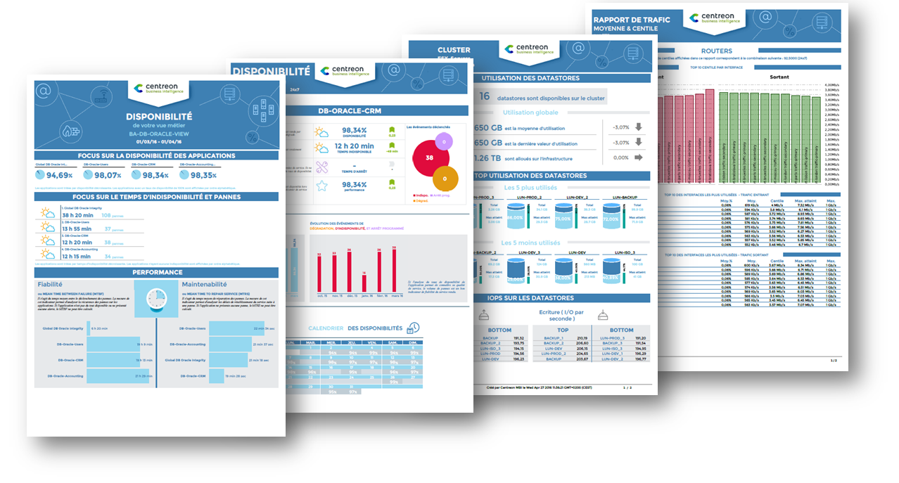

## Reporting complet: Centreon MBI

La fonctionnalité de "Reporting" de Centreon se base sur l'extension appellée 
"Centreon Monitoring Business Intelligence" (Centreon MBI)

Une fonctionnalité de reporting est également disponible dans la version open source de Centreon. Plus d'information ci-dessous

> Centreon MBI est une **extension** Centreon qui requiert une license valide. Pour plus d'information,
> contactez [Centreon](mailto:sales@centreon.com).

Centreon Monitoring Business Intelligence est une solution d'aide à la
décision et facilite la gestion de votre infrastructure IT. Centreon MBI
vous apporte une visibilité complète sur vos infrastructures et vos
activités avec un reporting aux normes ITIL  sur les évènements, les 
compteurs de performances ainsi que les données de capacité provenant de Centreon.

Vous pouvez suivre la santé de votre SI grâce à de nombreux modèles de
rapports paramétrables

Centreon MBI fournit un ensemble complet de rapports standards sur:

-   La gestion de capacité
-   La gestion de disponibilité
-   La gestion des niveaux de services (SLA : Service Level Agreement)
    management
-   La gestion des performances

**Voici quelques exemples de rapports disponibles dans Centreon MBI** : [Exemple de rapports](../assets/reporting/Centreon-MBI-Samples-of-Reports.pdf)

Et également grâce à de nombreux widgets de reporting exploitables
directement sur Centreon

Principales fonctionnalités:

-   Planification et génération des rapports aux formats PDF, Excel,
    Word et PPT
-   Visualisation web & interactive des statistiques grâce aux widgets
    fournis exploitables directement sur Centreon
-   Publication des rapports par email et par d\'autres protocoles
    standards (FTP, CIFS, ...)
-   Gestion des listes de contrôle d'accès
-   Interface d'administration et d'exploitation intégrée dans
    Centreon
-   Bibliothèques de développement de rapports

## Reporting simple

Les rapports de disponibilités des objets accessibles via l'interface web Centreon 
permettent de visualiser de manière intuitive le taux de disponibilité d'un hôte, 
d'un groupe d'hôtes ou d'un groupe de services sur une période de temps donnée.

Pour visualiser le rapport de disponibilité d'un 'hôte :

- Rendez-vous dans le menu **Rapports > Tableau de bord**
- Dans le menu de gauche, sélectionnez **Hôte**
- Sélectionnez l'hôte désiré dans la liste déroulante **Hôte**

* La liste **Période de génération** permet de choisir la période de temps sur laquelle on souhaite visualiser le taux de disponibilité. Il est possible de sélectionner une période prédéfinie via la liste déroulante ou de sélectionner manuellement sa période en définissant les champs **Du** et **Au**
* Le tableau **Etat de l'hôte** permet de visualiser le taux et la durée de disponibilité associé par état de l'objet
* Le tableau **Statuts des éléments du rapport** permettent de visualiser la disponibilité des services associés à l'hôte suivant leurs statuts  
* La frise chronologique permet de visualiser de manière intuitive le statut de l'objet au court du temps

De plus, en cliquant sur une journée de la frise chronologique, vous obtenez le rapport de la journée :

Il est également possible de visualiser des rapports web pour :

- Les groupes d'hôtes : Cliquez sur **Groupes d'hôtes** dans le menu de gauche
- Les groupes de services : Cliquez sur **Groupes de services** dans le menu de gauche

L'icône CSV permet d'exporter les données du rapport au format CSV.

> Cliquez sur le service d'un hôte dans le rapport de disponibilité de l'hôte pour obtenir un rapport détaillé du service.