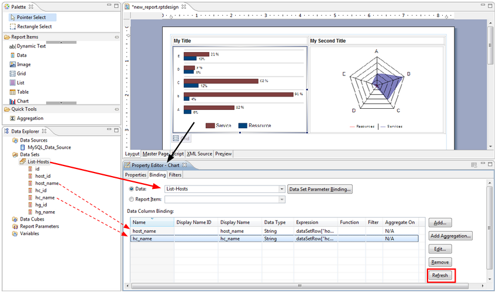
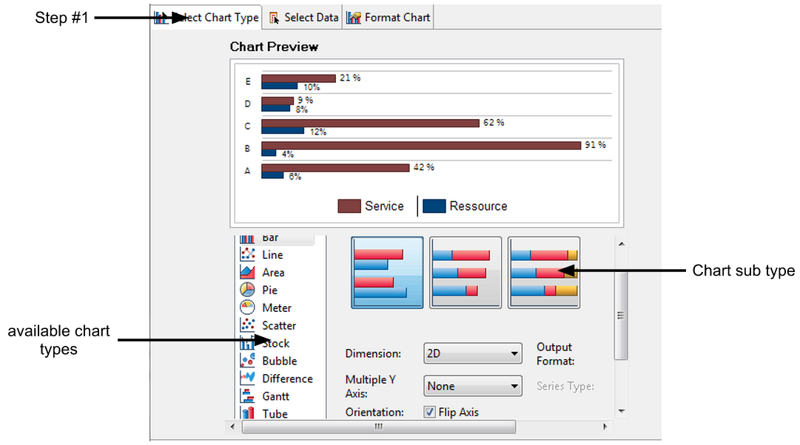
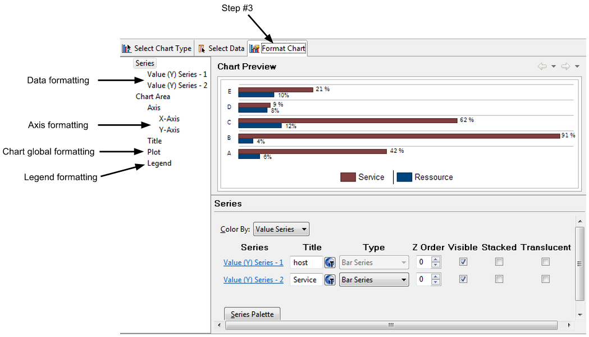
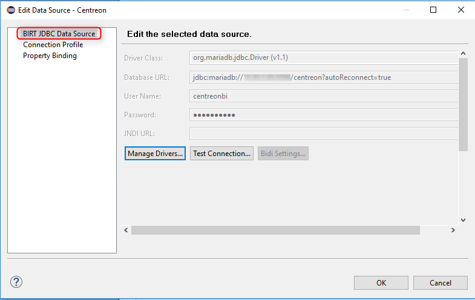
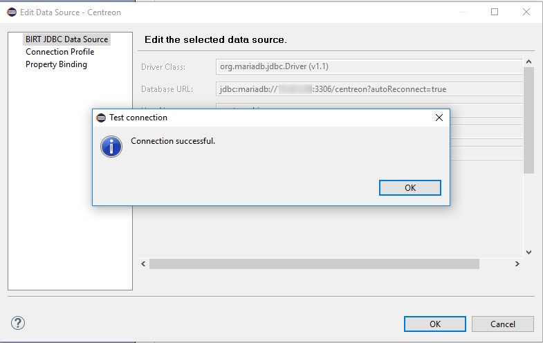
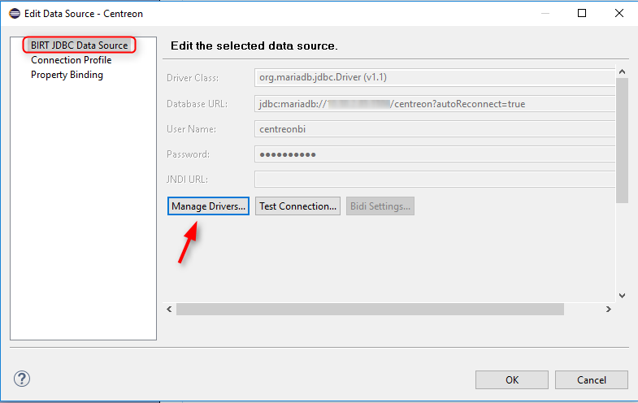

Compatibilité : BIRT 4.4.2

Ce guide a pour but de présenter les bonnes pratiques sur la mise en
place d'un projet de reporting BIRT. Cette documentation s'adresse à
des profils techniques qui souhaitent développer des rapports avec BIRT
et Centreon MBI. Des connaissances en langage SQL sont requises. Dans ce
guide vous trouverez :

-   Les principaux concepts de BIRT
-   Les différentes étapes de création d'un projet de rapport sous BIRT

Cette documentation ne décrit pas la réutilisation des bibliothèques de
développement de Centreon MBI.

BIRT est un outil de création de rapport. Il permet de :

-   S'interconnecter à des sources de données multiples
-   Extraire des données pertinentes à partir de ces sources
-   Présenter visuellement ces données


BIRT vous permet de visualiser vos données métiers dans des tableaux ou
des graphiques statistiques. Même si BIRT permet de connecter
différentes sources de données dans le même rapport, cette utilisation
n'est pas recommandée dans le cadre de calculs complexes ou
d'agrégations. Dans ces situations, l'utilisation d'un ETL (Extract
Transform Load) est plus adaptée.

Cette documentation aborde uniquement les concepts BIRT ainsi que le
développement de rapports (la zone bleue dans le schéma ci-dessus).


## Concepts de BIRT

### Les sources de données "Data sources"

La conception d'un rapport peut nécessiter plusieurs sources de données
issues de différents systèmes de stockage et accessibles par différents
protocoles :

-   Fichiers plats (CSV)
-   sources de données JDBC (MySQL, ...)
-   documents XML
-   services Web

BIRT vous permet aussi de développer vos propres sources de données
alimentées par des objets Java ou Javascript.

Cependant, il est fortement recommandé de collecter, consolider et
stocker vos données de reporting dans un seul type de sources de données
(source de données MySQL par exemple, avec peut-être plusieurs
connexions à la base de données). Multiplier les sources de données dans
un rapport entraînera des problèmes de performances et de
maintenabilité. Il est conseillé d'utiliser au maximum deux types de
sources de données différents dans le même projet de reporting BIRT (par
exemple : JDBC et CSV).

Configuration d'une source de données:


### Les jeux de données "Data sets"

Vous avez la possibilité d'extraire des échantillons de données d'une
base de données ou d'un important fichier CSV. Le « data set » BIRT
vous permet de sélectionner des données spécifiques depuis des sources
de données plus ou moins complexes.

Les différents « data sets » propres à un rapport contiennent toutes les
données nécessaires pour construire les éléments visuels du rapport
(tableaux, graphiques,...).


### Liens de données "Data binding"

Une fois les « data sets » créés, les données doivent être formatées
dans le rapport. Pour obtenir un graphique ou un tableau contenant des
données, il est nécessaire de réaliser un lien de données entre un "data
set" et un composant graphique qui peut être un tableau ou un objet
graphique.

Le lien de données copiera la structure du « data set » dans la
configuration du composant visuel présenté dans le rapport. Il n'est
pas nécessaire de copier la structure complète d'un « data set »,
seules les colonnes nécessaires peuvent être copiées. Le lien de données
est réalisé lors de l'ajout d'un nouveau composant :


Si la structure du « data set » est modifiée, il est nécessaire de
mettre à jour manuellement la structure du composant graphique pour
appliquer les modifications.



### Paramètres du rapport

Les paramètres de rapports sont des variables globales spécifiques à
chaque rapport. Initialisées juste avant la génération du rapport, ils
permettent de faire varier le contenu d'un rapport. Par exemple:

-   Spécifier deux paramètres de date qui permettent de générer les
    rapports sur différentes périodes de reporting
-   Dans le cas d'un rapport Centreon MBI, préciser en paramètre un
    groupe d'hôte pour lequel le rapport sera généré

Ainsi, un même rapport pourra présenter différentes statiques en
fonction des paramètres.

### Mise en page du rapport

#### Grille

Le composant grille « grid » est principalement utilisé pour
l'agencement des composants graphiques dans un rapport.

Bonne pratique : placer chaque composant graphique du rapport dans une
cellule d'une grille.


#### Tableau

##### Structure d'un tableau

Le tableau « table » permet d'afficher des statistiques organisés par
lignes et colonnes.

Le tableau nécessite une liaison de données avec un « data set »
permettant ainsi l'affichage de contenu dynamique.


-   **En-tête (header row)** : affiche le titre de la colonne ou des
    statistiques calculées à partir du contenu listé dans les lignes de
    détail. Cette ligne peut être répétée à chaque début de nouvelle
    page si le tableau s'étend sur plusieurs pages.
-   **Détail (detail row)** : Cette ligne est répétée pour chaque ligne
    (occurence) du « data set » auquel est lié le tableau.
-   **Pied du tableau (footer row)** : Inséré en fin du tableau, cette
    ligne permet également de calculer des statistiques en fonction des
    données listées dans les lignes de détail.

##### Groupement et agrégation de données

Un « data set » peut retourner beaucoup de lignes. Il est alors utile de
pouvoir les trier, organiser et créer des sous-ensembles grâce aux
fonctionnalités de groupage de données. Chaque groupe ajoutera 2 lignes
:

-   **En-tête du groupe (group header)**: initialise et identifie chaque
    sous-ensemble. Permet également de réaliser des calculs statistiques
    liés à ce sous-ensemble de données
-   **Pied du groupe (group footer)** : indique la fin de chaque
    sous-ensemble. Permet également de réaliser des calculs statistiques
    liés à ce sous-ensemble


### Graphiques

La création d'un graphique (ou diagramme) se fait en 3 étapes:

#### Choix du type de graphique



#### La liaison de données

Le « data binding » avec un diagramme peut être réalisé de deux manières
:

-   Lier directement un « data set » au graphique
-   Insérer le graphique dans une cellule de tableau permettant ainsi la
    liaison de données par héritage avec le « data set » du tableau »


L'héritage des données du composant parent est nécessaire lorsque l'on
souhaite réutiliser les groupes et agrégations réalisées dans le
composant parent. Les fonctions d'agrégations et de groupage sont
beaucoup plus limitées dans le composant graphique.

#### Mise en forme



### Les bibliothèques BIRT

Un rapport peut contenir un grand nombre d'objets. Il peut être
nécessaire de ré-utiliser des composants développés pour un rapport
spécifique dans de nouveaux rapports. Pour éviter de re-développer un
même composant dans plusieurs rapports, il est possible de stocker ce
composant dans une bibliothèque partagée et instancier cet élément
chaque fois qu'il est nécessaire.

Les bibliothèques BIRT (fichiers *.rptlibrary) contiennent des objets
qui seront partagés entre plusieurs rapports. Avantages :

-   gain de temps sur le développement de rapport
-   maintenance simplifiée : La mise à jour d'un composant dans la
    bibliothèque sera appliqué à tous les rapports utilisant ce
    composant
-   un composant issu d'une bibliothèque peut être surchargé dans un
    rapport afin d'en modifier l'apparence ou les paramètres

Principe de fonctionnement :

-   chaque projet de rapport a un dossier spécifique contenant toutes
    les ressources partagées et accessible via un chemin relatif
    (images, bibliothèques, CSS, ...)
-   l'explorateur de ressources de Eclipse BIRT permet de naviguer dans
    ces ressources et important les composants nécessaires grâce à un «
    glissé déposé » dans le rapport
-   les composants importés des bibliothèques sont identifiés dans le
    rapport à l'aide d'une icône spécifique


### Les modèles BIRT

Le modèle de rapport (fichier .rpttemplate) est très différent de la
bibliothèque BIRT. L'objectif du modèle est de fournir un point de
départ pour la création d'un nouveau rapport. Le modèle peut contenir:

-   une mise en page spécifique
-   les en-têtes et pieds de page (« master pages » )
-   les sources de données
-   les « data sets »
-   des composants graphiques
-   des scripts

Chaque composant utilisé systématiquement dans chaque nouveau rapport
peut être stocké dans un modèle. Ces composants peuvent également
provenir d'une bibliothèque BIRT.

Le rapport créé à partir d'un modèle ne garde aucun lien avec le modèle
utilisé : le contenu d'un modèle est dupliqué dans le nouveau rapport.
Ainsi, une modification apportée au modèle n'aura pas d'impact sur les
rapports déjà créés à partir de ce dernier.


## Créer un environnement de developpement

### Créer un espace de travail ( Workspace)

Au démarrage d'Eclipse, il est nécessaire de créer un espace de travail
qui pourra contenir par la suite (si nécessaire) plusieurs projets de
rapport BIRT. Il est conseillé de sélectionner un espace de travail
différent du répertoire d'installation de Eclipse BIRT. Cette
configuration permettra de changer plus facilement de version logiciel
de BIRT tout en conservant les projets déjà créés.

Une fois l'espace de travail créé et avant de commencer la création du
rapport, un projet de type « BIRT project » doit être créé. Il doit
également contenir les deux répertoires suivants :

-   « reports » : contiendra tous les rapports (fichiers .rptdesign)
-   « Ressources » : contiendra tous les fichiers et composants qui
    seront partagés à vos rapports en spécifiant un chemin d'accès
    relatif depuis ce répertoire.

### Créer un nouveau projet

Pour créer un projet BIRT, sélectionnez « File > New > Other projects
», puis, dans l'assistant, sélectionnez « report project ».


Une fois le projet créé, ajoutez les deux dossiers principaux via un
clic droit sur le projet dans l'onglet « navigator » :


Copier mainteant le contenu des répertoires reports
*(/usr/share/centreon-bi/reports)* et resources
*(/usr/share/centreon-bi/Resources)* de votre serveur de reporting dans
les 2 répertoires qui viennent d'être créés dans le projet.

#### Le dossier de ressources

Pour chaque projet BIRT créé dans cet espace de travail, il sera
nécessaire de définir dans les propriétés du projet la localisation du
dossier « Resources » associé


La spécification de ce dossier dans les propriétés du projet permet
l'accès aux composants partagés. Ces composants (data sources, data
sets, paramètres de rapports, composant graphique, composant des
bibliothèques BIRT, mais aussi modèles et images ou fichiers plats
stockés dans ce répertoire), seront instanciés dans les rapports
(.rptdesign) via le panneau « Ressource Explorer » :

Chaque composant importé dans un rapport (.rtpdesign) depuis les
ressources partagées sera référencé par un chemin relatif. Ainsi, il
sera possible de migrer le projet vers un autre espace de travail ou sur
un serveur de reporting Centreon MBI sans se préoccuper des chemins
d'accès. Par exemple, le fait que l'espace de travail soit situé dans
« mes documents/MonProjet » n'a pas d'importance. Seuls les
sous-dossiers et fichiers du projet doivent être figés.

Pour définir le dossier contenant les ressources partagés dans un
projet, faites clic-droit sur votre projet dans le panneau « Navigator »
puis cliquez sur « properties ». Définissez l'accès au dossier par :
"<Current Project Folder>/Resources/". La variable "<Current Project
Folder>" est initialisée automatiquement par Eclipse en fonction du
projet courant.


> Cette manipulation devra être réalisée à chaque fois :
> 
> -   qu'un nouveau projet est créé
> -   qu'un projet existant est important dans un nouvel espace de
>     travail (« workspace »)

### Connexion aux bases de données

#### Introduction

Les informations de connexion aux bases de données sont définis dans les
fichiers :

-   /etc/centreon-bi/cbis-profile.xml
-   /etc/centreon-bi/reports-profile.xml

Récupérez ces 2 fichiers et copiez-les sur votre poste de travail.

Modifiez les adresses IPs des 2 fichiers. Dans chaque fichier, il faut
mettre à jour l'adresse à 2 endoits: une pour la base de centreon, et
une pour la base centreon_storage.

-   Le fichier cbis-profile.xml doit contenir les adresses IPs du
    serveur de base de données de supervision
-   Le fichier reports-profile doit contenir les IPs du serveur de base
    de données de reporting

Modifiez les noms d'utilisateurs et mots de passe présents dans le
fichier si necessaire.

Autorisez la connexions aux serveurs définis dans les 2 fichiers de
profile depuis votre poste de travail.

#### Configuration de la bibliothèque L2_datasources

> **Important**
>
> Ne remplacer jamais le fichier L2_datasources sur le serveur de
> reporting par celui sur votre poste. Vous écraseriez la configuration
> vers les bases et rendrai Centreon MBI non fonctionnel (génération de
> rapports, ETL).

Tous les rapports utilisent la bibliothèque L2_datasources pour se
connecter aux données. Il suffit donc de faire pointer cette
bibliothèque vers les bons serveurs ( bases de données du serveur de
supervision et bases de données du serveur de reporting).

Nous lions ensuite la bibliothèque L2_datasources aux fichiers de
profile récupérés dans votre poste de travail et édités.

Pour cela, double cliquez sur la bibliothèque L2_datasource. Cette
dernière s'ouvre dans l'espace de travail.


Cliquez sur "outline", et dérouler les Data Sources


Il s'agit ici de tous les datasources utilisés dans les rapports
standard MBI.*

Double cliquez sur le data source Centreon, la pop-up suivante s'ouvre:


Dans "Connection Profile Store" Selectionnez le chemin du fichier
report-profile.xml de votre poste de travail et validez.

La popo-up suivante s'ouvre:


Dans la zone texte, l'ensemble des sources de données présentes dans le
fichier sont listés.

Dans ce cas, 2 sources de données sont listées: - Censtorage - Centreon

Selectionnez Centreon puis cliquez sur "BIRT JDBC Data Source"



Les informations présentes dans le fichier XML seront reprises.

Cliquez sur Test Connection pour vérifier la connexion à la base
centreon.

Vous derriez avoir un message de connexion réussie:




> En cas de message d'erreur faisant réference au Driver manquant, pensez
> à rajouter le driver MariaDB (.jar) dans menu manage driver.




Cette action est à effectuer une seule fois dans le projet.
:::

**Refaire la même chose pour les datasources: centreon_storage,
centreon_live et centreon_storage_live**

 Datasource     | Fichier de profile    | Profil à sélectionner
----------------|-----------------------|---------------------------
 Censtorage     | reports-profile.xml   | Censtorage 
Centreon_Live   | cbis-profile.xml      | Centreon 
Censtorage_Live | cbis-profile.xml      | Censtorage

### Générer un rapport standard

Pour générer un rapport standard depuis l'environnement de
développement, il suffit d'ouvrir le rapport en question en double
cliquant dessus.


Maintenant que le rapport est ouvert, cliquez sur le button "View
report" et selectionnez le format de sortie:


Une pop-up demandant de renseigner les paramètres du rapport


Le rapport sera donc généré sur le parimètre choisi (paramètres
renseignés) au format de sortie selectionné.


## Développez vos rapports en utilisant le modèle fourni par Centreon

### Utilisation du template generic_component

Pour assurer la compatibilité des rapports que vous développez avec
Centreon MBI, vous devez démarrer le développement de tous vos rapports
en utilisant le modèle que nous fournissons. Ce modèle s'appelle
"generic_component_script.rpttemplate" et est stocké dans
"/usr/share/centreon-bi/Resources/templates" (par défaut). Il est
indispensable car il rajoute automatiquement du script nécessaire au
fonctionnement de votre rapport sur notre plateforme.

Pour être en mesure d'utiliser ce modèle, vous devez :

:   -   Récupérer le fichier sur le serveur de reporting et le placer
        dans le dossier "Resources/template" de votre projet BIRT :
        "/Resources/templates/generic_component_script.rpttemplate"
    -   Faire un clique droit sur ce fichier et cliquer sur "Register
        Template with New Report Wizard"

    

    -   Pour chaque nouveau rapport que vous créez, faites New->Report,
        choisissez un nom puis cliquez sur "Next" pour accéder à la
        fenêtre des modèles
    -   Sélectionnez alors le modèle appelé "Component Template" puis
        cliquez sur "Finish"


### Définir la structure du projet

Il est important d'identifier et définir des normes pour :

-   l'arborescence des rapports et ressources
-   le nommage des dossiers et fichiers
-   le nommage de composants dans les bibliothèques, modèles et
    rapports.

**Lorsque des normes basiques comme celles-ci ne sont pas respectées, il
devient très difficile de maintenir et faire évoluer les projets**

Les prochains points de ce chapitre abordent les normes définies depuis
Centreon MBI 1.5.0.

Votre rapport est près à être développé et sera compatible avec Centreon
MBI.

### Modèle de rapport (RPTDESIGN)

-   Chaque rapport est stocké dans un dossier ou sous-dossier dont la
    racine est le dossier « reports ». Les noms de ces dossier sont
    définis selon le type des statistiques traitées :
    -   Capacité
    -   Disponibilité
    -   Performance
-   Les rapports stockés à la racine du répertoire « reports » sont
    dépréciés depuis la version 1.5 de Centreon MBI
-   Chaque composant d'un rapport (composant graphique, dataset, ...)
    est issu d'une bibliothèque BIRT. Le rapport réalise en majeure
    partie l'intégration de ces différents composants
-   Chaque rapport est créé à partir d'un modèle de rapport BIRT. Ce
    modèle contient un « scripting » facilitant la gestion des
    paramètres à sélection de valeurs multiples ainsi que la gestion des
    thèmes.

### Ressources

Le dossier contenant les ressources partagées de Centreon MBI est
organisé en sous-répertoires :

-   images : contient les images utilisées dans le rapport
-   templates : contient les modèles de rapports BIRT (.rpttemplate)
    utilisés pour la création de nouveaux rapports
-   translations: contient les fichiers de traduction des rapports
-   components : contient toutes les bibliothèques BIRT (.rptlibrary)
    organisées en sous-dossier selon une logique similaire au rapports
    (capacité, ...).

### Bibliothèques de composants

Certaines bibliothèques sont stockées directement dans le dossier «
components », sans aucune classification par sous-dossiers. Ces fichiers
contiennent des composants ré-utilisés dans des rapports mais également
dans d'autres bibliothèques :

-   « datasources » : contient toutes les sources de données utilisées
    dans le projet. Évitez de définir des « data sources » dans
    plusieurs fichiers afin de simplifier la maintenance et la mise en
    production
-   « parameters » : contient tous les paramètres de rapports utiles
-   « masterpages » : stocke les différents master qui sont ré-utilisés
    dans les rapports

Du fait du grand nombre de composants créés dans chaque bibliothèque, il
peut être compliqué de naviguer à travers ces fichiers pour retrouver un
composant. Pour simplifier cette recherche, il est conseillé de suivre
cette méthode :

-   Quel type de statistique recherchez vous ?

    ◦ Capacité ? Performance ? Disponibilité ? Ouvrez le sous-dossier
    correspondant à votre besoin.

-   Sur quel type d'objet souhaitez vous faire le rapport ?

    ◦ Hôte ? Un groupe d'hôtes ? Plusieurs groupes d'hôtes ? Vous
    trouverez cette information dans le nom du fichier « rtplibrary ».

-   Avez-vous besoin d'un « data set » ? Avec quels paramètres ?

    ◦ Tous les « data sets » sont listés dans le panneau « data explorer
    »

    ◦ le nom de chaque « data set » est préfixé d'un code. Chaque digit
    de ce code concerne un objet (hostgroup, host, service category,
    host category, metric, timeperiod, ...) et varie de 0 à 2 :

    - 0 : l'objet n'est pas utilisé en tant que paramètre
    
    - 1 : une seule valeur est attendue
    
    - 2 : une liste de valeur est attendue

-   Avez-vous besoin d'un composant graphique ? Avec quels paramètres ?

    ◦ Tous les composants graphiques sont listés dans le sous-menu «
    Report Items » de l'onglet « outline »

    ◦ Le nom de chaque composant commence avec un codage similaire aux
    noms des « data sets »

    ◦ Le nom de chaque composant est suffixé avec le type du composant :
    « chart », « table », « text », etc...

> **Important**
> 
> Attention, AUCUNE modification ne doit être faite sur les rapports et
> biblithèques standards.

## Intégration d'un rapport dans Centreon MBI

Centreon MBI permet de planifier et publier les rapports BIRT. Ainsi,
une fois que le développement du rapport est terminé, il n'est plus
nécessaire d'utiliser Eclipse à chaque fois qu'il est nécessaire
d'exécuter le rapport. Les utilisateurs non techniques pourront lancer
l'exécution de leurs rapports en quelques clics depuis l'interface
Centreon.

Voici les étapes permettant d'obtenir ce résultat :

### Créer le fichier XML de description des paramètres

Chaque fichier RPTDESIGN que vous allez créer contient differents
paramètres. Afin de les afficher à travers l'interface de Centreon MBI
et avoir la possibilité de les utiliser, il faut définir un fichier XML
qui sera lu afin de générer l'onglet de paramètres dynamiquement.

quand vous créez un nouveau modèle de rapport sur l'interface Centreon
MBI, vous devez lui associer le fichier XML des paramètres créé. Trois
types d'objet peuvent être définis dans ce XML:

> -   Balises de texte afin de permettre à l'utlisateur d'entrer son
>     propore texte: <text></text>
> -   Balises de sélection simple: <select></select>
> -   Balises de sélection multiple: <multiselect></multiselect>

Chacune de ces balises peut avoir plusieurs attributs possibles:

  Attribut      | Description                                           |Text   | Select  | Multiselect
  --------------|-------------------------------------------------------|-------|---------|-----------------
  id            | Nom du paramètre dans le rapport (report parameter)   |   X   |    X    |     X                                          
  title         | Description affichée à côté du paramètre              |   X   |    X    |     X
  data          | Donnée à afficher dans ce paramètre                   |   X   |    X
  size          | Taille du champs texte                                |   X                       


Ci-dessous les possibles valeurs pour l'attribut **data**.

> Les listes de sélection simples et multiples sont soumises aux ACLs de
> Centreon. Un utilisateur ayant des restrictions sur les ressources dans
> Centreon aura aussi ces restrictions dans Centreon MBI


  **Valeur**

- host
- hostgroup
- hostcategory
- servicegroup
- servicecategorie
- metric
- businessview
- businessactivity
- liveservice*
- timeperiodBA
- liveservice (correspond à période de "service" ex: 24x7)


> **Important**
> 
> Si vous souhaitez utiliser notre propre système de récupération de dates
> et avoir le paramètre date ( cyclique ou à la demande) lié à votre
> rapport, vous devez utiliser 2 paramètres "connus": "dateStart" and
> "dateEnd".

Voici un exemple du fichier XML associé au rapport (Host-detail-2):

``` XML
    <?xml version="1.0" encoding="iso-8859-1"?>
    <objects>
    <select id="portrait_master_logo" data="logo" title="Portrait master page logo"/>
    <select id="landscape_master_logo" data="logo" title="Landscape master page logo"/>
    <select id="liveserviceID" data="liveservice" title="Select reporting live service" />
    <text id="evolutionInterval"  title="Number of month to show in trend graphs" size="5"/>
    <select id="One-hostID" data="host" title="Select the host to report" />
    <select id="One-servicecategoryID_cpu" data="servicecategorie" title="Service category containing CPU service(s)" />
    <multiselect title="Filter on CPU metrics to INCLUDE" id="metricNAME_cpu" data="metric"/>
    <multiselect id="servicecategoryID_storage" data="servicecategory" title="Service category containing Storage service(s)" />
    <multiselect title="Filter on Storage metrics to EXCLUDE " id="metricNAME_storage" data="metric"/>
    <select id="One-servicecategory_memory" data="servicecategorie" title="Service category containing Memory service(s)" />
    <multiselect title="Filter on Memory metrics to INCLUDE" id="metricNAME_memory" data="metric"/>
    </objects>
```

### Déploiement du rapport

#### Sur le serveur de reporting

Copiez le rapport sur le serveur de reporting. Le dossier principal de
Centreon MBI contient les dossiers « reports » et « Ressources ».
L'arborescence de vos rapports et de vos ressources sur le serveur de
reporting doit être similaire à celui de votre projet BIRT Eclipse.

#### Sur le serveur de supervision

Dans le menu « Reporting > Business Intelligence > Report designs » de
Centreon, ajoutez un nouveau modèle en définissant les propriétés
suivantes :

 - Un nom pour le report design
 - Le chemin du report design sur le serveur
 - Le fichier XML décrivant les paramètres du report design créer dans l'étape précedente

### Execution du rapport

Dans le menu « Reporting > Business Intelligence > Jobs », créer la
tâche (job) qui exécutera le report design précedemment créé et
compléter les paramètres spécifiques ce dernier.

