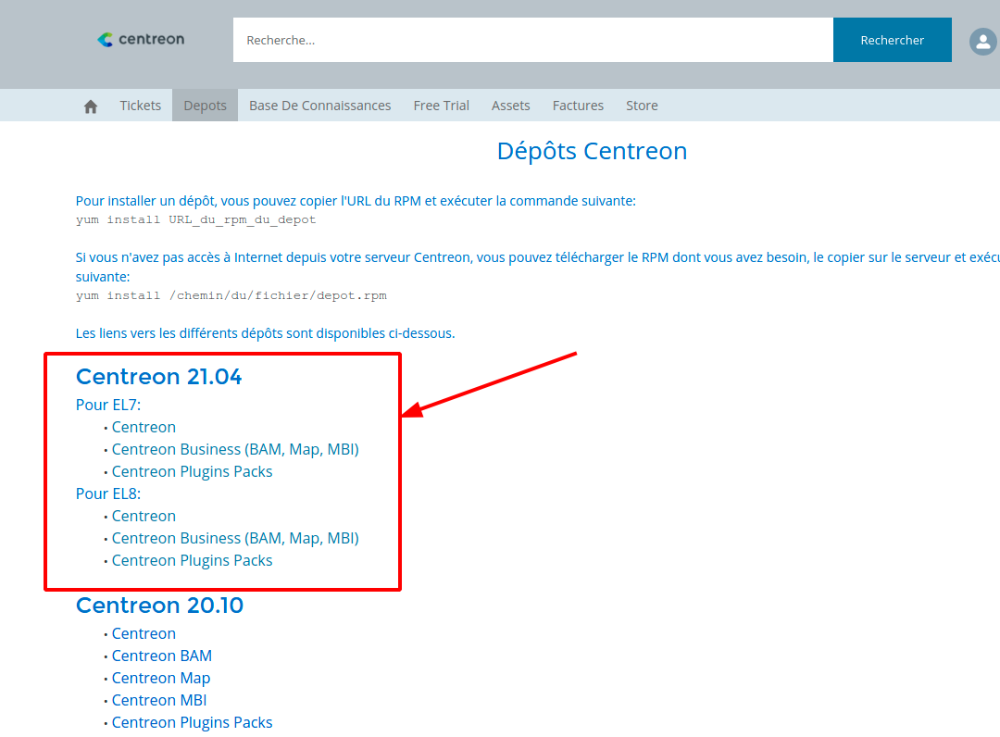

> Lors d'une montée de version < 18.10.x vers une version >= 18.10.x, vous devez:
>
> - Récupérer une nouvelle license via le support Centreon
> - S'assurer que votre serveur de reporting est basé sur CentOS 7. Si ce n'est
>   pas le cas, utiliser la procédure de [migration de votre serveur de
>   reporting](migrate.html)

La montée de version de Centreon MBI se fait en 4 étapes :

- Montée de version du dépôt RPM
- Mise à jour de Centreon MBI server (interface)
- Mise à jour du serveur de reporting
- Mise à jour de la base MariaDB

## Étape 1 : Montée de version du paquet

Lors d'une montée de version majeure (ex: 20.10.x à 21.04.x) il faut en premier lieu mettre à jour
 le dépôt contenant les paquets. 

Vous trouverez ce dépôt depuis votre compte sur notre platefome de support https://support.centreon.com à l'onglet "Depots" :



## Étape 2 : Mettre à jour l'interface

1. Mettre à jour le paquet: se connecter sur le serveur Centreon et exécuter la commande suivante :

    ```shell
    yum update centreon-bi-server
    ```

2. Mettre à jour l'interface: Se connecter à l'interface web de Centreon et se rendre dans le menu
 `Administration > Extension > Manager` puis cliquer sur le bouton de mise à jour de l'extension et des widgets.

## Étape 3 : Mettre  à jour le serveur de reporting

1. Premièrement, arrêtez le service d'ordonnancement (CBIS):

    ```shell
    systemctl stop cbis
    ```

2. Puis mettre à jour les paquets, en exécutant la commande suivante:

    ```shell
    yum update centreon-bi\*
    ```

3. Enfin, redémarrer le service d'ordonnancement:

    ```shell
    systemctl start cbis
    ```

## Étape 4 : mise à jour de MariaDB

Voir [Mettre à jour MariaDB](../upgrade/upgrade-mariadb.html).