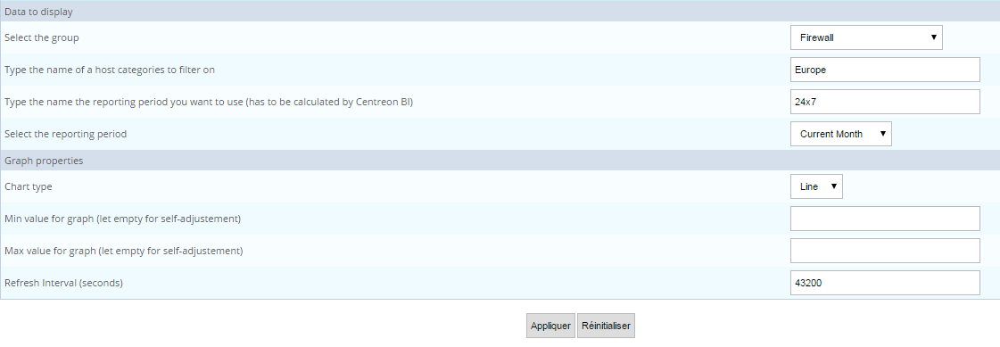
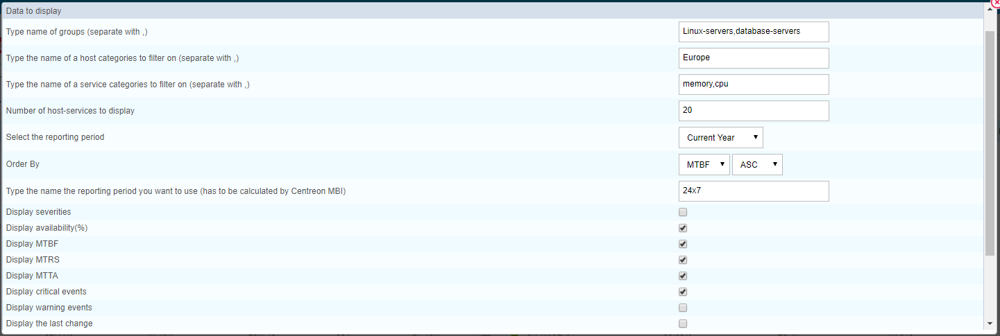
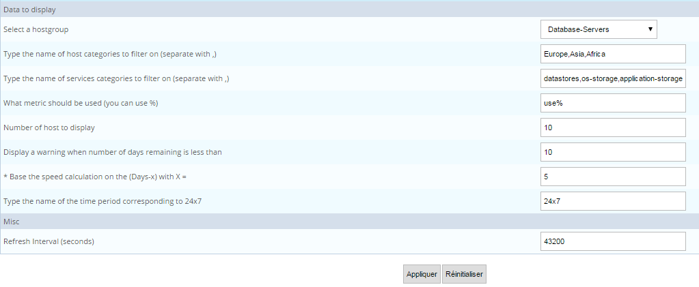
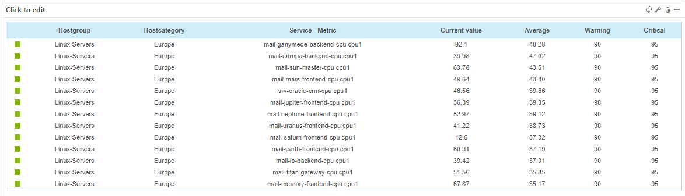
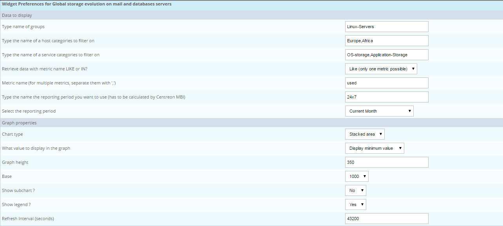
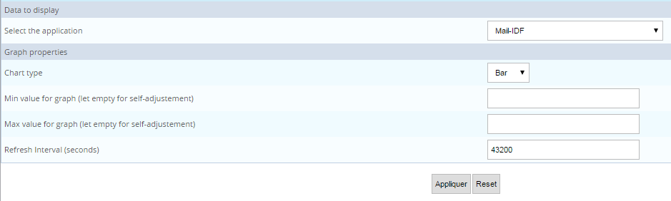

Les widgets de Centreon MBI s"utilisent dans les [vues personnalisées](../getting-started/create-custom-view.html) de Centreon. Il vous êtes de ce fait possible de créer des
dashboard combinant des données temps réel ET des données agrégées
(disponibilité, application, performance etc..)

Ci-dessous la liste des widgets de reporting disponibles :

> Dans le cas d\'une mise à jour des ACLs, cliquez sur "Update ACL
> Resources" dans les options générales de Centreon MBI, onglet "Report
> Parameters"

## Disponibilité et événements

### Hostgroup availability by host categories by month

#### Description

Ce widget affiche la disponibilité des hôtes appartenant à un groupe
d\'hôtes en les répartissant par catégorie, par mois.

#### Paramètres

**Description**

-   Select the group : Sélectionner le groupe d\'hôtes pour lequel
    afficher les statistiques
-   Type the name of host categories to filter on : taper le nom d\'une
    ou plusieurs catégories d\'hôtes. Séparer les catégories par des
    virgules
-   Type the name the reporting period you want to use (has to be
    calculated by Centreon BI) : Taper le nom de la plage horaire de
    reporting à utiliser. Cette plage horaire doit être présente dans la
    configuration de Centreon MBI
-   Chart type : Type de graphique à utiliser
-   Min value for graph (let empty for self-adjustement) : Valeur
    minimum de l\'axe des ordonnées
-   Max value for graph (let empty for self-adjustement) : Valeur
    maximum de l\'axe des ordonnées
-   Refresh Interval (seconds) : rafraichissement automatique du widgets

**Exemple**

### Hostgroup availability by host by day

#### Description

Ce widget affiche la disponibililté des hôtes appartenant à un groupe
d\'hôtes , par jour.

#### Paramètres

**Description**

-   Select the group : Sélectionner le groupe d\'hôtes pour lequel
    afficher les statistiques
-   Type the name of host categories to filter on : taper le nom d\'une
    ou plusieurs catégories d\'hôtes. Séparer les catégories par des
    virgules
-   Type the name the reporting period you want to use (has to be
    calculated by Centreon BI) : Taper le nom de la plage horaire de
    reporting à utiliser. Cette plage horaire doit être présente dans la
    configuration de Centreon MBI
-   Select the reporting period : sélectionner la période de reporting
    relative
-   Chart type : Type de graphique à utiliser
-   Min value for graph (let empty for self-adjustement) : Valeur
    minimum de l\'axe des ordonnées
-   Max value for graph (let empty for self-adjustement) : Valeur
    maximum de l\'axe des ordonnées
-   Refresh Interval (seconds) : rafraichissement automatique du widgets

**Exemple**

### Hostgroups availability by hostgroups by month

#### Description

Ce widget affiche la disponibililté des hôtes appartenant à un groupe
d\'hôtes , par mois.

#### Paramètres

**Description**

-   Select the group : Sélectionner le groupe d\'hôtes pour lequel
    afficher les statistiques
-   Type the name of host categories to filter on : taper le nom d\'une
    ou plusieurs catégories d\'hôtes. Séparer les catégories par des
    virgules
-   Type the name the reporting period you want to use (has to be
    calculated by Centreon BI) : Taper le nom de la plage horaire de
    reporting à utiliser. Cette plage horaire doit être présente dans la
    configuration de Centreon MBI
-   Chart type : Type de graphique à utiliser
-   Min value for graph (let empty for self-adjustement) : Valeur
    minimum de l\'axe des ordonnées
-   Max value for graph (let empty for self-adjustement) : Valeur
    maximum de l\'axe des ordonnées
-   Refresh Interval (seconds) : rafraichissement automatique du widgets

**Exemple**

### MTBF and MTRS par hôte

#### Description

Ce widget vous permet de connaître la fiabilité (MTBF) et la
mainteabilité (MTRS) de vos ressources ainsi que l\'éfficacité des
équipes dans la prise en compte des évènements (MTTA). Ces informations
sont affichées sous forme de Top. Des informations additionnelles sont
associées au widget afin de faciliter la prise de décision : statut en
temps réel, disponibilité sur la période, nombre d\'évènements, dernier
changement de statut.

-   Le MTBF est le temps moyen entre deux états DOWN, plus ce temps est
    grand, plus le hôte est fiable.
-   Le MTRS est la durée moyenne des pannes; les hôtes avec une bonne
    maintenabilité auront un petit MTRS.
-   Le MTTA est la durée moyenne de prise en compte (acquittement).
    Seuls les évènements acquittés sont pris en compte dans le calcul de
    la moyenne.

#### Paramètres

**Description**

-   Type name of groups : Taper le nom d\'un ou plusieurs groupes
    d\'hôtes (à séparer par des virgules)
-   Type the name of a host categories to filter on : taper le nom
    d\'une ou plusieurs catégories d\'hôtes. Séparer les catégories par
    des virgules
-   Number of host to display: taper le nombre d\'hôte à afficher au
    maximum
-   Select the reporting period : sélectionner la période de reporting
-   Order By: Trier par MTBF, par MTRS ou par MTTA
-   Type the name the reporting period you want to use (has to be
    calculated by Centreon MBI) Taper le nom de la plage horaire de
    reporting à utiliser. Cette plage horaire doit être présente dans la
    configuration de Centreon MBI
-   Display XXXXXX : affiche la colonne XXXXX
-   Refresh Interval (seconds) : rafraichissement automatique du widgets

**Exemple**

### MTBF & MTRS par service

#### Description

Ce widget vous permet de connaître la fiabilité (MTBF) et la
mainteabilité (MTRS) de vos services Centreon ainsi que l\'éfficacité
des équipes dans la prise en compte des soucis (MTTA). Ces informations
sont affichées sous forme de Top. Des informations additionnelles sont
associées au widget afin de faciliter la prise de décision : statut en
temps réel, disponibilité sur la période, nombre d\'évènements, dernier
changement de statut.

-   Le MTBF est le temps moyen entre deux états DOWN, plus ce temps est
    grand, plus le hôte est fiable.
-   Le MTRS est la durée moyenne des pannes; les hôtes avec une bonne
    maintenabilité auront un petit MTRS.
-   Le MTTA est la durée moyenne de prise en compte (acquittement).
    Seuls les évènements acquittés sont pris en compte dans le calcul de
    la moyenne.

#### Parameters

**Description**

-   Type name of groups : Taper le nom d\'un ou plusieurs groupes
    d\'hôtes (à séparer par des virgules)
-   Type the name of a host categories to filter on : taper le nom
    d\'une ou plusieurs catégories d\'hôtes. Séparer les catégories par
    des virgules
-   Type the name of a service categories to filter on : taper le nom
    d\'une ou plusieurs catégories de services. Séparer les catégories
    par des virgules
-   Number of host to display: taper le nombre d\'hôte à afficher au
    maximum
-   Select the reporting period : sélectionner la période de reporting
-   Order By: Trier par MTBF, par MTRS ou par MTTA
-   Type the name the reporting period you want to use (has to be
    calculated by Centreon MBI) Taper le nom de la plage horaire de
    reporting à utiliser. Cette plage horaire doit être présente dans la
    configuration de Centreon MBI
-   Display XXXXX : afficher ou masquer la colonne XXXXX
-   Refresh Interval (seconds) : rafraichissement automatique du widgets

**Exemple**

## Capacité et performance

> Les services utilisés dans les widgets suivants doivent être associés à au moins une catégorie
> de services, depuis au moins une journée.

### Typical metric performance on a 24h day

#### Description

Ce widget affiche sur un graphique de 24h, la journée type d\'une
métrique pour un service donné.

#### Parameters

**Description**

-   Select a service : sélectionner l\'hôtes et le service
-   Type the name of metric : donner le nom de la métrique (une métrique
    seulement)
-   Base : base 100 ou 1024
-   Chart type : type de graphique
-   Refresh Interval (seconds)

**Exemple**

### Storage list near saturation

#### Description

Ce widget permet de lister les espaces de stockage et date estimée de
saturation. Il affiche également la valeur en temps réelle et
l\'évolution par rapport à la veille. Le calcul se fait en prenant la
valeur de l\'espace de stockage à J-X et à J-1. Seul les espaces dont
l\'espace utilisé augmente sont visibles.

#### Paramètres

**Description**

-   Select a hostgroup
-   Type the name of a host category to filter on (separate with ,)
-   Type the name of a service category to filter on (separate with ,)
-   What metric should be used (you can use %) : Example : [used]()%
-   Number of host to display : Number of lines to display in the table
-   Display a warning when number of days remaining is less than
-   Base the speed calculation on the (Days-x) with X = : What\'s the
    day to compare to today value to calculate speed and saturation
    (simple rule of 3)
-   Type the name of the time period corresponding to 24x7
-   Refresh Interval (seconds)

**Exemple**

### Metric capacity planning

#### Description

Ce widget permet de calculer l\'évolution future d\'une métrique par
rapport à son historique, en utilisant la régréssion linéaire.

Si la courbe monte et qu\'une valeur maximum existe,c\'est cette valeur
qui est prise comme seuil de saturation, s\'il n\'y a pas de valeur
maximum, alors c\'est le seuil critique qui est pris comme seuil de
saturation. Si la courbe décroit, 0 est pris comme seuil de saturation.

#### Paramètres

**Description**

-   Select the service : Sélectionner l\'hôtes puis le service à
    utiliser
-   Type the name of the metric (one metric only) : taper le nom de la
    métrique appartenant au service à prendre en compte
-   How many historical days shoud we use to calculate the projection :
    Combien de jour passés faut il prendre en compte. Cette période doit
    être représentative de l\'évolution de la métrique
-   Type the name the reporting period you want to use (has to be
    calculated by Centreon BI) : Nom de la plage horaire à utiliser
-   Base : Base de division pour la métriques (1000 ou 1024)
-   Chart type : Type de graphique
-   Refresh Interval (seconds) : Intervalle de rafraîchissement du
    widget

**Exemple**

### Hostgroups performance metric - TOP X

#### Description

Ce widget affiche un Top X des données de performance par métrique (
valeur temps réel, moyenne, minimum, maximum, seuils ) , pour des
groupes & catégories en entrée.

#### Paramètres

**Description**

-   Type name of groups : Taper le nom d\'un ou plusieurs groupes
    d\'hôtes (à séparer par des virgules)
-   Type the name of a host categories to filter on : taper le nom
    d\'une ou plusieurs catégories d\'hôtes. Séparer les catégories par
    des virgules
-   Type the name of a service categories to filter on : taper le nom
    d\'une ou plusieurs catégories de services. Séparer les catégories
    par des virgules
-   Metric name: taper de nom d\'une ou plusieurs métriques. Séparer les
    métriques par des virgules.
-   Type the name the reporting period you want to use (has to be
    calculated by Centreon MBI) Taper le nom de la plage horaire de
    reporting à utiliser. Cette plage horaire doit être présente dans la
    configuration de Centreon MBI
-   Select the reporting period : sélectionner la période de reporting
-   Order values by : trier les valeur sur le minimum, moyenne ou
    maximum, tri ascendant ou descendant.
-   Number of metrics to display : Top X des métriques à afficher
-   Display Current value: Afficher la valeur temps réel
-   Display Average: Afficher la moyenne sur la période de reporting
-   Display Minimum: Afficher le minimum atteint sur la période de
    reporting
-   Display Maximum: Afficher le maximum atteint sur la période de
    reporting
-   Display warning threshold: Afficher le seuil warning
-   Display critical threshold: Afficher le seuil critique
-   Display Hostgroups: Afficher la colonne Hostgroups
-   Display Hostcategories: Afficher la colonne Hostcategories
-   Display ServiceCategories: Afficher la colonne ServiceCategories
-   Refresh Interval (seconds) : rafraichissement automatique du widgets

**Exemple**

### Hostgroups, categories performance analysis by day

#### Description

Ce widget affiche les données de performance ( moyenne, minimum ou
maximum ) par jour sur une période données, pour des groupes &
catégories.

#### Paramètres

**Description**

-   Type name of groups : Taper le nom d\'un ou plusieurs groupes
    d\'hôtes (à séparer par des virgulevernes)
-   Type the name of a host categories to filter on : taper le nom
    d\'une ou plusieurs catégories d\'hôtes. Séparer les catégories par
    des virgules
-   Type the name of a service categories to filter on : taper le nom
    d\'une ou plusieurs catégories de services. Séparer les catégories
    par des virgules
-   Retrieve data with metric name LIKE or IN? : Les données seront
    filtrées par métrique également, il s\'agit ici de préciser si on
    veut que les métriques soient filtrées en faisant like foo% ou alors
    en IN (foo,bar,\...)
-   Metric name (for multiple metrics, separate them with \',\') : nom
    de la (si mode = like) ou des métriques (si mode = IN) à prendre en
    compte
-   Type the name the reporting period you want to use (has to be
    calculated by Centreon MBI) Taper le nom de la plage horaire de
    reporting à utiliser. Cette plage horaire doit être présente dans la
    configuration de Centreon MBI
-   Select the reporting period : sélectionner la période de reporting
-   What value to display in the graph : quelle est la valeur à afficher
    , minimum, moyenne ou maximum
-   Graph height : en fonction du paramétrage, le graphique et la
    légende peuvent être haut. Vous pouvez alors spécifier la hauteur du
    graph pour optimiser le rendu
-   Base: ce paramètre contrôle la conversion à effectuer pour afficher
    les G,M,K etc..
-   Show subchart ? : afficher ou masquer un graphique permettant de
    zoomer
-   Show legend ? : afficher ou masquer la légende
-   Refresh Interval (seconds) : rafraichissement automatique du widgets

**Exemple**

## Activités Métier

### Business Application Availability (Gauge)

*Ce widget fonctionner uniquement si Centreon BAM est installé*

#### Description

Ce widget affiche la disponibilité d\'une BA, ses SLAs (si configurés)
pour la période de reporting sélectionnée ainsi que le niveau actuel de
la BA. Si vous sélectionnez une période de reporting pour laquelle il
n\'y a pas encore de données, comme par exemple \"Current Month\" en
étant le premier du mois, c\'est le niveau en direct qui s\'affiche.

#### Parameters

**Description**

-   Select an application from Centreon BAM : sélection de la BA
-   Select the reporting periods : sélection de la période de reporting
-   Refresh Interval (seconds) : Intervalle de rafraîchissement

**Exemple**

### Business Application Availability,Performance and Alerts by day

*Ce widget fonctionner uniquement si Centreon BAM est installé*

#### Description

Ce widget affiche la disponibilité, la performance et le nombre
d\'alertes d\'une BA, par jour.

#### Parameters

**Description**

-   Select an application from Centreon BAM ( Corresponds to a \"BA\") :
    sélectionner l\'application
-   Select the reporting periods : sélectionner la période de reporting
-   Min value for graph (let empty for self-adjustement) : Valeur
    minimum de l\'axe des ordonnées
-   Max value for graph (let empty for self-adjustement) : Valeur
    maximum de l\'axe des ordonnées
-   Refresh Interval (seconds) : intervalle de rafraîchissement

**Exemple**

### Business Application Availability,Performance and Alerts by month

*Ce widget fonctionner uniquement si Centreon BAM est installé*

#### Description

Ce widget affiche la disponibilité, la performance et le nombre
d\'alertes d\'une BA, par mois, sur les 12 derniers mois (si données
disponibles).

#### Parameters

**Description**

-   Select an application from Centreon BAM ( Corresponds to a \"BA\") :
    sélectionner l\'application
-   Select the reporting periods : sélectionner la période de reporting
-   Min value for graph (let empty for self-adjustement) : Valeur
    minimum de l\'axe des ordonnées
-   Max value for graph (let empty for self-adjustement) : Valeur
    maximum de l\'axe des ordonnées
-   Refresh Interval (seconds) : intervalle de rafraîchissement

**Exemple**

### Business Application MTBF & MTRS

*Ce widget fonctionner uniquement si Centreon BAM est installé*

#### Description

Ce widget vous permet de connaître la fiabilité (MTBF) et la
mainteabilité (MTRS) de vos applications et services critiques modélisés
dans Centreon BAM. Ces informations sont affichées sous forme de Top.
Des informations additionnelles sont associées au widget afin de
faciliter la prise de décision : statut en temps réel, disponibilité sur
la période, nombre d\'évènements, dernier changement de statut.

-   Le MTBF est le temps moyen entre deux états DOWN, plus ce temps est
    grand, plus le hôte est fiable.
-   Le MTRS est la durée moyenne des pannes; les hôtes avec une bonne
    maintenabilité auront un petit MTRS.

#### Parameters

**Description**

-   Select the business view (empty to view all BA) : sélection de la
    business view. En laissant vide ce champ, toutes les BAs sont
    récupées (filtrés par les ACls)
-   Number of business activities to display : nombre d\'activité métier
    à afficher dans le tableau
-   Select the reporting period : la période de reporting considérée
-   Order By : trier le résultat par MTBF ou MTRS
-   Type the name of the time period you want to use (has to be
    calculated by Centreon MBI). Let this field empty to use the default
    reporting time period for each BA : remplir ce champ si vous
    souhaitez spécifier une plage horaire spécifique. En laissant ce
    champ vide, c\'est la plage horaire de reporting par défaut de
    l\'activité métier qui est appliquée.
-   Display XXXXX : afficher ou masquer la colonne XXXXX
-   Refresh Interval (seconds) : Intervalle de rafraîchissement

**Exemple**

### Business View Availability,Performance and Alerts by month

*Ce widget fonctionner uniquement si Centreon BAM est installé*

#### Description

Ce widget affiche la disponibilité, la performance et le nombre
d'alertes d'une Business View (regroupement logique de BA), par mois,
sur les 12 derniers mois (si données disponibles).

#### Parameters

**Description**

-   Select a Business View from Centreon BAM : sélectionner la vue
    métier
-   Select the reporting periods : sélectionner la période de reporting
-   Min value for graph (let empty for self-adjustement) : Valeur
    minimum de l\'axe des ordonnées
-   Max value for graph (let empty for self-adjustement) : Valeur
    maximum de l\'axe des ordonnées
-   Refresh Interval (seconds) : intervalle de rafraîchissement

**Exemple**

