## Les activités métier

*Aussi appelées Business activities ou BA*

> Lorsque vous créez/modifiez une activité métier, il faut générer et 
> pousser la configuration pour que les modifications soient prises en compte

### Définition

Les activités métier sont le coeur de l'extension **Centreon BAM**, elles
constituent des indicateurs agrégés, basées sur les ressources supervisées par Centreon.
Sur la base de la valeur calculée, le système va être en mesure de notifier les utilisateurs 
en cas de dépassement de seuils, révélateur d'un dysfonctionnement du service IT ou de l'application modélisée.

### Méthodes de calcul

Une des notions importantes à comprendre lorsqu'on manipule des BA est la méthode de calcul appliquée. Il
y a quatre méthodes de calcul disponibles afin de rendre compte de l'état d'une BA:

- **Best Status**: Lorsque vous souhaitez suivre le dysfonctionnement de TOUS les indicateurs au même moment
- **Worst Status**: Lorsque vous souhaitez savoir dès qu'un indicateur ne fonctionne plus
- **Ratio**: Lorsque vous souhaitez modéliser des concepts de **Cluster** en spécifiant un pourcentage ou un nombre
 de resources maximum en statut Critique que vous ne voulez pas dépassez
- **Impact**: Lorsque vous souhaitez définir finement l'impact de chaque indicateur en fonction de leurs poids (<=> sévérité)

Ci-dessous des explications et exemples pour chacune des méthodes

<!--DOCUSAURUS_CODE_TABS-->

<!-- Best Status -->

L'ordre appliqué pour "Best" status est le suivant: `OK > Unknown > Warning > Critical > Pending`

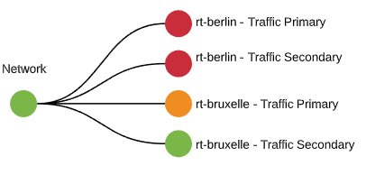

Et la configuration correspondante:

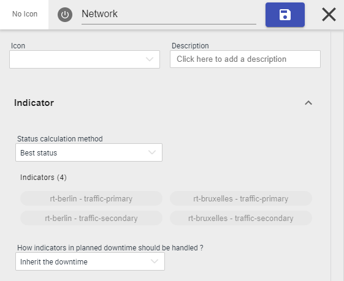

<!-- Worst Status -->

L'ordre appliqué pour "Worst" status est le suivant: `CRITICAL > Warning > Unknown > OK > Pending`

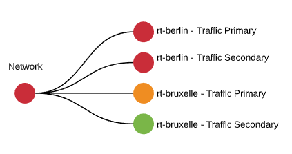

Et la configuration correspondante:

<!-- Ratio -->

La méthode ratio permet de modéliser des concepts de "Cluster" et s'appuie sur 
le **nombre ou pourcentage d'indicateurs en statut CRITIQUE** et compare ces 
nombres à des seuils (nombre/pourcentage) qu'il ne faut pas dépasser.

Dans l'example suivant, on souhaite que le nombre d'indicateurs en statut Critique soit inférieur à 80%, lorsque ce seuil
sera dépassé, la BA passera en statut "Critique" à son tour.

Et la configuration correspondante:

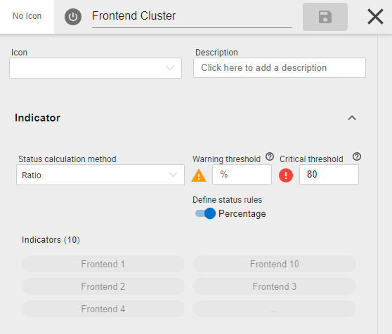

Configuration des seuils de la BA:

- Seuil **Critique**: si le nombre/pourcentage d'indicateur en statut **Critique** dépasse ce nombre/pourcentage, 
la BA sera **Critique**
- Seuil **Warning**: si le nombre/pourcentage d'indicateur en statut **Critique** dépasse ce nombre/pourcentage, 
  la BA sera **Warning**

<!-- Impact -->

> Ce mode est le plus compliqué à utiliser mais vous permet de modéliser finement des concepts de degré d'impact en 
fonction des statuts et de l'indicateur considéré

Dans cette méthode de calcul, l'activité métier a une "santé" de 100% au départ et ses indicateurs viennent 
faire chuter ce nombre en fonction de leur statut et de l'impact configuré. Le statut de l'activité métier 
dépendra alors des paramètres présents dans la section Indicateur.

-   **Seuil dégradé (warning)** : entre 100 et 0. Seuil à partir duquel
    l'activité métier sera en état dégradé. Ce seuil permet à
    l'activité métier de passer en "orange" (dégradé) et de
    déclencher l'envoi de notification si configuré.
-   **Seuil non fonctionnel (critical)** : entre 100 et 0 (doit être
    inférieur au seuil dégradé). Seuil à partir duquel l'activité
    métier sera en état non fonctionnel.Ce seuil permet à l'activité
    métier de passer en "rouge" (non fonctionnel) et de déclencher
    l'envoi de notification si configuré.

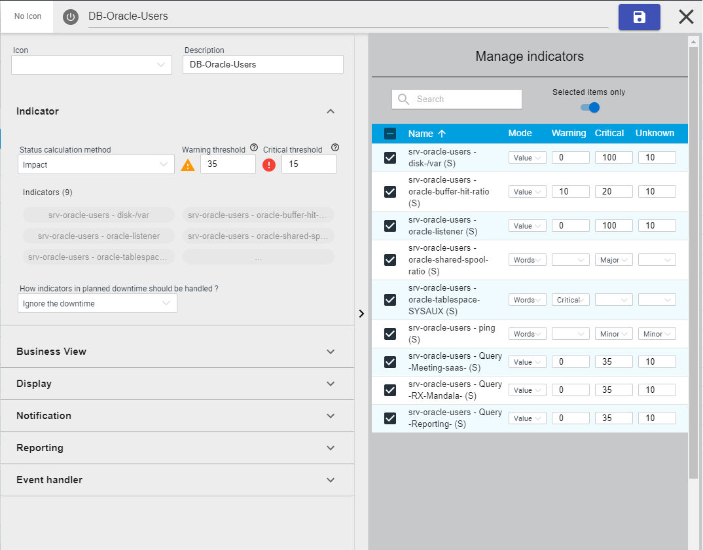

<!--END_DOCUSAURUS_CODE_TABS-->

### Création d'une activité métier

Pour créer une nouvelle activité métier, cliquer sur **Add**. Le
formulaire ci-dessous apparaît

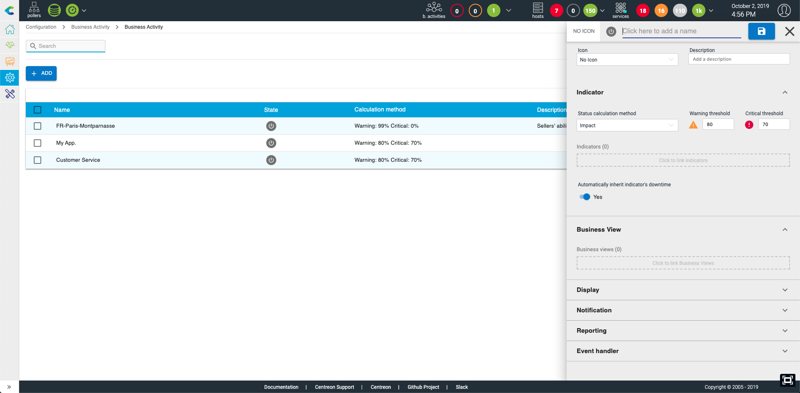

La création de l'activité métier se fait directement dans le panneau
qui s'ouvre. Après avoir donner un nom (obligatoire & unique) à votre activité
métier, vous devrez configurer plusieurs sections. La section **Indicateur** est la plus importante.

#### Indicateurs

C'est la section la plus important: c'est ici que vous définissez quels indicateurs vont être liés à la BA 
et quelle méthode de calcul sera appliquée. 

Vous pouvez lier ces types d'indicateurs à une activité métier:

- Services 
- D'autres activités métier
- Meta-services
- Règles booléennes

**Méthode de calcul**

Vous pouvez choisir parmi les 4 méthodes suivantes:

- Best status 
- Wors status
- Ratio
- Impact

Une fois les indicateurs et la méthode de calcul sélectionnée, vous pouvez en option, définir la manière dont les 
**plages de maintenance planifiées** sur les indicateurs vont se repercuter sur l'activité métier:

- **Ignore the downtime**: Dans ce cas, les plages de maintenance positionnées sur les indicateurs seront ignorées, la BA
sera impactée
- **Inherit the downtime**: Dans ce cas la BA hérite automatiquement de la plage de maintenance dès lorsqu'un indicateurs
l'impactant est en plage de maintenance. L'héritage suit ces règles:
    - Une activité métier hérite des plages de maintenance planifiées de ses KPIs lorsque son statut est Non-OK
    - Lorsqu'une activité métier est en plage de maintenance planifiée grâce au mécanisme d'héritage, 
    dès que le statut de l'activité métier remonte à OK, alors la plage de maintenance planifiée est arrêtée
    - Lorsqu'une activité métier est en plage de maintenance planifiée grâce au mécanisme d'héritage, 
    si un des impacts provient d'un de ses indicateurs n'étant pas sous plage de maintenance planifiée,
    alors la plage de maintenance de la BA est arrêtée
- **Ignore the indicator in the calculation**: lorsqu'un indicateur est en plage de maintenance planifiée, son statut/impact
est ignoré du calcul

Une fois la configuration du calcul de la BA effectuée, il vous est possible de configurer les éléments suivant dans les
différentes sections:

-   Vue métier: Pour lier l'activité métier à une vue métier
-   Affichage: Paramètrer les options d'affichage de l'activité métier
-   Notification: à quels moment et qui sera notifié en cas de
    dégradation de service sur cette activité métier
-   Rapport: paramètres gérant les SLA cibles et période de reporting à
    utiliser dans les widgets et rapports (lié à l'extension Centreon MBI)
-   Gestionnaire d'évènements: paramètres permettant l'exécution de
    script d'auto-correction

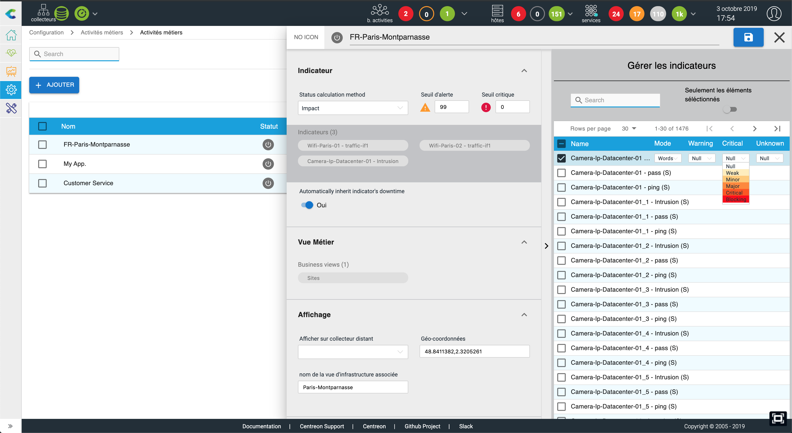

#### Vue métier

Lier l'activité métier à une ou plusieurs "Vue métier". Cela permet
de rendre disponible l'activité métier aux utilisateurs non-admin et de
configurer les widgets & rapports.

#### Affichage

-   Afficher sur un collecteur distant: Permet de rendre accessible
    l'activité métier sur un collecteur distant à condition que TOUS
    les indicateurs liés (y compris aux niveaux inférieurs) soit visible
    du collecteur distant
-   Geo-coordinate: définir la position géographique de l'activité
    métier pour l'afficher sur une GeoView (Centreon Map)
-   Nom de la vue d'infrastructure associée: rendre accessible en un
    clic l'accès à la vue d'infrastructure supportant l'activité
    métier.

#### Notification

Configurer à quel moment et qui doit être notifié lors d'une
dégradation de l'état de l'activité métier. Il est également possible
de définir les propriétés d'escalade. Lors de la liaison d'une
escalade à une activité métier, ce sont les propriétés des service de
l'escalade qui sont utilisés

#### Rapport

-   Période de rapport par défaut: la disponibilité calculées et
    affichées dans les widgets & rapports sera calculée sur cette
    période
-   Service Level Agreement en %(SLA): seuil en pourcentage visible dans
    les widgets & rapports auquel la disponibilité et l'activité est
    comparée
-   Service Level Agreement en min(SLA): seuil en minute visible auquel
    le temps indisponible est comparée
-   Service Level Objective en %(SLO): seuil additionnel en pourcentage
    qui peut être utilisé comme un seuil de SLA "warning".
-   Service Level Objective en min(SLO): seuil additionnel en minute qui
    peut être utilisé comme un seuil de SLA "warning".
-   Plages de reporting additionnelles: permet de calculer les
    statistiques de l'activité métier sur d'autres plages horaire

#### Gestionnaire d'évènements

Pour activer et associer des mécanisme d'auto-remédiation en fonction
du statut de l'activité métier

### Liste

La gestion des activité(s) métier est réalisée via le menu `Configuration > Business Activity > Business Activity`

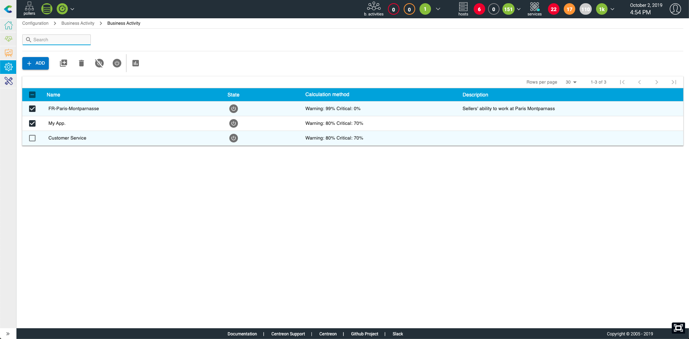

Des actions de duplication, suppression, activation/désactivation ou changement massif sont possible
lorsque vous cochez une ou plusieurs lignes

> La suppression d'une activité métier la supprime définitivement avec
> l'ensemble des données et indicateurs qui lui sont rattachés.

## Indicateurs (KPI)

> Lorsque vous créez/modifiez un indicateur, il faut générer et 
> pousser la configuration pour que la modification soit prise en compte

### Définition

Un indicateur est un point de contrôle présent dans le système de
supervision qui est associé à une BA. Un BA peut avoir 1 à n indicateurs
et ces indicateurs peuvent être de quatre types :

-   Indicateur "Service" (les services déployés par groupes **ne sont
    pas** disponibles)
-   Indicateur "Meta Service"
-   Indicateur "Booléen"
-   Indicateur "Activité métier"

Un indicateur impacte uniquement sa BA parente lorsque le statut de la
ressource qui lui est rattachée est en état confirmé ("hard") dans la
supervision.

L'indicateur va influer sur la valeur de la BA grâce à un mécanisme
d'impact sur sa santé. Ce choix des valeurs des impacts est laissé à
l'appréciation de l'utilisateur. Pour commencer, nous conseillons
d'utiliser le mode "standard" se reposant sur des mots clés
(mineur,bloquant..) plutôt que le mode avancé se basant sur des valeurs
numérique d'impact, plus compliqué à déterminer.

A chaque changement de statut d'un indicateur, l'impact, s'il existe,
va être retranché à la santé de la BA. La santé minimum d'une BA est 0
même si la somme de ses impacts en cours est supérieur à 100.

### Liste des indicateurs (KPI)

La gestion des indicateurs peut être réalisée de deux manières:

- Dans l'activité métier comme vu précédemment 
- Au travers du menu `Configuration > Business Activity > Indicators` uniquement pour les BA utilisant le mode de calcul "Impact"

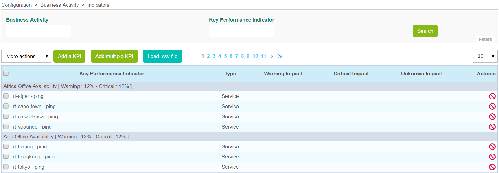

  **Colonne**               | **Description**
  --------------------------|-----------------------------------------------------
  Key Performance indicator |  Nom de l'indicateur (basé sur l'objet utilisé)
  Type                      |  type de resource associée (Service, Meta Service, BA)
  Impact dégradé            | Poids d'impact en cas d'état "Warning" ou dégradé, dans la supervision temps réel
  Impact critique           |  Poids d'impact en cas d'état "Critical" ou critique, dans la supervision temps réel
  Impact inconnu            | Poids d'impact en cas d'état "Unknown" ou inconnu, dans la supervision temps réel                  
  Actions                   | Actions pouvant être effectuées (modification,activation/désactivation)

Le menu "More actions" permet d'appliquer une action sur plusieurs
indicateurs à la fois :

-   Activer les KPI au sein de leur BA
-   Modifier massivement les valeurs d'impact des KPIs
-   Désactiver les KPI au sein de leur BA
-   Supprimer les KPI

> La suppression d'un KPI ne supprime pas l'objet auquel il réfère dans
> les objets **Centreon** ni l'historique des impacts dans les logs. La
> disponibilité de la BA impactée n'est pas non plus recalculée.

### Création d'un indicateur (KPI)

Il existe plusieurs façons d'ajouter des indicateurs:

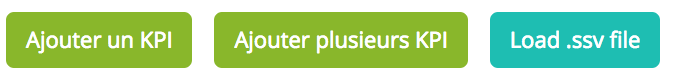

#### Ajouter un indicateur

> Dans cette page, il est **uniquement** possible de créer/gérer les indicateurs attachés à des activité métier utilisant le mode de calcul "Impact".  

Pour ajouter un indicateur, cliquer sur le lien **Add a KPI** qui dirige
vers un formulaire de saisie.

> L'ajout d'indicateur via ce formulaire n'est valable que pour les activités métier de type IMPACT.

**Mode standard** :

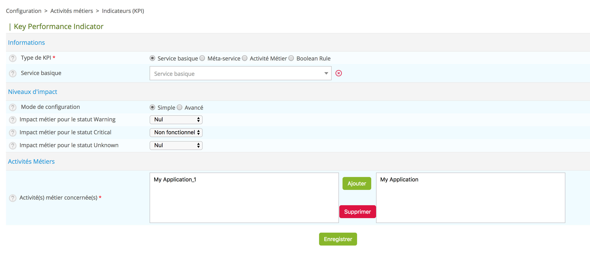

**Mode avancé** :

Il permet de saisir la valeur des impacts manuellement.

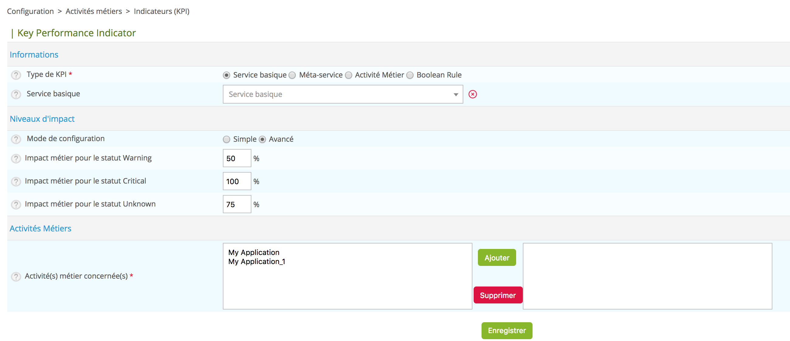

  **Paramètre**                         | **Description**
  --------------------------------------|------------------------------------------------
  Mode de configuration                 | Mode de configuration standard ou avancé
  Type de KPI                           | Type de KPI (Service, Meta service, booléen ou une BA)
  Key Performance Indicator             | Choix du KPI sur la base des objets présents dans **Centreon**
  Impact métier pour le statut warning  |  Poids d'impact en cas d'état "Warning" ou dégradé, dans la supervision temps réel
  Impact métier pour le statut critique |  Poids d'impact en cas d'état "Critical" ou critique, dans la supervision temps réel
  Impact métier pour le statut unknown  | Poids d'impact en cas d'état "Unknown" ou inconnu, dans la supervision temps réel
  Activité(s) métier concernée(s)       |    BA auxquelles le KPI est associé.

*Pour ajouter un KPI de type booléen, il faut l'avoir préalablement créé dans le menu dédié (cf explication ci-après)*

#### Ajouter plusieurs KPI

Pour ajouter plusieurs KPI à la fois, cliquer sur le lien **Ajoute plusieurs KPIs** qui dirige vers un formulaire de saisie.

Sélection l'objet à partir duquel vous souhaitez récupérer les services.

  **Colonne**                               |    **Description**
  ------------------------------------------|---------------------------------------------------
  Mode de configuration                     |       Mode de configuration standard ou avancé
  Type d'objet                              |   Type de l'objet à partir duquel les KPI seront chargés
  Hôte, Groupe d'hôtes, Groupe de services  |  Selon le type d'objet sélectionné, une liste d'objets sera chargée lors du clic sur le bouton "Récupérer KPI"
  Activité(s) métier concernée(s)           | BA auxquelles le KPI est associé, seules les BA utilisant le mode IMPACT sont listées ici

En cliquant sur le bouton **Récupérer KPI**, une liste des indicateurs se présentera, il sera alors 
possible de les filtrer / d'appliquer massivement les seuils:

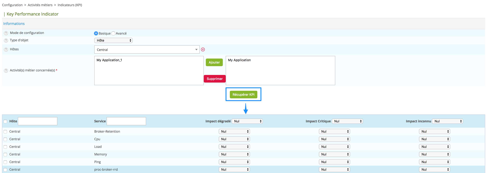

  **Colonne**       |  **Description**
  ------------------|---------------------------------------------------------
  Hôte              |  Hôte du KPI de service
  Service           |   KPI de service
  Impact dégradé    |     Poids d'impact en cas d'état "Warning" ou dégradé, dans la supervision temps réel
  Impact critique   | Poids d'impact en cas d'état "Critical" ou critique, dans la supervision temps réel
  Impact inconnu    | Poids d'impact en cas d'état "Unknown" ou inconnu,dans la supervision temps réel

#### Charger fichier SSV

Pour ajouter plusieurs KPI à la fois en chargeant un fichier de type
.ssv, cliquer sur le lien "Load .ssv file" qui dirige vers un
formulaire de saisie.

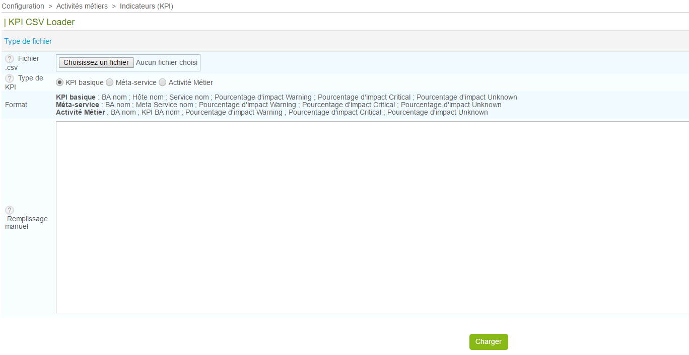

 |  **Colonne**     | **Description**                                     
 |------------------|---------------------------------------------------------
 | .ssv File        | Ouvrir l'explorateur de fichiers
 | KPI Type         | Type de KPI à charger
 | Format           |  Aide sur le format du fichier SSV à utiliser en fonction du type de KPI choisi
 | Manual filling   |  Possibilité de compléter ce champ plutôt que de charger un fichier

### Indicateur booléen

Dans le menu `Configuration > Business Activity > Règles booléennes`

Il est possible de créer des règles logique entre les services afin
d'en faire des règles "booléenne".

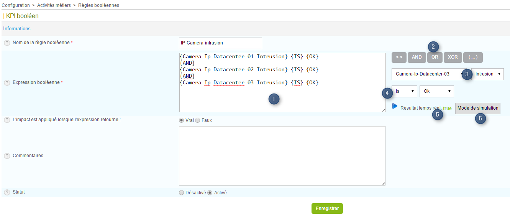

Expication du formulaire :

  * Nom de la règle 
  * Nom du KPI booléenne 
  * Expression booléenne
    
    1. Fenêtre d'édition de l'expression logique 
    2. Boutons d'édition 
    3. Les services qui alimentent l'expression 
    4. Bouton permettant d'évaluer l'expression avec les statuts réels de monitoring 
    5. Etat suite à l'évaluation (statuts réels ou simulés)
    6. Permet d'entrer dans le mode simulation. Ce dernier permet de soumettre des états aux différents services 
    permettant de simuler une situation et voir le retour de l'expression

  * L'impact appliqué lorsque l'expression retourne: Dans quel cas l'impact doit être appliqué: quand l'expression 
    renvoie Vrai ou Faux ?
  * Comments: Commentaires concernant le KPI
  * Status: Activé ou désactivé

## Les vues métier
*Business Views - BV*

### Définition

Les vues métier permettent de rassembler plusieurs activités métier dans
un groupe. Elles peuvent être comparées aux "groupes d'hôtes" de
**Centreon** et seront utilisées au travers des différents écrans du
logiciel.

Les restrictions de visualisation des activités métier (ACL) se font
uniquement à travers les vues métier et permettent d'associer un ou
plusieurs groupes d'accès créés dans **Centreon**.

> Afin de faciliter la "root cause analysis", une fois qu'un
> utilisateur a accès à une activité métier, il sera en mesure de
> visualiser tous les indicateurs liés, peu importe les restrictions sur
> les resources qui pourraient être définies.

Une vue métier n'est pas un indicateur en tant que tel pour lequel des
données peuvent être historisées. L'information qu'elle affiche
dépendant de son contenu à l'instant ou on la sollicite.

### Liste des vues métier

La configuration des vues métier est réalisée via le menu
**Configuration > Business Activity > Business Views**

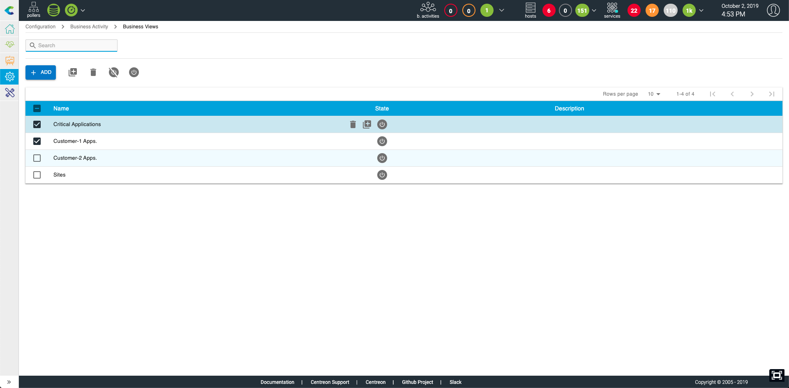

  |   Colonne       |    Description
  |-----------------|-------------------------------------------------------------
  | Nom             | Nom de la vue métier
  | Description     | Description
  | Affiché         | Affichage ou non de la BV sur les écrans du logiciel  **Centreon BAM** *(deprecated)*
  | Actions         | Liste d'actions pouvant être effectuées sur la vue métier (modification/affichage)

Supprimer une vue métier:

-   La suppression d'une vue métier ne supprime pas les activités
    métier qui lui sont rattachées.
-   La suppression d'une BV la supprime définitivement.

### Création d'une vue métier

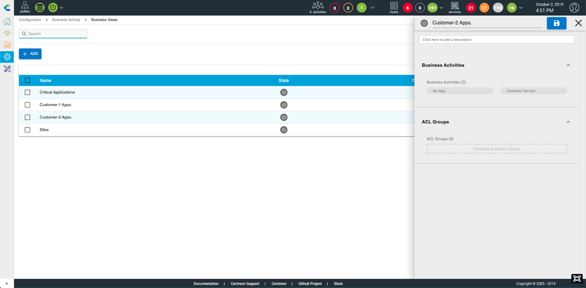

  
  Colonne                   | Description
  --------------------------|-------------------------------------------------------------
  Nom                       | Nom de la vue métier
  Description               | Description de la vue métier
  Activité(s) métier        | La ou les activité(s) métier associées à la BV concernée(s)       
  Groupes d'accès autorisés | Le ou les groupes d'accès pouvant consulter la vue métier et les activités métier contenues
