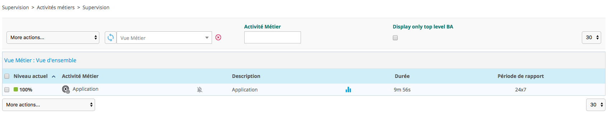
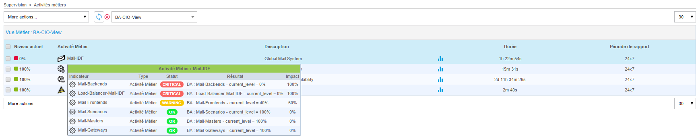
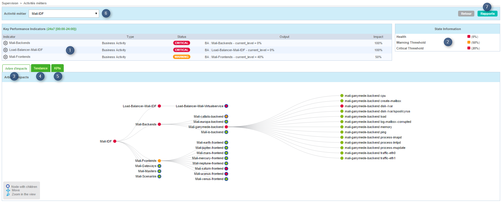
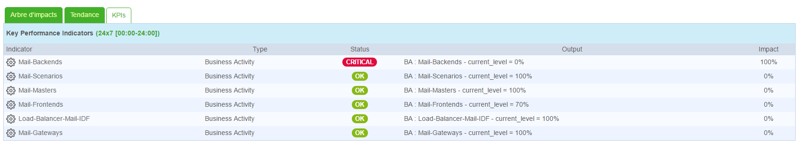

Après avoir créer / modifier / supprimer des objets liés à Centreon BAM,
rendez vous dans `Configuration > Poller`, générer la configuration et
relancer le moteur du poller **Central**.

Une fois la configuration rechargée et les **services liés aux KPIs
contrôlés au moins 1 fois**, les BA sont à jour et peuvent être
visualisées à la page `Supervision > Activités métiers > Supervision`

## Interprétation des données temps réel

### Liste des activités métier

La page principale de monitoring est une console présentant les
informations essentielles concernant le status des BA en temps réel.

Un utilisateur non administrateur verra uniquement les BA appartenant
aux BV liées à son groupe d'accès.

| Colonne            | Description                                            |
|--------------------|--------------------------------------------------------|
| Niveau actuel      | Niveau actuel de la BA exprimé en %, entre 0 et 100    |
| Activité métier    | Le nom de la BA                                        |
| Description        | Description de la BA                                   |
| Durée              | Durée depuis laquelle la BA est dans son statut actuel |
| Période de rapport | Période de reporting par défaut utilisée par la BA     |

Il est possible de visualiser l'évolution du niveau de la BA en plaçant
le curseur de la souris sur l'icône du graphique. En plaçant le curseur
de la souris sur le nom ou la description de la BA, une fenêtre apparaît
et présente les différents KPI de cette BA, accompagnés de leurs statuts
actuels.

En cliquant sur le nom ou la description d'une BA, une nouvelle page se
charge, cette dernière est une vue détaillée de la BA.

### Vue détaillée

La vue détaillée d'une BA est divisée en 7 parties.

1.  Tableau listant les indicateurs de performance impactant
    actuellement la BA.
2.  Tableau d'information sur l'état de santé de la BA et les seuils
    d'alertes.
3.  Onglet présentant l'arbre d'impact de la BA. Il est possible de
    déployer les niveaux inférieurs, zoomer et se déplacer dans le
    graphique.
4.  Onglet contenant les graphiques de niveau de services de la BA
5.  Onglet contenant un tableau listant tous les KPIs de la BA
6.  Menu déroulant permettant de modifier la BA
7.  Lien vers la page de reporting de la BA

Le tableau des KPI affichent en temps réel les informations sur leurs
états mais aussi les impacts sur la BA.

L'onglet "Tendance" affiche 4 graphique : un journalier, un
hebdomadaire, un mensuel et un annuel affichant le niveau de la BA dans
le temps et son statut.

