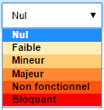

## Paramètres par défaut

Le module **Centreon BAM** offre une série d'option permettant de
déployer vos BA plus facilement et d'avoir une visualisation
personnalisée de vos graphiques.

Les « Default settings » ont pour but de pré-remplir certains des champs
de saisie lors de l'ajout de nouvelles BA et de nouveaux indicateurs.

    Supervision > Activité Métier > Paramètres par défaut 

### Paramètres d'impact par défaut

Les valeurs renseignées ici correspondent aux valeurs associées aux
impacts Faible, Mineur,Majeur,Non fonctionnel,Bloquant. Ces valeurs
prédéfinies des impacts sont utilisées lors de la définition de
l'impact des différents status des indicateurs en mode "basique".

Chaque impacts correspond à un impact en pourcentage.

### Impacts par défaut des activités métier et règles booléennes

Ces valeurs sont utilisées lors de la déclaration d'un indicateur de
type "Activité métier" et "Règle booléenne". Elles permettent de
pré-remplir les champs lors de la bascule de la configuration en mode
"Avancé".

### Paramètres des activités métier par défaut

Les paramètres ci-dessous permettent de définir les valeurs par défaut
que prendront les activité métiers. Seule la commande de notification ne
peut être surchargée au niveau des activités métier.

 Colonne | Description
--------------|-----------------------------------------------------
Seuil dégradé | Seuil « Warning » : Correspond à un état dégradé de la BA. Une notification peut alors être envoyée.
Seuil non fonctionnel | Seuil « Critical » : Correspond à un état critique de la BA. Une notification peut alors être envoyée.
Période du rapport | Période de reporting par défaut de la BA BA
Période de notification | Période de notification par défaut de la BA
Groupes de contact | Groupes de contact notifiés par défaut de la BA
Intervalle entre deux | Intervalle de notification par défaut de la BA

Pour être en mesure d'envoyer des notifications aux utilisateurs ou
solutions externes (Slack, OpenDuty etc..) appartenant au(x) groupe(s)
de contacts sélectionnés, vous devez configurer la section "Business
activity" pour les utilisateurs concernés:

Paramètres utilisateur
======================

Les « User Settings » sont des options personnalisées qui sont propres à
chaque profil d'utilisateur. Ces paramètres concernent surtout les
effets visuels du module, à savoir les graphiques.

    Monitoring > Business Activity > User Settings

Vue d'ensemble personnalisée
-----------------------------

Par défaut, le module Centreon BAM affiche la console de supervision
avec toutes les BA autorisées. L'utilisateur a cependant la possibilité
de composer sa propre vue d'ensemble en y ajoutant les BA de son choix,
parmi celles qui sont autorisées.

Style de graphique par défaut
-----------------------------

*Déprécié - va être supprimé*

Couleur des graphiques
----------------------

*Déprécié - va être supprimé*

Autres options
--------------

*Déprécié - va être supprimé*
