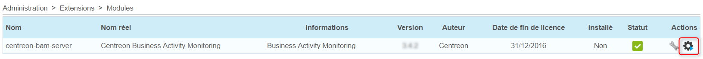
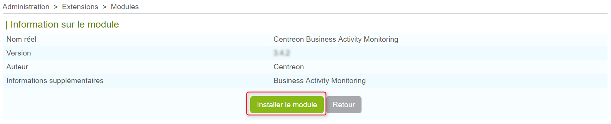
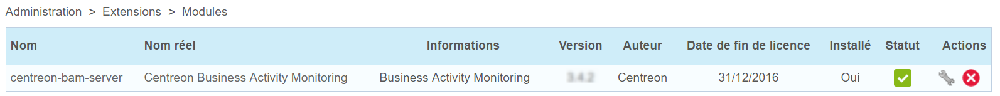

> Centreon BAM est une **extension** Centreon qui requiert une license
> valide. Pour plus d'information, contactez
> [Centreon](mailto:sales@centreon.com).

## Prerequisites

La version de Centreon nécessaire au fonctionnement de Centreon BAM
est la version **Centreon 20.10**

## Installation

### Installation du paquet

Ajouter le dépôt Centreon BAM fourni par Centreon.

``` shell
yum install https://yum.centreon.com/centreon-bam/d4e1d7d3e888f596674453d1f20ff6d3/20.10/el7/stable/noarch/RPMS/centreon-bam-release-20.10-2.el7.centos.noarch.rpm
```

Et installer le paquet en exécutant les commandes ci-dessous :

``` shell
yum install centreon-bam-server
```

### Charger la licence

Le fichier de licence "bam.license" est fourni par Centreon, pour
l'installer, rendez vous dans `Administration > Extensions > Gestionnaire` puis
télécharger la via l'interface.

### Installation sur l'interface

Se connecter sur l'interface web de Centreon en utilisant un compte
ayant les droits d'installer des modules et se rendre dans le menu
`Administration > Extensions > Gestionnaire`.

Cliquer sur l'icône d'installation correspondante au module **Centreon
BAM** située dans la colonne Actions:



Cliquer sur le bouton **Install module** :



Cliquer sur "Back", le module est maintenant installé :



> Si vous utilisez une réplication MariaDB pour vos bases de données de
> **monitoring**, lors de l'installation de Centreon BAM, une vue est
> créée. Il faut l'exclure de la réplication en rajoutant la ligne
> suivante dans le fichier my.cnf du slave
>
> ``` text
> replicate-ignore-table=centreon.mod_bam_view_kpi
> ```
>
> puis créer les vues sur le slave en lançant la commande:
>
> ``` shell
> myqsl centreon < view_creation.sql
> ```
