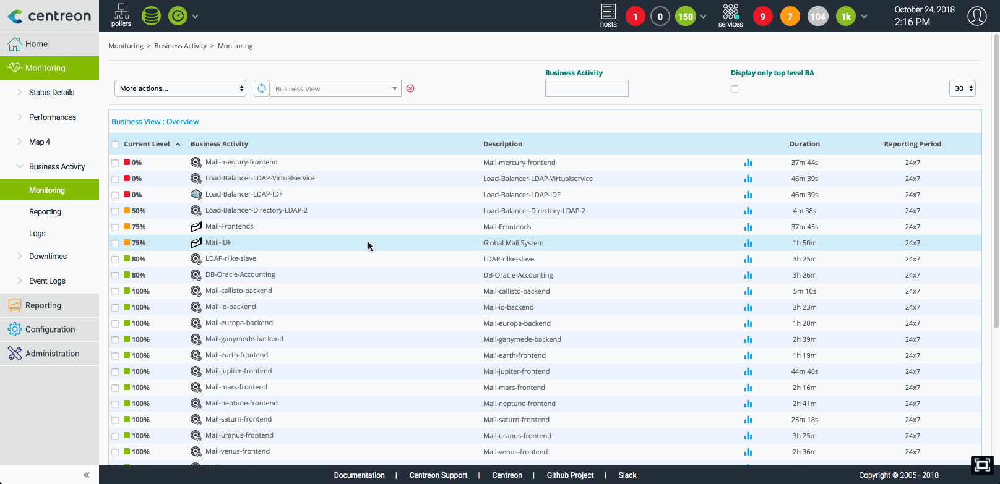

La fonctionnalité de "Service Mapping" de Centreon se base sur l'extension appellée "Centreon Business 
Activity Monitoring" (Centreon BAM)

> Centreon BAM est une **extension** Centreon qui requiert une license valide. Pour plus d'information,
> contactez [Centreon](mailto:sales@centreon.com).

Le module **Centreon Business Activity Monitoring** offre la possibilité
de mesurer en temps réel l\'activité de la production informatique en
agrégeant les états des différents points de contrôle supervisés avec
**Centreon**. L\'utilisateur est alors mieux informé de l\'état de santé
global de son SI et à même de prendre les meilleures décisions.

**Centreon BAM** utilise un moteur avancé de calcul des \"**Business
Activities**\" (BA), à partir d\'indicateurs de performance clés
(**KPI**) supervisés par **Centreon**.

La représentation graphique des données est faite en temps réel, ce qui
permet d\'avoir une console dédiée à la supervision de ses activités
métiers.

Cette documentation a pour but de guider l\'utilisateur sur
l\'installation, la configuration des vues métiers, sur le déploiement
des activités métiers ainsi que sur l\'exploitation des données
disponibles au travers du module **Centreon BAM**.

Définitions :

-   **BA** (\"Business Activity\") : Activité métier
-   **BV** (\"Business View\") : Regroupement d\'activité métier
-   **KPI** (\"Key Performance Indicator\") : Indicateur pondéré
    rentrant en considération dans le calcul de la BA.

