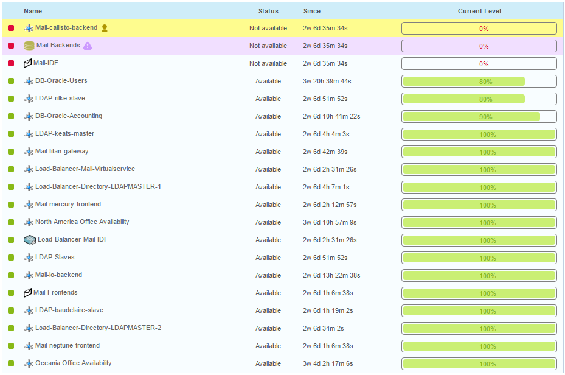
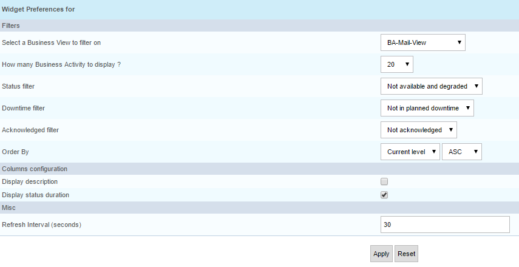

## Live Business Activity Status

Ce widget vous permet d'afficher sur la page d'accueil de Centreon, sous
forme de widget, l'état actuel de vos activités métier.

## Paramètres

**Description**

-   Select a Business View to filter on : sélection de vue métier. Si
    laisser vide, toutes les BAs seront prise (en fonction des ACLs)
-   How many Business Activity to display ? : nombre d'activité métier à
    afficher
-   Status filter : permet de filtrer sur le status des activités métiers
-   Downtime filter : permet filtrer pour ne garder que les activités
    métiers sur lesquelles un temps d'arrêt planifié est en cours ou ne
    pas les afficher
-   Acknowledged filter : permet de filtrer pour ne garder que les
    activités métier sur lesquelles une personne intervient
    (acquittement en cours) ou ne pas les afficher
-   Order By : définissez dans quel ordre les activité métier doivent
    être classées
-   Display description : afficher ou non la description
-   Display status duration : afficher ou non la durée passée dans le
    statut en cours
-   Display only top level BA : afficher uniquement les BA n'ayant pas
    de parents. Pour un utilisateur non admin, le calcul des BAs n'ayant
    pas de parent prend en compte les ACLs
-   Refresh Interval (seconds) : Intervalle de rafraîchissement

**Exemple**

