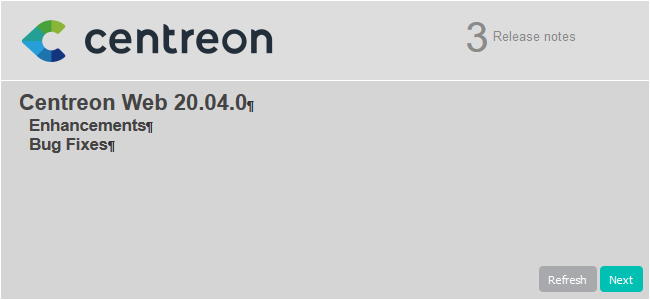
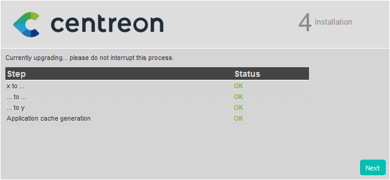

Ce chapitre décrit la procédure de mise à jour de votre plate-forme Centreon
20.10.

## Sauvegarde

Avant toute chose, il est préférable de s’assurer de l’état et de la consistance
des sauvegardes de l’ensemble des serveurs centraux de votre plate-forme :

- Serveur Centreon Central,
- Serveur de gestion de base de données.

## Mise à jour du serveur Centreon Central

### Mise à jour de la solution Centreon

Videz le cache de yum :

```shell
yum clean all --enablerepo=*
```

Mettez à jour l'ensemble des composants :

```shell
yum update centreon\*
```

### Finalisation de la mise à jour

Connectez-vous à l'interface web Centreon pour démarrer le processus de
mise à jour :

Cliquez sur **Next** :


Cliquez sur **Next** :


La note de version présente les principaux changements, cliquez sur **Next** :



Le processus réalise les différentes mises à jour, cliquez sur **Next** :



Votre serveur Centreon est maintenant à jour, cliquez sur **Finish** pour
accéder à la page de connexion :


> Si le module Centreon BAM est installé, référez-vous à la [documentation
> associée](../service-mapping/update.html) pour le mettre à jour.

Déployez ensuite la configuration du Central depuis l'interface web en
suivant [cette
procedure](../monitoring/monitoring-servers/deploying-a-configuration.html),

Enfin, redémarrez Broker, Engine et Gorgone sur le serveur Central en exécutant
la commande suivante:

```shell
systemctl restart cbd centengine gorgoned
```

### Mise à jour des extensions

Depuis le menu `Administration > Extensions > Gestionnaire`, mettez à jour
toutes les extensions, en commençant par les suivantes :

  - License Manager,
  - Plugin Packs Manager,
  - Auto Discovery.

Vous pouvez alors mettre à jour toutes les autres extensions commerciales.

## Mise à jour des Remote Servers

Cette procédure est identique à la mise à jour d'un serveur Centreon Central.

> En fin de mise à jour, la configuration doit être déployée depuis le serveur
> Central.

## Mise à jour des Pollers

Videz le cache de yum :

```shell
yum clean all --enablerepo=*
```

Mettez à jour l'ensemble des composants :

```shell
yum update centreon\*
```

Déployez la configuration du Poller depuis l'interface web en suivant [cette
procedure](../monitoring/monitoring-servers/deploying-a-configuration.html), et
en choisissant la méthode *Redémarrer* pour le processus Engine

Redémarrez enfin le service Gorgone s'il est utilisé sur le Poller :

```shell
systemctl restart gorgoned
```
