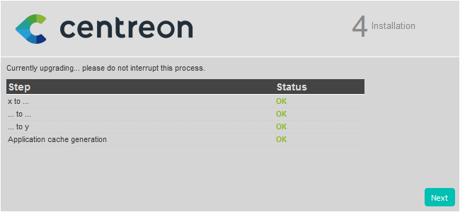

Ce chapitre décrit la procédure de mise à jour de votre plate-forme vers
Centreon 20.04.

Pour mettre à jour votre serveur Centreon Map, TODO

Pour mettre à jour votre serveur Centreon MBI, TODO

## Sauvegarde

Avant toute chose, il est préférable de s’assurer de l’état et de la consistance
des sauvegardes de l’ensemble des serveurs centraux de votre plate-forme :

- Serveur(s) Centreon central(aux) ;
- Serveur(s) de gestion de base de données ;

## Montée de version du serveur Centreon central

### Mise à jour du système d’exploitation

Pensez à mettre à jour votre système d'exploitation via la commande :

```shell
yum update
```

> Acceptez toutes les clés GPG proposées et pensez a redémarrer votre serveur si
> une mise à jour du noyau est proposée.

### Mise à jour des dépôts

Il est nécessaire de mettre à jour le dépôt Centreon.

Exécutez la commande suivante :

```shell
yum install -y http://yum.centreon.com/standard/20.04/el7/stable/noarch/RPMS/centreon-release-20.04-1.el7.centos.noarch.rpm
```

### Montée de version de la solution Centreon

Mettez à jour le cache de yum :

```shell
yum clean all --enablerepo=*
```

Mettez à jour l'ensemble des composants :

```shell
yum update centreon\*
```

> Acceptez les nouvelles clés GPG des dépôts si nécessaire.

### Actions complémentaires

#### Mise à jour de la version de PHP

Centreon 20.04 utilise un nouveau paquet PHP.

Le fuseau horaire par défaut de PHP 7 doit être configuré. Executez la commande
suivante :

```shell
echo "date.timezone = Europe/Paris" > /etc/opt/rh/rh-php72/php.d/php-timezone.ini
```

> Changez **Europe/Paris** par votre fuseau horaire.

> N'oubliez pas de reporter les configurations spécifiques qui peuvent être
> configurées dans /etc/opt/rh/rh-php71/php.ini et/ou
> /etc/opt/rh/rh-php71/php-fpm.d/centreon.conf

Réalisez les actions suivantes :

```shell
systemctl disable rh-php71-php-fpm
systemctl stop rh-php71-php-fpm
systemctl enable rh-php72-php-fpm
systemctl start rh-php72-php-fpm
systemctl restart httpd24-httpd
```

### Finalisation de la mise à jour

Connectez-vous à l'interface web Centreon pour démarrer le processus de mise à
jour :

Cliquez sur **Next** :


Cliquez sur **Next** :


La note de version présente les principaux changements, cliquez sur **Next** :


Le processus réalise les différentes mises à jour, cliquez sur **Next** :



Votre serveur Centreon est maintenant à jour, cliquez sur **Finish** pour
accéder à la page de connexion :


Pour mettre à jour votre module Centreon BAM, référez-vous à la [documentation
associée](https://documentation-fr.centreon.com/docs/centreon-bam/en/latest/update/index.html).

### Actions post montée de version

#### Démarrer le gestionnaire de tâches

Centreon 20.04 a changé son gestionnaire de tâches en passant de *Centcore* à
*Gorgone*.

Pour acter ce changement, réalisez les actions suivantes :

```shell
systemctl stop centcore
systemctl enable gorgoned
systemctl start gorgoned
```

> Par défaut, la communication entre le Central et les Pollers ou Remote
> Servers sera toujours effectuée en utilisant le protocole SSH.
>
> Reportez vous à la procédure *TODO* pour modifier le protocole de
> communication.

#### Redémarrage des processus de supervision

Le composant Centreon Broker a changé le format de son fichier de configuration.

Il utilise maintenant JSON à la place de XML.

Pour être sur que Broker et que le module Broker de Engine utilisent les nouveaux
fichiers de configuration, suivez ces étapes :

1. Déployer la configuration du Central depuis l'interface web en suivant
*[cette procedure](../monitoring/deploy.html)*,
2. Redémarrer Broker et Engine sur le serveur Central en exécutant la commande
suivante:

    ```shell
    systemctl restart cbd centengine
    ```

## Montée de version des collecteurs

### Mise à jour des dépôts

Exécutez la commande suivante :

```shell
yum install -y http://yum.centreon.com/standard/20.04/el7/stable/noarch/RPMS/centreon-release-20.04-1.el7.centos.noarch.rpm
```

### Montée de version de la solution Centreon

Mettez à jour l'ensemble des composants :

```shell
yum update centreon\*
```

> Acceptez les nouvelles clés GPG des dépôts si nécessaire.

### Actions post montée de version

Du fait du nouveau format de configuration du module Broker de Engine, la
configuration doit être re-déployée.

Déployer la configuration du Poller depuis l'interface web en suivant
*[cette procedure](../monitoring/deploy.html)*, et en choisissant la méthode
*Redémarrer* pour le processus Engine

## Mise à jour des Remote Servers

Cette procédure est identique à la mise à jour d'un serveur Centreon Central.
