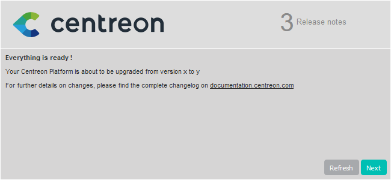

Ce chapitre décrit la procédure de montée de version de votre plate-forme
Centreon depuis la version 20.04 vers la version 20.10.

## Sauvegarde

Avant toute chose, il est préférable de s’assurer de l’état et de la consistance
des sauvegardes de l’ensemble des serveurs centraux de votre plate-forme :

- Serveur Centreon Central,
- Serveur de gestion de base de données.

## Montée de version du serveur Centreon Central

### Mise à jour des dépôts

Il est nécessaire de mettre à jour le dépôt Centreon.

Exécutez la commande suivante :

```shell
yum install -y http://yum.centreon.com/standard/20.10/el7/stable/noarch/RPMS/centreon-release-20.10-2.el7.centos.noarch.rpm
```

> Si vous êtes dans un environnement CentOS, il faut installer les dépôts de
> *Software Collections* avec la commande suivante :
>
> ```shell
> yum install -y centos-release-scl-rh
> ```

### Montée de version de la solution Centreon

Videz le cache de yum :

```shell
yum clean all --enablerepo=*
```

Mettez à jour l'ensemble des composants :

```shell
yum update centreon\*
```

> Acceptez les nouvelles clés GPG des dépôts si nécessaire.

### Finalisation de la mise à jour

Avant de démarrer la montée de version via l'interface web, rechargez le
serveur Apache avec la commande suivante :

```shell
systemctl reload httpd24-httpd
```

Connectez-vous ensuite à l'interface web Centreon pour démarrer le processus de
mise à jour :

Cliquez sur **Next** :


Cliquez sur **Next** :


La note de version présente les principaux changements, cliquez sur **Next** :



Le processus réalise les différentes mises à jour, cliquez sur **Next** :


Votre serveur Centreon est maintenant à jour, cliquez sur **Finish** pour
accéder à la page de connexion :


Si le module Centreon BAM est installé, référez-vous à la [documentation
associée](../service-mapping/upgrade.html) pour le mettre à jour.

### Actions post montée de version

#### Montée de version des extensions

Depuis le menu `Administration > Extensions > Gestionnaire`, mettez à jour
toutes les extensions, en commençant par les suivantes :

  - License Manager,
  - Plugin Packs Manager,
  - Auto Discovery.

Vous pouvez alors mettre à jour toutes les autres extensions commerciales.

## Montée de version des Remote Servers

Cette procédure est identique à la montée de version d'un serveur Centreon
Central.

## Montée de version des Pollers

### Mise à jour des dépôts

Exécutez la commande suivante :

```shell
yum install -y http://yum.centreon.com/standard/20.10/el7/stable/noarch/RPMS/centreon-release-20.10-2.el7.centos.noarch.rpm
```

> Si vous êtes dans un environnement CentOS, il faut installer les dépôts de
> *Software Collections* avec la commande suivante :
>
> ```shell
> yum install -y centos-release-scl-rh
> ```

### Montée de version de la solution Centreon

Videz le cache de yum :

```shell
yum clean all --enablerepo=*
```

Mettez à jour l'ensemble des composants :

```shell
yum update centreon\*
```

> Acceptez les nouvelles clés GPG des dépôts si nécessaire.

## Sécurisez votre plateforme

N'oubliez pas de sécuriser votre plateforme Centreon en suivant nos
[recommandations](../administration/secure-platform.html)
