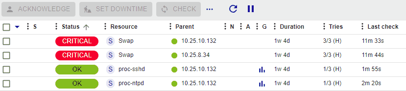

import Tabs from '@theme/Tabs';
import TabItem from '@theme/TabItem';

## Acquitter une alerte

### Principe

Lorsqu'un hôte ou un service présente un incident et que ce dernier est
validé, le processus de notification est enclenché, pouvant générer une
notification envoyée à un contact.

L'acquittement d'une alerte permet de stopper le processus de
notification (envoi de notifications), jusqu'à ce que l'hôte ou le
service retrouve un statut nominal.

Exemple d'utilisation :

Un service est chargé de vérifier la santé des disques durs d'une baie
de disques. Un disque dur physique tombe en panne sur une baie de disques,
une notification est envoyée. L'opérateur de supervision acquitte le
service en précisant qu'une équipe est en train de régler le problème.
Les notifications ne sont plus envoyées. Le service reprendra son état
nominal après changement du disque.

> L'acquittement d'une alerte signifie la prise en compte du problème
> par un utilisateur de la supervision, et non la résolution de ce
> dernier qui ne pourra être effective que lorsque le contrôle sera
> revenu dans son état nominal.

### Comportement spécifique aux activités métier

> Si vous utilisez le module **Business Activity Monitoring**, les acquittements d'une alerte s'appliquent uniquement à l'objet concerné (activité métier ou KPI).

Les acquittements s'appliquent aux activités métier (BA) comme suit :
- L'acquittement d'une activité métier n'entraîne pas l'acquittement de ses KPIs sous-jacents (que ces KPIs soient une activité métier, un service ou un méta-service).
- L'acquittement d'un KPI n'entraîne pas l'acquittement de l'activité métier qui en dépend.

### En pratique

Pour acquitter une alerte :

1. Allez à la page **Supervision > Statut des ressources**.
2. Utilisez une des méthodes suivantes :
    - Sélectionnez le ou les objets que vous souhaitez acquitter, puis cliquez sur le bouton **Acquitter** au-dessus de la liste des ressources.
    - Survolez la ressource désirée, puis cliquez sur l'icône **Acquitter** qui apparaît à gauche :

    

    Une fenêtre apparaît :

    - Le champ **Commentaire** est généralement utilisé pour fournir la raison de l'acquittement et est obligatoire.

    - Si la case **Notifier** est cochée, alors une notification est envoyée aux contacts liés à l'objet pour les avertir que l'incident sur la ressource a été acquitté (dans le cas où le filtre de notification d'acquittement est activé pour ce contact).

    - Si la case **Sticky pour tout statut non-OK** est cochée, alors l'acquittement sera conservé en cas de changement de statut non-OK (Exemple DOWN à UNREACHABLE ou bien WARNING à CRITICAL). Sinon, l'acquittement disparaît et le processus de notification est réactivé.
   - Si, pour un hôte, la case **Acquitter les services attachés à l'hôte** est cochée, acquitter une alerte sur l'hôte acquittera tous les services liés à cet hôte automatiquement.

### Supprimer un acquittement

Pour supprimer l'acquittement d'un incident sur un objet :

1. Allez à la page **Supervision > Statut des ressources**.
2. Sélectionnez le ou les objets à désacquitter.
3. Dans le menu **Plus d'actions**, cliquez sur **Désacquitter**.
