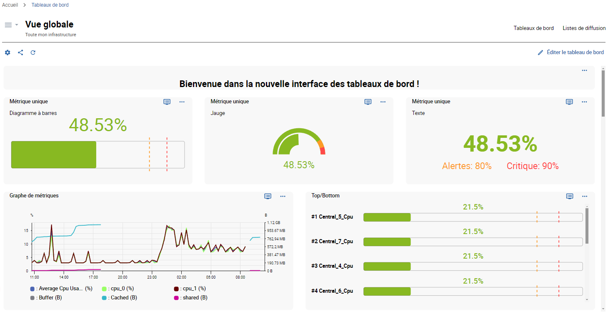
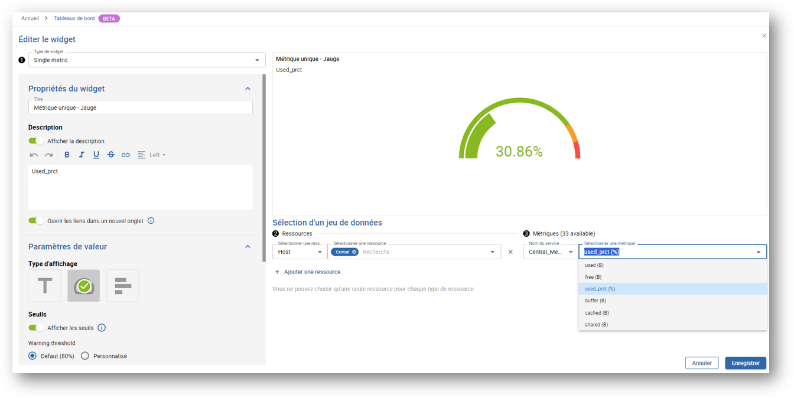

> Centreon Tableaux de bord est maintenant disponible en version bêta.

Commencez par créer des tableaux de bord et ajoutez des widgets spécialement conçus pour optimiser votre expérience utilisateur. Bénéficiez ensuite d'options de visualisation de données pour afficher et suivre vos ressources en temps réel.

## Créer votre premier tableau de bord

1. Allez dans **Accueil > Tableaux de bord Beta**.
2. Dans la page **Bibliothèque de tableaux de bord**, cliquez sur le bouton **Créer un tableau de bord**. Cela ouvre la modale **Créer un tableau de bord**.
3. Nommez le tableau de bord et renseignez une description si nécessaire.
4. Cliquez sur **Créer** pour confirmer la création.

Votre tableau de bord est maintenant ajouté ! Vous pouvez directement commencer à ajouter des widgets.

### Ajouter des widgets

> Votre tableau de bord doit être ouvert en mode édition.

- S'il s'agit de votre tout premier widget, cliquez sur la zone **Ajouter widget**.
- Sinon, cliquez sur le bouton **+ Ajouter widget** à droite de l'interface.

La majorité des widgets fonctionnent généralement selon les étapes suivantes : 

- **Étape 1 :** sélectionnez le type de widget. Les paramètres du widget dépendent ensuite du widget sélectionné.
- **Étape 2 :** sélectionnez les ressources.
- **Étape 3 :** sélectionnez les métriques.

> Assurez-vous de sauvegarder vos modifications. Si vous quittez sans sauvegarder votre tableau de bord, les modifications seront définitivement perdues.

### Autres actions

Cliquez sur le menu avec les **trois points verticaux** en haut à droite du widget pour le modifier ou pour accéder à d'autres actions :
- Actualiser
- Dupliquer
- Supprimer le widget

> En mode édition, vous pouvez facilement organiser vos widgets en les déplaçant ou en les redimensionnant. N'oubliez pas de sauvegarder vos modifications.

## Gérer les tableaux de bord

> Vous devez être dans la page **Bibliothèque de tableaux de bord** pour avoir une vue d'ensemble de vos tableaux de bord.

### Modifier un tableau de bord

#### Mettre les propriétés à jour

Cliquez sur le bouton **roue dentée** en bas à droite du tableau de bord pour mettre son nom et sa description à jour.

#### Modifier les widgets du tableau de bord 

1. Cliquez sur le tableau de bord pour l'ouvrir en mode vue.
2. Cliquez sur **Éditer le tableau de bord** pour accéder aux widgets et les gérer en mode édition.

### Supprimer un tableau de bord

Cliquez sur le bouton **Corbeille** en bas à gauche du tableau de bord pour le supprimer. Confirmez ensuite la suppression.

### Partager un tableau de bord

> Vous pouvez partager des tableaux de bord en utilisant l'interface **Gestion des droits d'accès**.

#### À propos des droits d'accès

Vous utilisez la fonctionnalité Tableaux de bord avec un profil de **viewer** ou **editor** :

- Les **viewers** : peuvent uniquement visualiser les tableaux de bord que vous partagez avec eux.
- Les **editors** : peuvent visualiser et modifier les tableaux de bord que vous partagez avec eux.

#### Gérer les droits d'accès

1. Cliquez sur le bouton **partager** en bas à droite du tableau de bord.
2. Dans la liste déroulante **Ajouter un contact**, sélectionnez l'utilisateur à ajouter.
3. Sélectionnez le profil **Viewer** ou **Editor**.
4. Cliquez sur le bouton **+** pour l'ajouter.
5. Répétez l'action pour chaque utilisateur que vous souhaitez ajouter.
6. Cliquez sur le bouton **Mettre à jour** pour enregistrer vos modifications.

Les utilisateurs que vous venez d'ajouter ont maintenant accès au partage de votre tableau de bord, selon le profil que vous avez défini pour eux.

> Utilisez la fonction **Copier le lien** pour partager l'URL du tableau de bord directement avec les utilisateurs qui ont accès à votre plateforme.
