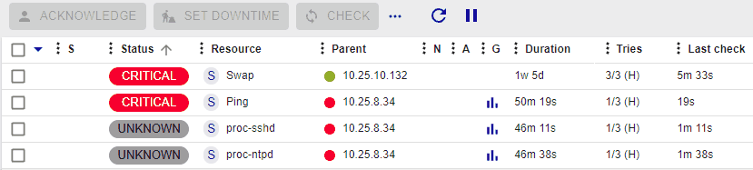
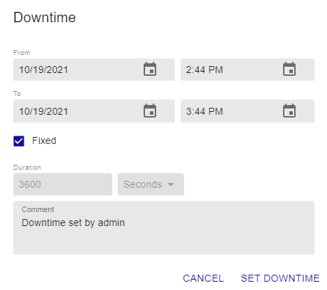
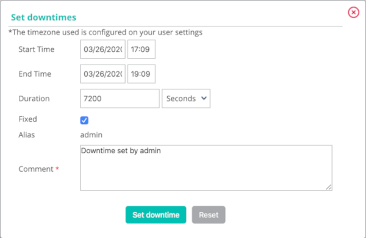

import Tabs from '@theme/Tabs';
import TabItem from '@theme/TabItem';

## Adding a downtime

### Principle

A downtime period is a time period during which the notifications to a
resource are disabled. Downtimes period are used during a programmed
maintenance operation, they save us receiving false-positive alerts.

> It is important to select all the resources necessary to prevent
> false-positives and false-negatives. In addition, the time spent in
> this state is taken into account during the generation of the
> availability data.

There are two types of downtimes:

-   The **fixed** downtime: it starts and stops at the preview time.
-   The **flexible** downtime: it starts during the preview time window
    as soon as an incident is detected and finishes when preview time in
    seconds expires.

### Practice

There are several ways to define a downtime:

-   From the **Resources Status** page
-   From the detail sheets of a host or of the service
-   From the real time monitoring interface
-   From the **Downtime** menu

<Tabs groupId="sync">
<TabItem value="Resources Status page" label="Resources Status page">

1. Go to **Monitoring > Resources Status**.
2. Use one of the following methods:
    - Select the object(s) that you want to define a downtime on, then click the **Set Downtime** button above the list of resources.
    - Hover over the resource you want to define a downtime on, then click the **Set Downtime** icon that appears on the left.

        

    The following window appears:

    

    -   The **From** and **To** fields define the beginning and
    end date of the downtime. Downtimes cannot start or end after December 31, 2099, 11:59 pm.

    -   If the **Fixed** box is checked the downtime is fixed. Otherwise, it
    is flexible.

    -   If the downtime is flexible, the **Duration** field defines the
    length of the downtime.

    -   The **Comments** field can be used to indicate why the downtime is
    defined.

</TabItem>
<TabItem value="Detailed sheet of an object" label="Detailed sheet of an object">

1.  Access the detail page of an object
2.  In the category: **Commands**, click on **Schedule downtime for this
    host/service**

    The following window appears:

    

-   The **Host Name** field defines the host concerned by the downtime
-   The **Service** field defines the service concerned by the downtime
-   If the **Fixed** box is checked the downtime is fixed. Otherwise, it
    is flexible
-   If the downtime is flexible, the **Duration** field defines the
    length of the downtime
-   The **Start Time** and **End Time** fields define the beginning and
    end date of the downtime. Downtimes cannot start or end after December 31, 2099, 11:59 pm.
-   The **Comments** field can be used to indicate why the downtime is
    defined

</TabItem>
<TabItem value="Real time monitoring" label="Real time monitoring">

1.  Go into the **Monitoring > Status Details > Hosts** (or **Services**)
    menu
2.  Select the(s) object(s) on which you want to program a downtime
    period
3.  In the **More actions…** menu, click on **Hosts : Set Downtime** or
    **Services : Set Downtime**

    The following window appears:

    

    -   The **Host Name** field defines the host concerned by the downtime
    -   The **Service** field defines the service concerned by the downtime
    -   If the **Fixed** box is checked the downtime is fixed. Otherwise, it
        is flexible
    -   If the downtime is flexible, the **Duration** field defines the
        length of the downtime
    -   The **Start Time** and **End Time** fields define the beginning and
        end date of the downtime. Downtimes cannot start or end after December 31, 2099, 11:59 pm.
    -   The **Comments** field can be used to indicate why the downtime is
        defined

</TabItem>
<TabItem value="Downtime menu" label="Downtime menu">

1.  Go into the **Monitoring > Downtimes > Downtimes** menu
2.  Click on **Add a service downtime** or **Add a host downtime**

    The following window appears:

    

    -   The **Host Name** field defines the host concerned by the downtime
    -   The **Service** field defines the service concerned by the downtime
    -   If the **Fixed** box is checked the downtime is fixed. Otherwise, it
        is flexible
    -   If the downtime is flexible, the **Duration** field defines the
        length of the downtime
    -   The **Start Time** and **End Time** fields define the beginning and
        end date of the downtime. Downtimes cannot start or end after December 31, 2099, 11:59 pm.
    -   The **Comments** field can be used to indicate why the downtime is
        defined

</TabItem>
</Tabs>

## Recurrent downtimes

### Principle

A downtime period is a time period during which the notifications to a
host or a service are disabled. Downtime periods are convenient during
maintenance operations on a host or a service: they allow us to avoid
receiving false positive.

Recurrent Downtime periods are Downtime periods that recurs
repetitively.

E.g.: A back-up of the virtual machines is performed every day from
20h00 to midnight. This type of back-up has a tendency to saturate the
CPU use of all the virtual machines. It is necessary to program
recurrent Downtime periods on the services concerned to avoid receiving
notifications from 20h00 to midnight.

> The Downtime periods are taken into account in the calculation of the
> availability ratio of the resource in the
> **[Dashboard](../reporting/introduction#simple-reporting)**.

### Practice

There are two types of Downtime periods:

-   The **fixed** downtime period: This means that the downtime period
    takes place during exactly the time period defined.
-   The **flexible** downtime period: This means that if during the time
    period defined the service or the host returns a Not-OK status the
    downtime period lasts a certain number of seconds (to be defined in
    the form) from the moment when the host or the status returns a
    Not-OK status.

To add a recurrent downtime period go into the
**Monitoring > Downtimes > Recurrent Downtimes** menu and click on
**Add**.

#### Configuration of Downtime periods

-   The **Name** and **Description** fields serve to give a name and
    describe the recurrent downtime period.
-   The **Enable** field serves to enable or disable the downtime
    period.
-   The **Periods** field serves to define one or more periods of
    recurrent downtime periods. To add a period, click on the symbol
    .

It is possible to choose three types of period:

-   Weekly: to choose the days of the week
-   Monthly: to choose the days of the month
-   Specific date: to choose specific dates

-   The **Days** field defines the day(s) concerned.
-   The **Time period** field contains the time period concerned
    (expressed in HH:MM - HH:MM).
-   The **Downtime type** field defines the type of downtime period
    desired.

> It is possible to combine several types of periods within the same
> downtime period.

#### Relations

-   The **Linked with Hosts** list can be used to choose the host(s)
    concerned by the recurrent downtime period.
-   If **Linked with Host Groups** is chosen with the list Linked with
    the host group all the hosts belonging to this group are concerned
    by the recurrent downtime period.
-   The **Linked with Services** list can be used to choose the
    service(s) concerned by the recurrent downtime period.
-   If a service group is chosen with the list **Linked with Service
    Groups** all the services belonging to this group are concerned by
    the recurrent downtime period.
