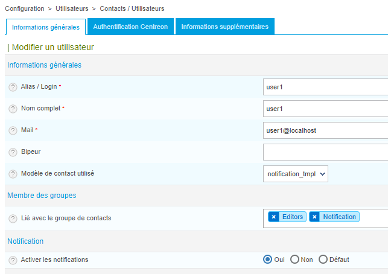

Par défaut, les notifications sont actives pour tous les hôtes et tous les services. Dans Centreon Cloud, les notifications sont envoyées par le serveur central.

## Dans quels cas des notifications sont-elles envoyées?

Des notifications sont envoyées dans les cas suivants :

* quand une ressource est dans un état non-ok (**Alerte** ou **Critique** pour un service, **Indisponible** ou **Injoignable** pour un hôte)
* quand une ressource revient dans un état OK
* quand une plage de maintenance commence.

## À qui sont envoyées les notifications?

Les notifications sont envoyées à tous les utilisateurs pour qui celles-ci ont été configurées.

Pour permettre à un utilisateur de recevoir des notifications :

1. Allez à la page **Configuration > Utilisateurs > Contacts/Utilisateurs** puis cliquez sur le contact qui devra recevoir les notifications.
2. Dans la section **Informations générales**, dans le champ **Modèle de contact utilisé**, sélectionnez **notification_tmpl**.
3. Dans la section **Lié avec le groupe de contacts**, vérifiez que l'utilisateur a le [rôle](../users/users.md#rôles-des-utilisateurs) **Notifications** .
4. Dans la section **Notification**, vérifiez que **Activer les notifications** a pour valeur **Oui**.
5. Cliquez sur **Sauvegarder**.
6. [Déployez](../monitoring/monitoring-servers/deploying-a-configuration.md) la configuration.

## Comment sont contrôlées les ressources?

Les ressources sont contrôlées selon les paramètres suivants :

* Les contrôles ont lieu 24x7, toutes les 5 minutes tant que l'hôte ou le service sont dans un état OK.
* Lorsqu'un hôte ou un service entre dans un statut non-ok (type de statut SOFT, par exemple Injoignable SOFT pour un hôte), Centreon vérifie 3 fois que l'hôte ou le service est toujours dans un état non-OK (ces 3 contrôles sont chacun espacés d'une minute).
* Si, après ces 3 contrôles, la ressource est toujours dans un statut non-ok, son type de statut devient HARD et les notifications commencent à être envoyées.
* Des contrôles ont alors lieu toutes les 5 minutes pour vérifier si la ressource est toujours dans un statut HARD. Des notifications sont envoyées toutes les 5 minutes.

> Pour assurer la compatibilité avec les versions futures, ne changez pas ces valeurs.

## Troubleshooting

### Les contacts ne reçoivent pas d'emails de notification

Vérifiez que les notifications sont activées pour le contact, que celui-ci a bien le rôle **Notifications**, et que le modèle de contact **notification_tmpl** est bien sélectionné (voir [ci-dessus](#à-qui-sont-envoyées-les-notifications)).

### Des notifications ont été envoyées en-dehors de la période temporelle définie

Vérifiez le fuseau horaire de l'utilisateur à qui sont envoyées les notifications :

1. Allez à la page **Configuration > Utilisateurs > Contacts/Utilisateurs**, puis cliquez sur le contact à qui vous voulez que les notifications soient envoyées.

2. Vérifiez le champ **Fuseau horaire/Localisation**. La période de temps pendant laquelle les notifications seront envoyées à l'utilisateur est la période de temps dans son fuseau horaire.
