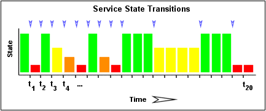

## Introduction

Centreon Engine détecte les hôtes et les services bagotants ("flapping"). Le bagotage se produit lorsqu'un service ou un hôte change de statut trop souvent. Cela empêche Centreon d'envoyer de nombreuses notifications d'alerte et de récupération : une seule notification de bagotage est envoyée (une en début et une en fin de bagotage). Le bagotage peut indiquer des services gênants ou de vrais problèmes de réseau.

## Fonctionnement de la détection de bagotage

Chaque fois que le moteur Centreon contrôle l'état d'un hôte ou d'un service, il
vérifie s'il a commencé ou arrêté de bagoter. Pour ce faire, il :

* Stocke les résultats des 21 dernièrs contrôles sur l'hôte ou le service.
* Détermine le pourcentage de changement d'état qui se sont produits pour l'hôte ou le service au cours de ces 21 contrôles.
* Compare le pourcentage de changement d'état aux seuils de bagotage bas et haut.

Un hôte ou un service est considéré comme ayant commencé à bagoter lorsque son
pourcentage de changement d'état **dépasse pour la première fois le seuil de bagotage haut**. Lorsqu'un hôte ou un service est en état de bagotage :

* À la page **Statut des ressources**, il est affiché sur fond vert.
* À la page **Statut des ressources**, l'icône suivante est affichée dans son panneau **Détails** et dans la colonne **État** :
    
* Si les notifications de bagotage sont activées, une notification est envoyée lorsque la ressource commence à bagoter, et une autre est envoyée lorsqu'elle cesse de bagoter. Les notifications d'alerte et de récupération sont temporairement désactivées.

Dans la page **Statut des ressources**, vous pouvez filtrer la vue pour n'afficher que les ressources bagotantes.

Un hôte ou un service est considéré comme ayant cessé de bagoter lorsque son pourcentage de changmenet de statut passe en dessous du seuil bas de bagotage.

## Seuils de bagotage

Dans Centreon Cloud, les seuils de bagotage sont les suivants :

| Seuil | Hôtes | Services |
| --- | --- | --- |
| Seuil bas de détection de bagotage | 25 | 25 |
| Seuil haut de détection de bagotage | 50 | 50 |

## Exemple

Décrivons plus en détail le fonctionnement de la détection de
bagotage avec les services.

L'image ci-dessous montre un historique chronologique pour un service
des états des 21 derniers contrôles. Les états OK sont affichés en vert,
les états WARNING en jaune, les états CRITICAL en rouge et les états
UNKNOWN en orange.

L'historique des résultats de la vérification du service sont examinés
pour déterminer où se produisent les changements / transitions de
statuts. Les changements de statut se produisent lorsqu'un état archivé
est différent de l'état archivé qui le précède immédiatement
chronologiquement. Étant donné que nous conservons les résultats des 21
dernières vérifications du service, il est possible d'avoir au plus 20
changements de statuts. Dans cet exemple, il y a 7 changements de
statuts, indiqués par des flèches bleues dans l'image ci-dessus.

La logique de détection des bagotages utilise les changements de
statuts pour déterminer un pourcentage global de changement de statuts
pour le service. Il s'agit d'une mesure de la volatilité / du changement
pour le service. Les services qui ne changent jamais de statuts auront
une valeur de changement de statuts de 0%, tandis que les services qui
changent de statuts chaque fois qu'ils sont vérifiés auront un
changement de statuts de 100%. La plupart des services auront un
changement de statuts en pourcentage quelque part entre les deux.

Lors du calcul du pourcentage de changement de statuts pour le service,
l'algorithme de détection des bagotages donnera plus de poids aux
nouveaux changements par rapport aux anciens. Plus précisément, les
routines de détection des bagotages sont conçues pour que le
changement de statut le plus récent ait 50% de poids en plus que le
changement le plus ancien. L'image ci-dessous montre comment les
changements récents ont plus de poids que les changements plus anciens
lors du calcul du changement de statut global ou total en pourcentage
pour un service particulier.

À l'aide des images ci-dessus, calculons le pourcentage de changement de
statut pour le service. Vous remarquerez qu'il y a un total de 7
changements de statuts (à t\_3, t\_4, t\_5, t\_9, t\_12, t\_16 et
t\_19). Sans aucune pondération des changements au fil du temps, cela
nous donnerait un changement d'état total de 35%:

(7 changements observés / 20 possible changements) \* 100 = 35 %

Étant donné que la logique de détection des bagotages donnera aux
changements d'état plus récents un taux plus élevé que les changements
plus anciens, le pourcentage réel de changement calculé sera légèrement
inférieur à 35% dans cet exemple. Disons que le pourcentage pondéré du
changement d'état s'est avéré être de 31%.

Le pourcentage de changement de statut calculé pour le service (31%)
sera ensuite comparé aux seuils de bagotages pour voir ce qui devrait
se produire:

-   Si le service était en état régulier auparavant, et que 31% est égal
    ou supérieur au seuil de bagotage haut, le moteur Centeron
    considère que le service vient de commencer à bagoter.
-   Si le service était en état de bagotage précédemment et que 31%
    est inférieur au seuil de bagotage bas, le moteur Centreon
    considère que le service redevient dans un état régulier.

Si aucune de ces deux conditions n'est remplie, la logique de détection
des bagotages ne fera rien d'autre avec le service, car soit le service
est en état de bagotage, soit en état régulier.
