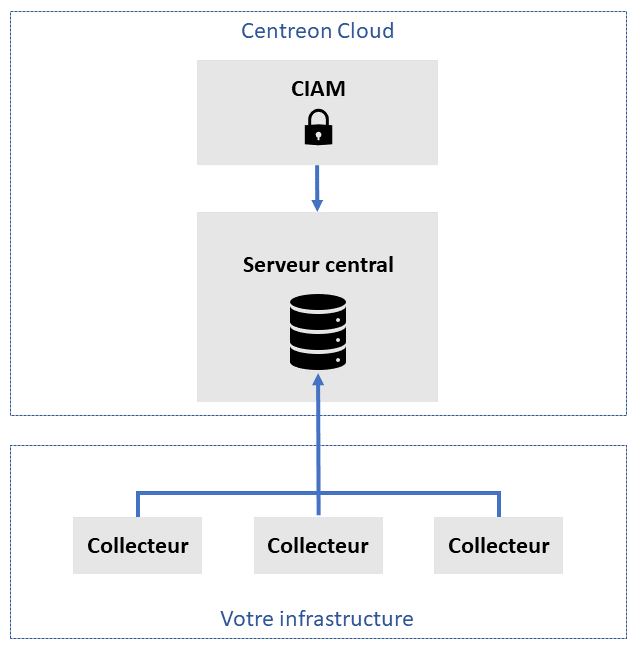

Votre plateforme Centreon Cloud est constituée d'un serveur central fourni par Centreon, et de collecteurs que vous installez dans votre infrastructure.

* **Serveur central** :
  * Le serveur central vous est fourni par Centreon, prêt à l'emploi.
  * Le serveur central ne supervise pas de ressources au sein de votre infrastructure (c'est le rôle des collecteurs).
  * Le serveur central offre une [interface utilisateur](interface.md), dans laquelle vous pouvez voir toutes les ressources supervisées par tous les collecteurs.
  * Vous pouvez vous connecter à l'interface utilisateur depuis n'importe où en tapant `<organisation>.<region>.centreon.cloud` dans votre navigateur web.
  * Le serveur central est hosté dans le cloud.
  * Centreon installe et met à jour le serveur central.

* **Un ou plusieurs collecteurs** :
  * Les collecteurs supervisent des ressources dans votre infrastructure. Ils doivent être situés dans le même réseau que les ressources à superviser.
  * Les collecteurs n'ont pas d'interface utilisateur (l'activité des pollers est visible sur l'interface du serveur central).
  * Les collecteurs sont situés dans votre infrastructure, ce qui veut dire une meilleure sécurité, latence et bande passante.
  * Vous [installez vos collecteurs](../installation/deploy-poller.md) à l'aide d'un simple script.

