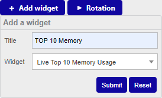
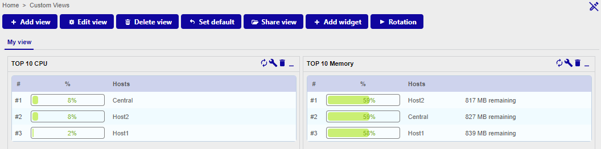
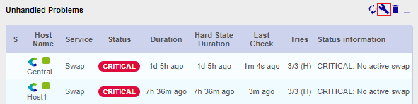
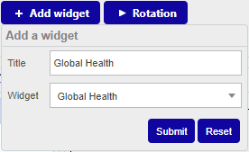
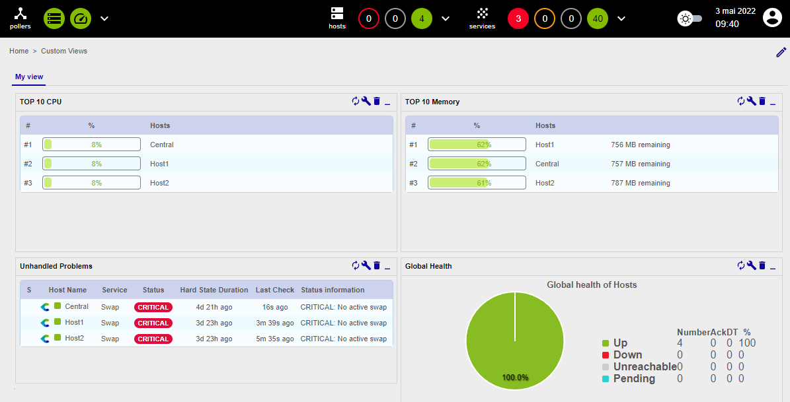

Les tableaux de bord sont des vues personnalisées créées à l'aide de [widgets](../resources/glossary.md#widget). 

## Tutoriels vidéo

Découvrez les widgets

<iframe width="100%" height="650" src="https://app.arcade.software/share/quGjHWoPfTn1rVTOqBd1" frameborder="0" allowfullscreen></iframe>

Découvrez les custom views

<iframe width="100%" height="650" src="https://app.arcade.software/share/U8me4yoZFo7pD4tj4xbU" frameborder="0" allowfullscreen></iframe>

## Créez votre première vue personnalisée

Rendez-vous au menu **Home > Custom Views** et cliquez sur l'icône crayon situé tout à droite de l'interface pour activer
le mode d'édition.

Cliquez sur le bouton **+ Add view** pour créer votre première vue personnalisée, puis saisissez **My view** pour le nom
de la vue et sélectionnez 2 colonnes. Cliquez enfin sur le bouton **Submit** :

Ajoutez votre premier widget, en cliquant sur le bouton **+ Add widget**, puis saisissez le titre **TOP 10 CPU** et
sélectionnez le widget **Live Top 10 CPU Usage**. Cliquez ensuite sur le bouton **Submit** :

Cliquez de nouveau sur le bouton **+ Add widget**, saisissez le titre **TOP 10 Memory** et sélectionnez le widget
**Live Top 10 Memory Usage**. Cliquez ensuite sur le bouton **Submit** :

Le deuxième widget se place automatiquement sur la deuxième colonne :

Cliquez de nouveau sur le bouton **+ Add widget**, saisissez le titre **Alertes non traitées** et sélectionnez le
widget **Services Monitoring**. Cliquez ensuite sur le bouton **Submit** :

Éditez ce widget en cliquant sur l'icône clé à molette :

Dans la fenêtre qui s'ouvre, décochez les cases :

* **Display Pending**
* **Display Duration**
* **Display Tries**

Puis cliquez sur le bouton **Apply**.

Cliquez de nouveau sur le bouton **+ Add widget**, saisissez le titre **Global Health** et sélectionnez le widget
**Global Health**. Cliquez ensuite sur le bouton **Submit** :

Éditez ce widget en cliquant sur l'icône clé à molette et sélectionnez **Show services** pour le champ **Services/Hosts**.
Cliquez sur le bouton **Apply**.

Votre première vue personnalisée est créée :

