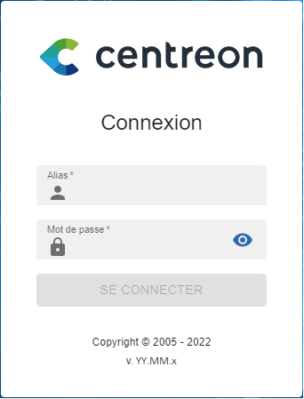
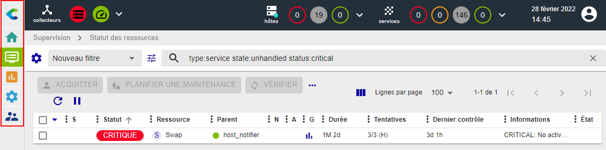
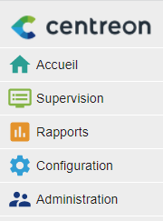
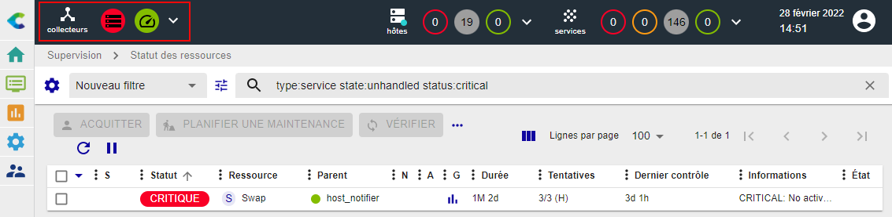
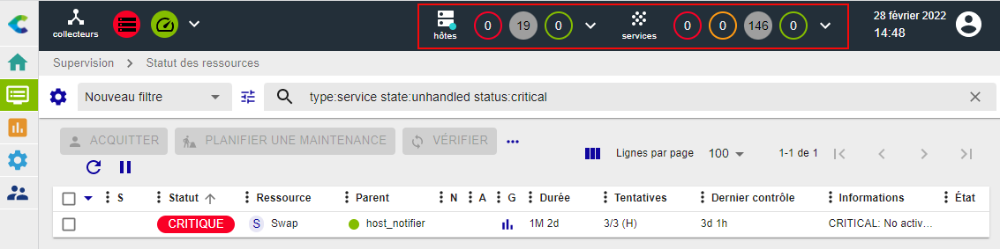
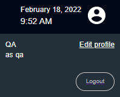
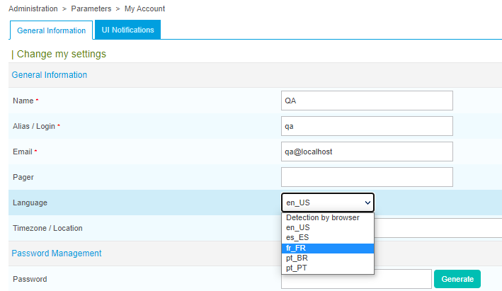

## Accéder à l'interface du serveur central

Lors de votre première connexion à Centreon Cloud, utilisez l'URL et les identifiants que le support Centreon vous a fourni. L'URL de connexion a le format suivant : `https://<organisation>.<region>.centreon.cloud`.

Renseignez votre identifiant et mot de passe, puis cliquez sur le bouton **Connect** :

Vous êtes maintenant connecté à l'interface web Centreon.

## Menus

L'interface web de Centreon est composée de plusieurs menus, chaque menu a une fonction bien précise (cliquez sur le logo Centreon en haut à gauche de l'écran pour afficher les libellés) :

* Le menu **Accueil** affiche les [vues personnalisées](create-custom-view.md). Votre espace de travail peut être vide pour l'instant. Une fois que vous aurez configuré les widgets
  personnalisables, vous verrez les données et les graphiques en fonction de votre personnalisation.
* Le menu **Supervision** regroupe l'état de tous les éléments supervisés en temps réel et en différé au travers de la
  visualisation des logs.
* Le menu **Rapports** permet de visualiser de manière intuitive (via des diagrammes) l'évolution de la supervision sur
  une période donnée.
* Le menu **Configuration** permet de configurer l'ensemble des éléments supervisés ainsi que l'infrastructure de supervision.
* Le menu **Administration** vous permet d'accéder à votre compte utilisateur.

## Bandeau supérieur

### Section Collecteurs

La partie gauche du bandeau supérieur montre la santé de votre plateforme en temps réel :

* si tous les collecteurs sont en cours d'exécution ou non : l'icône devient rouge lorsqu'un collecteur n'a pas envoyé de données au serveur central depuis au moins 15 minutes
* si les contrôles sont en retard ou non. Si l'icône est orange ou rouge, cela peut indiquer que vos collecteurs supervisent de trop nombreuse ressources.

Cliquez sur l'icône **collecteurs** pour développer le menu. Dans le menu, cliquez sur **Configurer les collecteurs** pour accéder à la page **Configuration > Collecteurs > Collecteurs**.

### Section hôtes et services ("top counters")

Dans la partie de droite du bandeau supérieur, des statistiques indiquent le nombre de ressources supervisées, avec un statut spécifique :

* Pour les hôtes : le nombre d'hôtes avec le statut **INDISPONIBLE**, **INJOIGNABLE** et **DISPONIBLE**.
* Pour les services: le nombre de services avec le statut **CRITIQUE**, **ALERTE**, **INCONNU** et **OK**.

Ces nombres incluent les alertes non confirmées (SOFT), mais n'incluent pas les ressources acquittées ou en maintenance. Les ressources en attente sont indiquées par une pastille bleue sur les icônes **hôtes** ou **services**.

Cliquez sur un cercle représentant un statut :

* La page **Supervision > Statut des ressources** s'ouvre.
* La page est filtrée selon le type de ressource et le statut correspondant.

Cliquez sur les icônes **hôtes** ou **services** pour développer le menu et afficher le détail des hôtes et services.

## Changer la langue de l'interface

Dans le bandeau, cliquez sur l'icône profil, puis cliquez sur **Edit profile**:

Dans la liste de sélection des langues, sélectionnez la vôtre :

Puis cliquez sur **Save**. Votre interface est maintenant traduite dans votre
langue.
