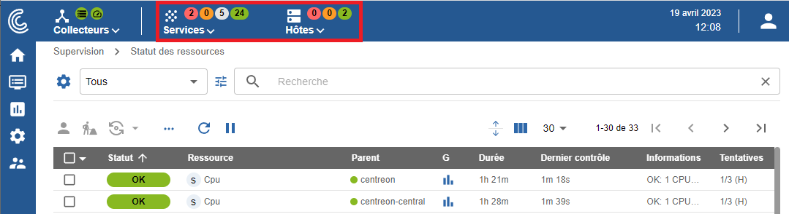
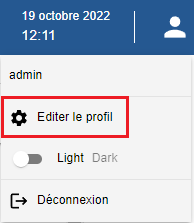

## Tutoriels vidéo

Parcourez l'interface pour vous familiariser avec Centreon Cloud, selon votre [rôle utilisateur](../users/users.md#user-roles).

J'ai le rôle Editor

- Découvrir le menu principal :

<iframe width="100%" height="650" src="https://app.arcade.software/share/3asg2bObpD9nH31r1jvR" frameborder="0" allowfullscreen></iframe>

- Découvrir le bandeau supérieur :

<iframe width="100%" height="650" src="https://app.arcade.software/share/fdCcspkyOLIsHehIBOHZ" frameborder="0" allowfullscreen></iframe>

J'ai le rôle User

- Découvrir le menu principal :

<iframe width="100%" height="650" src="https://app.arcade.software/share/8xmtVdestemqeYPvKtGy" frameborder="0" allowfullscreen></iframe>

- Découvrir le bandeau supérieur :

<iframe width="100%" height="650" src="https://app.arcade.software/share/qvZAsg23B2q4MEe8T2Sl" frameborder="0" allowfullscreen></iframe>

## Accéder à l'interface du serveur central

Lors de votre première connexion à Centreon Cloud, utilisez l'URL et les identifiants que le support Centreon vous a fourni. L'URL de connexion a le format suivant : `https://<organisation>.<region>.centreon.cloud`.

Renseignez votre identifiant et mot de passe (définis via [Centreon CIAM](../ciam/ciam.md)), puis cliquez sur le bouton **Connect** :

Vous êtes maintenant connecté à l'interface web Centreon.

## Menus

L'interface web de Centreon est composée de plusieurs menus, chaque menu a une fonction bien précise (cliquez sur le logo Centreon en haut à gauche de l'écran pour afficher les libellés) :

* Le menu **Accueil** affiche les [vues personnalisées](create-custom-view.md). Votre espace de travail peut être vide pour l'instant. Une fois que vous aurez configuré les widgets
  personnalisables, vous verrez les données et les graphiques en fonction de votre personnalisation.
* Le menu **Supervision** regroupe l'état de tous les éléments supervisés en temps réel et en différé au travers de la
  visualisation des logs.
* Le menu **Rapports** permet de visualiser de manière intuitive (via des diagrammes) l'évolution de la supervision sur
  une période donnée.
* Le menu **Configuration** permet de configurer l'ensemble des éléments supervisés ainsi que l'infrastructure de supervision.
* Le menu **Administration** vous permet d'accéder à votre compte utilisateur.

## Bandeau supérieur

### Section Collecteurs

La partie gauche du bandeau supérieur montre la santé de votre plateforme en temps réel :

* si tous les collecteurs sont en cours d'exécution ou non : l'icône devient rouge lorsqu'un collecteur n'a pas envoyé de données au serveur central depuis au moins 15 minutes
* si les contrôles sont en retard ou non. Si l'icône est orange ou rouge, cela peut indiquer que vos collecteurs supervisent de trop nombreuse ressources.

Cliquez sur l'icône **collecteurs** pour développer le menu. Dans le menu, cliquez sur **Configurer les collecteurs** pour accéder à la page **Configuration > Collecteurs > Collecteurs**.

### Section hôtes et services ("top counters")

Dans la partie de droite du bandeau supérieur, des statistiques indiquent le nombre de ressources supervisées, avec un statut spécifique :

* Pour les hôtes : le nombre d'hôtes avec le statut **INDISPONIBLE** et **DISPONIBLE**.
* Pour les services: le nombre de services avec le statut **CRITIQUE**, **ALERTE**, **INCONNU** et **OK**.

Ces nombres incluent les alertes non confirmées (SOFT), mais n'incluent pas les ressources acquittées ou en maintenance. Les ressources en attente sont indiquées par une pastille bleue sur les icônes **hôtes** ou **services**.

Cliquez sur un cercle représentant un statut :

* La page **Supervision > Statut des ressources** s'ouvre.
* La page est filtrée selon le type de ressource et le statut correspondant.

Cliquez sur les icônes **hôtes** ou **services** pour développer le menu et afficher le détail des hôtes et services.

### Passer en mode sombre

Lors de votre première connexion, l'interface Centreon s'affiche en mode clair par défaut.

Dans le bandeau supérieur, cliquez sur l'icône profil et utilisez le bouton pour activer le mode sombre. Lorsque vous vous reconnecterez, le mode que vous avez sélectionné précédemment restera activé.

- Mode clair :

- Mode sombre :

### Langue de l'interface utilisateur

Dans le bandeau, cliquez sur l'icône profil, puis cliquez sur **Editer le profil**:

Dans la liste **Langue**, sélectionnez la vôtre.

Puis cliquez sur **Sauvegarder**. Votre interface est maintenant traduite dans votre
langue.
