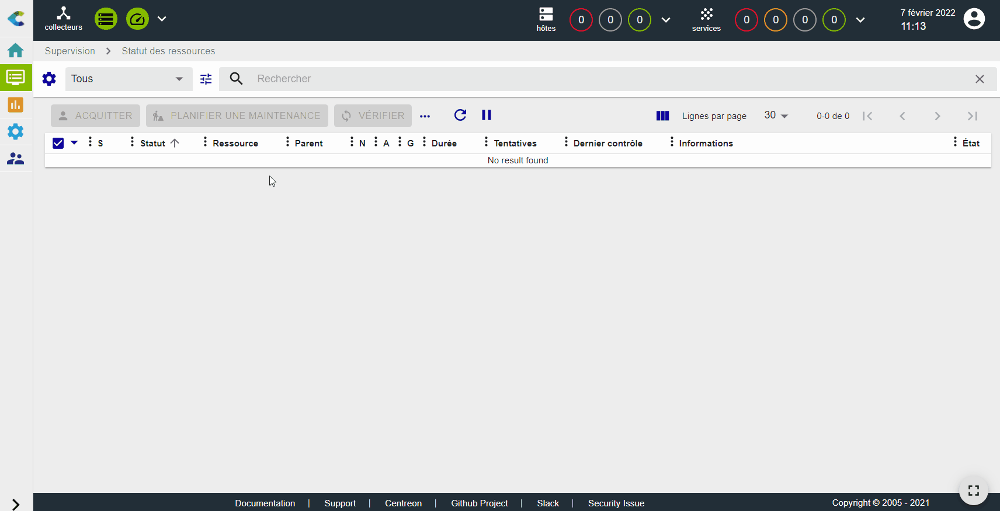
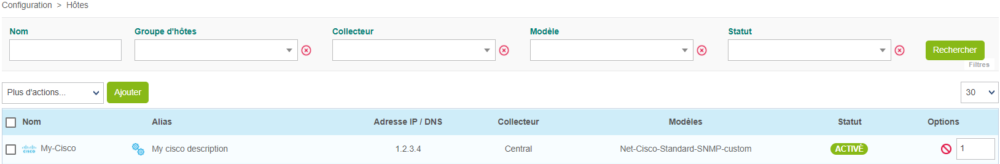
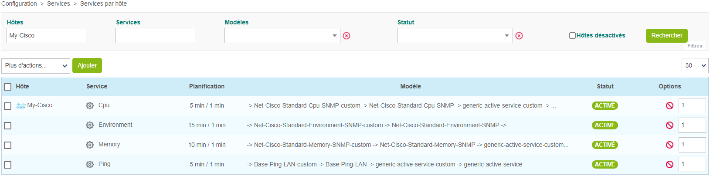
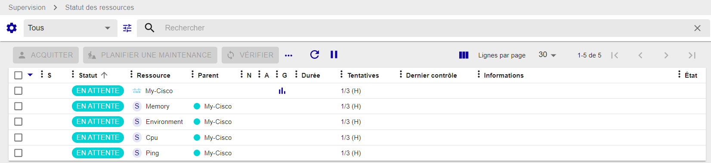

## Superviser un routeur Cisco avec SNMP

Dans ce tutoriel, nous partons du principe que votre plate-forme Centreon est installée et fonctionne correctement.

Votre routeur Cisco sera supervisé à l'aide du Plugin Pack Cisco standard. (Plus d'informations sur les Plugin Packs [ici](../monitoring/pluginpacks.md)).

## Prérequis

### Sur le routeur Cisco que vous souhaitez superviser

La première étape consiste à activer et à configurer un service SNMP sur votre appareil Cisco.
Veuillez vous référer à la documentation de votre appareil Cisco pour savoir comment configurer le service SNMP.

### Flux réseau

L'équipement doit être accessible depuis le collecteur Centreon sur le port SNMP UDP/161.

### Sur le serveur central

Dans l'interface web, allez à la page **Configuration > Plugin Packs**, recherchez et installez le Plugin Pack **Cisco standard** :

## Configurer l'hôte et déployer la configuration

1. Allez à la page **Configuration > Hôtes > Hôtes** et cliquez sur **Ajouter** :

  

2. Remplissez les informations suivantes :

  * Le nom du routeur (1)
  * Une description du routeur (2)
  * L'adresse IP du routeur (3)
  * La version et la communauté SNMP (4)
  * Sélectionnez le collecteur qui supervisera votre routeur (5)

3. Cliquez sur **+ Ajouter une nouvelle entrée** dans le champ **Modèles** (6), puis sélectionnez le modèle **Net-Cisco-Standard-SNMP-custom** (7) dans la liste :

  

4. Cliquez sur **Sauvegarder**. Votre équipement a été ajouté à la liste des hôtes :

  

5. Allez à la page **Configuration > Services > Services par hôte**. Un ensemble d'indicateurs a été créé automatiquement.

  

  Vous pouvez également utiliser le raccourci situé à côté du nom de l'hôte pour accéder directement à la page **Configuration > Services > Services par hôte**. La liste sera filtrée par le nom de l'hôte :

  

  

6. [Déployez la configuration](../monitoring/monitoring-servers/deploying-a-configuration.md).

7. Allez dans **Supervision > Statut des ressources** et sélectionnez **Toutes** dans le filtre **Statut des ressources**. Dans un premier temps, les ressources apparaissent avec le statut **En attente**, ce qui signifie qu'aucun contrôle n'a encore été exécuté :

   

   Après quelques minutes, les premiers résultats du contrôle apparaissent :

   

   Si tous les services ne sont pas dans un état OK, vérifiez la cause de l'erreur et corrigez le problème.
