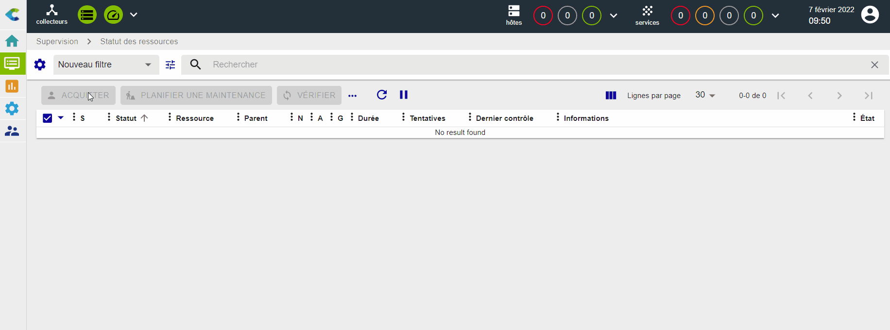
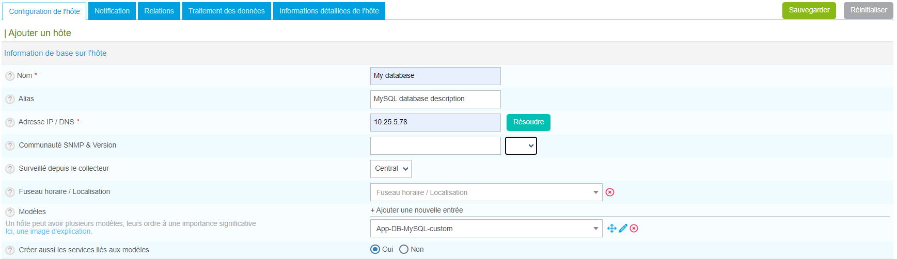
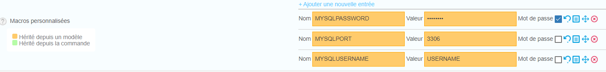
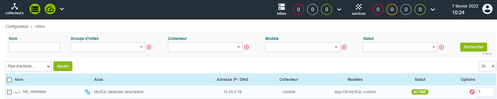
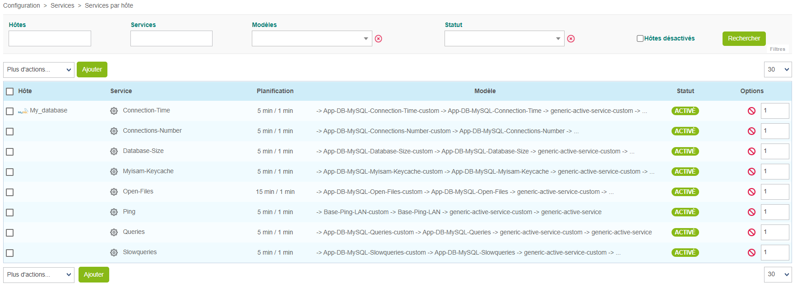
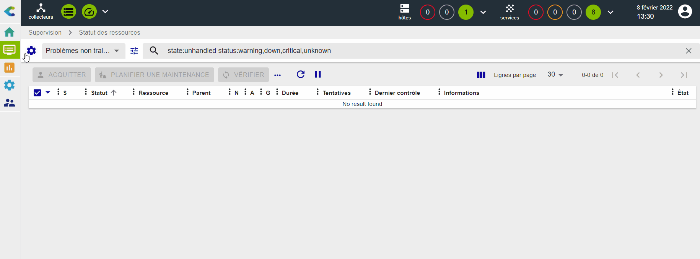

## Prérequis

L'objectif de ce tutoriel est de superviser une base de données Mysql/MariaDB.

Afin de pouvoir collecter les informations nécessaires à partir de la base de données, un utilisateur de la base de données disposant de privilèges spécifiques sera nécessaire. Si la base que vous souhaitez superviser est une base Centreon, un utilisateur dédié existe déjà (il s'appelle **centreon**). Dans le cas contraire, commencez par créer un nouvel utilisateur : connectez-vous à votre base de données, puis exécutez la commande suivante :

```shell
CREATE USER 'username'@'IP_POLLER' IDENTIFIED BY 'password';
```

Puis, que votre base soit une base Centreon ou non, exécutez la commande suivante :

```shell
GRANT SELECT ON *.* TO 'centreon'@'IP_POLLER';
```

> Remplacez le nom d'utilisateur, l'adresse IP du collecteur et le mot de passe par les valeurs de votre choix.

### Installer le Plugin Pack

La base de données sera supervisée à l'aide du Plugin Pack **MySQL/MariaDB**.
Rendez-vous dans le menu **Configuration > Packs de plugins** et installez le Plugin Pack **MySQL/MariaDB** :


#### Configurer l'hôte et déployer la configuration

1. Allez à la page **Configuration > Hôtes > Hôtes** et cliquez sur le bouton **Ajouter** :

  

2. Renseignez les informations suivantes :

  * Le nom de votre serveur
  * Une description de votre serveur
  * Son adresse IP
  * Sélectionnez le collecteur qui supervisera votre base de données (laissez "Central" si vous n'avez pas d'autre collecteur)

3. Cliquez sur le bouton **+ Ajouter une nouvelle entrée** à côté du champ **Modèles** puis sélectionnez le modèle
**App-DB-MySQL-custom**.

  

4. Une liste de macros correspondant au modèle va alors apparaître :

  

  Renseignez la valeur des macros suivantes :

  * **MYSQLUSERNAME** : le nom de l'utilisateur qui se connectera à la base de données.
  * **MYSQLPASSWORD** : le mot de passe associé à cet utilisateur.
  * **MYSQLPORT** : le port d'écoute de la base de données, par défaut 3306.

5. Cliquez sur le bouton **Sauvegarder**. Votre équipement a été ajouté à la liste des hôtes :

  

6. Allez dans **Configuration > Services > Services par hôte**. Un ensemble d'indicateurs a été créé automatiquement.

  

7. [Déployez la supervision](../monitoring/monitoring-servers/deploying-a-configuration.md).

8. À la page **Supervision > Status des ressources**, sélectionnez la valeur **Tous** pour le
filtre **Afficher les détails**. Dans un premier temps, les ressources apparaissent avec le statut **En attente**, ce qui signifie qu'aucun contrôle n'a encore été exécuté. Après quelques minutes, les premiers résultats de la supervision apparaissent :

  