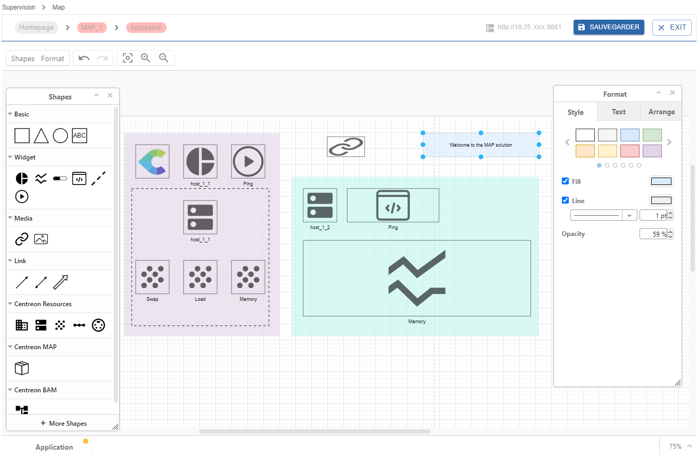
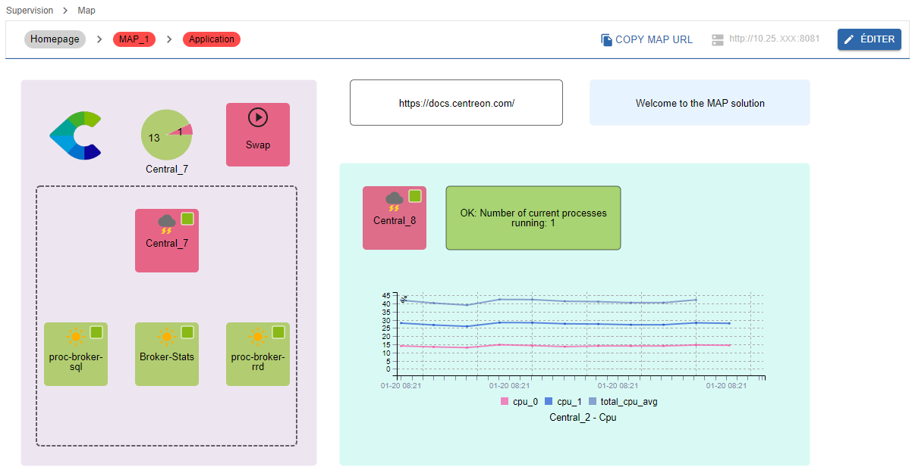

Centreon MAP est une solution intégralement disponible dans l'interface web Centreon tout en vous proposant la meilleure expérience possible pour créer, visualiser et partager des représentations graphiques de votre infrastructure supervisée.

## Aperçu de l'interface

Créez, personnalisez et visualisez vos cartes au sein d'une unique interface web.

Vous devez d'abord créer vos vues logiques à l'aide de l'éditeur MAP :

Vous pouvez ensuite visualiser votre carte directement dans le mode de visualisation :

Vos cartes peuvent être affichées de deux façons dans l'interface :
- Dans la page **Supervision > Map**, en mode visualisation.
- Dans la page **Accueil > Vues personnalisées**, en utilisant un [widget](../alerts-notifications/custom-views.md) MAP dédié.

## Procédures

Les procédures suivantes permettent de gérer et d'utiliser Centreon MAP.

- [Gérer les droits d'accès dans MAP](map-web-manage.md) décrit les différents droits et permissions sur les cartes.
- [Gérer les cartes dans MAP](map-web-manage.md) vous donne des informations sur la manière de gérer des cartes à partir de l'interface Centreon MAP.
- [Créer une carte standard](map-web-create-standard-map.md) décrit comment créer des cartes standard et comment les personnaliser à l'aide de l'éditeur MAP.
- [Créer une vue géographique](map-web-create-geoview.md) explique comment afficher vos ressources dans une zone géographique définie.
- [Problèmes connus dans MAP](map-web-known-issues.md) est une liste d'incidents que vous pouvez rencontrer en utilisant MAP.
