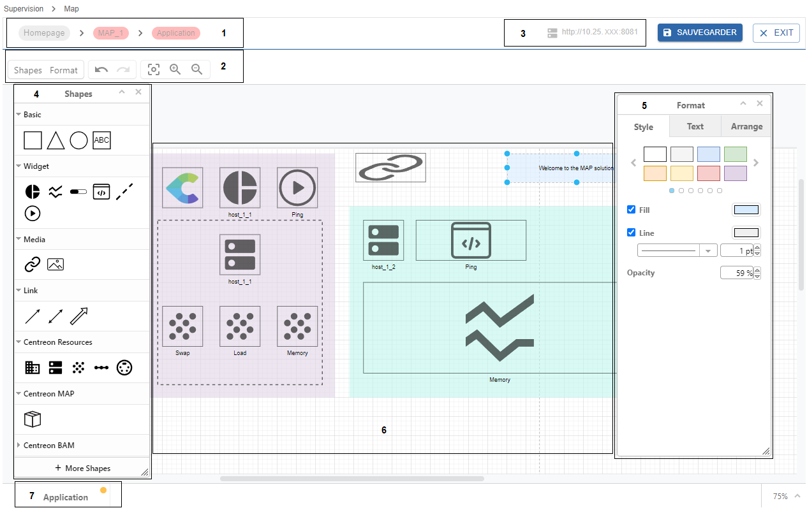

Cette page décrit comment créer des cartes standards et comment les personnaliser avec l'éditeur de MAP. 

L'affichage du bouton **Add a Map** signifie que vous êtes autorisé à créer une carte et que vous appartenez à un groupe d'accès auquel est attribué le rôle de créateur.

## Créer une map standard

1. Dans la page **Supervision > Map**, cliquez sur le bouton **Add a Map** situé dans la section **Standard maps**.

2. Définissez les propriétés de la nouvelle carte :
   - Nom : nommez la carte.
   - Image : sélectionnez une image si vous souhaitez personnaliser l'affichage de la carte dans la liste des cartes.

3. Cliquez sur **Ajouter** pour confirmer la création de la carte.

La nouvelle carte s'ouvre directement dans l'interface de l'éditeur.
Vous pouvez maintenant personnaliser votre carte en utilisant les fonctionnalités de l'éditeur MAP.

## Utiliser l'éditeur MAP

Suivez cette procédure pour ouvrir votre carte en mode édition :

1. Allez dans **Supervision > Map** pour afficher la liste des cartes existantes.
2. Sélectionnez la carte que vous souhaitez modifier.
3. Cliquez sur le bouton **Éditer** pour l'ouvrir en mode édition.

> Une fois éditée, passez en mode visualisation en enregistrant vos modifications avec le bouton **Sauvegarder**. Cliquez ensuite sur **Exit**.

### Aperçu de l'éditeur MAP

Voici comment se présente l'éditeur MAP :

**1. Fil d'Ariane :** vous permet de savoir quels éléments de la carte vous avez parcourus pour atteindre la vue courante. 
**2. Barre d'outils :** permet de masquer/afficher des panneaux, annuler/répéter des actions, et d'adapter/zoomer/dézoomer l'espace de travail.
**3. Adresse IP :** il s'agit de l'adresse du serveur MAP spécifiée dans les paramètres de Centreon MAP.
**4. Panneau des formes (Shapes) :** ce panneau présente tous les éléments dont vous avez besoin pour concevoir une carte, des formes basiques aux ressources Centreon.
**5. Panneau Format :** ce panneau vous permet d'appliquer un format sur un élément sélectionné.
**6. Espace de travail :** c'est l'espace situé au milieu de l'éditeur, pour concevoir votre diagramme.
**7. Onglet :** vous pouvez naviguer entre plusieurs onglets lorsque votre carte nécessite plusieurs niveaux (pages). Par exemple, lorsque votre carte comporte plusieurs conteneurs, vous pouvez naviguer entre les onglets, où chaque onglet correspond à un conteneur.

### Utiliser des éléments graphiques pour concevoir votre carte

Le panneau **Shapes** contient différents types d'éléments pour concevoir votre carte. Les options s'affichent en fonction du type d'élément que vous avez sélectionné.

#### Éléments de base

Utilisez les formes de la section **Basic** pour organiser vos éléments avec des formes géométriques et des zones de texte. Utilisez ensuite le panneau **Format** pour personnaliser votre forme en appliquant un format de style tel que la couleur, l'opacité, etc.

#### Éléments de widget

Utilisez les éléments **Widget** pour afficher des données graphiques sur les ressources que vous supervisez. Les widgets fournissent des informations telles que des indications sur l'état de santé ou des statistiques de performance. Les widgets disponibles sont les suivants :

- **Graphique à camembert :** affiche l'état d'une ressource à superviser sous forme de données proportionnelles. Il affiche :
  - Pour un hôte : le nombre d'états OK, Alerte, Critique, et NA.
  - Pour un groupe d'hôtes : le nombre d'hôtes en états OK, Alerte, Critique, et NA.
- **Graphique linéaire :** affiche les données de performance relatives à un service, sur une période de temps.
- **Jauge :** décrit la sortie d'un service. Vous pouvez placer une jauge dans n'importe quelle direction (de gauche à droite, de bas en haut, etc.).
- **Output :** décrit la sortie d'un service. La couleur d'arrière-plan est la même que le statut.
- **Processus :** permet de déclencher une action sur n'importe quelle ressource à l'aide d'une commande. Voici un exemple :
  - Vous avez un site internet interne qui utilise Apache et parfois,  Apache se bloque. Vous avez besoin d'investiguer sur la raison principale de ce crash, mais votre priorité est de vous assurer que les utilisateurs finaux peuvent accéder au site internet.
  - Vous pouvez utiliser le widget Processus en attribuant une commande telle que `services httpd restart` de sorte que lorsque le processus Apache se bloque, les utilisateurs peuvent immédiatement redémarrer le service Apache à partir de la vue en double-cliquant sur le widget.
  - Pour créer un service dédié à une "action" : créez une commande (dans **Configuration > Commande > Contrôles > Ajouter**) qui contient `services httpd restart` (n'oubliez pas d'activer le shell). Liez la commande à un service passif. Reliez le service passif à un hôte (par exemple, l'hôte qui héberge le site internet). Vous pouvez ensuite affecter ce service au widget.

#### Éléments médias

Utilisez les éléments de la section **Media** pour ajouter :
- Une **URL** : vous permet d'ajouter un accès à un lien spécifié.
- Une **image** : vous permet de personnaliser votre diagramme en ajoutant des images.  

1. Faites un glisser-déposer de l'élément vers l'espace de travail.
2. Faites un clic-droit dessus et sélectionnez **Edit data**.
3. Remplissez le paramètre requis et cliquez sur **Soumettre**.

#### Eléments de lien

Utilisez les éléments de la section **Link** pour établir des liens entre les éléments (avec des points d'ancrage) :
- **Link :** est un élément de lien simple de type flèche pour connecter deux éléments.
- **Status link :** utilisez ce lien entre deux éléments et configurez une ressource à superviser à partir de celui-ci. Ensuite, ce lien affichera l'état de la couleur de la ressource que vous avez spécifiée.
- **Metric link :** utilisez ce lien entre deux éléments et configurez un service et ses métriques à partir de celui-ci. Ensuite, ce lien affichera les métriques du service que vous avez spécifié. 

#### Eléments Centreon

- Eléments de la section **Resources** :
  - Host group
  - Host
  - Service
  - Service group
  - Meta service

- Eléments de la section **MAP** :
  - Container

- Eléments de la section **BAM** :
  - Business activity

Les paramètres s'affichent en fonction du type d'élément que vous avez sélectionné.

1. Faites un glisser-déposer de l'élément vers l'espace de travail.
2. Faites un clic-droit dessus et sélectionnez **Edit data**.
3. Remplissez le paramètre requis et cliquez sur **Soumettre**.

#### Personnaliser les éléments

Le panneau **Format** vous permet d'appliquer des options de formatage en fonction du type d'élément que vous avez sélectionné.
- Onglet **Style** : pour personnaliser les formes, les liens et le texte.
- Onglet **Text** : pour mettre en forme tous les éléments de texte.
- Onglet **Arrange** : pour organiser les éléments dans l'espace de travail (taille, position, alignement) et les placer sur différents calques.

> Vous pouvez ajouter un élément et enregistrer la carte même si cet élément n'est lié à aucune ressource. Il sera alors affiché en jaune lorsque vous passez en mode vue.
