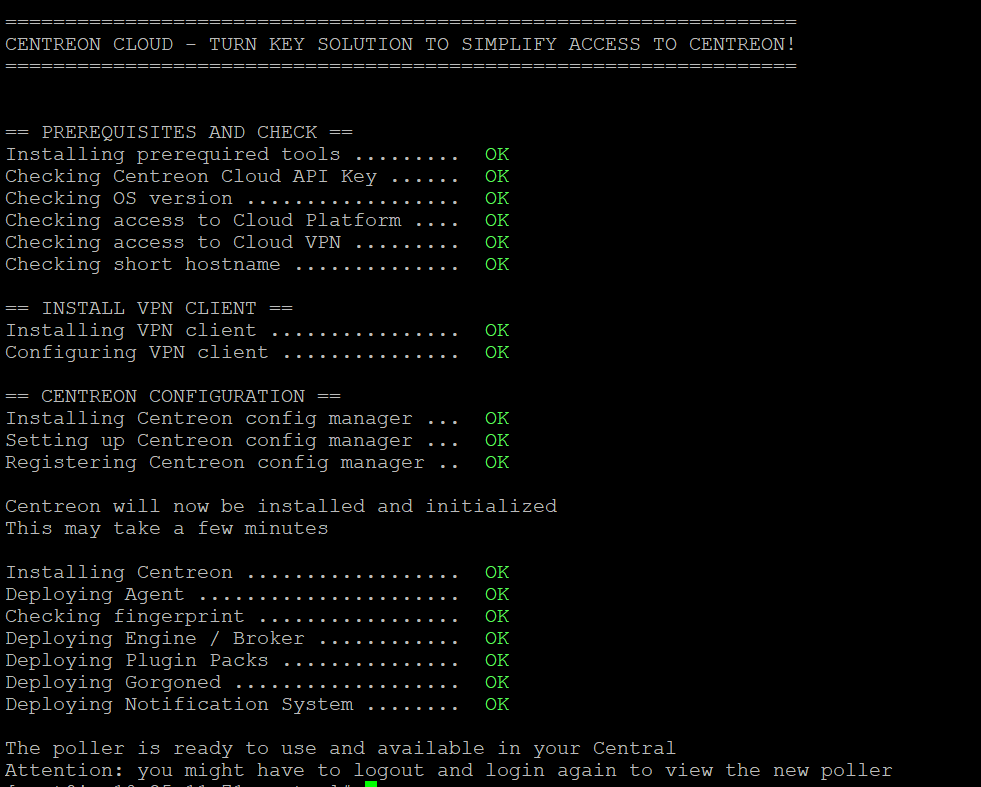

Avec Centreon Cloud, votre serveur central est déjà prêt à l'emploi. Il ne vous reste qu'à installer un ou des collecteurs dans votre infrastructure, ce qui est très facile : exécutez un script, exportez la configuration et le collecteur est prêt.

Avant de déployer un collecteur, assurez-vous que votre machine hôte répond aux [prérequis](prerequisites.md).

## Étape 1 : Exécuter le script

1. Connectez-vous en SSH au serveur qui deviendra un collecteur Centreon.

2. Exécutez la commande qui déploiera le collecteur automatiquement. Cette commande vous a été fournie par notre équipe support. Le format est le suivant :

  ```shell
  bash -c "$(curl -H "content-type: application/json"  -H "x-api-key: <votre_token>"  https://api.euwest1.prod1.centreon.cloud/v1/organization/<votre_code_organisation>/site/centreon/poller -s)"
  ```
  
  > Remplacez `<votre_token>` et `<votre_code_organisation>` par les valeurs appropriées.

  Le script s'exécute (cela devrait prendre environ 10 minutes) :

  

3. Une fois le script exécuté, [connectez-vous à votre serveur central](../getting-started/interface.md#accéder-à-linterface-du-serveur-central) et allez à la page **Configuration > Collecteurs > Collecteurs**. Le nouveau collecteur apparaît dans la liste des collecteurs.
   * Par défaut, le nom du collecteur est son hostname (celui-ci peut avoir été abrégé). Cliquez sur le nom du collecteur pour le renommer.
   * Dans la colonne **Adresse IP**, l'adresse indiquée est celle du collecteur vu par le serveur central. En effet, pendant le processus d'installation, un VPN est installé : l'adresse IP est celle du collecteur à l'intérieur du VPN.
   * Le collecteur n'est pas encore démarré (**Non** dans la colonne **En cours d'exécution?**).

## Étape 2 : Exporter la configuration et redémarrer le collecteur

Exportez la configuration du collecteur :

1. Sur le serveur central, allez à la page **Configuration > Collecteurs > Collecteurs**, puis sélectionnez le collecteur que vous venez de créer.
2. Cliquez sur **Exporter la configuration**. Un nouvelle page s'ouvre :
   * Sélectionnez les 4 premières options
   * À côté de **Redémarrer l'ordonnanceur**, sélectionnez la méthode **Redémarrer**.
3. Cliquez sur **Exporter**. Un log de l'export s'affiche : il ne devrait pas y avoir d'erreurs.
4. Retournez à la page **Configuration > Collecteurs > Collecteurs** : le collecteur affiche **Oui** dans la colonne **En cours d'exécution?**. Votre collecteur est maintenant prêt à superviser des ressources.
