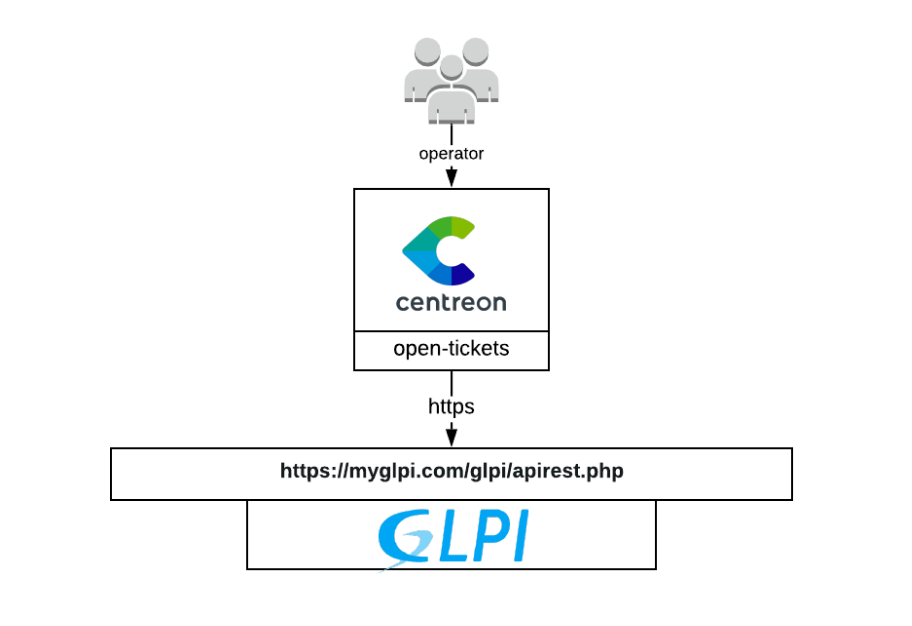

> GLPI web services are no longer maintained, so we recommend that you use the Rest API version to benefit from the latest enhancements and features.

## How it works

The Glpi provider uses the webservice plugin of Glpi to retrieve data in order
to open a ticket.

## Compatibility

This connector is (at least) compatible with the following Glpi versions:

  - between 8.5 and 9.0

## Requirements

You need to [configure Open Tickets](../../alerts-notifications/ticketing.md) in order for resources (hosts and services) to receive a ticket number.

Our provider requires the following parameters:

| Parameter | Example of value                     |
| --------- | ------------------------------------ |
| Address   | 192.168.0.6                          |
| Username  | centreon                             |
| Password  | MyPassword                           |
| Path      | /glpi/plugins/webservices/xmlrpc.php |
| Timeout   | 60                                   |

## Possibilities

As of now, the provider is able to retrieve the following objects from Glpi:

  - Entities
  - Itil categories
  - Groups

It will also fill the following parameters from a predefined list in Centreon.
You can extend those lists inside the provider configuration since they are
[custom lists](../../alerts-notifications/ticketing.md).

  - Urgency
  - Impact
