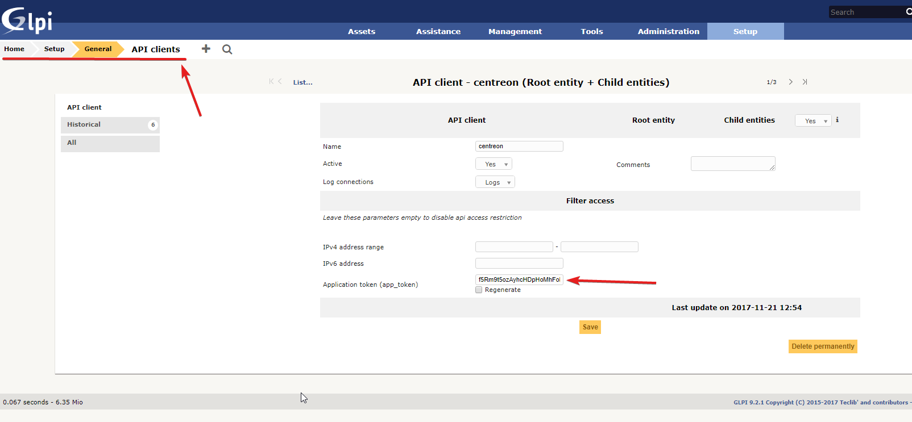
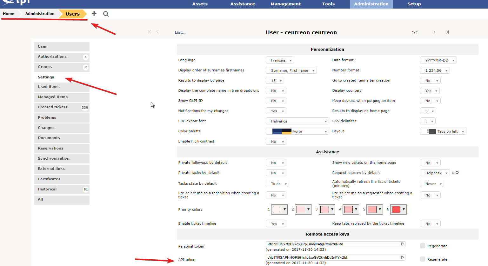

## How it works

The GlpiRestApi provider uses the REST API of Glpi to retrieve data in order to
open a ticket. Since it gathers a lot of configurations objects from Glpi, it
puts them in cache. Loging out or waiting 10 hours will flush the cache.


## Compatibility

This connector is compatible with the following Glpi versions:

  - 11
  - 10
  - 9.5
  - 9.4
  - 9.3
  - 9.2
  - 9.1 (Glpi REST API birth)

You can’t use this provider with Glpi < 9.1. From the 8.5 to 9.0 version, you
should use the [old Glpi provider](ot-glpi.md) that uses the Glpi plugin called “webservice”.

## Feature information

| Open ticket | Close ticket (from Centreon to Glpi) | Handle custom fields |
| -- | -- | -- |
| ✓ | ✓ | ✘ |

## Requirements

You need to [configure Open Tickets](../../alerts-notifications/ticketing.md) in order for resources (hosts and services) to receive a ticket number.

Our provider requires the following parameters:

| Parameter    | Example of value                         |
| ------------ | ---------------------------------------- |
| Address      | 10.30.2.46                               |
| User token   | cYpJTf0SAPHHGP561chJJxoGV2kivhDv3nFYxQbl |
| App token    | f5Rm9t5ozAyhcHDpHoMhFoPapi49TAVsXBZwulMR |
| REST API url | /glpi/apirest.php                        |
| Protocol     | https                                    |
| Timeout      | 60                                       |

### Network flow

| Source | Destination | Protocol/Port |
| -- | -- | -- |
| Centreon central server | Glpi | TCP/443 (https) or TCP/80 (http) |

### Account

You need the following information:

- API token (also known as app token)
- User token
- Serveur address

The aforementioned account must at least be able to open a ticket through the **/Ticket API endpoint** and to authenticate itself through the **/initSession API endpoint**.

The connector will also try to access the following API endpoints depending on the configuration of your open ticket rule:

- /User
- /Group
- /getMyEntities
- /Supplier
- /itilCategory

Some test commands that you can run from your Centreon central server are available in the [Test commands](#test-commands) section.

## Retrieved data

This open ticket connector can retrieve the following information from your Glpi server:

- Entities
- Users
- Groups
- Suppliers
- ITIL categories

> If you need more information regarding retrieved data from an open ticket connector, please read the [retrieved data chapter](../../alerts-notifications/ticketing/mapping.md) from the Open Ticket global documentation.

## Additional data

This open ticket connector can also send the following information when opening a ticket:

- Urgency
- Impact
- Priority
- Group and User role

Those information are not retrieved from Glpi. They are configured in your open ticket rule as [custom lists](../../alerts-notifications/ticketing/mapping.md#custom-list-definition).

## Test commands

The curl commands listed below must be run from your central server. You need to replace all elements between `<>` for example `<glpi_address>` may be replaced with `my_glpi.local`.

### Get a session token

```bash
curl --location 'https://<glpi_address>/<glpi_api_path>/initSession' \
--header 'Content-Type: application/json' \
--header 'Authorization: user_token <user_token>' \
--header 'App-Token: <app_token>' 
```

### Get Glpi entities

```bash
curl --location 'https://<glpi_address>/<glpi_api_path>/getMyEntities?is_recursive=1' \
--header 'Authorization: Bearer <authentication_token>' \
--header 'Content-Type: application/json' \
--header 'App-Token: <app_token>'  \
--header 'Session-Token: <session_token>'
```

### Get Glpi users

```bash
curl --location 'https://<glpi_address>/<glpi_api_path>/User' \
--header 'Authorization: Bearer <authentication_token>' \
--header 'Content-Type: application/json' \
--header 'App-Token: <app_token>'  \
--header 'Session-Token: <session_token>'
```

### Get Glpi groups

```bash
curl --location 'https://<glpi_address>/<glpi_api_path>/Group' \
--header 'Authorization: Bearer <authentication_token>' \
--header 'Content-Type: application/json' \
--header 'App-Token: <app_token>'  \
--header 'Session-Token: <session_token>'
```

### Get Glpi suppliers

```bash
curl --location 'https://<glpi_address>/<glpi_api_path>/Supplier' \
--header 'Authorization: Bearer <authentication_token>' \
--header 'Content-Type: application/json' \
--header 'App-Token: <app_token>'  \
--header 'Session-Token: <session_token>'
```

### Get Glpi ITIl categories

```bash
curl --location 'https://<glpi_address>/<glpi_api_path>/itilCategory' \
--header 'Authorization: Bearer <authentication_token>' \
--header 'Content-Type: application/json' \
--header 'App-Token: <app_token>'  \
--header 'Session-Token: <session_token>'
```

### Open a ticket

Keep in mind that the data in the command down below is just an example and your Glpi server may ask you to add mandatory data

```bash
curl --location 'https://<glpi_address>/<glpi_api_path>/Ticket' \
--header 'Content-Type: application/json' \
--header 'App-Token: <app_token>'  \
--header 'Session-Token: <session_token>' \
--data '{
    "input": {
      "name": "this is a test ticket",
      "content": "Believe it or not, but it is just a test"
    }
  }'
```

### Close a ticket

```bash
curl -X PUT --location 'https://<glpi_address>/<glpi_api_path>/Ticket/<ticket_id>' \
--header 'Authorization: Bearer <authentication_token>' \
--header 'Content-Type: application/json' \
--header 'App-Token: <app_token>'  \
--header 'Session-Token: <session_token>' \
--data '{
    "input": {
      "status": 6
    }
  }'
```

## Configuration

You'll find the required **app token** in the following menu:


You'll find the **user token** in the following menu:

