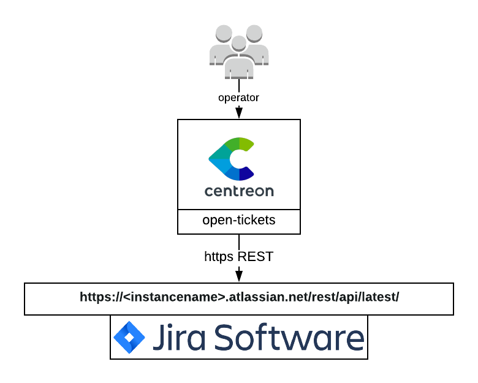

## How it works

The Jira provider connects to your Itop server and retrieve data through the
Jira REST API.



## Compatibility

This integration is (at least) compatible with Jira cloud.

## Feature information

| Open ticket | Close ticket (from Centreon to Jira) | Handle custom fields |
| -- | -- | -- |
| ✓ | ✘ | ✘ |

## Requirements

You need to [configure Open Tickets](../../alerts-notifications/ticketing.md) in order for resources (hosts and services) to receive a ticket number.

Our provider requires the following parameters:

| Parameter         | Example of value    |
| ----------------- | ------------------- |
| Address           | xxxxx.atlassian.net |
| Rest Api Resource | /rest/api/latest/   |
| Username          | MyUser              |
| Password          | MyPassword          |
| Timeout           | 60                  |

### Network flow

| Source | Destination | Protocol/Port |
| -- | -- | -- |
| Centreon central server | jira | TCP/443 (https) or TCP/80 (http) |

### Account

You need the following information:

- Jira address
- Rest Api Resource (usually `/rest/api/latest/`)
- Username
- Password

The aforementioned account must at least be able to open a ticket through the **/issue API endpoint**.

The connector will also try to access the following API endpoints depending on the configuration of your open ticket rule:

- /priority
- /issuetype
- /project
- /user/search

Some test commands that you can run from your Centreon central server are available in the [Test commands](#test-commands) section.

## Retrieved data

This open ticket connector can retrieve the following information from your Jira server:

- Priorities
- Users
- Type of issues
- Projects

> If you need more information regarding retrieved data from an open ticket connector, please read the [retrieved data chapter](../../alerts-notifications/ticketing/mapping.md) from the Open Ticket global documentation.

## Test commands

The curl commands listed below must be run from your central server. You need to replace all elements between `<>` for example `<jira_address>` may be replaced with `my_jira.atlassian.net`.

### Get Jira priorities

```bash
curl --location 'https://<jira_address>/<rest_api_resource>/priority' \
--header 'Content-Type: application/json' \
-u '<user>:<user_token>'
```

### Get Jira users

```bash
curl --location 'https://<jira_address>/<rest_api_resource>/user/search' \
--header 'Content-Type: application/json' \
-u '<user>:<user_token>'
```

### Get Jira issue types

```bash
curl --location 'https://<jira_address>/<rest_api_resource>/issuetype' \
--header 'Content-Type: application/json' \
-u '<user>:<user_token>'
```

### Get Jira projects

```bash
curl --location 'https://<jira_address>/<rest_api_resource>/project' \
--header 'Content-Type: application/json' \
-u '<user>:<user_token>'
```

### Open a ticket

Keep in mind that the data in the command below is just an example and your Jira server may ask you to add mandatory data.

```bash
curl --location 'https://<jira_address>/<rest_api_resource>/issue' \
--header 'Content-Type: application/json' \
-u '<user>:<user_token>' \
--data '{
    "fields": {
      "project": {
        "id": "<project_id>"
      },
      "summary": "this is a test ticket",
      "description": "Believe it or not, but it is just a test"
    }
  }'
```
