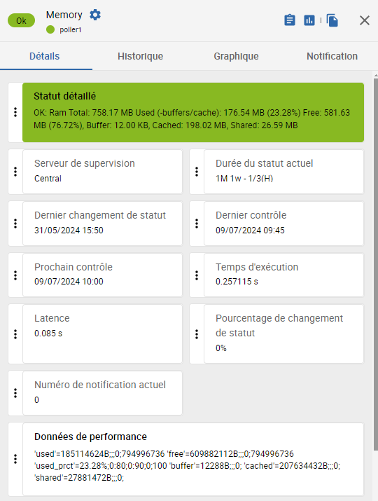

## Qu'est-ce qu'une métrique ?

Une métrique, ou "donnée de performance", est un élément d'un service. Un service peut comprendre plusieurs métriques, ou aucune.

Les métriques permettent d’obtenir des graphiques et de positionner des seuils pour être alerté.

### Statut des métriques et statut du service

Lorsqu’un service comprend plusieurs métriques, le statut du service est le plus mauvais parmi les statuts de toutes les métriques. L'ordre de priorité est le suivant : OK, INCONNU, ALERTE, CRITIQUE.

Si une métrique n'est pas récupérée, son statut est considéré comme INCONNU et impactera le statut du service associé.

### Services sans métriques

Certains services n'ont aucune métrique associée : il s'agit de services contrôlant des états et non des valeurs numériques. Typiquement, des contrôles sur des équipements matériels. Le statut que prend le service est directement défini dans le code de chaque plugin, en fonction de la réponse de l'équipement.

## Où voir les métriques d'un service dans Centreon ?

À la page **Statut des ressources**, dans le panneau de détails d'un service, la section **Données de performance** donne les valeurs détaillées de toutes les métriques associées à ce service, pour le dernier contrôle effectué.

Exemple : Nous supervisons un collecteur Centreon (pour ce service, via le connecteur [Linux SNMP](https://docs.centreon.com/pp/integrations/plugin-packs/procedures/operatingsystems-linux-snmp/#collected-metrics--status)). Dans l'image suivante, le service **Memory** retourne 6 métriques : **used**, **free**, **used_prct**, **buffer**, **cached** et **shared**.



Vous pouvez également :

* Voir l'évolution de toutes les métriques d'un service dans l'onglet **Graphique** du panneau de détails du service.
* Représenter le dernière valeur d'une métrique dans un [tableau de bord](../alerts-notifications/dashboards.md), grâce au widget **Métrique unique**.

## Quel est le format d'une métrique ?

Dans tous les cas, le format des métriques telles que retournées par les plugins est le suivant :

```text
'nom_de_la_métrique'= valeur[unité];alerte;critique;min;max
```

* **valeur** : la valeur affichée dans le panneau de détails est celle retournée par le dernier contrôle effectué.

* **alerte/critique**: [seuils](#syntaxe-des-seuils-des-métriques) pour lesquels le statut de la métrique sera ALERTE ou CRITIQUE. Si aucun seuil n'est défini, le statut de la métrique sera toujours OK. La valeur de ces seuils est définie [dans une macro spécifique au service, ou bien dans la macro EXTRAOPTIONS du service](#comment-définir-des-seuils-pour-des-métriques-spécifiques).

   > Il est possible de ne définir qu'un seuil CRITIQUE, sans passer par le stade ALERTE (et vice-versa).

* **min/max** : Il ne s'agit pas de la valeur minimale/maximale constatée dans les données de performance, mais de la valeur minimale/maximale possible que peut prendre la métrique. Par exemple, le maximum d'une utilisation CPU sera toujours 100%. Pour certains plugins ou modes, ces valeurs peuvent être redéfinies [dans la macro EXTRAOPTIONS](#comment-définir-des-seuils-pour-des-métriques-spécifiques).

   * Le min et le max seront les valeurs minimales/maximales sur l'axe des Y du graphique. Si aucun min et max ne sont définis, le graphique s'adaptera en hauteur en fonction de la plus petite et la plus grande valeur constatées. Redéfinir les valeurs min/max permet de rendre l'affichage des graphes le plus pertinent possible : si plusieurs graphiques représentant le même service pour plusieurs hôtes sont affichés ensemble, définir le même min et max permet de représenter toutes les métriques à la même échelle.
   * Elles servent également à évaluer le niveau d'utilisation d'une ressource par rapport à sa capacité, d'où l'intérêt de pouvoir les redéfinir dans certains cas. Par exemple, si on contrôle le trafic réseau sur une interface, l'interface fournit son débit maximum théorique au plugin, mais celui-ci peut être changé à la main si le débit réel est limité par le fait d'être connecté à un autre équipement.
   * Les valeurs min et max peuvent également servir à représenter les données sous forme de jauge dans [MAP](../graph-views/introduction-map.md).

### Syntaxe des seuils des métriques

* **x** : on alerte si la valeur de la métrique est strictement supérieure à **x** (**80** signifie donc qu'on alerte si la valeur est supérieure à 80).
* **x:** : on alerte si la valeur de la métrique est strictement inférieure à **x** (**50:** signifie donc qu'on alerte si la valeur est inférieure à 50).
* **x:y** : on alerte si la valeur de la métrique est située en-dehors de cette fourchette (**0:10** signifie donc en-dessous de 0 et au-dessus de 10). Par exemple, on peut déterminer que la température dans un datacenter sera critique si elle est inférieure à 18 et supérieure à 24 : on entrera **18:24**.
* **@x:y** : on alerte si la valeur de la métrique est située dans la plage (**@0:10** signifie donc qu'on alerte si la valeur de la métrique est située entre 0 et 10).
* **x:x** : la valeur de la métrique doit être égale à la valeur **x** pour que son statut soit OK.

## Comment définir des seuils pour une métrique spécifique ?

Pour définir un seuil pour une métrique spécifique, il faut ajouter une option dans la macro EXTRAOPTIONS du service (si une macro spécifique à une métrique n'existe pas déjà). Pour chaque connecteur, la documentation inclut le tableau des options, dans la section **Options disponibles > Options des modes**.

**Exemple** : Un connecteur [**HWg-STE Sensor**](/pp/integrations/plugin-packs/procedures/hardware-sensors-hwgste-snmp) apporte un service **Sensors-Global**, qui comprend 2 métriques : **hardware.sensor.temperature** et **hardware.sensor.humidity.percentage**. On veut définir des seuils ALERTE et CRITIQUE pour la température et pour l'humidité. La documentation explique :

| Option | Description |
| ------ | ----------- |
| --warning	| Set warning threshold for 'temperature', 'humidity' (syntax: type,regexp,threshold) Example: --warning='temperature,.*,30' |
| --critical | Set critical threshold for 'temperature', 'humidity' (syntax: type,regexp,threshold) Example: --warning='temperature,.*,50' |

(Ici, **regexp** permet de filtrer sur un capteur spécifique s'il y en a plusieurs. Pour inclure tous les capteurs, mettre `.*`)

Donc dans la macro EXTRAOPTIONS du service, on entrera :

```text
--warning='temperature,.*,30' --warning='humidity,.*,60' --critical='temperature,.*,50' --critical='humidity,.*,80'
```

## Exemples de commandes et de métriques retournées

### Service HTTP-Response-Time

**Commande**

```text
/usr/lib/centreon/plugins//centreon_protocol_http.pl
--plugin=apps::protocols::http::plugin
--mode=response
--hostname=xxx.xxx.xxx.xxx
--proto='http'
--port='80'
--urlpath='/'
--warning=''
--critical=''
```

**Métriques retournées**

```text
'time'=0.224s;;;0; 'size'=579B;;;0;
```

### Service CPU

**Commande**

```text
/usr/lib/centreon/plugins//centreon_linux_snmp.pl
--plugin=os::linux::snmp::plugin
--mode=cpu
--hostname=xxx.xxx.xxx.xxx
--snmp-version='2c'
--snmp-community='public'
--warning-average='80'
--critical-average='90'
--critical-core='85'
```

**Métriques retournées**

```text
'total_cpu_avg'=17.00%;0:80;0:90;0;100 'cpu_0'=16.00%;;0:85;0;100 'cpu_1'=18.00%;;0:85;0;100
```

### Service Ping

**Commande**

```text
/usr/lib64/nagios/plugins/check_icmp
-H xxx.xxx.xxx.xxx
-w 200.000,20%
-c 400.000,50% -p 1
```

**Métriques retournées**

```text
rta=0,984ms;200,000;400,000;0; pl=0%;20;50;0;100 rtmax=4,721ms;;;; rtmin=0,032ms;;;;
```

### Service Swap

**Commande**

```text
/usr/lib/centreon/plugins//centreon_linux_snmp.pl
--plugin=os::linux::snmp::plugin
--mode=swap
--hostname=xxx.xxx.xxx.xxx
--snmp-version='2c'
--snmp-community='public'
--warning-usage-prct='10'
--critical-usage-prct='30'
```

**Métriques retournées**

```text
'used'=270487552B;;;0;1719660544 'free'=1449172992B;;;0;1719660544 'used_prct'=15.73%;0:10;0:30;0;100
```

### Service Load

**Commande**

```text
/usr/lib/centreon/plugins//centreon_linux_snmp.pl
--plugin=os::linux::snmp::plugin
--mode=load
--hostname=xxx.xxx.xxx.xxx
--snmp-version='2c'
--snmp-community='public'
--warning='4,3,2'  // 1 minute, 5 minutes, 15 minutes glissantes
--critical='6,5,4'
```

**Métriques retournées**

```text
'load1'=0.30;0:4;0:6;0; 'load5'=0.16;0:3;0:5;0; 'load15'=0.29;0:2;0:4;0;
```

### Service Chronyd

**Commande**

```text
/usr/lib/centreon/plugins/centreon_linux_snmp.pl
--plugin os::linux::snmp::plugin
--hostname 127.0.0.1
--snmp-community public
--mode processcount
--process-name chronyd
--critical 2:2
```

**Sortie de la commande**

```text
CRITICAL: Number of current processes running: 1 | 'nbproc'=1;;2:2;0;
```
