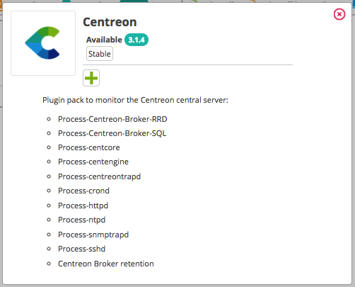

## Qu'est-ce qu'un Plugin Pack?

Un Plugin Pack est un jeu téléchargeable
de modèles de configuration qui permet un déploiement rapide de la supervision de votre infrastructure IT. Les Plugin Packs sont le moyen le plus simple de mettre un hôte en supervision.
Il existe un Plugin Pack par type d'équipement supervisé (par exemple, un Plugin Pack pour superviser des serveurs Linux, un Plugin Pack pour superviser des serveurs Windows, etc...).

Un Plugin Pack est constitué de deux éléments, installés séparément :

- Un plugin, qui exécute les commandes de supervision depuis un collecteur. Tous les plugins sont déjà installés sur vos collecteurs.
- Un pack, qui contient des commandes, des modèles de services et des modèles d’hôtes. Il est installé via l'interface du serveur central.
  Pour chaque type d’équipement, les modèles déterminent quels indicateurs seront
supervisés et définissent les valeurs par défaut des seuils Warning et
Critical (celles-ci sont modifiables par la suite).

  Certains packs contiennent aussi des règles de découverte d'hôtes et de services.

## Que faire pour pouvoir utiliser un Plugin Pack?

### Vérifier la procédure de supervision

Certains Plugin Packs demandent des étapes de configuration supplémentaires. Consultez la procédure de supervision associée à chaque pack installé pour comprendre le contenu du pack ainsi
que les prérequis nécessaires à son fonctionnement. Cliquez sur l'icône ``i`` de chaque pack pour accéder à la documentation associée :

### Installer le pack

Vous avez maintenant accès au catalogue des Plugin Packs, à la page **Configuration > Packs de plugins** :

Pour installer un pack, cliquez sur le ``+``

Vous pouvez aussi cliquer sur le Plugin Pack. Vous accéderez à sa description et un bouton ``+`` permettant
de l’installer.

Une fois le pack installé, il apparaîtra avec un contour vert et une coche indiquant qu’il est installé.

| **Avant installation**                                           | **Après installation**                                          |
|------------------------------------------------------------------|-----------------------------------------------------------------|
|  |  |

#### Gestion des dépendances

Il se peut que durant l’installation, certains objets du pack ne soient pas installés. Ces objets sont souvent des
objets de configuration additionnels et ne sont pas obligatoires pour déployer les modèles de configuration apportés par
le pack.

La plupart du temps, il est nécessaire de mettre à jour votre plate-forme Centreon, puis de réinstaller votre pack.

Dans l’exemple ci-dessus, l’objet “autodiscover” concerne une règle de découverte pour le module “Centreon Auto Discovery”,
mais celles-ci ne sont disponibles que pour Centreon en version 18.10.x :

## Comment utiliser un Plugin Pack?

Appliquez un Plugin Pack à un hôte ou à un service pour mettre celui-ci en supervision :

1. Créez l'hôte/le service, et dans le champ **Modèle(s)**, choisissez le modèle correspondant au Plugin Pack désiré.

2. [Déployez](monitoring-servers/deploying-a-configuration.md) la configuration.
