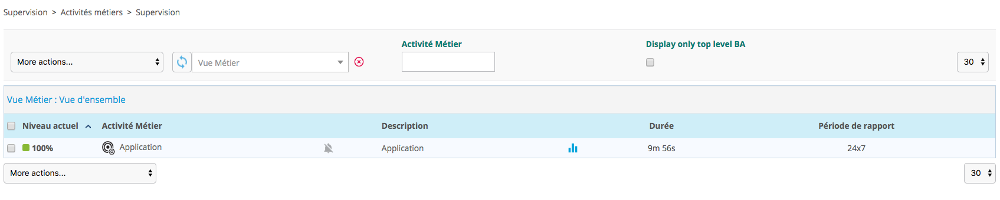
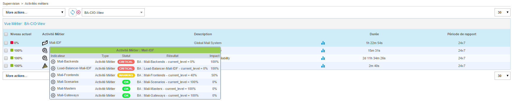
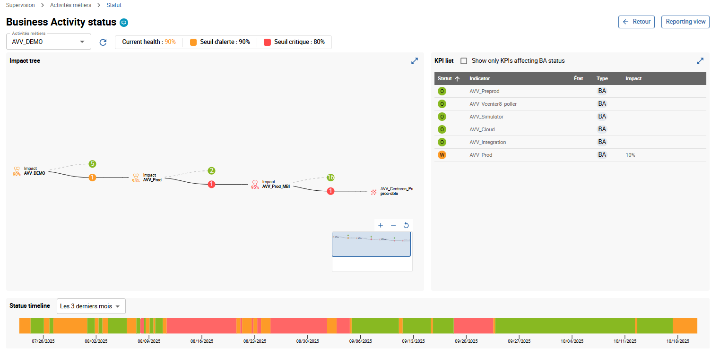

Après avoir créer / modifier / supprimer des objets liés à Centreon BAM,
rendez vous dans **Configuration > Poller**, générer la configuration et
relancer le moteur du poller **Central**.

Une fois la configuration rechargée et les **services liés aux KPIs
contrôlés au moins 1 fois**, les BA sont à jour et peuvent être
visualisées à la page **Supervision > Activités métiers > Supervision**

## Interprétation des données temps réel

### Liste des activités métier

La page principale de monitoring est une console présentant les
informations essentielles concernant le status des BA en temps réel.

Un utilisateur non administrateur verra uniquement les BA appartenant
aux BV liées à son groupe d'accès.

| Colonne            | Description                                            |
|--------------------|--------------------------------------------------------|
| Niveau actuel      | Niveau actuel de la BA exprimé en %, entre 0 et 100    |
| Activité métier    | Le nom de la BA                                        |
| Description        | Description de la BA                                   |
| Durée              | Durée depuis laquelle la BA est dans son statut actuel |
| Période de rapport | Période de reporting par défaut utilisée par la BA     |

Il est possible de visualiser l'évolution du niveau de la BA en plaçant
le curseur de la souris sur l'icône du graphique. En plaçant le curseur
de la souris sur le nom ou la description de la BA, une fenêtre apparaît
et présente les différents KPI de cette BA, accompagnés de leurs statuts
actuels.

En cliquant sur le nom ou la description d'une BA, une nouvelle page se
charge, cette dernière est une vue détaillée de la BA.

### Vue détaillée

La vue détaillée d'une BA est divisée en 6 parties.

- Liste déroulante **Activités métiers** pour sélectionner une autre activité métier.
- Informations sur le statut du niveau de Santé actuelle de l'activité métier et les seuils d'alerte.
- Bouton **Reporting view** pour accéder à la page des rapports.
- Zone contenant l'arbre d'impact de l'activité métier. Vous pouvez ouvrir un sous-niveau, zoomer et dézoomer, et déplacer l'arborescence.
- Tableau contenant la liste des KPIs ayant un impact sur le niveau de l'activité métier.
- Barre de chronologie des statuts affichant une séquence chronologique des différents statuts.
