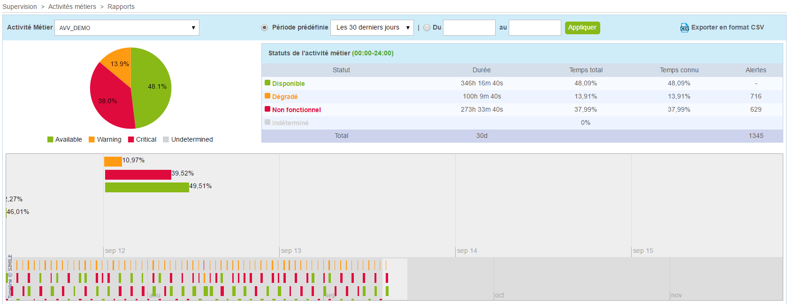

Consulter à tout moment les évolutions des données archivées et
pondérées au travers des pages de reporting, de logs et des graphiques
de performance. Ces écrans ont un fonctionnement similaire à ceux
utilisés dans **Centreon**.

## Rapport

La page de reporting se trouve dans le menu **Rapports > Disponibilité** de Centreon, il suffit de
sélectionner une BA pour consulter ses statistiques de disponibilité
opérationnelle, dégradée et non fonctionnelle sur une période donnée.



Il est possible d'exporter les données vers un fichier CSV, en cliquant
sur le lien "Exporter en format CSV".

## Forcer le calcul des statistiques de disponibilité et évènements

Des statistiques de disponibilité et d'évènements sont automatiquement
calculées tous les jours. Dans le cas de modification de période de
reporting ou d'association à des vues métier, il est possible d'avoir à
reconstruire ces statistiques pour appliquer les modifications de
configuration sur la passé.

Pour cela, lancer le script suivant :

``` shell
/usr/share/centreon/www/modules/centreon-bam-server/engine/centreon-bam-rebuild-events --all
```

Il est également possible de reconstruire les données d'une BA
spécifique:

``` shell
/usr/share/centreon/www/modules/centreon-bam-server/engine/centreon-bam-rebuild-events --ba=<id of ba>
```

Pour plus d'informations concernant ce script, lancer la commande
suivante:

``` shell
/usr/share/centreon/www/modules/centreon-bam-server/engine/centreon-bam-rebuild-events --help
```

**Si vous disposez de Centreon MBI** et souhaitez également exploiter
ces données à jour, la commande suivante est à exécuter sur le serveur
de reporting :

``` shell
/usr/share/centreon-bi/etl/importData.pl -r --bam-only
```
