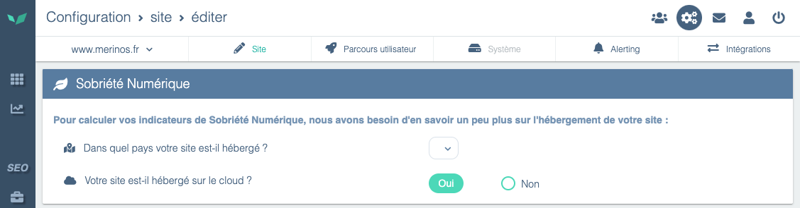

---
id: configure-digital-sobriety
title: Configurer la Sobriété Numérique
--- 

Si vous disposez de l’option Sobriété Numérique, vous devez indiquer à CXM deux informations:

- Où se situent vos serveurs ?
- S’agit-il d’un hébergement Cloud ?

A partir de ces informations, CXM évaluera le CO2 émis par page.

Pour remplir ces informations, rendez vous dans *Configuration* > *Site*

