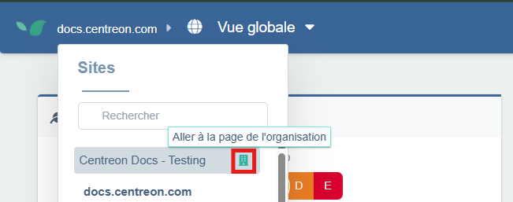

Une Zone de Monitoring Synthétique (zone STM) privée vous permet de superviser vos parcours utilisateur sur des domaines internes ou des réseaux propres à votre organisation, via une sonde déployée dans votre infrastructure.

## Prérequis

- Une machine située dans votre infrastructure devra héberger une sonde. Elle devra pouvoir accéder à l'application à superviser.
- Les identifiants Docker fournis par Centreon (voir [l'étape 6](#étape-6--créer-et-démarrer-la-sonde)). Les identifiants vous sont transmis par Centreon via un lien sécurisé Keeper. Sauvegardez les identifiants dans votre propre coffre-fort.
- Un **parcours utilisateur** configuré sur l'application interne à superviser.

## Étape 1 : Créer une nouvelle zone STM

- Depuis la **Vue Globale**, ouvrez le sélecteur de site en haut à gauche et ouvrez la page de votre organisation.



- Dans la page de configuration de votre organisation, cliquez sur l'onglet **Zones de Monitoring Synthétique**.

- Cliquez sur **+ Nouvelle Zone de Monitoring Synthétique**. Donnez-lui un nom significatif (ex. : Paris Office) puis cliquez sur **+ Créer**.
Votre nouvelle zone apparaît désormais dans la liste.

## Étape 2 : Associer une sonde à une zone STM

- Cliquez sur **Associer une sonde** à droite de votre zone.

Une fenêtre s'ouvre avec 2 commandes Docker :

- Utilisez la première commande pour vous identifier au registry Docker Centreon avec [les identifiants fournis par Centreon](#prérequis) :

```shell
docker login docker.centreon.com/centreon-dem-beta
```

Puis entrez votre identifiant et mot de passe lorsqu'ils vous sont demandés.

- la seconde sert à créer et lancer la sonde (voir [étape 3](#étape-3--créer-et-démarrer-la-sonde)).

## Étape 3 : Créer et démarrer la sonde

Exécutez la deuxième commande obtenue à [l'étape 2](#étape-2--associer-une-sonde-à-une-zone-stm) pour créer la sonde et la démarrer.

Rafraîchissez la page : une fois démarrée, la sonde s'enregistre automatiquement et apparaît à droite de la zone associée dans la liste des **Zones de monitoring synthétique**.

## Étape 4 : Associer la zone à un parcours utilisateur

1. Accédez à l'onglet **Configuration** > **Parcours Utilisateur** de votre site. Sur le parcours que vous souhaitez exécuter depuis votre zone privée, cliquez sur les trois points à droite puis sur **Avancé**.

2. Dans la fenêtre **Configuration avancée**, faites défiler jusqu'à la section **Zones de Monitoring Synthétique**. Votre zone privée apparaît sous **Zones Privées**. Sélectionnez-la.
Cliquez sur **Sauvegarder**.

3. Après quelques secondes, la sonde aura réalisé son premier contrôle et votre supervision de parcours interne sera alors opérationnel ! Vous pouvez l'étudier de la même manière qu'un [parcours utilisateur](../../how-to-articles/user-journey-screen.md) normal.

## Dépannage de problèmes

### Ce nom de domaine n'est pas autorisé pour votre site

Si vous obtenez ce message lorsque vous essayez de configurer une action de navigation vers un lien, cela signifie que le domaine que vous essayez de joindre n'a pas encore été autorisé par Centreon.

Si ce n'est pas encore fait, ouvrez un ticket avec le support Centreon pour que votre domaine soit manuellement approuvé.
