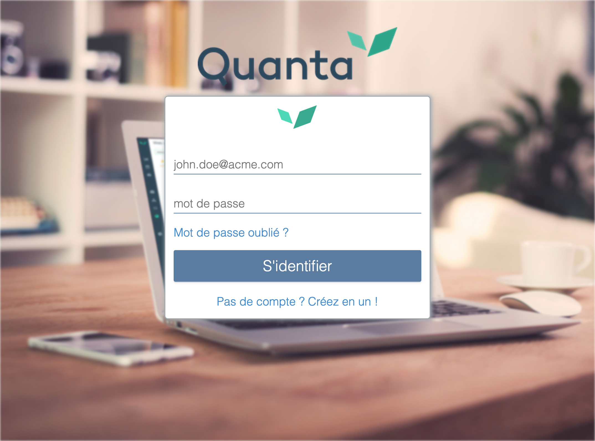

---
id: password-reset
title: Comment réinitialiser mon mot de passe ?
--- 

Si vous avez oublié votre mot de passe, ou vous voulez changer votre mot de passe, rendez-vous sur [https://app.quanta.io/](https://app.quanta.io/) et cliquez sur "Mot de passe oublié".

Rentrez ensuite votre adresse e-mail et cliquez sur “Retrouver son mot de passe”. Un e-mail vous sera alors envoyé contenant un lien pour générer un nouveau mot de passe.

