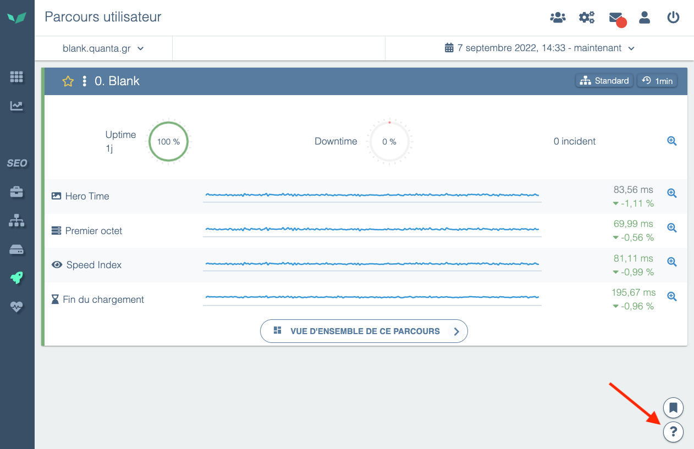

# Contacter le support DEM

Une question ? Besoin d'aide sur votre outil, sur vos scénarios ? Vous ne comprenez pas les alertes remontées par l'outil?

N'hésitez pas à nous contacter, nous sommes là pour vous répondre!

Dans l'application via l'icône en bas de votre écran à droite:

Vous pouvez aussi nous contacter par email en écrivant à [support@quanta.io](mailto:support@quanta.io) si vous souhaitez un délai de traitement optimal.
