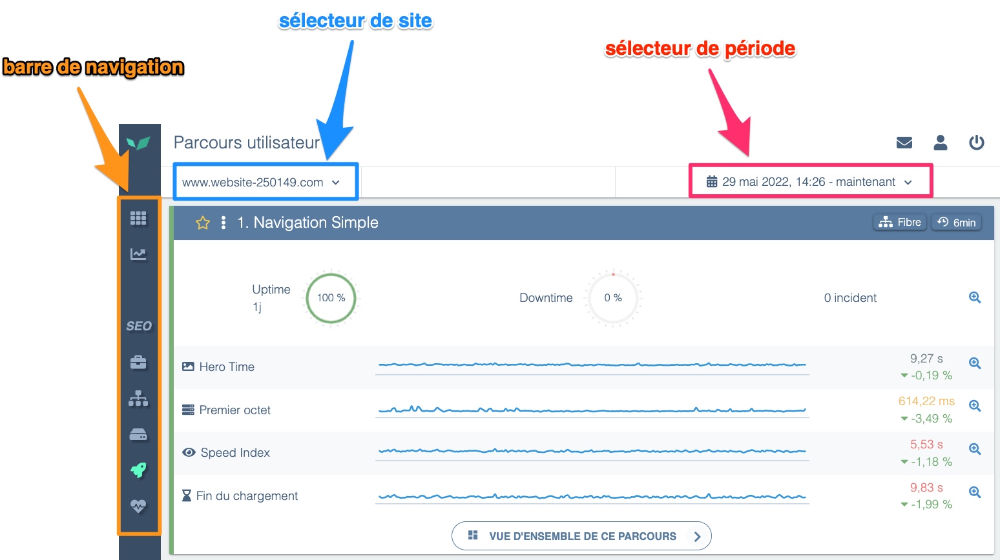

---
id: navigate-in-dem
title: Naviguer dans DEM
--- 

Dans DEM il est possible de se déplacer dans plusieurs dimensions : en changeant de fonction, en changeant de site ou en modifiant la période de temps sélectionnée.

En se loguant pour la 1ère fois dans DEM, on va se retrouver par défaut sur la Vue d’Ensemble. Puis, quand on sélectionne dans le menu “[*Parcours Utilisateurs*](../../getting-started/synthetic-monitoring.md)”, on remarque sur cet écran :

- **la barre de navigation horizontale** (en haut), permettant de naviguer dans chacun des modules de DEM (”[Parcours Utilisateurs”](../../getting-started/synthetic-monitoring.md), “[Système](../../getting-started/system-view.md)”, “[Real User Monitoring](../../getting-started/real-user-monitoring.md)”, etc.)
- **un sélecteur de site** (en haut à gauche), permettant à un utilisateur ayant accès à plusieurs sites dans DEM de passer de site en site (ex: utilisation de DEM avec une licence Enterprise, utilisation de DEM par une agence ayant accès aux comptes DEM de plusieurs clients, etc.).
En cas d’utilisation de DEM en mode “multi-site”, il est également possible de comparer les données de performance en sélectionnant plusieurs sites en même temps, ou encore de construire un tableau de bord personnalisé regroupant des indicateurs de plusieurs sites.
- **un sélecteur de période de temps** (en haut à droite), permettant de modifier à tout instant la période qui est analysée. Cette fonction est importante pour constater l’évolution des temps de réponse d’un site, parfois sur plusieurs semaines ou mois. Par défaut, DEM montre les dernières 24h et actualise la page chaque minute afin de remonter les dernières mesures en temps réel.

