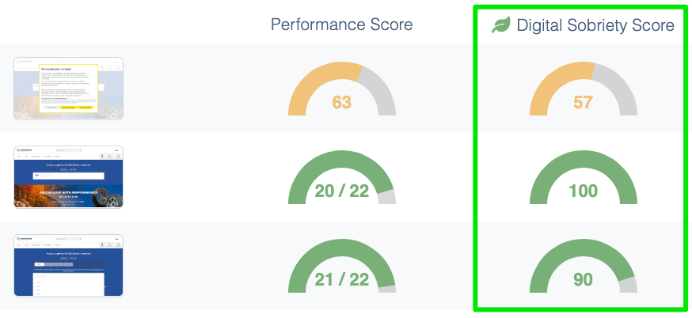

---
id: carbon-footprint-evaluation-and-digital-sobriety
title: Approche d’évaluation carbone et sobriété numérique dans Experience Monitoring
--- 

Mesurer l’empreinte environnementale du numérique liée à l’activité d’un site Internet nécessite de prendre de nombreux paramètres en compte et de se tenir à jour sur les meilleurs méthodes de calculs car le domaine d’étude est récent et par conséquent l’état de l’art sur le sujet est en perpétuelle évolution.

Bien que ce domaine évolue rapidement, Experience Monitoring s’attache dès aujourd’hui à fournir des mesures actionnables permettant de respecter les principes du [GHG Protocol](https://www.greenly.earth/blog-fr/ghg-protocol-quest-ce-que-cest-comment-ca-marche) (Pertinence, Exhaustivité, Permanence, Transparence et Exactitude). Ces critères sont particulièrement importants à suivre afin de permettre aux entreprises qui le souhaite d’intégrer les données d’impact de leurs sites Internet dans leur bilan carbone global d’entreprise.

Pour respecter ces principes et fournir une mesure d’impact carbone la plus proche de la réalité pour les sites Internet étudiés, Experience Monitoring s’appuie donc sur plusieurs algorithmes faisant références sur le marché :

- Le Score de Sobriété Numérique pour le score d’éco-conception, représenté par un score par page sur un total de 100 points
    
    
    
    Mesure du score d’éco-conception dans Experience Monitoring pour un parcours utilisateur donné.
    
- La méthode [Sustainable Web Design](https://sustainablewebdesign.org/calculating-digital-emissions/) pour l’estimation du coût en CO2eq émis par le téléchargement d’une page sur le réseau.
    
    
    
    Mesure de l’impact carbone, en CO2eq, réalisé via des requêtes synthétiques pour un parcours utilisateur donné.
    
- La base de donnée d’impact open source de Boavizta pour les calculs d’impact de fabrication et fin de vie des serveurs (mesure à paraitre dans Experience Monitoring au Q2 2023).

Selon les fonctionnalités concernées, que cela soit pour la mesure d’impact carbone d’un parcours utilisateur donné sur le site, pour la mesure d’impact carbone de chacune des pages du site pondérées à leur fréquentation, ou encore l’affichage des pages ayant les plus gros leviers d’optimisations d’éco-conception à réaliser, Experience Monitoring va utiliser l’une ou l’autre de ces méthodes, et toujours de façon transparente.

  

Mesure globale d’un site Internet (score d’éco-conception et empreinte carbone) calculé sur la base du **trafic réel** dans le module Real User Monitoring d'Experience Monitoring.

Enfin, au delà de l’utilisation de ces méthodes qui font aujourd’hui référence, Experience Monitoring contribue à affiner ces méthodes de calculs par des échanges réguliers avec les professionnels de cette discipline, en particulier :

- l’éco-système des signataires de [Planet’Tech Care](https://planet-techcare.green/) (dont Centreon est membre actif)
- le groupe de travail inter-entreprise [Boavizta](https://www.boavizta.org/)
- l’association [La Fresque du Numérique](https://www.fresquedunumerique.org/)

L’objectif de ces échanges est de faire avancer l’état de l’art sur la mesure d’impact du numérique, et de confronter les résultats avec d’autres professionnels pour s’assurer de la bonne cohérence des mesures prises par chacune des parties (cf. critères de Pertinence et Exactitude imposées par le GHG Protocol).

Pour en savoir + sur la décarbonation du numérique et sur les outils de mesure qui en découlent, vous pouvez également [consulter cette interview](https://www.youtube.com/watch?v=UELsTjTDMag) de Laurent Eskenazi (cofondateur de Boavizta) et Guillaume Thibaux (cofondateur de Quanta, devenu Centreon Experience Monitoring) pour BSmart TV.

## Les dimensions du calcul

Pour mesurer l’impact carbone global d’un site Internet, 2 grandes dimensions doivent être prise en compte, notamment :

1. Les 3 types de “Scope” (ou périmètre en français) :
    - les émissions directes produites par l’entreprise (Scope 1);
    - les émissions indirectes liées à la consommation d’énergie (Scope 2);
    - les émissions indirectes qui concernent tout le reste (Scope 3);
2. Mais également la partie de la chaîne d’équipements numériques considérée :
    - Datacenter (donc notamment les serveurs hébergeant le site);
    - Réseau (routeurs, firewall, antennes 4G, fibre sous-marine, etc.);
    - Matériel utilisé par l’internaute (ordinateur, tablette ou téléphone);

Comme on peut le voir dans ce tableau c-dessous en 2 dimensions, Experience Monitoring permet aujourd’hui de mesurer précisément les émissions liées à “l’usage” du site, sur l’ensemble de la chaîne (datacenter, réseau et matériel de l’internaute). Cette mesure représente très généralement la partie la plus émettrice de gaz à effet de serre, et c’est également sur cette mesure que les principes d’éco-conception du site auront le plus d’impact lors de leur mise en oeuvre.

Voici le détail à date du périmètre fonctionnel d'Experience Monitoring :

|  | Scope 1 | Scope 2 | Scope 3 |  |
| --- | --- | --- | --- | --- |
|  | Emissions directes par l'usage | Emissions indirectes lors de l'usage | Emissions en amont et aval de l'utilisation |  |
| Datacenter | OUI | OUI | OUI (précision à paraître sur données [Boavizta.org](http://Boavizta.org) au Q4 2023) |  |
| Réseau | OUI | OUI | OUI |  |
| Devices des internautes | OUI | OUI | n/a
 |  |

Pour + de détails sur les algorithmes de calcul utilisés pour chacun de ces périmètres, n’hésitez pas à prendre contact avec l’équipe support via l’email [support@quanta.io](mailto:support@quanta.io).
