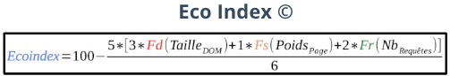
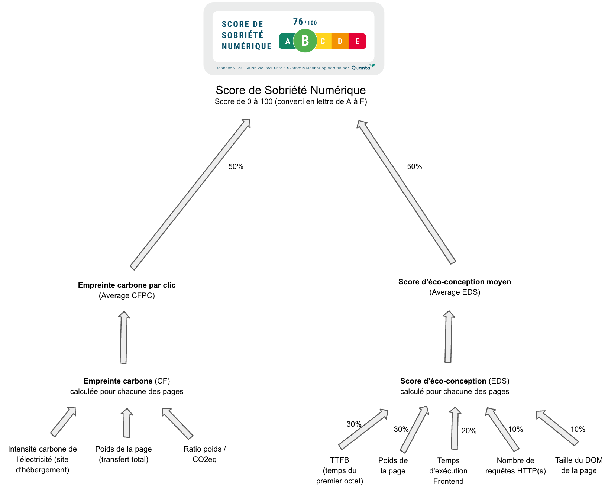

---
id: differences-with-eco-index
title: Quelles sont les différences entre le Score de Sobriété Numérique et l’Eco Index (c)
--- 

La distinction entre le Score de Sobriété Numérique d'Experience Monitoring et l'Eco Index développé par le collectif GreenIT repose sur plusieurs points fondamentaux, reflétant des approches variées de l'évaluation de l'empreinte environnementale des sites web.

## Eco Index

**Critères d'Évaluation** : L'Eco Index se fonde sur trois critères principaux pour évaluer l'empreinte environnementale d'un site web : la taille du Document Object Model (DOM), le poids de la page, et le nombre de requêtes HTTP. Ces critères sont évalués dans la formule de l’Eco Index avec un poids respectif de 3, 1 et 2, donnant une importance prépondérante à la taille du DOM et au nombre de requêtes HTTP effectuées dans l'évaluation :

**Objectif** : En se concentrant sur ces trois critères, l'Eco Index vise à encourager des améliorations ciblées sur des aspects techniques précis des sites web pour réduire leur impact environnemental. Ce focus offre une simplicité d'approche, qui est un bon point de départ pour commencer à approcher l’éco-conception d’un site internet, mais qui montre aussi des limites pour évaluer les impacts environnementaux de l’usage des serveurs et des terminaux utilisateurs visitant le site.

## Score de Sobriété Numérique d'Experience Monitoring

**Critères d'Évaluation** : Le Score de Sobriété Numérique d'Experience Monitoring intègre un éventail plus large d'indicateurs, réalisé  sur un panel moyen de 10 pages de référence par site, soit jusqu’à 60 points de mesures en tout. Le Score de Sobriété Numérique inclu non seulement le poids de la page, le nombre de requêtes HTTP et la taille du DOM, mais aussi le Time To First Byte (TTFB), le temps d’exécution Frontend et l’empreinte carbone par clic. Cette approche plus globale prend en compte à la fois les aspects front-end et back-end des sites web, ainsi que leur impact environnemental sur les gaz à effet de serre au travers l’empreinte carbone par clic.

Voici l’algorithme de calcul du Score de Sobriété Numérique avec ses poids sur chaque critère d’évaluation menant jusqu’à la note globale :

**Avantages** : En valorisant un spectre d'indicateurs plus large et en analysant un “panel représentatif de pages” plutôt qu’une seule URL, le Score de Sobriété Numérique d'Experience Monitoring permet une évaluation plus globale de l'empreinte environnementale d'un site. Ces indicateurs permettent une prise en compte :

- de l'optimisation du code backend pour évaluer le coût environnemental de l’utilisation des serveurs dans le centre d’hébergement du site;
- du travail de sobriété effectué par l’équipe de développement sur l’exécution du code “frontend” (typiquement le code Javascript) par le terminal de l’internaute. Ce temps est particulièrement intéressant à prendre en compte pour évaluer si le site tend à rendre les téléphones anciens obsolètes de part leur comportement (énergivore ou au contraire frugal).

**Objectif** : L’initiative d'Experience Monitoring avec la création de ce score est d'offrir gratuitement à l’ensemble des parties prenantes une vision globale de l'empreinte environnementale d’un site web, avec un score comparable entre 2 sites n’ayant pas nécessairement le même niveau de trafic. Cette initiative vise à encourager une optimisation la plus exhaustive possible et soutenir les efforts visant à réduire de manière significative l'impact écologique du numérique à tous les niveaux : utilisation des serveurs, utilisation du réseau, et propension du site à favoriser le prolongement de la durée de vie des terminaux.

## Quel indicateur suivre ?

A vous d’en décider ! A notre sens, les 2 approches sont très complémentaires : alors que l'Eco Index met l'accent sur une simplicité d'évaluation à travers trois critères techniques sur une URL donnée, ce qui est très utile en phase développement, le Score de Sobriété Numérique d'Experience Monitoring adopte une approche plus englobante et apparait plutôt comme une solution d’audit externalisé lorsque le site est en ligne.
