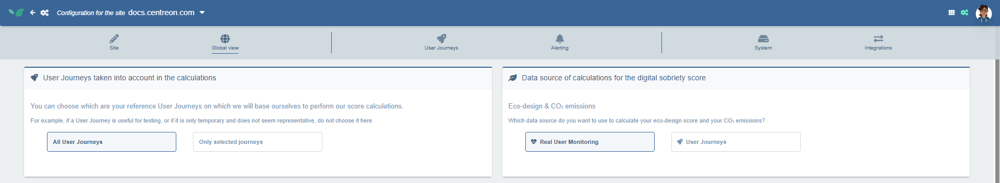
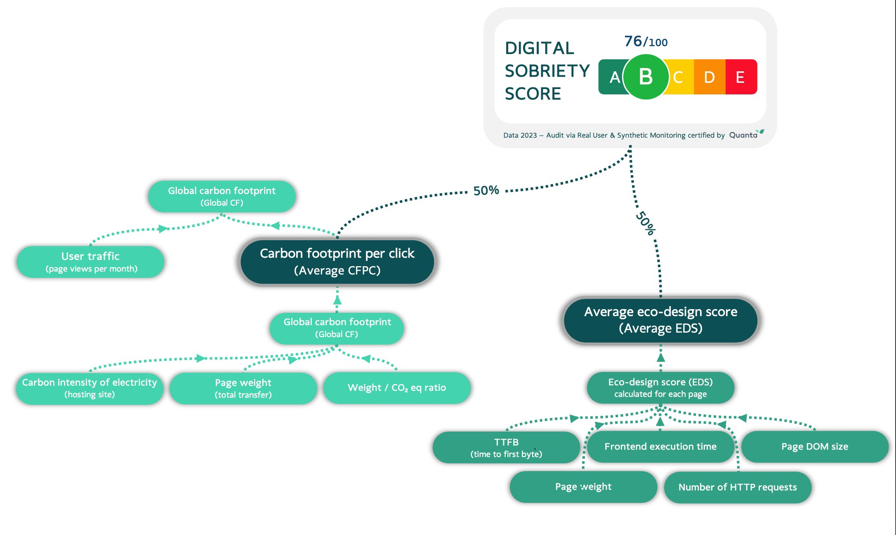

## Score de Sobriété Numérique

Chaque site web a un coût environnemental. Les serveurs consomment de l'énergie, les réseaux transfèrent des données et les appareils les traitent. Tout cela s'accumule.
Le Score de Sobriété Numérique (SSN) est la façon dont Centreon mesure cet impact et le traduit en une note unique et actionnable.

Vous pouvez trouver le SSN dans la **Vue Globale**.

Le SSN affiché est calculé à partir des [données RUM](../rum/rum-intro.md) ou de vos [données de parcours utilisateur](../configuration/user-journey/user-journey-intro.md). Pour modifier les données utilisées, rendez-vous dans **Configuration** > **Vue globale**.

Ici vous pouvez choisir d'utiliser les données RUM ou les données de Parcours Utilisateurs.
De plus, si vous choisissez **Parcours Utilisateurs**, vous pouvez décider si le score doit être calculé à partir des données de tous les parcours utilisateurs ou uniquement de certains.

Notez qu'il peut falloir un certain temps pour calculer un nouveau score après avoir modifié les données utilisées.

## Comment est-il calculé ?

Le Score de Sobriété Numérique combine plusieurs critères en une seule métrique.
Il ne mesure pas uniquement les émissions de carbone, mais constitue un indicateur comparatif conçu pour évaluer les applications web indépendamment de la taille de leur audience.

L'empreinte carbone du site est calculée à partir des données de trafic mesurées et peut être intégrée à l'inventaire carbone global d'une entreprise pour mieux représenter les émissions numériques.

Pour permettre la comparaison entre des applications web de tailles différentes, les résultats sont exprimés relativement au trafic.

Le SSN combine deux métriques :

- Empreinte Carbone Par Clic (ECPC) — le CO₂ émis par page vue ou interaction utilisateur.
- Score d'Éco-Conception (SEC) — une évaluation technique de l'efficacité avec laquelle le site est construit et servi.

Ensemble, ils produisent un score de 0 à 100, converti en note alphabétique :

| Score | Note |
|-------|------|
| 90–100 | A |
| 75–90 | B |
| 60–75 | C |
| 45–60 | D |
| 0–45 | E |

Les résultats sont exprimés relativement au trafic, ce qui permet de comparer équitablement des sites de tailles différentes.

Le SSN est assez similaire à l'Éco Index du [collectif GreenIT](https://www.ecoindex.fr/en/).
L'Éco Index met l'accent sur une évaluation simple basée sur trois critères techniques pour une URL donnée, ce qui est particulièrement utile en phase de développement.
Le SSN d'Experience Monitoring, en revanche, adopte une approche plus globale, de type audit, mieux adaptée aux sites déjà en production.

## Avant de commencer

Pour calculer votre SSN, Experience Monitoring a besoin de deux informations :

- Où sont situés vos serveurs ?
- Sont-ils hébergés dans le cloud ?

Rendez-vous dans **Configuration > Site** pour renseigner ces informations.

Le SSN est calculé à partir des données de vos parcours utilisateurs ou de vos données RUM. Pour déterminer lequel doit être utilisé, rendez-vous sur la page de configuration.
Dans l'onglet **Vue globale**, vous pouvez choisir d'utiliser les données RUM ou les parcours utilisateurs pour les calculs.

## Audit simple vs. audit complet

Il existe deux façons d'obtenir un SSN :

|                          | Audit simple                                      | Audit complet                              |
|--------------------------|---------------------------------------------------|--------------------------------------------|
| **Durée**                | 3 à 5 minutes                                     | 7 jours minimum                            |
| **Couverture**           | Moyenne des 10 pages les plus visitées            | 100 % des pages, pondérées par le trafic   |
| **Configuration requise**| Aucune                                            | Tag RUM (compatible RGPD) ou Parcours Utilisateur |
| **Coût**                 | Gratuit sur [quanta.green](https://www.quanta.green/) | Nécessite une licence Experience Monitoring |
| **Données historiques**  | Trimestrielles, conservées 3 mois                 | Temps réel, conservées plusieurs années    |
| **Certificat**           | Oui                                               | Oui                                        |

L'audit simple est un bon point de départ. L'audit complet est ce qu'il vous faut pour les sites en production — il offre une vision complète et continuellement mise à jour.

## Obtenir un certificat

Centreon peut délivrer un certificat SSN avec des mesures détaillées, adaptées aux présentations, communications ou à l'affichage sur votre site.

Prérequis :
- Une licence Digital Sobriety Experience Monitoring avec le Real User Monitoring activé.
- Une revue par un expert pour produire le rapport complet.

Validité :
- Première année : basée sur les 30 derniers jours de données.
- Renouvellement : basé sur les 12 mois suivants.
- À partir de la deuxième année : basé sur une année complète de trafic, avec une comparaison optionnelle d'année par année.

## Ce qui compose le Score d'Éco-Conception

Pour ceux qui souhaitent les détails, le SEC est calculé à partir de cinq indicateurs techniques :

- **Time To First Byte (TTFB)** — le temps que met le serveur à répondre. Des réponses plus lentes signifient davantage d'énergie consommée côté serveur.
- **Poids de la page** — le volume total de données transférées par chargement de page. Des pages plus lourdes consomment davantage de ressources réseau et d'appareils.
- **Temps d'exécution frontend** — le temps que l'appareil de l'utilisateur passe à exécuter le JavaScript et à afficher la page. Souvent négligé, il contribue pourtant aux émissions des appareils des utilisateurs finaux.
- **Nombre de requêtes HTTP(S)** — chaque requête ajoute une charge réseau et CPU des deux côtés. Moins il y en a, mieux c'est.
- **Taille du DOM** — le nombre d'éléments HTML en mémoire. Des DOMs plus grands signifient plus de travail pour le navigateur pour afficher et mettre à jour la page.