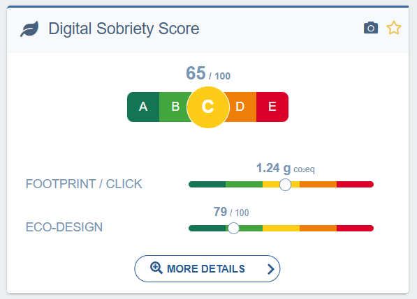

import Tabs from '@theme/Tabs';
import TabItem from '@theme/TabItem';

Le Score de Sobriété Numérique (SSN) est un calcul des émissions carbone de votre site [prenant en compte divers facteurs](https://docs.centreon.com/fr/experience-monitoring/experience-monitoring/digital-sobriety/digital-sobriety-score/). En plus de le calculer, Centreon Experience Monitoring peut vous conseiller sur les améliorations à apporter.

Les détails de votre SSN et les pistes d'amélioration sont accessibles depuis le widget correspondant, situé dans la page **Vue Globale**.

Cliquez sur le bouton **Plus de détails**.

## Comment savoir quoi améliorer ?

Le graphique en haut affiche des informations sur votre SSN global. Celui-ci est calculé à partir des données combinées de tous vos **Parcours Utilisateurs** ou de vos données **RUM**.
L'amélioration de votre SSN passe par l'amélioration des étapes individuelles des parcours utilisateurs ou de certaines pages si vous utilisez le RUM. Pour découvrir les améliorations possibles :

<Tabs groupId="improveDss" queryString>
<TabItem value="For User Journeys" label="For User Journeys">

1. Depuis la page **Parcours Utilisateurs**, cliquez sur le bouton **Vue d'ensemble de ce parcours** pour le parcours que vous souhaitez améliorer.
2. Dans la page **Vue d'ensemble**, les étapes du parcours utilisateur sont listées. À droite de chaque étape se trouve l'icône d'une loupe intitulée **Dernière analyse détaillée**. Cliquez sur l'icône de l'étape que vous souhaitez améliorer.
3. Cliquez sur l'onglet **Dernières recommandations** en haut de la page.

Vous vous trouvez maintenant sur la page des **Dernières recommandations** pour l'étape sélectionnée. Vous pouvez y voir une frise chronologique indiquant le temps de chargement de chaque étape.

En dessous se trouve le **Diagnostic**, une liste de recommandations pour améliorer votre score. Elles sont réparties en 3 groupes selon leur impact :
- Les plus impactantes sont signalées par un triangle rouge.
- Viennent ensuite celles signalées par un carré jaune.
- Les recommandations les moins impactantes sont signalées par un cercle gris.

Vous pouvez cliquer sur chaque recommandation individuellement pour obtenir plus de détails sur la façon de la mettre en œuvre.

</TabItem>
<TabItem value="For RUM" label="For RUM">

1. Depuis la page **Real User Monitoring**, cliquez sur l'onglet **URLs**.
2. À droite de certaines URLs, une icône en forme de jumelles est disponible, cliquez dessus.

Vous vous trouvez maintenant sur la page des **Dernières recommandations** pour l'URL sélectionnée. Vous pouvez y voir une frise chronologique indiquant le temps de chargement de chaque étape.

En dessous se trouve le **Diagnostic**, une liste de recommandations pour améliorer votre score. Elles sont réparties en 3 groupes selon leur impact :
- Les plus impactantes sont signalées par un triangle rouge.
- Viennent ensuite celles signalées par un carré jaune.
- Les recommandations les moins impactantes sont signalées par un cercle gris.

Vous pouvez cliquer sur chaque recommandation individuellement pour obtenir plus de détails sur la façon de la mettre en œuvre.

</TabItem>
</Tabs>

## Comment savoir si mes modifications ont eu un effet ?

Dans la page **Dernières recommandations**, faites défiler jusqu'en bas de la page et cliquez sur le bouton **Comparer avec**.

Le dernier audit de recommandations est sélectionné par défaut. Sélectionnez un audit antérieur pour voir l'impact de vos modifications.
N'oubliez pas que la sonde de recommandations est exécutée une fois par jour, vos modifications peuvent donc ne pas être visibles avant le lendemain.