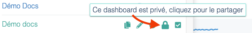

---
id: dashboards
title: Les tableaux de bord
--- 

Les tableaux de bord sont un moyen de visualiser en un coup d’oeil des informations issues d'Experience Monitoring.

## Cas d’usage

### 1. Regrouper des informations issues de sites ou d’organisation différentes

Dans Experience Monitoring, vous pouvez appartenir à plusieurs organisations, et chaque organisation peut contenir l'accès au monitoring de plusieurs applications web. Dans ce contexte, les tableaux de bord vous permettent d’afficher, sur un même écran, n’importe quelles cartes d'Experience Monitoring auxquelles vous avez accès.

Exemple de cartes issues de 2 sites dans 2 organisations différentes :

Dans cet exemple, les 2 cartes viennent de 2 sites différents, dans 2 organisations différentes. Avec les tableaux de bord, vous pouvez donc garder la maitrise de l'ensemble de vos sites d'un seul coup d'oeil !

### 2. Créer un tableau de bord partagé.

Au sein de votre organisation, certaines personnes vont attendre des informations différentes. Par exemple, votre équipe marketing ne s’intéressera qu’aux mesures de trafic et aux Core Web Vitals pour le SEO.

Vous pouvez créer des tableaux de bord et les partager avec votre organisation afin que tous ceux qui sont dans votre organisation y ai accès.

Dans la liste de vos tableaux de bord, vous verrez en premier vos tableaux de bord privés. En cliquant sur le cadenas, vous accédez aux options de partage pour choisir avec quelle organisation le partager.

### 3. Agréger des données d’écran différents d'Experience Monitoring

En imaginant que sur votre site, vous souhaitez vous concentrer sur le panier de votre site, il est intéressant d’avoir les informations à jour sur cette page venant des mesures faites par le RUM et les Parcours Utilisateurs.

Or, toutes les informations sont dans des écrans différents: dans les parcours utilisateurs, vous avez un onglet pour les Core Web Vitals, et un pour les performances, et le RUM n’est pas non plus sur la même page.

Les tableaux de bord permettent de faire des écrans personnalisés pour cela.
